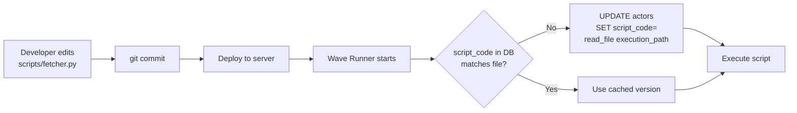
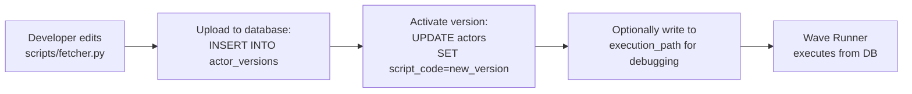
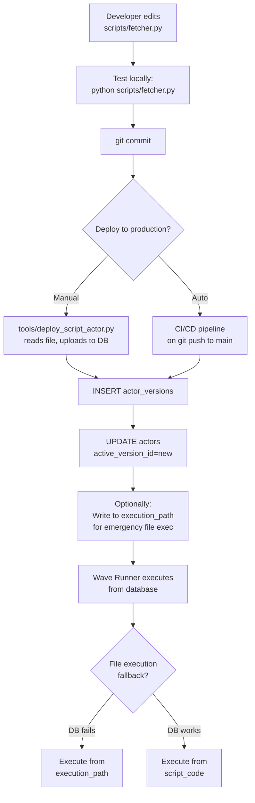

# Script Actor Code Management Lifecycle

**Date:** November 23, 2025  
**The Problem:** How to manage script code between filesystem and database?  
**Arden's Original Idea:** Store in database, exec directly (eliminated file errors)  
**Reality:** Need files for imports, dependencies, debugging  
**Current Question:** What's the source of truth? How to keep them in sync?

---

## The Dilemma

### Original Vision: Database-Only Execution

```python
# actors.script_code contains complete script
script_code = db.query("SELECT script_code FROM actors WHERE actor_id=6")

# Execute directly (no filesystem)
exec(script_code)
```

**Dream Benefits:**
- ✅ No missing file errors
- ✅ Version controlled in database
- ✅ Rollback via database
- ✅ Audit trail automatic

**Reality Problems:**
- ❌ Can't import local modules
- ❌ Can't debug in IDE
- ❌ Can't version control with git
- ❌ Can't use file-based tools

### Current Reality: Filesystem + Database

```python
# actors.execution_path points to file
execution_path = "/home/xai/Documents/ty_wave/scripts/db_job_fetcher.py"

# Execute file
subprocess.run(['python3', execution_path])

# Backup in actors.script_code (from actor_router.py)
if script_code is NULL:
    script_code = read_file(execution_path)
    db.update("UPDATE actors SET script_code=%s WHERE actor_id=%s", script_code, actor_id)
```

**Current Benefits:**
- ✅ Normal development workflow
- ✅ Git version control
- ✅ IDE debugging
- ✅ Import from other files

**Current Problems:**
- ❌ Database backup can go stale
- ❌ Which is source of truth?
- ❌ How to detect drift?
- ❌ When to sync?

---

## The Three Approaches

### Approach A: Filesystem is Source of Truth (Git-First)

**Philosophy:** Develop in files, database is just a cache/backup.



**Implementation:**

```python
# wave_runner_v2/actor_executor.py

def execute_script_actor(actor_id, input_data):
    """Execute script actor with sync check."""
    actor = db.get_actor(actor_id)
    
    # Read current file
    file_content = read_file(actor.execution_path)
    file_hash = hashlib.sha256(file_content.encode()).hexdigest()
    
    # Compare with database
    db_hash = hashlib.sha256(actor.script_code.encode()).hexdigest() if actor.script_code else None
    
    if file_hash != db_hash:
        # File changed - update database
        db.execute("""
            UPDATE actors 
            SET script_code = %s,
                script_code_hash = %s,
                script_code_synced_at = NOW()
            WHERE actor_id = %s
        """, (file_content, file_hash, actor_id))
        
        log.info(f"Synced actor {actor_id} script from file to database")
    
    # Execute from file (not database)
    result = subprocess.run(
        ['python3', actor.execution_path],
        input=json.dumps(input_data),
        capture_output=True,
        text=True
    )
    
    return json.loads(result.stdout)
```

**Pros:**
- ✅ Standard development workflow
- ✅ Git is version control
- ✅ Database auto-syncs
- ✅ Always executes latest code

**Cons:**
- ❌ Missing file = crash
- ❌ File permissions issues
- ❌ Harder to rollback (need git revert + redeploy)

**When to Use:** Development phase, rapid iteration

---

### Approach B: Database is Source of Truth (DB-First)

**Philosophy:** Database is the deployment target, files are just working copies.



**Schema Addition:**

```sql
CREATE TABLE actor_versions (
    version_id BIGSERIAL PRIMARY KEY,
    actor_id INT REFERENCES actors(actor_id),
    script_code TEXT NOT NULL,
    version_number TEXT,  -- "1.2.3"
    created_by_actor_id INT,
    created_at TIMESTAMPTZ DEFAULT NOW(),
    changelog TEXT,
    activated_at TIMESTAMPTZ,
    
    INDEX idx_actor_versions (actor_id, created_at DESC)
);

ALTER TABLE actors ADD COLUMN active_version_id BIGINT REFERENCES actor_versions(version_id);
```

**Implementation:**

```python
# tools/deploy_script_actor.py

def deploy_script_actor(actor_name, script_path, version, changelog):
    """Deploy script to database."""
    # Read script
    script_code = read_file(script_path)
    
    # Get actor
    actor = db.get_actor_by_name(actor_name)
    
    # Create version
    version_id = db.execute("""
        INSERT INTO actor_versions (
            actor_id,
            script_code,
            version_number,
            changelog
        ) VALUES (%s, %s, %s, %s)
        RETURNING version_id
    """, (actor.actor_id, script_code, version, changelog))
    
    # Activate version
    db.execute("""
        UPDATE actors
        SET active_version_id = %s,
            script_code = %s
        WHERE actor_id = %s
    """, (version_id, script_code, actor.actor_id))
    
    print(f"Deployed {actor_name} v{version}")
    
# Usage:
# python tools/deploy_script_actor.py \
#   --actor db_job_fetcher \
#   --script scripts/db_job_fetcher.py \
#   --version 1.3.0 \
#   --changelog "Fixed timeout handling"
```

**Execute from Database:**

```python
# wave_runner_v2/actor_executor.py

def execute_script_actor(actor_id, input_data):
    """Execute script from database (not file)."""
    actor = db.get_actor(actor_id)
    
    # Execute code from database
    process = subprocess.Popen(
        ['python3', '-c', actor.script_code],
        stdin=subprocess.PIPE,
        stdout=subprocess.PIPE,
        stderr=subprocess.PIPE,
        text=True
    )
    
    stdout, stderr = process.communicate(input=json.dumps(input_data))
    return json.loads(stdout)
```

**Pros:**
- ✅ No file dependency
- ✅ Version history in database
- ✅ Instant rollback (just change active_version_id)
- ✅ Audit trail complete
- ✅ Can deploy without server access

**Cons:**
- ❌ Can't import local modules (unless in PYTHONPATH)
- ❌ Debugging harder (need to write to temp file)
- ❌ Not standard git workflow

**When to Use:** Production, stable scripts, multi-server deployments

---

### Approach C: Hybrid (Best of Both Worlds)

**Philosophy:** Develop in files, deploy to database, execute from database, maintain sync.



**Implementation:**

```python
# wave_runner_v2/actor_executor.py

class ScriptActorExecutor:
    def __init__(self):
        self.execution_mode = 'database'  # or 'file' or 'auto'
    
    def execute(self, actor_id, input_data):
        """Execute script with fallback."""
        actor = db.get_actor(actor_id)
        
        if self.execution_mode == 'database':
            return self._execute_from_database(actor, input_data)
        elif self.execution_mode == 'file':
            return self._execute_from_file(actor, input_data)
        else:  # auto
            try:
                return self._execute_from_database(actor, input_data)
            except Exception as e:
                log.warning(f"Database execution failed: {e}, falling back to file")
                return self._execute_from_file(actor, input_data)
    
    def _execute_from_database(self, actor, input_data):
        """Execute script_code from database."""
        if not actor.script_code:
            raise ValueError(f"No script_code for actor {actor.actor_id}")
        
        # Write to temp file (to handle imports)
        temp_file = f"/tmp/wave_runner_actor_{actor.actor_id}.py"
        with open(temp_file, 'w') as f:
            f.write(actor.script_code)
        
        # Execute temp file
        result = subprocess.run(
            ['python3', temp_file],
            input=json.dumps(input_data),
            capture_output=True,
            text=True,
            cwd='/tmp'  # Temp directory
        )
        
        # Cleanup
        os.remove(temp_file)
        
        return json.loads(result.stdout)
    
    def _execute_from_file(self, actor, input_data):
        """Execute from execution_path."""
        if not actor.execution_path or not os.path.exists(actor.execution_path):
            raise ValueError(f"No valid execution_path for actor {actor.actor_id}")
        
        result = subprocess.run(
            ['python3', actor.execution_path],
            input=json.dumps(input_data),
            capture_output=True,
            text=True,
            cwd=os.path.dirname(actor.execution_path)  # Script's directory
        )
        
        return json.loads(result.stdout)
```

**Deployment Tool:**

```python
#!/usr/bin/env python3
"""
Deploy Script Actor to Database

Usage:
    python tools/deploy_script_actor.py db_job_fetcher --version 1.3.0
    python tools/deploy_script_actor.py --all  # Deploy all changed scripts
"""

import argparse
import hashlib
from pathlib import Path

def get_script_hash(path):
    """Get SHA256 hash of script file."""
    return hashlib.sha256(Path(path).read_text().encode()).hexdigest()

def deploy_actor(actor_name, version=None, changelog=None):
    """Deploy one actor."""
    # Get actor from database
    actor = db.query("""
        SELECT actor_id, execution_path, script_code
        FROM actors
        WHERE actor_name = %s
    """, actor_name)[0]
    
    # Read current file
    file_content = Path(actor['execution_path']).read_text()
    file_hash = get_script_hash(actor['execution_path'])
    
    # Check if changed
    db_hash = hashlib.sha256(actor['script_code'].encode()).hexdigest() if actor['script_code'] else None
    
    if file_hash == db_hash:
        print(f"✓ {actor_name}: No changes")
        return False
    
    # Auto-version if not provided
    if not version:
        # Get latest version
        latest = db.query("""
            SELECT version_number FROM actor_versions
            WHERE actor_id = %s
            ORDER BY created_at DESC LIMIT 1
        """, actor['actor_id'])
        
        if latest:
            # Increment patch version
            major, minor, patch = latest[0]['version_number'].split('.')
            version = f"{major}.{minor}.{int(patch)+1}"
        else:
            version = "1.0.0"
    
    # Create version
    version_id = db.execute("""
        INSERT INTO actor_versions (
            actor_id,
            script_code,
            version_number,
            changelog,
            script_hash
        ) VALUES (%s, %s, %s, %s, %s)
        RETURNING version_id
    """, (actor['actor_id'], file_content, version, changelog, file_hash))
    
    # Activate
    db.execute("""
        UPDATE actors
        SET active_version_id = %s,
            script_code = %s,
            script_code_hash = %s,
            script_code_synced_at = NOW()
        WHERE actor_id = %s
    """, (version_id, file_content, file_hash, actor['actor_id']))
    
    print(f"✓ {actor_name}: Deployed v{version}")
    return True

def deploy_all_changed():
    """Deploy all actors with changed scripts."""
    actors = db.query("SELECT actor_name FROM actors WHERE actor_type='script'")
    
    deployed = 0
    for actor in actors:
        if deploy_actor(actor['actor_name']):
            deployed += 1
    
    print(f"\nDeployed {deployed} actors")

if __name__ == "__main__":
    parser = argparse.ArgumentParser()
    parser.add_argument('actor_name', nargs='?', help='Actor name to deploy')
    parser.add_argument('--version', help='Version number (auto-incremented if not provided)')
    parser.add_argument('--changelog', help='Changelog entry')
    parser.add_argument('--all', action='store_true', help='Deploy all changed actors')
    
    args = parser.parse_args()
    
    if args.all:
        deploy_all_changed()
    elif args.actor_name:
        deploy_actor(args.actor_name, args.version, args.changelog)
    else:
        parser.print_help()
```

**CI/CD Integration:**

```yaml
# .github/workflows/deploy_scripts.yml

name: Deploy Script Actors

on:
  push:
    branches: [main]
    paths:
      - 'scripts/**/*.py'

jobs:
  deploy:
    runs-on: ubuntu-latest
    steps:
      - uses: actions/checkout@v2
      
      - name: Deploy changed actors
        run: |
          python tools/deploy_script_actor.py --all
        env:
          DB_HOST: ${{ secrets.DB_HOST }}
          DB_USER: ${{ secrets.DB_USER }}
          DB_PASS: ${{ secrets.DB_PASS }}
```

**Pros:**
- ✅ Normal development in files
- ✅ Git version control
- ✅ Database deployment
- ✅ Version history in DB
- ✅ Rollback capability
- ✅ Fallback to file if needed
- ✅ CI/CD integration

**Cons:**
- ⚠️ More complexity (sync mechanism)
- ⚠️ Need deployment tool
- ⚠️ Two sources of truth (but managed)

---

## Recommended: Hybrid with Clear Rules

### Development Phase:
1. Edit `scripts/actor_name.py`
2. Test locally: `python scripts/actor_name.py`
3. Git commit
4. Deploy: `python tools/deploy_script_actor.py actor_name`

### Production Execution:
1. Wave Runner reads `actors.script_code` (from DB)
2. Writes to temp file (for import support)
3. Executes temp file
4. Cleans up temp file

### Emergency Fallback:
1. If DB connection fails
2. Or script_code is NULL
3. Execute from `execution_path` (file)

### Sync Strategy:
- **On deploy:** File → Database (explicit, via tool)
- **On startup:** Database → File (write to execution_path for debugging)
- **On execute:** Database is source of truth

### Schema Updates:

```sql
ALTER TABLE actors ADD COLUMN active_version_id BIGINT;
ALTER TABLE actors ADD COLUMN script_code_hash TEXT;
ALTER TABLE actors ADD COLUMN script_code_synced_at TIMESTAMPTZ;

CREATE TABLE actor_versions (
    version_id BIGSERIAL PRIMARY KEY,
    actor_id INT REFERENCES actors(actor_id),
    script_code TEXT NOT NULL,
    script_hash TEXT NOT NULL,
    version_number TEXT NOT NULL,
    changelog TEXT,
    created_by_actor_id INT,
    created_at TIMESTAMPTZ DEFAULT NOW(),
    activated_at TIMESTAMPTZ,
    deactivated_at TIMESTAMPTZ
);
```

---

## Flowchart: Complete Lifecycle

```mermaid
flowchart TD
    Start([Developer starts work]) --> Edit[Edit scripts/fetcher.py<br/>in IDE]
    
    Edit --> LocalTest[Test locally:<br/>python scripts/fetcher.py<br/>with sample input]
    
    LocalTest --> Works{Works?}
    
    Works -->|No| Debug[Debug in IDE]
    Debug --> Edit
    
    Works -->|Yes| Commit[git add scripts/fetcher.py<br/>git commit -m 'Fix timeout']
    
    Commit --> Push[git push origin main]
    
    Push --> CI{CI/CD enabled?}
    
    CI -->|Yes| AutoDeploy[GitHub Action runs:<br/>tools/deploy_script_actor.py --all]
    CI -->|No| ManualDeploy[Developer runs:<br/>tools/deploy_script_actor.py fetcher]
    
    AutoDeploy --> DBInsert[INSERT INTO actor_versions<br/>version_id=42<br/>version='1.3.1'<br/>script_code=file_content]
    
    ManualDeploy --> DBInsert
    
    DBInsert --> Activate[UPDATE actors<br/>SET active_version_id=42,<br/>script_code=new_content,<br/>script_code_hash=new_hash]
    
    Activate --> OptionalSync[Optional:<br/>Write to execution_path<br/>for debugging]
    
    OptionalSync --> Production([Wave Runner<br/>Production])
    
    Production --> Execute[Actor needs execution]
    
    Execute --> GetActor[SELECT script_code<br/>FROM actors<br/>WHERE actor_id=6]
    
    GetActor --> TempFile[Write to<br/>/tmp/wave_actor_6.py]
    
    TempFile --> Run[subprocess.run<br/>'python3 /tmp/wave_actor_6.py']
    
    Run --> Cleanup[Delete temp file]
    
    Cleanup --> Success{Execution<br/>successful?}
    
    Success -->|Yes| Log[Log to interactions<br/>status='completed']
    
    Success -->|No| Fallback{Try file<br/>fallback?}
    
    Fallback -->|Yes| FileExec[Execute from<br/>execution_path]
    Fallback -->|No| LogError[Log to interactions<br/>status='failed']
    
    FileExec --> Log
    
    Log --> Done([Done])
    
    style Start fill:#e1f5e1
    style Production fill:#e1e1f5
    style Done fill:#e1f5e1
    style Success fill:#fff4e1
```



---

## UPDATED RECOMMENDATION: Filesystem + Auto-Sync with Drift Detection

**After discussion with Arden (Nov 23, 2025):**

### The Revised Approach

**Core Principle:** Files are source of truth, database is synchronized copy with full history.

**Problem Solved:** Prevent Turing crashes from deleted/changed scripts via automatic drift detection and sync.

---

## Schema: Enhanced actors + actor_code_history

```sql
-- Enhanced actors table
ALTER TABLE actors 
ADD COLUMN script_code_hash TEXT,              -- SHA256 of script_code
ADD COLUMN script_file_path TEXT,              -- Canonical file path
ADD COLUMN script_file_mtime TIMESTAMPTZ,      -- File modification time
ADD COLUMN script_synced_at TIMESTAMPTZ,       -- Last sync timestamp
ADD COLUMN script_sync_status TEXT DEFAULT 'synced',  -- 'synced', 'drift_detected', 'file_missing'
ADD COLUMN active_history_id BIGINT;

-- History table (like workflow_history, conversation_history)
CREATE TABLE actor_code_history (
    history_id BIGSERIAL PRIMARY KEY,
    actor_id INT REFERENCES actors(actor_id),
    
    -- What changed
    script_code TEXT NOT NULL,
    script_code_hash TEXT NOT NULL,
    
    -- Why changed
    change_type TEXT NOT NULL,  -- 'manual_deploy', 'auto_sync', 'rollback', 'initial'
    change_reason TEXT,
    
    -- Who/When
    changed_by_actor_id INT REFERENCES actors(actor_id),
    changed_at TIMESTAMPTZ DEFAULT NOW(),
    
    -- Source
    source_file_path TEXT,
    source_file_mtime TIMESTAMPTZ,
    
    -- Metadata
    version_tag TEXT,           -- e.g., "1.3.0"
    git_commit_hash TEXT,       -- If synced from git
    
    -- Activation
    activated_at TIMESTAMPTZ,
    deactivated_at TIMESTAMPTZ,
    
    INDEX idx_actor_code_history_actor (actor_id, changed_at DESC),
    INDEX idx_actor_code_history_active (actor_id, activated_at, deactivated_at)
);
```

---

## Drift Detection: SHA256 Hash (Recommended)

**Why SHA256 over mtime or CRC32?**
- ✅ Detects ANY content change (even single character)
- ✅ Deterministic (same content = same hash)
- ✅ No false positives (unlike mtime)
- ✅ Cryptographically secure (unlike CRC32)
- ✅ Industry standard (git uses similar)
- ✅ Fast enough for small scripts (<1ms)

```python
# wave_runner_v2/script_sync.py

import hashlib
import os
from datetime import datetime

def get_file_hash(filepath):
    """SHA256 hash of file content."""
    if not os.path.exists(filepath):
        return None
    with open(filepath, 'rb') as f:
        return hashlib.sha256(f.read()).hexdigest()

def check_for_drift(actor_id):
    """Check if file differs from database."""
    actor = db.query("""
        SELECT actor_id, script_file_path, script_code_hash
        FROM actors
        WHERE actor_id = %s
    """, actor_id)[0]
    
    if not actor['script_file_path']:
        return 'no_file_path'
    
    if not os.path.exists(actor['script_file_path']):
        return 'file_missing'
    
    file_hash = get_file_hash(actor['script_file_path'])
    
    if file_hash != actor['script_code_hash']:
        return 'drift_detected'
    
    return 'synced'
```

---

## Auto-Sync Implementation

```python
def sync_actor_to_database(actor_id, change_reason='auto_sync', changed_by_actor_id=None):
    """Sync file to database with history tracking."""
    actor = db.query("""
        SELECT actor_id, actor_name, script_file_path, script_code, script_code_hash
        FROM actors
        WHERE actor_id = %s
    """, actor_id)[0]
    
    filepath = actor['script_file_path']
    
    # Check if file exists
    if not os.path.exists(filepath):
        log.error(f"Cannot sync actor {actor_id}: file missing at {filepath}")
        db.execute("""
            UPDATE actors 
            SET script_sync_status = 'file_missing'
            WHERE actor_id = %s
        """, actor_id)
        return False
    
    # Read file
    with open(filepath, 'r') as f:
        new_script_code = f.read()
    
    new_hash = hashlib.sha256(new_script_code.encode()).hexdigest()
    file_mtime = datetime.fromtimestamp(os.path.getmtime(filepath))
    
    # Check if actually changed
    if new_hash == actor['script_code_hash']:
        log.info(f"Actor {actor_id} ({actor['actor_name']}): No changes detected")
        return True
    
    # Deactivate old version in history
    db.execute("""
        UPDATE actor_code_history
        SET deactivated_at = NOW()
        WHERE actor_id = %s
          AND deactivated_at IS NULL
    """, actor_id)
    
    # Create history record
    history_id = db.execute("""
        INSERT INTO actor_code_history (
            actor_id,
            script_code,
            script_code_hash,
            change_type,
            change_reason,
            changed_by_actor_id,
            source_file_path,
            source_file_mtime,
            activated_at
        ) VALUES (%s, %s, %s, %s, %s, %s, %s, %s, NOW())
        RETURNING history_id
    """, (
        actor_id,
        new_script_code,
        new_hash,
        'auto_sync' if change_reason == 'auto_sync' else 'manual_deploy',
        change_reason,
        changed_by_actor_id,
        filepath,
        file_mtime
    ))
    
    # Update actors table
    db.execute("""
        UPDATE actors
        SET script_code = %s,
            script_code_hash = %s,
            script_file_mtime = %s,
            script_synced_at = NOW(),
            script_sync_status = 'synced',
            active_history_id = %s
        WHERE actor_id = %s
    """, (new_script_code, new_hash, file_mtime, history_id, actor_id))
    
    log.info(f"✓ Synced actor {actor_id} ({actor['actor_name']}): {filepath} → database")
    return True

def sync_all_script_actors():
    """Sync all script actors (called on startup)."""
    actors = db.query("""
        SELECT actor_id, actor_name, script_file_path
        FROM actors
        WHERE actor_type = 'script'
          AND script_file_path IS NOT NULL
    """)
    
    synced = 0
    drift_detected = 0
    missing = 0
    
    for actor in actors:
        status = check_for_drift(actor['actor_id'])
        
        if status == 'drift_detected':
            sync_actor_to_database(actor['actor_id'], 'startup_sync')
            drift_detected += 1
        elif status == 'file_missing':
            log.warning(f"File missing for actor {actor['actor_id']}: {actor['script_file_path']}")
            missing += 1
        else:
            synced += 1
    
    log.info(f"Sync complete: {synced} synced, {drift_detected} updated, {missing} missing")
    return drift_detected
```

---

## Execution with Drift Check

```python
def execute_script_actor(actor_id, input_data):
    """Execute with automatic drift detection and sync."""
    
    # Quick drift check before execution
    status = check_for_drift(actor_id)
    
    if status == 'drift_detected':
        log.warning(f"Drift detected for actor {actor_id}, auto-syncing...")
        sync_actor_to_database(actor_id, 'pre_execution_sync')
    elif status == 'file_missing':
        raise FileNotFoundError(f"Script file missing for actor {actor_id}")
    
    # Execute from file (now guaranteed synced)
    actor = db.get_actor(actor_id)
    result = subprocess.run(
        ['python3', actor.script_file_path],
        input=json.dumps(input_data),
        capture_output=True,
        text=True,
        cwd=os.path.dirname(actor.script_file_path)  # Imports work!
    )
    
    return json.loads(result.stdout)
```

---

## Rollback Capability

```python
def rollback_actor(actor_id, history_id):
    """Rollback to previous version from history."""
    
    # Get historical version
    historical = db.query("""
        SELECT script_code, script_code_hash, version_tag
        FROM actor_code_history
        WHERE history_id = %s
    """, history_id)[0]
    
    # Deactivate current
    db.execute("""
        UPDATE actor_code_history
        SET deactivated_at = NOW()
        WHERE actor_id = %s AND deactivated_at IS NULL
    """, actor_id)
    
    # Create new history entry (rollback)
    new_history_id = db.execute("""
        INSERT INTO actor_code_history (
            actor_id, script_code, script_code_hash,
            change_type, change_reason, activated_at
        ) VALUES (%s, %s, %s, 'rollback', 'Rollback to ' || %s, NOW())
        RETURNING history_id
    """, (actor_id, historical['script_code'], historical['script_code_hash'], historical['version_tag']))
    
    # Update actors table
    db.execute("""
        UPDATE actors
        SET script_code = %s,
            script_code_hash = %s,
            script_sync_status = 'synced',
            active_history_id = %s
        WHERE actor_id = %s
    """, (historical['script_code'], historical['script_code_hash'], new_history_id, actor_id))
    
    log.info(f"Rolled back actor {actor_id} to version {historical['version_tag']}")
```

---

## When to Sync?

### 1. On Wave Runner Startup (Required)
```python
def wave_runner_startup():
    log.info("Wave Runner V2 starting...")
    
    # Sync all script actors
    drift_count = sync_all_script_actors()
    
    if drift_count > 0:
        log.warning(f"Synced {drift_count} actors with drift on startup")
    
    # Start execution loop
    run_tick_loop()
```

### 2. Before Execution (Paranoid Mode - Optional)
```python
# Already shown above - check drift, sync if needed, then execute
```

### 3. Manual Deployment
```python
# tools/deploy_script_actor.py

def deploy_actor(actor_name, version, changelog):
    """Manually deploy script with version tag."""
    actor = db.get_actor_by_name(actor_name)
    
    # Force sync with metadata
    sync_actor_to_database(
        actor.actor_id,
        change_reason=f"Deploy v{version}: {changelog}",
        changed_by_actor_id=1  # Arden
    )
    
    # Tag version in history
    db.execute("""
        UPDATE actor_code_history
        SET version_tag = %s
        WHERE actor_id = %s
          AND deactivated_at IS NULL
    """, (version, actor.actor_id))
    
    print(f"✓ Deployed {actor_name} v{version}")
```

---

## Final Recommendation 🎓

**Approach:** Filesystem + Auto-Sync with SHA256 Drift Detection

**Rules:**
1. **Source of Truth:** Files in `scripts/` directory
2. **Development:** Normal workflow (edit files, git commit)
3. **Deployment:** Manual tool OR auto-sync on startup
4. **Execution:** From file (imports work naturally)
5. **Sync Check:** SHA256 hash comparison
6. **Auto-Sync:** On startup + before execution (optional)
7. **History:** Full audit trail in `actor_code_history`
8. **Rollback:** Instant rollback to any previous version

**Benefits:**
- ✅ **Crash Prevention:** Drift detected → auto-sync → execution continues
- ✅ **Normal Development:** Edit files in IDE, no special workflow
- ✅ **Import Support:** Execute from file, all local imports work
- ✅ **Version History:** Complete audit trail with rollback
- ✅ **Auto-Healing:** File changes detected and synced automatically
- ✅ **Graceful Failure:** Missing file → known error state (not silent corruption)

**Trade-offs:**
- Files must exist on disk (can't delete without breaking)
- Database is backup/history (not primary execution source)
- SHA256 overhead negligible (<1ms per script)

---

**This solves Arden's concern:** "Make sure we don't delete or change a script on disk and crash Turing."

**Answer:** We detect drift automatically, sync to database, maintain history, and can rollback. Turing never crashes from stale code!
