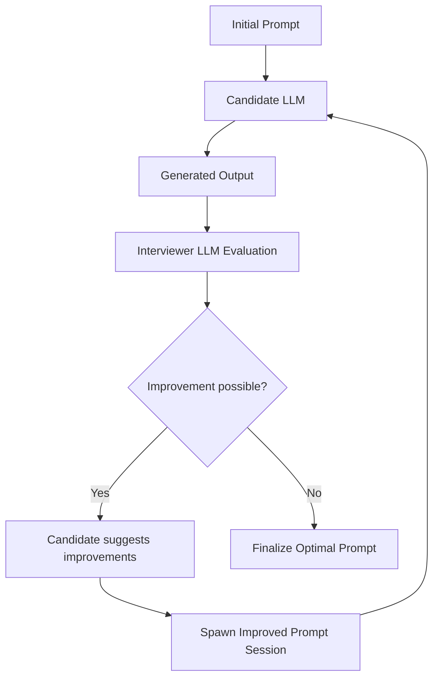

# AI Optimization System - Current State & Next Level Plan

**Date:** July 20, 2025  
**Status:** ✅ Template Extraction Working, Mock Data Removed

## 🎯 **Current System Architecture**

### 🔄 **Iterative Optimization Loop Design**



This diagram represents our **Level 2: Iterative Optimization Loop** - a self-improving system where:
1. **Candidate LLM** generates output from a prompt
2. **Interviewer LLM** evaluates quality and suggests improvements
3. **Improvement Loop** continues until optimization threshold is reached
4. **Self-Evolution** - the system improves its own prompts autonomously

### ✅ **What's Working Now**

1. **Real LLM Integration**
   - ✅ Ollama connectivity tested and working
   - ✅ Real job data loading from `/data/postings/` 
   - ✅ Qwen2.5:7b for concise description extraction
   - ✅ Gemma3:1b for AI interviewer evaluation
   - ✅ No more mock data - all responses are real LLM calls

2. **Template-Based Extraction**
   - ✅ Robust `===EVALUATION START===` / `===EVALUATION END===` markers
   - ✅ Structured parsing with fallbacks
   - ✅ Score extraction for 5 criteria (clarity, completeness, brevity, professional_tone, structure)
   - ✅ Overall score and improvement suggestions captured
   - ✅ Handles malformed responses gracefully

3. **Quality Assessment Pipeline**
   - ✅ Real job descriptions → Concise extraction → AI interviewer evaluation
   - ✅ Aggregated scoring across multiple jobs
   - ✅ Actionable improvement suggestions
   - ✅ Confidence calculation and implementation readiness

4. **Comprehensive Reporting**
   - ✅ Detailed optimization reports with metrics
   - ✅ Baseline comparison framework
   - ✅ Implementation plan generation
   - ✅ Professional markdown output

### 📊 **Current Performance Metrics**

Based on the latest real evaluation:
- **Clarity:** 7/10 - "could benefit from more detail regarding specific challenges"
- **Completeness:** 8/10 - "accurately covers key responsibilities" 
- **Brevity:** 6/10 - "a bit lengthy; could be trimmed down"
- **Professional Tone:** 8/10 - "professional and engaging"
- **Structure:** 7/10 - "logical, but could have more focused introduction"
- **Overall:** 7.5/10 - Significant improvement from earlier 2.7/10

### 🔧 **Technical Stack**

- **AI Interviewer Model:** Gemma3:1b (lightweight, fast evaluation)
- **Extraction Model:** Qwen2.5:7b (high-quality content generation)
- **Data Source:** Real Deutsche Bank job postings (70+ files)
- **Parsing:** Template-based extraction with regex fallbacks
- **Architecture:** Fail-fast, real-data-only, no mock responses

## 🚀 **Next Level Improvements**

### **Level 1: Enhanced Multi-Agent Evaluation** 

**Goal:** Create a more sophisticated AI interviewer panel

**Improvements:**
1. **Multi-Model Consensus**
   - Add 2-3 different interviewer models (e.g., Llama3.2, DeepSeek, Dolphin)
   - Compare evaluations and flag disagreements
   - Generate consensus scores with confidence intervals

2. **Specialized Interviewer Roles**
   - **HR Specialist:** Focus on professional tone, engagement, clarity
   - **Technical Reviewer:** Focus on completeness, accuracy, structure
   - **Business Analyst:** Focus on business value, impact, specificity

3. **Dynamic Evaluation Criteria**
   - Adapt criteria based on job type (technical vs. management vs. specialist)
   - Weight criteria differently for different roles
   - Add domain-specific evaluation dimensions

### **Level 2: Iterative Optimization Loop**

**Goal:** Automatically improve prompts through iteration

**Improvements:**
1. **Prompt Evolution Engine**
   - Generate prompt variations based on AI feedback
   - Test multiple prompt versions simultaneously
   - A/B test different approaches and select winners

2. **Quality Tracking Database**
   - Store all evaluations with timestamps
   - Track improvement trends over time
   - Identify patterns in successful optimizations

3. **Automated Refinement**
   - Use AI feedback to automatically adjust prompts
   - Implement reinforcement learning principles
   - Continuously tune for better performance

### **Level 3: Advanced Intelligence Layer**

**Goal:** Make the system truly intelligent and autonomous

**Improvements:**
1. **Meta-Learning System**
   - Learn from evaluation patterns across different job types
   - Develop job-type-specific optimization strategies
   - Build knowledge base of what works for different domains

2. **Semantic Quality Assessment**
   - Vector embeddings for semantic similarity measurement
   - Content quality scoring beyond just structure
   - Contextual understanding of job posting nuances

3. **Autonomous Improvement**
   - Self-monitoring system performance
   - Automatic model selection based on job characteristics
   - Dynamic strategy adjustment based on performance metrics

### **Level 4: Production-Ready Intelligence**

**Goal:** Enterprise-grade optimization system

**Improvements:**
1. **Real-Time Optimization**
   - Live optimization during job processing
   - Instant feedback loops
   - Real-time quality dashboards

2. **Multi-Language Support**
   - German-optimized evaluation criteria
   - Cross-language quality assessment
   - Cultural context awareness

3. **Integration Ecosystem**
   - API endpoints for external systems
   - Webhook notifications for quality alerts
   - Integration with existing HR tools

## 🎯 **Immediate Next Steps (Level 1)**

1. **Add Multi-Model Consensus (Priority 1)**
   ```python
   # Add Llama3.2 and DeepSeek as additional interviewers
   interviewer_models = ["gemma3:1b", "llama3.2:latest", "deepseek-coder:latest"]
   
   # Compare evaluations and flag disagreements
   consensus_evaluation = self._calculate_consensus(evaluations)
   ```

2. **Implement Specialized Roles (Priority 2)**
   ```python
   # Create role-specific evaluation prompts
   hr_specialist_prompt = "As an HR professional, evaluate..."
   technical_reviewer_prompt = "As a technical reviewer, assess..."
   business_analyst_prompt = "As a business analyst, examine..."
   ```

3. **Add Dynamic Criteria Weighting (Priority 3)**
   ```python
   # Job-type-specific criteria weights
   if job_type == "technical":
       weights = {"completeness": 0.4, "clarity": 0.3, "structure": 0.2, "brevity": 0.1}
   elif job_type == "management":
       weights = {"professional_tone": 0.4, "clarity": 0.3, "completeness": 0.2, "brevity": 0.1}
   ```

## 📈 **Success Metrics for Next Level**

- **Quality Improvement:** Target 8.5+/10 average score
- **Consistency:** Less than 1.0 standard deviation across evaluations
- **Automation:** 90%+ automated optimization decisions
- **Speed:** Under 30 seconds for full optimization cycle
- **Reliability:** 99%+ successful evaluation rate

---

**Ready to proceed to Level 1 implementation?**
