# Talent.Yoga System Overview
**Updated:** 2026-01-19  
**Status:** 📖 Living Document

---

## What It Does

Talent.Yoga is a **pull-based job matching system** that:
1. **Ingests** job postings from Deutsche Bank API (daily cron)
2. **Extracts** requirements and competencies using CPS model (see [Turing_project_directives.md](Turing_project_directives.md))
3. **Classifies** skills into OWL taxonomy hierarchy
4. **Matches** postings ↔ profiles (planned)

---

## Current State (2026-01-19)

| Metric | Count |
|--------|-------|
| Total postings | 2,206 |
| Active postings | 284 |
| Invalidated (stale/removed) | 1,922 |
| With extracted summary | 284 (100% of active) |
| With extracted requirements | 27 (in progress) |

**Pipeline Status (active postings only):**
- Stage 1 (summary): ✅ Complete (284/284)
- Stage 2 (requirements): 🔄 In progress (27/284)
- Stage 3 (competencies): ⏳ Waiting for requirements

---

## Architecture

### Entry Point: Daily Job Fetch

**Actor:** [thick_actors/db_job_fetcher.py](../thick_actors/db_job_fetcher.py)  
**Task Type:** `db_job_fetcher` (ID: 9384)  
**Trigger:** Cron daily at 6 AM (or manual)  
**Status:** ✅ WORKING

**What it does:**
1. Pre-flight: API health check (1-job fetch)
2. Fetch up to 100 jobs from Deutsche Bank API
3. For each new job, scrape description from Workday URL
4. Insert only jobs with valid descriptions
5. Invalidate stale postings (>2 days not seen, with >50% safety net)
6. QA: Warn if description success rate <70%

### Pull Daemon

**Script:** [core/pull_daemon.py](../core/pull_daemon.py)  
**Service:** Manual start (daemon currently stopped)  
**Status:** ✅ WORKS WHEN RUNNING

The daemon polls pull-enabled task types and executes work discovered via SQL `work_query`.

### Pull-Enabled Task Types

| Task Type | Actor | Finds Work When... |
|-----------|-------|--------------------|
| `summary_extract` | `postings__extracted_summary_U.py` | posting has job_description but no summary |
| `requirements_extract` | `postings__extracted_requirements_U.py` | posting has summary but no requirements |
| `competency_row_create` | `posting_facets__row_C.py` | posting has requirements but no competencies |

---

## Workflow: Posting → Competencies

```mermaid
graph TD
    Cron([Cron 6 AM]) -->|max 100 jobs| Fetch
    
    Fetch["db_job_fetcher<br/>✅ thick_actors/"]
    style Fetch fill:#c8e6c9,stroke:#2e7d32
    
    Fetch -->|Creates posting| P1[(postings.job_description)]
    style P1 fill:#e3f2fd,stroke:#1565c0
    
    P1 -.->|Pull daemon| Summary
    
    Summary["postings__extracted_summary_U<br/>🤖 qwen2.5:7b"]
    style Summary fill:#e1f5fe,stroke:#0277bd
    
    Summary -->|writes| P2[(postings.extracted_summary)]
    style P2 fill:#e3f2fd,stroke:#1565c0
    
    P2 -.->|Pull daemon| Req
    
    Req["postings__extracted_requirements_U<br/>🤖 qwen2.5:7b"]
    style Req fill:#e1f5fe,stroke:#0277bd
    
    Req -->|writes| P3[(postings.extracted_requirements)]
    style P3 fill:#e3f2fd,stroke:#1565c0
    
    P3 -.->|Pull daemon| CPS
    
    CPS["posting_facets__row_C<br/>🤖 qwen2.5:7b"]
    style CPS fill:#e1f5fe,stroke:#0277bd
    
    CPS -->|Creates rows| PC[(posting_facets)]
    style PC fill:#e3f2fd,stroke:#1565c0
```



**Cascade Triggers:**
- When `extracted_summary` changes → `extracted_requirements` is NULLed
- When `extracted_requirements` changes → `posting_facets` rows are deleted
- Old values archived to `attribute_history` table

**Legend:**
- 🟢 Green = Entry point (thick actor)
- 🔵 Blue = Pull-enabled (LLM)
- Dotted arrows = Pull-based discovery
- Cylinders = Database columns/tables

---

## Thick Actors

All thick actors live in `thick_actors/`. Naming: `{table}__{attribute}_{CRUD}.py`

| Actor | Purpose | Model |
|-------|---------|-------|
| `db_job_fetcher.py` | Daily job intake + enrichment | None (API) |
| `postings__extracted_summary_U.py` | Extract requirements summary | qwen2.5:7b |
| `postings__extracted_requirements_U.py` | Extract requirement quotes | qwen2.5:7b |
| `posting_facets__row_C.py` | Decompose into CPS dimensions | qwen2.5:7b |

See [TEMPLATE_thick_actor.py](../thick_actors/TEMPLATE_thick_actor.py) for the pattern.

---

## Key Tables

| Table | Purpose |
|-------|---------|
| `postings` | Job listings with `job_description`, `extracted_summary`, `extracted_requirements` |
| `posting_facets` | Extracted CPS competencies per posting |
| `owl` | Universal matching taxonomy |
| `task_types` | Template defining what CAN happen |
| `task_logs` | Record of what DID happen |
| `attribute_history` | Archive of NULLed attributes from cascade triggers |

**Key Views:**
- `posting_pipeline_status` — Shows pipeline stage and next action for each posting

---

## Operations

### Start a pipeline actor via daemon
```bash
cd /home/xai/Documents/ty_learn
./tools/turing/turing-raq start requirements_extract --count 500
```

### Monitor with watchdog
```bash
./tools/turing/turing-dashboard -W 30 -r -c 20 -l logs/watchdog.log
# -W 30 = check every 30s
# -r = auto-restart daemon if it dies
# -c 20 = circuit breaker at 20% failure rate
# -l = log events to file
```

### Run job fetcher manually
```bash
./venv/bin/python thick_actors/db_job_fetcher.py --max-jobs 50
```

### Check pipeline status
```sql
SELECT next_action, COUNT(*) FROM posting_pipeline_status GROUP BY 1;
```

### RAQ workflow
See [tools/turing/README.md](../tools/turing/README.md) for the full RAQ toolchain.

---

## Related Documentation

| Document | Purpose |
|----------|---------|
| [Turing_project_directives.md](Turing_project_directives.md) | Core principles, CPS model, directives |
| [thick_actors/TEMPLATE_thick_actor.py](../thick_actors/TEMPLATE_thick_actor.py) | Actor template with best practices |
| [tools/turing/README.md](../tools/turing/README.md) | RAQ tools documentation |
| [daily_notes/](daily_notes/) | Session notes and discoveries |

---

**This document reflects live system state. Update when architecture changes.**
