# Nightly Fetch Pipeline

**Script:** `scripts/nightly_fetch.sh`  
**Schedule:** 20:00 CET daily (`0 20 * * *`)  
**Log:** `logs/nightly_fetch.log`  

---

## Pipeline Overview

```mermaid
flowchart TD
    subgraph "STEP 1-2: FETCH"
        A1[🇩🇪 Arbeitsagentur API<br/>16 states, metadata only] --> A2[💼 Deutsche Bank API]
    end
    
    subgraph "STEP 3: CLASSIFY"
        B1[Berufenet fuzzy match<br/>~2000 titles/batch]
    end
    
    subgraph "STEP 4: ENRICH (turing_daemon)"
        C1[1303: domain_gate_classifier<br/>KLDB → domain] --> C2[1304: domain_embedding_classifier<br/>embeddings for non-KLDB]
        C2 --> C3[1302: embedding_generator<br/>bge-m3 embeddings]
        C3 --> C4[1300: extracted_summary<br/>LLM summaries]
        C4 --> C5[1301: external_partner_scrape<br/>partner job sites]
        C5 --> C6[1299: job_description_backfill<br/>fetch full descriptions]
    end
    
    A2 --> B1 --> C1
    C6 --> D[📊 Summary + Notification]
```



---

## Command Modes

```bash
# Run full pipeline
./scripts/nightly_fetch.sh [SINCE_DAYS] [MAX_JOBS] [force]

# Examples
./scripts/nightly_fetch.sh           # Default: 1 day, 1000 jobs
./scripts/nightly_fetch.sh 3 5000    # 3 days, 5000 jobs
./scripts/nightly_fetch.sh 1 1000 force  # Skip already-fetched check

# Status & debug
./scripts/nightly_fetch.sh status    # Show DB stats, running processes
./scripts/nightly_fetch.sh debug     # Detailed process info, connections
./scripts/nightly_fetch.sh tail      # Follow latest backfill log
```

---

## Pipeline Steps

### Step 0: Pre-flight Smoke Tests
Validates imports before starting long-running pipeline:
- `actors/postings__arbeitsagentur_CU.py`
- `actors/postings__deutsche_bank_CU.py`
- `core/turing_daemon.py`
- `tools/populate_domain_gate.py`

### Step 1: Fetch Arbeitsagentur
```bash
python3 actors/postings__arbeitsagentur_CU.py --since $SINCE --states --max-jobs $MAX_JOBS --no-descriptions
```
- Fetches job metadata from all 16 German states
- `--no-descriptions` for speed (backfilled later in Step 4)
- ~20-30 minutes for full run

### Step 2: Fetch Deutsche Bank
```bash
python3 actors/postings__deutsche_bank_CU.py --max-jobs $MAX_JOBS
```
- Corporate careers API
- ~1 minute

### Step 3: Berufenet Classification
```bash
while true; do
    python3 actors/postings__berufenet_U.py --batch 2000
done
```
- Fuzzy matches job titles to German occupation codes (KldB)
- ~2000 titles/batch until exhausted
- Enables qualification-level filtering (Helfer/Fachkraft/Spezialist/Experte)

### Step 4: Enrichment Pipeline (turing_daemon)
```bash
python3 core/turing_daemon.py --limit 50000
```
Runs all enabled actors in priority order:

| Prio | ID | Actor | Script | What it does |
|------|----|-------|--------|--------------|
| 20 | 1303 | domain_gate_classifier | `tools/populate_domain_gate.py` | KLDB → domain mapping (instant) |
| 25 | 1304 | domain_embedding_classifier | `tools/classify_domains_embeddings.py` | Embedding-based domain for non-KLDB postings |
| 30 | 1302 | embedding_generator | `actors/postings__embedding_U.py` | bge-m3 embeddings for matching |
| 40 | 1300 | extracted_summary | `actors/postings__extracted_summary_U.py` | LLM summaries for verbose descriptions |
| 55 | 1301 | external_partner_scrape | `actors/postings__external_partners_U.py` | Fetch from linked partner sites |
| 60 | 1299 | job_description_backfill | `actors/postings__job_description_U.py` | Full descriptions from AA detail pages |

---

## Actor Details

### 1303: domain_gate_classifier (prio 20)
**Purpose:** Map KLDB codes to human-friendly domains  
**Data source:** Berufenet KLDB codes (authoritative)  
**Coverage:** ~90% of AA postings  
**Speed:** Instant (pure SQL lookup)

Work query:
```sql
SELECT p.posting_id FROM postings p
JOIN berufenet b ON b.berufenet_id = p.berufenet_id
WHERE (p.domain_gate IS NULL OR p.domain_gate->>'primary_domain' IS NULL)
  AND b.kldb IS NOT NULL
```

### 1304: domain_embedding_classifier (prio 25)
**Purpose:** Classify non-berufenet postings by domain  
**Data source:** Job title embeddings vs domain centroids  
**Coverage:** ~10% (non-KLDB postings)  
**Speed:** ~1 sec/posting (embedding lookup)

Work query:
```sql
SELECT p.posting_id FROM postings p
WHERE (p.domain_gate IS NULL OR p.domain_gate->>'primary_domain' IS NULL)
  AND p.job_title IS NOT NULL
  AND NOT EXISTS (SELECT 1 FROM berufenet b WHERE b.berufenet_id = p.berufenet_id AND b.kldb IS NOT NULL)
```

### 1302: embedding_generator (prio 30)
**Purpose:** Generate bge-m3 embeddings for job matching  
**Model:** `bge-m3:567m` via Ollama (1024 dims)  
**Speed:** ~10/sec on GPU

### 1299: job_description_backfill (prio 60)
**Purpose:** Fetch full descriptions from AA detail pages  
**Method:** HTTP with ng-state JSON extraction  
**Speed:** ~15-20/sec with 20 workers

---

## Notifications

Pipeline sends notifications via ntfy.sh:
- **Topic:** `ty-pipeline`
- **Success:** "Pipeline OK" with timestamp
- **Failure:** "Pipeline FAILED" with exit code

Subscribe: Install ntfy app, subscribe to `ntfy.sh/ty-pipeline`

---

## Troubleshooting

### Lock file stuck
```bash
rm -f /tmp/nightly_fetch.lock
```

### Check what's running
```bash
./scripts/nightly_fetch.sh status
./scripts/nightly_fetch.sh debug
```

### Resume after crash
Pipeline is idempotent — just run again. Each actor's work_query finds remaining work.

### Check specific actor status
```bash
python3 -c "
from core.database import get_connection
with get_connection() as conn:
    cur = conn.cursor()
    cur.execute('SELECT task_type_name, last_poll_at FROM task_types WHERE task_type_id = 1299')
    print(cur.fetchone())
"
```

---

## Files

| File | Purpose |
|------|---------|
| `scripts/nightly_fetch.sh` | Main pipeline orchestrator |
| `core/turing_daemon.py` | Actor runner (parallel, priority-ordered) |
| `actors/postings__arbeitsagentur_CU.py` | AA fetch actor |
| `actors/postings__deutsche_bank_CU.py` | DB fetch actor |
| `actors/postings__berufenet_U.py` | Berufenet classification |
| `actors/postings__embedding_U.py` | Embedding generation |
| `actors/postings__extracted_summary_U.py` | LLM summaries |
| `actors/postings__external_partners_U.py` | Partner site scraping |
| `actors/postings__job_description_U.py` | Description backfill |
| `tools/populate_domain_gate.py` | KLDB → domain mapping |
| `tools/classify_domains_embeddings.py` | Embedding-based domain classification |
| `tools/pipeline_health.py` | Health report generator |

---

*Last updated: 2026-02-10*
