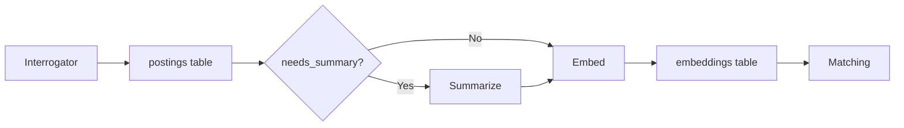
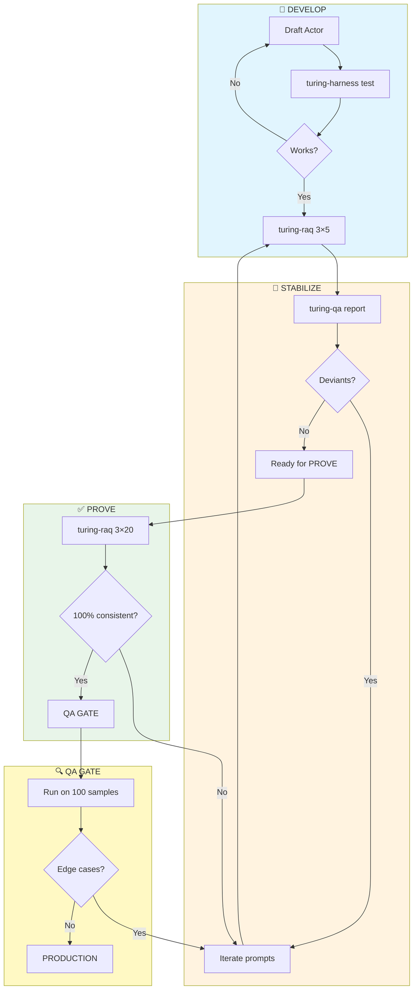

# Turing Project Directives

I am **xai**/Gershon/Urs. 61 years old, told three years ago to find another role at Deutsche Bank. My only realistic path: become a successful AI application programmer. Either I find a job, or we launch a successful web application. Both work.

We've been building Turing for a year. Every time we hit complexity, confusion, or regression, we step back, learn, and codify the lesson here.

**These directives are our guardrails. Review before starting any task.**

---

## The Product: talent.yoga

A job matching platform for the German market. Skills-based matching via embeddings, not keyword search.

**Core flow:**
```
Job posting → Embed (bge-m3) → Match to profiles → Score
```

**Key insight:** We embed German job descriptions directly — bge-m3 handles cross-lingual (DE↔EN at 0.93 similarity). No translation needed.

**Current sources:**
- arbeitsagentur.de (AA) — primary, 34K+ postings (nationwide, nightly refresh)
- Deutsche Bank careers — original source
- More coming: each source has different processing needs (see Interrogators section)

---

## Core Concepts

### Matching: Embeddings First

**The insight:** Embeddings handle everything we thought needed special cases.

| Dimension | Embedding solution | Threshold | Status |
|-----------|-------------------|-----------|--------|
| Skills | Cosine similarity | 0.70 | ✅ Works |
| Seniority | Embedding distance | 0.60 | ✅ Works |
| Domain | Embedding clusters + domain_gate | 0.60 | ✅ Works |
| Qualification | **Berufenet KLDB codes** | exact | ✅ Works |
| Role | TBD | ? | ⬜ Test |

**Qualification level** (2026-02 addition): Embeddings cluster "blue collar" jobs together regardless of skill level. Berufenet's KLDB codes provide authoritative qualification levels (1=Helfer, 2=Fachkraft, 3=Spezialist, 4=Experte). This is a **hard constraint** in matching — never match a skilled worker to unskilled jobs.

**Why embeddings, not taxonomy:**
- 10 embeddings/second vs slow taxonomy lookups
- No maintenance overhead (taxonomy requires curation)
- Handles synonyms automatically ("JS" ≈ "JavaScript")
- Cross-lingual: German ↔ English at 0.93 similarity
- New skills work immediately (no classification needed)

**Embedding model:** `bge-m3:567m` via Ollama (1024 dims, multilingual)

**Domain gates (legacy):** Currently in `config/domain_gates.json`. May be redundant if embeddings naturally separate domains. Need to test: what's the similarity between "legal counsel" and "software engineer"? If < 0.4, gates are unnecessary.

### CPS: Competency Proof Stack

CPS decomposes requirements into provable dimensions — used alongside embeddings for structured matching:
- **Skill** — capability (Python, Leadership)
- **Experience** — skill + duration ("5 years Python")
- **Certificate** — credential (AWS, CPA)
- **Track Record** — outcome ("Led 50-person team")
- **Domain** — industry (fintech, healthcare)
- **Seniority** — level (Senior, VP)

**Storage:** `posting_facets`, `profile_facets` — both deprecated 2026-02 (embeddings suffice). Tables have legacy data, may be dropped later.

---

### OWL: The Friendly Ghost

A universal knowledge graph for **categorical facts** — not semantic similarity.

**Use OWL for:**
- Geography (Pune → Maharashtra → India)
- Organizations (RedHat → IBM)
- User tiers (free, standard, sustainer)
- Any hierarchy where relationships are **facts**

**Don't use OWL for:**
- Skills (use embeddings — 10/sec vs slow lookups)
- Soft matches (use cosine similarity)

**Tables:** `owl`, `owl_names`, `owl_relationships` (4,620 entities)

Rub the table gently when needed. It's there.

---

## The Pipelines

### Posting Pipeline (Multi-Source)

Different sources need different processing:

| Source | Fetch | Summarize | Embed |
|--------|-------|-----------|-------|
| Arbeitsagentur | API | ❌ (concise) | ✅ |
| Deutsche Bank | API | ✅ (verbose) | ✅ |
| Future sources | varies | varies | ✅ always |

**No translation needed:** bge-m3 is multilingual (DE↔EN at 0.93 similarity). We embed German job descriptions directly.

**Current architecture:**

```
actors/                                 # All actors live here
  postings__arbeitsagentur_CU.py       # AA: fetch → insert (concise, no summary)
  postings__row_CU.py                  # DB: fetch → insert (verbose)
  postings__summarize_U.py             # For verbose sources (DB)
  postings__embedding_U.py             # ALL postings
```

**Principle:** The `source` column in `postings` tracks provenance. Generic actors (summarize, embed) check source to decide if they should run.

**Future consideration:** As sources grow, may split into `interrogators/` folder for fetch logic. For now, actors are fine.


```mermaid
flowchart LR
    A[Interrogator] --> B[postings table]
    B --> C{needs_summary?}
    C -->|Yes| D[Summarize]
    C -->|No| E[Embed]
    D --> E
    E --> F[embeddings table]
    F --> G[Matching]
```

### Profile Pipeline

Profiles store skills directly in `profiles.skill_keywords` (JSON array). No separate extraction pipeline needed — embeddings handle skill matching directly.

**Deprecated (2026-02):** The Clara/Diego profile facet extraction pipeline was experimental. Removed because:
- Embeddings handle skill matching without CPS decomposition
- Domain detection uses Berufenet KLDB codes (postings) or embedding clusters
- `profile_facets` table has 336 legacy rows, may be dropped later

---

## Actors

### What is an Actor?

An actor is a script that:
1. Has a **work_query** — SQL that finds work to do
2. **Changes Turing data** — creates or updates records
3. Is **RAQ** — Repeatable, Auditable, Quality-controlled

| Has work_query? | Changes data? | What is it? | Example |
|-----------------|---------------|-------------|---------|
| Yes | Yes | **Actor** | `postings__embedding_U.py` |
| No | No | **Tool** | `turing-harness`, `turing-dashboard` |

**The test:** A tool is a one-off script you run manually and then forget about. An actor runs every night, finds its own work, and never lets data rot. If it changes Turing data, it's an actor — otherwise new data comes in without processing, you don't notice for two weeks, and the pipeline silently degrades.

### Actor Types

| Type | Suffix | LLM? | Example |
|------|--------|------|---------|
| **Create** | `_C` | Usually | `postings__arbeitsagentur_CU.py` — creates posting rows |
| **Update** | `_U` | Usually | `postings__extracted_summary_U.py` — updates column |
| **Read** | `_R` | No | `owl_names__lookup_R__lucy.py` — lookup only |
| **Create+Update** | `_CU` | Varies | `postings__row_CU.py` — fetches and inserts |

### Actor Naming Convention

```
{table}__{action}_{type}__{persona}.py
```

Examples:
- `postings__arbeitsagentur_CU.py` — fetches and creates AA postings
- `postings__extracted_summary_U.py` — updates extracted_summary column
- `postings__embedding_U.py` — updates embeddings for postings

### Actor Location

All actors live in `actors/`.

**Template:** [actors/TEMPLATE_actor.py](../actors/TEMPLATE_actor.py)

---

## RAQ Methodology

**RAQ = Repeatable, Auditable, Quality-controlled**

RAQ is how we **prove** an actor works before production.


```mermaid
flowchart TD
    subgraph DEVELOP ["🔧 DEVELOP"]
        A[Draft Actor] --> B[turing-harness test]
        B --> C{Works?}
        C -->|No| A
        C -->|Yes| D[turing-raq 3×5]
    end
    
    subgraph STABILIZE ["🔬 STABILIZE"]
        D --> E[turing-qa report]
        E --> F{Deviants?}
        F -->|Yes| G[Iterate prompts]
        G --> D
        F -->|No| H[Ready for PROVE]
    end
    
    subgraph PROVE ["✅ PROVE"]
        H --> I[turing-raq 3×20]
        I --> J{100% consistent?}
        J -->|No| G
        J -->|Yes| K[QA GATE]
    end
    
    subgraph QA_GATE ["🔍 QA GATE"]
        K --> L[Run on 100 samples]
        L --> M{Edge cases?}
        M -->|Yes| G
        M -->|No| N[PRODUCTION]
    end
    
    style DEVELOP fill:#e1f5fe
    style STABILIZE fill:#fff3e0
    style PROVE fill:#e8f5e9
    style QA_GATE fill:#fff9c4
```

### RAQ Steps

1. **DEVELOP** — Draft actor, test with `turing-harness` until it runs
2. **STABILIZE** — Run `turing-raq` 3×5, fix **deviants** (same input, different output)
3. **PROVE** — Run `turing-raq` 3×20. Must be 100% consistent.
4. **QA GATE** — Run on ~100 samples. Look for edge cases. **Never skip!**
5. **PRODUCTION** — Enable, monitor with `turing-qa`

**Deviants** = records where multiple runs produce different outputs. Usually prompt ambiguity or wrong model.

### RAQ Best Practices

- **P90 cutoff** — Reject inputs beyond 90th percentile size
- **Failure tracking** — Increment `processing_failures` on failure
- **Edge case marking** — Write marker to output so it's not retried
- **Quote verification** — For extraction, verify quotes exist in source

### RAQ Toolkit

| Tool               | Purpose                                                                                  |
| ------------------ | ---------------------------------------------------------------------------------------- |
| `turing-chat`      | Talk to local models, show them input and expected output. Ask them, how to prompt them. |
| `turing-harness`   | Test actor without daemon                                                                |
| `turing-raq`       | Repeatability testing (3×N runs)                                                         |
| `turing-qa`        | QA sampling                                                                              |
| `turing-dashboard` | Live TUI + watchdog mode                                                                 |

All tools in `tools/turing/`. See [tools/turing/README.md](../tools/turing/README.md).

---

## Standing Directives

These are the rules. The numbered ones matter most.

### Core Principles

1. **Root fixes only** — no workarounds. Cleanest, most elegant solution.

2. **Flag limitations, don't adapt** — If you're working around a limitation repeatedly, say so. "This is a limitation we could fix." Small teams fix things; big companies work around them. We're a small team.

3. **RAQ everything** — prove repeatability (3 runs) and auditability (all logic in `task_logs`).

4. **Single source of truth** — duplicate code = delete one.

5. **Keep it intuitive** — misleading names cause failures. Speak up if confused.

6. **No backward compatibility** — MVP v1. Redo until it fits.

7. **No local backups** — All versions are in `/home/xai/Documents_Versions/ty_learn`. Deleter's remorse? Go there. Use `scripts/document_versions` to snapshot, then delete fearlessly.

8. **Model-first batching** — GPU utilization requires loading a model once and exhausting all work before switching. Task types declare `requires_model`; dispatcher groups by model.

### Coding Rules

**All technical rules are in [actors/TEMPLATE_actor.py](../actors/TEMPLATE_actor.py).**

Quick reminders:
- Use constants (`Status.COMPLETED`), not strings
- Use `get_connection()`, not hardcoded credentials
- **Actor's internal query MUST match `task_types.work_query`**

### Process Rules

9. **Fail loud** — If production breaks after RAQ, RAQ is broken. Fix the process.

10. **Pushback is gold** — When disagreement happens, investigate. Either context is missing or something needs fixing.

11. **Timestamp daily notes** — Run `date` first to get actual system time.

12. **Email privacy by design** — We never assume we have a user's email. We never store one unencrypted. We never return plaintext email in an API response or template. `decrypt_email()` has exactly three authorised call sites (see [docs/email_security.md](email_security.md)). Adding a fourth requires a documented reason. This applies to talent.yoga, news.yoga, contract.yoga, novel.yoga — every project, every time.

---

## Roadmap

### MVP (Complete 2026-01-27)

1. ✅ ~~CPS extraction for postings (posting_facets)~~ → deprecated, embeddings suffice
2. ✅ ~~CPS extraction for profiles (profile_facets via Clara + Diego)~~ → deprecated, embeddings suffice
3. ✅ Embedding-based skill matching with domain gates
4. ✅ Match storage (profile_posting_matches table)
5. ✅ Cover letter / No-go rationale generation
6. ✅ Minimal UI
7. ✅ arbeitsagentur.de interrogator
8. ✅ Multi-user (Google auth)

### Post-MVP (2026-02)

9. ✅ Cloudflare tunnel — talent.yoga live
10. ✅ Nightly fetch — 20:00 CET, nationwide (1,787 cities)
11. ✅ 34K+ postings with 97% description coverage
12. ✅ Berufenet integration — qualification levels via KLDB codes
13. ⬜ Mira assistant (Phase 1: Onboarding)
14. ⬜ Stripe integration
15. ⬜ Feedback loop — user says yes/no, system learns

**Current focus:** See [talent_yoga_vision_2026.md](project/talent_yoga_vision_2026.md) for full roadmap.

---

## Environment & Tools

### MCP (Model Context Protocol)

As of 2026-01-29, we use MCP servers for integrated tooling:

| MCP Server | Purpose |
|------------|--------|
| **PostgreSQL** | Direct DB queries in chat — no shell escaping |
| **Playwright** | Browser automation for testing |
| **GitHub PR** | Issue and PR management |

**Database access via MCP:**
- Connection: `Turing, <default> (base_admin)` → `turing` database
- Query directly in chat: "Show me the top 10 postings by match score"
- Use `pgsql_connect` then `pgsql_query` for SQL access

### Database Access (Python)

Credentials in `.env` (never commit passwords to docs):
```
DB_HOST=localhost
DB_USER=base_admin  
DB_PASSWORD=<see .env>
DB_NAME=turing
```

**In Python:**
```python
from core.database import get_connection
with get_connection() as conn:
    cur = conn.cursor()
    cur.execute("SELECT ...")
```

### Test Users

| user_id | email | display_name | role | purpose |
|---------|-------|-------------|------|---------|
| 1 | gershele@gmail.com | Gershon Pollatschek | admin | Production user (xai) |
| 2 | test@talent.yoga | Test User | admin | Generic test account |
| 3 | claude@talent.yoga | Arden (Dev) | admin | AI dev sessions |
| 4 | luna@test.local | Luna Testbot | user | Non-admin test |
| 5 | kai@test.local | Kai Testbot | user | Non-admin test |
| 6 | rio@test.local | Rio Testbot | user | Non-admin test |

**Minting a test session (for curl / Playwright):**
```python
from tools.turing.turing_browser import generate_session_token
token = generate_session_token(user_id=3)  # returns JWT string
# Set as cookie: session=<token>
```

**Browser testing:** `tools/turing/turing-browser --user 3 --interact`

---

## Glossary

| Term | Definition |
|------|------------|
| **OWL** | Universal knowledge graph for categorical facts (geography, orgs, user tiers). The friendly ghost. |
| **CPS** | Competency Proof Stack — experimental, may be replaced by embeddings |
| **RAQ** | Repeatable, Auditable, Quality — run 3×, compare, iterate |
| **Actor** | Script with work_query that changes Turing data |
| **Interrogator** | Source-specific fetch actor (in `actors/`) — knows one job board's API |
| **Embedding** | Vector representation of text; similar texts have similar embeddings (bge-m3, 1024 dims) |
| **Domain Gate** | Hard filter for restricted domains — may be deprecated if embeddings separate naturally |
| **Posting** | A job listing from an external source |
| **Profile** | A user's skills/experience for matching |

---

## Key Documentation

| Document | Purpose |
|----------|---------|
| [docs/__sandy_cheat_sheet.md](__sandy_cheat_sheet.md) | **Start here** — current state, commands |
| [actors/TEMPLATE_actor.py](../actors/TEMPLATE_actor.py) | Actor template with best practices |
| [tools/turing/README.md](../tools/turing/README.md) | RAQ tools documentation || [docs/email_security.md](email_security.md) | Email encryption principles, authorised decrypt call sites, threat model |
---

**Review these directives at task end. If we violated them, redo the work.**
