# Turing Project Directives

I am **xai**/Gershon/Urs. 61 years old, told three years ago to find another role at Deutsche Bank. My only realistic path: become a successful AI application programmer. Either I find a job, or we launch a successful web application. Both work.

We've been building Turing for a year. Every time we hit complexity, confusion, or regression, we step back, learn, and codify the lesson here.

**These directives are our guardrails. Review before starting any task.**

---

## The Product: talent.yoga

A job matching platform for the German market. Skills-based matching via embeddings, not keyword search.

**Core flow:**
```
Job posting → Embed (bge-m3) → Match to profiles → Score
```

**Key insight:** We embed German job descriptions directly — bge-m3 handles cross-lingual (DE↔EN at 0.93 similarity). No translation needed.

**Current sources:**
- arbeitsagentur.de (AA) — primary, 34K+ postings (nationwide, nightly refresh)
- Deutsche Bank careers — original source
- More coming: each source has different processing needs (see Interrogators section)

---

## Core Concepts

### Matching: Embeddings First

**The insight:** Embeddings handle everything we thought needed special cases.

| Dimension | Embedding solution | Threshold | Status |
|-----------|-------------------|-----------|--------|
| Skills | Cosine similarity | 0.70 | ✅ Works |
| Seniority | Embedding distance | 0.60 | ✅ Works |
| Domain | Embedding clusters + domain_gate | 0.60 | ✅ Works |
| Qualification | **Berufenet KLDB codes** | exact | ✅ Works |
| Role | TBD | ? | ⬜ Test |

**Qualification level** (2026-02 addition): Embeddings cluster "blue collar" jobs together regardless of skill level. Berufenet's KLDB codes provide authoritative qualification levels (1=Helfer, 2=Fachkraft, 3=Spezialist, 4=Experte). This is a **hard constraint** in matching — never match a skilled worker to unskilled jobs.

**Why embeddings, not taxonomy:**
- 10 embeddings/second vs slow taxonomy lookups
- No maintenance overhead (taxonomy requires curation)
- Handles synonyms automatically ("JS" ≈ "JavaScript")
- Cross-lingual: German ↔ English at 0.93 similarity
- New skills work immediately (no classification needed)

**Embedding model:** `bge-m3:567m` via Ollama (1024 dims, multilingual)

**Domain gates (legacy):** Currently in `config/domain_gates.json`. May be redundant if embeddings naturally separate domains. Need to test: what's the similarity between "legal counsel" and "software engineer"? If < 0.4, gates are unnecessary.

### CPS: Competency Proof Stack

CPS decomposes requirements into provable dimensions — used alongside embeddings for structured matching:
- **Skill** — capability (Python, Leadership)
- **Experience** — skill + duration ("5 years Python")
- **Certificate** — credential (AWS, CPA)
- **Track Record** — outcome ("Led 50-person team")
- **Domain** — industry (fintech, healthcare)
- **Seniority** — level (Senior, VP)

**Storage:** `posting_facets`, `profile_facets` — may be deprecated if embeddings suffice.

---

### OWL: The Friendly Ghost

A universal knowledge graph for **categorical facts** — not semantic similarity.

**Use OWL for:**
- Geography (Pune → Maharashtra → India)
- Organizations (RedHat → IBM)
- User tiers (free, standard, sustainer)
- Any hierarchy where relationships are **facts**

**Don't use OWL for:**
- Skills (use embeddings — 10/sec vs slow lookups)
- Soft matches (use cosine similarity)

**Tables:** `owl`, `owl_names`, `owl_relationships` (4,620 entities)

Rub the table gently when needed. It's there.

---

## The Pipelines

### Posting Pipeline (Multi-Source)

Different sources need different processing:

| Source | Fetch | Summarize | Translate | Embed |
|--------|-------|-----------|-----------|-------|
| Arbeitsagentur | API | ❌ (concise) | ❌ (German users) | ✅ |
| Deutsche Bank | API | ✅ (verbose) | ✅ (DE→EN) | ✅ |
| Future sources | varies | varies | varies | ✅ always |

**Current architecture:**

```
actors/                                 # All actors live here
  postings__arbeitsagentur_CU.py       # AA: fetch → insert (concise, no summary)
  postings__row_CU.py                  # DB: fetch → insert (verbose)
  postings__summarize_U.py             # For verbose sources (DB)
  postings__embedding_U.py             # ALL postings
```

**Principle:** The `source` column in `postings` tracks provenance. Generic actors (summarize, embed) check source to decide if they should run.

**Future consideration:** As sources grow, may split into `interrogators/` folder for fetch logic. For now, actors are fine.


### Profile Pipeline

Profile work history → CPS facets:


| Stage | Actor | Purpose |
|-------|-------|---------|
| 1 | `profile_facets__extract_C__clara.py` | Extract explicit CPS facets from job descriptions |
| 2 | `profile_facets__enrich_U__diego.py` | Add implied/enabler skills based on domain, role, seniority |

**Implied skills:** Skills people don't mention because they're "obvious":
- Banking domain → SharePoint, Outlook, Excel
- Manager role → People management, Budget oversight
- Senior seniority → Mentoring, Strategic thinking

**Configuration:** [config/enabler_skills.json](../config/enabler_skills.json)

---

## Actors

### What is an Actor?

An actor is a script that:
1. Has a **work_query** — SQL that finds work to do
2. **Changes Turing data** — creates or updates records
3. Is **RAQ** — Repeatable, Auditable, Quality-controlled

| Has work_query? | Changes data? | What is it? | Example |
|-----------------|---------------|-------------|---------|
| Yes | Yes | **Actor** | `posting_facets__row_C.py` |
| No | No | **Tool** | `turing-harness`, `turing-dashboard` |

### Actor Types

| Type | Suffix | LLM? | Example |
|------|--------|------|---------|
| **Create** | `_C` | Usually | `posting_facets__row_C.py` — creates facet rows |
| **Update** | `_U` | Usually | `postings__extracted_summary_U.py` — updates column |
| **Read** | `_R` | No | `owl_names__lookup_R__lucy.py` — lookup only |
| **Create+Update** | `_CU` | Varies | `postings__row_CU.py` — fetches and inserts |

### Actor Naming Convention

```
{table}__{action}_{type}__{persona}.py
```

Examples:
- `posting_facets__row_C.py` — creates posting_facets rows
- `profile_facets__extract_C__clara.py` — Clara extracts profile facets
- `postings__extracted_summary_U.py` — updates extracted_summary column

### Actor Location

All actors live in `actors/`.

**Template:** [actors/TEMPLATE_actor.py](../actors/TEMPLATE_actor.py)

---

## RAQ Methodology

**RAQ = Repeatable, Auditable, Quality-controlled**

RAQ is how we **prove** an actor works before production.

```mermaid
flowchart TD
    subgraph DEVELOP ["🔧 DEVELOP"]
        A[Draft Actor] --> B[turing-harness test]
        B --> C{Works?}
        C -->|No| A
        C -->|Yes| D[turing-raq 3×5]
    end
    
    subgraph STABILIZE ["🔬 STABILIZE"]
        D --> E[turing-qa report]
        E --> F{Deviants?}
        F -->|Yes| G[Iterate prompts]
        G --> D
        F -->|No| H[Ready for PROVE]
    end
    
    subgraph PROVE ["✅ PROVE"]
        H --> I[turing-raq 3×20]
        I --> J{100% consistent?}
        J -->|No| G
        J -->|Yes| K[QA GATE]
    end
    
    subgraph QA_GATE ["🔍 QA GATE"]
        K --> L[Run on 100 samples]
        L --> M{Edge cases?}
        M -->|Yes| G
        M -->|No| N[PRODUCTION]
    end
    
    style DEVELOP fill:#e1f5fe
    style STABILIZE fill:#fff3e0
    style PROVE fill:#e8f5e9
    style QA_GATE fill:#fff9c4
```



### RAQ Steps

1. **DEVELOP** — Draft actor, test with `turing-harness` until it runs
2. **STABILIZE** — Run `turing-raq` 3×5, fix **deviants** (same input, different output)
3. **PROVE** — Run `turing-raq` 3×20. Must be 100% consistent.
4. **QA GATE** — Run on ~100 samples. Look for edge cases. **Never skip!**
5. **PRODUCTION** — Enable, monitor with `turing-qa`

**Deviants** = records where multiple runs produce different outputs. Usually prompt ambiguity or wrong model.

### RAQ Best Practices

- **P90 cutoff** — Reject inputs beyond 90th percentile size
- **Failure tracking** — Increment `processing_failures` on failure
- **Edge case marking** — Write marker to output so it's not retried
- **Quote verification** — For extraction, verify quotes exist in source

### RAQ Toolkit

| Tool               | Purpose                                                                                  |
| ------------------ | ---------------------------------------------------------------------------------------- |
| `turing-chat`      | Talk to local models, show them input and expected output. Ask them, how to prompt them. |
| `turing-harness`   | Test actor without daemon                                                                |
| `turing-raq`       | Repeatability testing (3×N runs)                                                         |
| `turing-qa`        | QA sampling                                                                              |
| `turing-dashboard` | Live TUI + watchdog mode                                                                 |

All tools in `tools/turing/`. See [tools/turing/README.md](../tools/turing/README.md).

---

## Standing Directives

These are the rules. The numbered ones matter most.

### Core Principles

1. **Root fixes only** — no workarounds. Cleanest, most elegant solution.

2. **Flag limitations, don't adapt** — If you're working around a limitation repeatedly, say so. "This is a limitation we could fix." Small teams fix things; big companies work around them. We're a small team.

3. **RAQ everything** — prove repeatability (3 runs) and auditability (all logic in `task_logs`).

4. **Single source of truth** — duplicate code = delete one.

5. **Keep it intuitive** — misleading names cause failures. Speak up if confused.

6. **No backward compatibility** — MVP v1. Redo until it fits.

7. **No local backups** — All versions are in `/home/xai/Documents_Versions/ty_learn`. Deleter's remorse? Go there. Use `scripts/document_versions` to snapshot, then delete fearlessly.

8. **Model-first batching** — GPU utilization requires loading a model once and exhausting all work before switching. Task types declare `requires_model`; dispatcher groups by model.

### Coding Rules

**All technical rules are in [actors/TEMPLATE_actor.py](../actors/TEMPLATE_actor.py).**

Quick reminders:
- Use constants (`Status.COMPLETED`), not strings
- Use `get_connection()`, not hardcoded credentials
- **Actor's internal query MUST match `task_types.work_query`**

### Process Rules

9. **Fail loud** — If production breaks after RAQ, RAQ is broken. Fix the process.

10. **Pushback is gold** — When disagreement happens, investigate. Either context is missing or something needs fixing.

11. **Timestamp daily notes** — Run `date` first to get actual system time.

---

## Roadmap

### MVP (Complete 2026-01-27)

1. ✅ CPS extraction for postings (posting_facets)
2. ✅ CPS extraction for profiles (profile_facets via Clara + Diego)
3. ✅ Embedding-based skill matching with domain gates
4. ✅ Match storage (profile_posting_matches table)
5. ✅ Cover letter / No-go rationale generation
6. ✅ Minimal UI
7. ✅ arbeitsagentur.de interrogator
8. ✅ Multi-user (Google auth)

### Post-MVP (2026-02)

9. ✅ Cloudflare tunnel — talent.yoga live
10. ✅ Nightly fetch — 20:00 CET, nationwide (1,787 cities)
11. ✅ 34K+ postings with 97% description coverage
12. ✅ Berufenet integration — qualification levels via KLDB codes
13. ⬜ Mira assistant (Phase 1: Onboarding)
14. ⬜ Stripe integration
15. ⬜ Feedback loop — user says yes/no, system learns

**Current focus:** See [talent_yoga_vision_2026.md](project/talent_yoga_vision_2026.md) for full roadmap.

---

## Environment & Tools

### MCP (Model Context Protocol)

As of 2026-01-29, we use MCP servers for integrated tooling:

| MCP Server | Purpose |
|------------|--------|
| **PostgreSQL** | Direct DB queries in chat — no shell escaping |
| **Playwright** | Browser automation for testing |
| **GitHub PR** | Issue and PR management |

**Database access via MCP:**
- Connection: `Turing, <default> (base_admin)` → `turing` database
- Query directly in chat: "Show me the top 10 postings by match score"
- Use `pgsql_connect` then `pgsql_query` for SQL access

### Database Access (Python)

Credentials in `.env` (never commit passwords to docs):
```
DB_HOST=localhost
DB_USER=base_admin  
DB_PASSWORD=<see .env>
DB_NAME=turing
```

**In Python:**
```python
from core.database import get_connection
with get_connection() as conn:
    cur = conn.cursor()
    cur.execute("SELECT ...")
```

---

## Glossary

| Term | Definition |
|------|------------|
| **OWL** | Universal knowledge graph for categorical facts (geography, orgs, user tiers). The friendly ghost. |
| **CPS** | Competency Proof Stack — experimental, may be replaced by embeddings |
| **RAQ** | Repeatable, Auditable, Quality — run 3×, compare, iterate |
| **Actor** | Script with work_query that changes Turing data |
| **Interrogator** | Source-specific fetch actor (in `actors/`) — knows one job board's API |
| **Embedding** | Vector representation of text; similar texts have similar embeddings (bge-m3, 1024 dims) |
| **Domain Gate** | Hard filter for restricted domains — may be deprecated if embeddings separate naturally |
| **Posting** | A job listing from an external source |
| **Profile** | A user's skills/experience for matching |

---

## Key Documentation

| Document | Purpose |
|----------|---------|
| [docs/__sandy_cheat_sheet.md](__sandy_cheat_sheet.md) | **Start here** — current state, commands |
| [actors/TEMPLATE_actor.py](../actors/TEMPLATE_actor.py) | Actor template with best practices |
| [tools/turing/README.md](../tools/turing/README.md) | RAQ tools documentation |

---

**Review these directives at task end. If we violated them, redo the work.**
