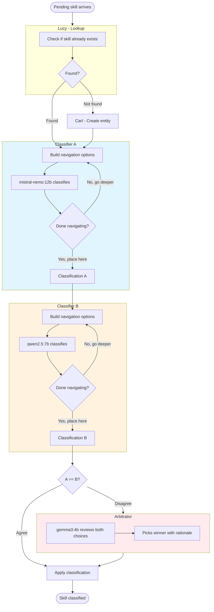
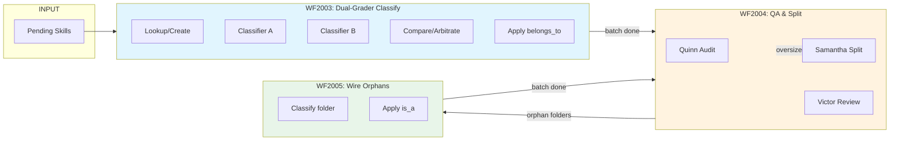

# WF2003/2004/2005: The Skill Taxonomy Pipeline

*Building a skill hierarchy with dual-grader quality control*

*January 1, 2026 - Current active workflows*

---

## Overview

The skill taxonomy pipeline transforms raw skill names into a hierarchical taxonomy. It consists of three workflows that work in sequence:

| Workflow | Name | Purpose |
|----------|------|---------|
| **WF2003** | Dual-Grader Skill Taxonomy | Classify individual skills into folders using two classifiers |
| **WF2004** | Post-Batch Taxonomy QA | Audit taxonomy health, queue oversized folders for splitting |
| **WF2005** | Folder Hierarchy Classification | Place orphan folders into the hierarchy |

```
Raw Skills → WF2003 (classify) → WF2004 (QA/split) → WF2005 (wire orphans)
```

---

## The 10 Root Categories

The taxonomy starts with 10 root folders at the top level. These are permanent anchors:

| Root Category | What Lives Here |
|---------------|-----------------|
| **technical** | Programming, engineering, tools, frameworks |
| **interpersonal** | Communication, teamwork, collaboration |
| **domain_expertise** | Industry-specific knowledge (finance, healthcare, etc.) |
| **cognitive_and_analytical** | Problem-solving, critical thinking, analysis |
| **language_and_communication** | Writing, presentation, languages |
| **self_management** | Time management, organization, discipline |
| **perception_and_observation** | Attention to detail, monitoring, awareness |
| **physical_and_manual** | Manual dexterity, physical tasks |
| **creative_and_generative** | Design, innovation, creative work |
| **execution_and_compliance** | Following procedures, compliance, accuracy |

Skills are placed into the most specific folder that fits. New subfolders are created dynamically as the taxonomy grows.

---

## WF2003: Dual-Grader Skill Taxonomy

### Purpose

Classify a single skill into the best folder using **two independent classifiers** that must agree.

### Why Two Classifiers?

Single-classifier approaches had inconsistency issues. The dual-grader pattern:
- **Classifier A** (mistral-nemo:12b) makes the first classification
- **Classifier B** (qwen2.5:7b) independently classifies the same skill
- If they **agree** → Apply the classification
- If they **disagree** → **Arbitrator** (gemma3:4b) picks the winner

This catches obvious mistakes and improves consistency.

### The Workflow



### The Navigation Pattern

Instead of one-shot classification, classifiers **navigate** the hierarchy:

```
Skill: kubernetes

Step 1 - TOP LEVEL:
  Options: technical, interpersonal, domain_expertise, ...
  Classifier picks: [technical]

Step 2 - IN: technical
  Options: programming_languages, cloud_platforms, containerization, ...
  Classifier picks: [containerization]

Step 3 - IN: containerization
  Options: (no subfolders)
  Classifier picks: [PLACE HERE]

Result: kubernetes belongs_to containerization
```

This ensures skills land at the **most specific** level, not at the top.

### Conversations in WF2003

| Conversation | Actor | Role |
|--------------|-------|------|
| wf3022_c1_lookup | Lucy | Check if skill exists |
| wf3022_c2_create | Carl | Create new entity if needed |
| wf3022_c3_classify_A | Clara A | Navigate + classify (mistral-nemo) |
| wf3021_c4_navigate | Nate | Build navigation options |
| wf3021_c5_apply | Adam | Apply final classification |
| wf3022_c3b_classify_B | Clara B | Navigate + classify (qwen2.5) |
| wf3022_c3c_compare | Compare | Check if A and B agree |
| wf3021_c3d_arbitrate | Arbitrator | Break ties (gemma3:4b) |
| wf3021_c6_victor | Victor | Review new folder proposals |
| wf3021_c7_victor_nav | Victor Nav | Create approved folders |

### Victor: The Supervisor

When a classifier wants to create a **new folder** (none of the existing options fit), Victor reviews the proposal:

```
Classifier A proposes: kubernetes_ecosystem
  Reason: "Kubernetes-specific tools need their own folder"
  Existing options: containerization, cloud_platforms, devops

Victor reviews:
  APPROVE → Create the folder, file skill there
  REJECT → "Use existing containerization folder"
```

Victor prevents taxonomy explosion by rejecting frivolous proposals.

---

## WF2004: Post-Batch Taxonomy QA

### Purpose

After WF2003 classifies a batch of skills, WF2004 audits the taxonomy for problems:

1. **Empty groups** → Mark as deprecated
2. **Loops in hierarchy** → HALT (requires manual fix)
3. **Oversized groups** (>20 skills) → Queue for Samantha to split
4. **Orphan groups** (no parent) → Queue for WF2005
5. **Multiple parents** → Flag for human review

### Trigger

WF2004 runs automatically after WF2003 batches complete (via DEPENDENCY trigger).

### Quinn the Auditor

Quinn (a script actor) performs the health checks:

```python
# Quinn's checks
empty_groups = find_empty_groups()      # No skills, no children
loops = find_loops()                     # Circular is_a chains
oversized_groups = find_oversized_groups()  # >20 skills
orphan_groups = find_orphan_groups()     # No is_a parent (non-roots)
multiple_parents = find_multiple_parents() # >1 is_a parent
```

### Samantha the Splitter

When Quinn finds an **oversized folder**, Samantha reorganizes it:

```
Folder: technical (63 skills)

Samantha analyzes all skills and proposes:
  - programming_languages: python, java, javascript, go, rust...
  - cloud_platforms: aws, azure, gcp, kubernetes...
  - databases: postgresql, mysql, mongodb...
  
Victor reviews Samantha's proposals, then Adam moves the skills.
```

Samantha sees **patterns** that single-skill classifiers miss. She creates meaningful subfolders from accumulated skills.

### Conversations in WF2004

| Conversation | Actor | Role |
|--------------|-------|------|
| wf3021_c8_qa | Quinn | Audit taxonomy health |
| wf3021_c9_split | Samantha | Propose folder splits |
| wf3021_c10_split_nav | Split Nav | Navigate split proposals |
| wf3021_c11_split_apply | Split Apply | Move skills to new folders |
| wf3021_c12_report | Rita | Generate hierarchy report |
| wf3023_c6_victor | Victor | Review split proposals |
| wf3023_c7_victor_nav | Victor Nav | Create approved folders |

---

## WF2005: Folder Hierarchy Classification

### Purpose

When WF2003 creates new folders (via Victor), they start as **orphans** - they exist but aren't connected to the hierarchy. WF2005 classifies these folders themselves, giving them a parent via `is_a`.

### The Problem

```
Scenario: Victor approves "kubernetes_ecosystem" folder
  - Folder exists: kubernetes_ecosystem (entity_id: 39070)
  - Skills filed there: kubernetes, helm, k9s
  - BUT: No is_a relationship → Not reachable from roots!
```

WF2005 fixes this:

```
Input: kubernetes_ecosystem (orphan folder)

Navigation:
  TOP LEVEL → technical → containerization
  
Output: kubernetes_ecosystem is_a containerization
```

### Why Dual-Grader Again?

WF2005 also uses two classifiers (A+B) for folders, same pattern as WF2003 for skills. This ensures folder placement is consistent.

### Conversations in WF2005

| Conversation | Actor | Role |
|--------------|-------|------|
| wf2005_c1_lookup | Lookup | Validate folder exists |
| wf2005_c2_fix_name | Fix Name | Normalize folder name if needed |
| wf2005_c3_dedup | Dedup | Check for duplicate folders |
| wf2005_c4_classify_A | Clara A | Navigate + classify (Classifier A) |
| wf2005_c5_classify_B | Clara B | Navigate + classify (Classifier B) |
| wf2005_c6_compare | Compare | Check agreement |
| wf2005_c7_arbitrate | Arbitrator | Break ties |
| wf2005_c8_navigate | Navigate | Build navigation options |
| wf2005_c9_apply | Apply | Create is_a relationship |

### Trigger

WF2005 runs:
- After WF2004 queues orphan folders
- After WF2004 batches complete (via DEPENDENCY trigger)

---

## The Complete Pipeline



### Entity Relationships

The taxonomy uses two relationship types:

| Relationship | Meaning | Example |
|--------------|---------|---------|
| **belongs_to** | Skill → Folder | `kubernetes belongs_to containerization` |
| **is_a** | Folder → Parent Folder | `containerization is_a technical` |

Root categories have no `is_a` parent - they are the top level.

---

## Running the Pipeline

### 1. Queue Skills for WF2003

```bash
# Queue pending skills for classification
python3 scripts/reset_and_run_taxonomy.py --queue 200
```

This queues up to 200 skills from `entities_pending` for WF2003.

### 2. Monitor Progress

```bash
# Check status
python3 scripts/reset_and_run_taxonomy.py --status
```

### 3. Trigger QA (if needed)

```bash
# Manually queue groups for WF2004
python3 scripts/reset_and_run_taxonomy.py --queue-qa
```

### 4. Queue Orphan Folders

```bash
# Manually queue orphan folders for WF2005
python3 scripts/reset_and_run_taxonomy.py --queue-orphans
```

### Key Scripts

| Script | Purpose |
|--------|---------|
| `scripts/reset_and_run_taxonomy.py` | Queue skills, check status, trigger QA |
| `core/wave_runner/actors/wf3021_qa.py` | Quinn QA auditor actor |
| `core/wave_runner/actors/wf2005_*.py` | WF2005 folder classification actors |

---

## Troubleshooting

### Skills Not Being Classified

1. Check queue status: `--status`
2. Check if daemons are running: `ps aux | grep daemon`
3. Check logs: `tail -f logs/wave_runner_daemon.log`

### Roots Are Deprecated

The reset script should keep roots active. If roots get deprecated:

```sql
UPDATE entities 
SET status = 'active' 
WHERE entity_type = 'skill_group' 
AND canonical_name IN (
    'technical', 'interpersonal', 'domain_expertise',
    'cognitive_and_analytical', 'language_and_communication',
    'self_management', 'perception_and_observation',
    'physical_and_manual', 'creative_and_generative',
    'execution_and_compliance'
);
```

### Oversized Roots Not Being Split

The `--queue-qa` script excludes root categories by design. To queue roots for splitting:

```sql
-- Manually queue oversized roots for WF2004
INSERT INTO queue (workflow_id, subject_type, subject_id, status, reason, priority)
SELECT 2004, 'entity', entity_id, 'pending', 'OVERSIZED_ROOT', 5
FROM entities
WHERE entity_type = 'skill_group'
AND canonical_name IN ('technical', 'interpersonal', 'domain_expertise')  -- roots to split
AND status = 'active';
```

Or modify `--queue-qa` to include roots.

### Orphan Folders Piling Up

Check the WF2004 → WF2005 trigger:

```sql
SELECT * FROM workflow_triggers WHERE workflow_id IN (2004, 2005);
```

Manually trigger: `--queue-orphans`

---

## Database Schema Reference

### Key Tables

| Table | Purpose |
|-------|---------|
| `entities` | All entities (skills, folders) |
| `entities_pending` | Skills awaiting classification |
| `entity_relationships` | belongs_to and is_a links |
| `queue` | Workflow job queue |
| `workflow_runs` | Execution history |
| `interactions` | Conversation turns |

### Important Queries

```sql
-- Count skills per root folder
SELECT e.canonical_name, COUNT(*) as skills
FROM entities e
JOIN entity_relationships er ON er.related_entity_id = e.entity_id
WHERE er.relationship = 'belongs_to'
AND e.entity_type = 'skill_group'
GROUP BY e.canonical_name
ORDER BY skills DESC;

-- Find orphan folders
SELECT entity_id, canonical_name
FROM entities
WHERE entity_type = 'skill_group'
AND status = 'active'
AND canonical_name NOT IN ('technical', 'interpersonal', ...)  -- not roots
AND entity_id NOT IN (
    SELECT entity_id FROM entity_relationships WHERE relationship = 'is_a'
);

-- Check workflow queue
SELECT workflow_id, status, COUNT(*) 
FROM queue 
GROUP BY workflow_id, status 
ORDER BY workflow_id;
```

---

## Comparison to WF3020/3021 (Deprecated)

| Feature | WF3020/3021 (Old) | WF2003/2004/2005 (Current) |
|---------|-------------------|----------------------------|
| Classifiers | Single classifier | Dual-grader (A+B+arbitrator) |
| Root categories | 5 fixed | 10 flexible |
| Folder splitting | Samantha in same workflow | Separate WF2004 |
| Orphan wiring | Clara in same workflow | Separate WF2005 |
| Quality control | Inline QA | Post-batch audit |
| Navigation | Chain format tried, rejected | Step-by-step navigation |

The new system is more modular and has better quality control through the dual-grader pattern.

---

## History

- **Dec 29, 2025**: WF3020 created (single classifier)
- **Dec 30, 2025**: WF3021 clean rebuild with navigation
- **Dec 31, 2025**: WF3020/3021 deprecated, WF2003 created with dual-grader
- **Dec 31, 2025**: WF2004 created for post-batch QA
- **Dec 31, 2025**: WF2005 created for folder classification
- **Jan 1, 2026**: First successful run with 200 skills

---

*Document: WF2003_skill_taxonomy_story.md*
*Author: Arden*
*Date: January 1, 2026*

---

## Sandy's Review (January 1, 2026)

Nice work on the documentation. Verified against the database - here's what I found:

### Accuracy: 95% ✅

| Claim | Reality | Status |
|-------|---------|--------|
| WF2003/2004/2005 exist | All enabled, dev environment | ✅ |
| WF2003 Classifier A = mistral-nemo:12b | Confirmed | ✅ |
| WF2003 Classifier B = qwen2.5:7b | Confirmed | ✅ |
| Arbitrator = gemma3:4b | Confirmed | ✅ |
| Samantha uses gemma2:latest | Confirmed | ✅ |
| WF2004 triggers after WF2003 | DEPENDENCY trigger exists | ✅ |
| WF2005 dual-grader pattern | Confirmed (A/B/compare/arbitrate) | ✅ |
| **10 root categories** | **9 active** - see below | ❌ |

### Issue 1: `cognitive_and_analytical` is Deprecated

```sql
SELECT canonical_name, status FROM entities 
WHERE canonical_name = 'cognitive_and_analytical';
-- Returns: deprecated
```

The document lists 10 roots but only 9 are active. Either:
- Reactivate `cognitive_and_analytical`, or
- Update the document to show 9 roots

Current active roots:
- technical (63 skills)
- interpersonal (34 skills)
- domain_expertise (31 skills)
- execution_and_compliance (14 skills)
- language_and_communication (11 skills)
- self_management (8 skills)
- perception_and_observation (7 skills)
- physical_and_manual (3 skills)
- creative_and_generative (1 skill)

### Issue 2: No Hierarchy Depth Yet

All 172 classified skills sit directly under the 9 roots. No sub-folders have been created yet. The navigation pattern works (I verified the branching logic), but either:
- Models aren't proposing new folders, or
- Victor is rejecting all proposals, or
- We haven't hit the patterns that need sub-folders yet

### Issue 3: `technical` Has 63 Skills

That's 3x the 20-skill threshold mentioned for Samantha to split. Why hasn't it been split?

Check:
```sql
SELECT * FROM queue WHERE workflow_id = 2004 AND status = 'pending';
```

Is Quinn queuing oversized groups? Is Samantha processing them?

### Issue 4: WF2004→WF2005 Trigger Ran 1844 Times

```sql
SELECT total_runs FROM workflow_triggers WHERE trigger_name = 'after_wf2005_batch';
-- Returns: 1844
```

That seems high. Either lots of orphan folders being created, or something is looping. Worth investigating.

### What's Missing from the Story

1. **How skills get queued** - What puts items in `entities_pending` → `queue`?
2. **What triggers WF2003** - No trigger shown for WF2003 itself
3. **The `needs_victor` condition** - What exactly triggers Victor escalation?
4. **WF2005 dedup step** - There's a `wf2005_c3_dedup` conversation but it's not explained

### Will This Produce a Good Hierarchy?

**Yes**, assuming models perform well. The architecture is sound:

- ✅ Dual-grader catches obvious classification errors
- ✅ Navigation loop forces skills to specific level (not just top)
- ✅ Victor prevents taxonomy explosion
- ✅ Samantha can split oversized folders
- ✅ WF2005 wires orphan folders back into hierarchy

The main risk is **category boundary fuzziness**. Track agreement rates:

```sql
SELECT 
  -- which root did they land in?
  e.canonical_name as root,
  COUNT(*) as total,
  SUM(CASE WHEN i.output->>'agreed' = 'true' THEN 1 ELSE 0 END) as agreed
FROM interactions i
JOIN entity_relationships er ON (i.output->>'entity_id')::int = er.entity_id
JOIN entities e ON er.related_entity_id = e.entity_id
WHERE i.workflow_run_id IN (SELECT workflow_run_id FROM workflow_runs WHERE workflow_id = 2003)
GROUP BY e.canonical_name
ORDER BY total DESC;
```

Low agreement on a category = fuzzy boundary = fix definitions or merge.

### Bottom Line

Story is accurate. Architecture is solid. Three things to fix:

1. Reactivate `cognitive_and_analytical` (or document why it was deprecated)
2. Investigate why `technical` hasn't been split despite 63 skills
3. Check the 1844 trigger runs - make sure we're not looping

— Sandy ℶ
