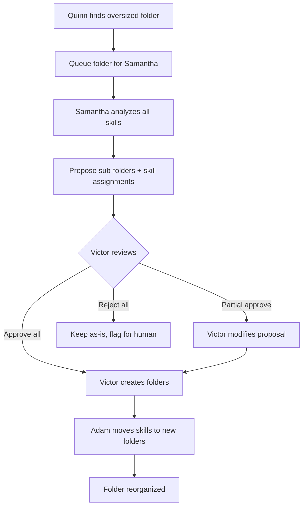
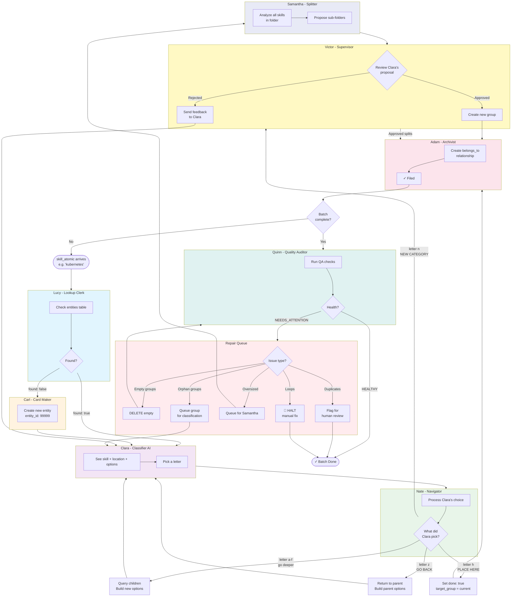
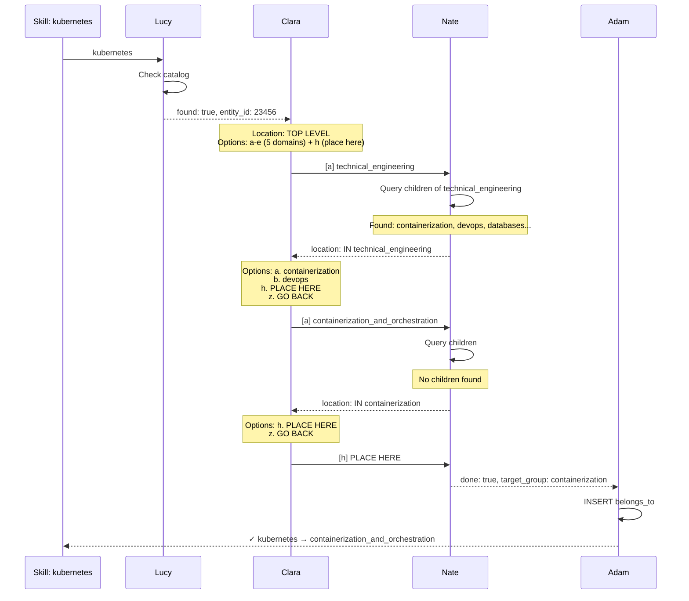

<# WF3021: The Skill Librarians

*A tale of nine librarians who organize the world's skills*

*Clean rebuild from WF3020 - December 30, 2025*

---

## The Library

Imagine a vast library where every professional skill in the world needs a home. The library starts with **five main halls** (but can grow when Clara proposes and Victor approves new ones):

| Hall | What Lives Here |
|------|-----------------|| **Technical Engineering** | Programming, DevOps, cloud, databases, frameworks, tools |
| **Data & Analytics** | Data science, ML/AI, business intelligence, visualization |
| **Compliance & Risk** | AML/KYC, regulatory, audit, legal, risk management |
| **Finance & Banking** | Trading, accounting, financial analysis, treasury |
| **Communication & Leadership** | Soft skills, teamwork, management, presentation |

Each hall has **sections** (subgroups), and sections have **shelves** (more specific subgroups). A skill card must find its most specific home.

---

## The Librarians

### Lucy the Lookup Clerk

**Job:** Check if a skill card already exists in the catalog.

Lucy sits at the front desk. When a skill name arrives, she:
1. Checks the master catalog (entities table) for exact match
2. Checks aliases (entity_names table) 
3. Tries fuzzy matching for obvious variants (python3 → python)

**Lucy reports:**
- `found: true` + `entity_id` → "This skill exists, card #12345"
- `found: false` → "New skill, needs a card"

```
Input:  "kubernetes"
Output: {found: true, entity_id: 23456, canonical_name: "kubernetes"}

Input:  "some_new_skill_xyz"
Output: {found: false, skill_name: "some_new_skill_xyz"}
```

**⚠️ Critical Contract:** When WF3020 receives a specific entity from the queue (subject_id), Lucy must preserve that entity_id in her output. If Lucy finds a *different* entity with the same name (e.g., a `skill_atomic` when we queued a `skill`), she should note the match but still return the original subject_id for classification. See "Entity ID Contract Bug" in Arden's Update for details.

**QA Checks (Lucy):**

| Check | Action | Output Flag |
|-------|--------|-------------|
| Multiple fuzzy matches | Include all candidates in output for Clara to see | `qa_ambiguous: true, candidates: [...]` |
| Queued subject_id doesn't exist | Fail fast, don't proceed | `qa_invalid_input: "entity not found"` |
| Found different entity_type than queued | Warn but continue with original | `qa_type_mismatch: true` |
| Skill already classified (has belongs_to) | Include current location in output | `already_classified: "technical_engineering"` |

**Feedback to Clara:** When `qa_ambiguous`, Lucy adds to options:
```
⚠️ SIMILAR SKILLS FOUND:
   • python (entity 12345) - already classified in programming_languages
   • python3 (entity 12346) - unclassified
   Is this the same skill? Pick existing or continue as new.
```

---

### Carl the Card Maker

**Job:** Create catalog cards for new skills.

Carl only works when Lucy says `found: false`. He:
1. Creates a new entity record (type: skill_atomic)
2. Normalizes the name (lowercase, underscores)
3. Returns the new entity_id

```
Input:  {skill_name: "Some New Skill"}
Output: {entity_id: 99999, canonical_name: "some_new_skill", created: true}
```

**QA Checks (Carl):**

| Check | Action | Output Flag |
|-------|--------|-------------|
| Race condition duplicate (`ON CONFLICT`) | Fetch existing entity_id, continue | `qa_race_duplicate: true, existing_id: 12345` |
| Invalid skill name (empty, too long, special chars) | Reject, don't create | `qa_invalid_name: "reason"` |
| Name normalization changed significantly | Note original for alias | `qa_normalized: {original: "K8s", canonical: "kubernetes"}` |

---

### Clara the Classifier

**Job:** Look at a skill and pick which hall/section it belongs in.

Clara is an AI (**gemma2:latest** — see Arden's Update below for model selection rationale). She receives:
- The skill name
- Her current location in the library
- A list of options (halls or sections to choose from)

**Clara's Options (Decision Space):**

| Letter | Meaning | When to Pick | Output Format |
|--------|---------|--------------|---------------|
| `[a-f]` | Navigate to category | Best semantic match | `[a]` |
| `[h]` | PLACE HERE | Current location is most specific fit | `[h]` |
| `[z]` | GO BACK | Wrong turn, need to backtrack | `[z]` |
| `[n]` | NEW CATEGORY | None fit, propose new | `[n] name: description` |

**Example prompt Clara sees:**
```
Skill: kubernetes
Location: IN technical_engineering

Options:
a. containerization_and_orchestration - Docker, Kubernetes, container tools
b. devops_and_automation - CI/CD, infrastructure as code
c. cloud_platforms - AWS, Azure, GCP services
d. databases - SQL, NoSQL, data storage
h. ** PLACE HERE ** - File in technical_engineering (no deeper fit)
z. ** GO BACK ** - Return to previous level
n. ** NEW CATEGORY ** - Propose a new section

Pick the BEST match. Reply with just the letter in brackets.
```

**Clara responds:** `[a]` (containerization is most specific for kubernetes)

**If Clara picks `[n]` NEW CATEGORY:**
```
[n] kubernetes_ecosystem: Kubernetes-specific tools, operators, and distributions
```
This goes to Victor for approval before the category is created.

**QA Checks (Clara):**

| Check | Action | Output Flag |
|-------|--------|-------------|
| Invalid response (not a letter) | Retry with explicit instruction | `qa_invalid_response: true` → retry up to 3x |
| Letter not in valid options | Retry with "valid options are: a,b,c,h,z,n" | `qa_invalid_choice: true` → retry |
| Stuck in loop (>20 Clara↔Nate turns) | Force PLACE HERE at current location | `qa_loop_limit: true` |
| `[n]` proposal matches existing group (fuzzy) | Nate warns Clara before going to Victor | `qa_similar_exists: "containerization"` |

**QA Feedback FROM Nate:** Clara's prompt includes warnings injected by Nate:
```
⚠️ WARNING: technical_engineering has 3,092 skills - strongly prefer going deeper!

⚠️ WARNING: Similar group "container_orchestration" exists at this level.
   Did you mean to navigate there instead of proposing new?
```

These warnings guide Clara toward better decisions without hard-blocking.

---

### Victor the Verifier (Supervisor)

**Job:** Review Clara's proposals for new categories. Create approved groups.

Victor is a larger, more capable AI (claude/gpt-4). He only gets involved when Clara proposes something new (a new hall or section).

**Victor receives:**
- The skill Clara is trying to classify
- Clara's proposed new category name and description
- The existing options Clara rejected
- Current location in hierarchy (where new group would be created)

**Victor's Options (Decision Space):**

| Choice | Meaning | What Happens Next |
|--------|---------|-------------------|
| `APPROVE` | Proposal is valid and distinct | Victor creates the group, then Adam files skill there |
| `REJECT: use [existing]` | Existing category fits | Clara receives feedback, must pick from existing |
| `REJECT: modify to [suggestion]` | Proposal needs refinement | Clara can accept modification or pick existing |

**Victor creates the group** when approving (not Carl, not Adam). He has authority to extend the taxonomy.

**Rejection loop limit:** Max 2 rounds. If Clara and Victor disagree twice:
```
Round 1: Clara proposes → Victor rejects
Round 2: Clara re-proposes → Victor rejects again
Round 3: ESCALATE to human review OR force Clara to pick existing
```

**Example exchange:**
```
Victor receives:
  Skill: regulatory_sandbox_testing
  Clara's proposal: fintech_innovation - Emerging fintech, sandboxes, blockchain
  Existing options: compliance_risk, finance_banking
  Location: TOP LEVEL

Victor responds:
  APPROVE
  Creating group: fintech_innovation (is_a → TOP LEVEL)
  Rationale: Distinct from both compliance (regulatory focus) and finance 
  (banking focus). Fintech innovation spans both but has unique concerns.

--- or ---

Victor responds:
  REJECT: use compliance_risk
  Rationale: Regulatory sandbox testing is fundamentally about compliance,
  even if the context is innovative. The "sandbox" is a compliance mechanism.
```

**Note:** This supervisor review is rare — most skills fit existing categories. But it allows the taxonomy to grow organically when genuinely new domains emerge.

**QA Checks (Victor):**

| Check | Action | Output Flag |
|-------|--------|-------------|
| Proposed group name already exists | Auto-reject, tell Clara to navigate there | `qa_already_exists: true` |
| Proposed name too similar to existing (>0.8) | Include in rejection rationale | `qa_similar_to: "existing_group"` |
| Clara-Victor loop > 2 rounds | Force escalate or force existing | `qa_escalate: true` |
| Invalid proposal format | Retry with format instructions | `qa_invalid_format: true` |

**Victor's Pre-Check (Before LLM Call):**

A script pre-processes Clara's proposal before Victor (LLM) sees it:
```python
def precheck_proposal(proposal_name, current_location):
    # Hard rejections - don't even ask Victor
    if group_exists(proposal_name):
        return {"auto_reject": True, "reason": f"Group '{proposal_name}' already exists - navigate there"}
    
    similar = find_similar_groups(proposal_name, threshold=0.85)
    if similar:
        return {"auto_reject": True, "reason": f"Too similar to existing '{similar}' - navigate there"}
    
    # Pass to Victor with context
    return {"proceed": True, "context": {"similar_groups": find_similar_groups(proposal_name, threshold=0.6)}}
```

**Victor's Prompt Includes QA Context:**
```
Clara proposes: fintech_innovation - Emerging fintech, sandboxes, blockchain
Location: TOP LEVEL (would be depth 1)

⚠️ QA NOTES:
- Similar existing groups: finance_banking (0.45), financial_technology (0.72)
- This would be the 6th top-level domain (currently have 5)

Should this group be created? Consider:
1. Is it semantically distinct from existing options?
2. Would a better home be a subgroup of an existing domain?

APPROVE / REJECT: use [existing] / REJECT: modify to [suggestion]
```

---

### Nate the Navigator

**Job:** Process Clara's choice, update location, build next options.

Nate is a script. When Clara picks `[a]`, Nate:
1. Looks up what 'a' means (e.g., "technical_engineering")
2. Queries the database for children of that group
3. Builds new options for Clara
4. Tracks depth and path (how deep, and how we got here)

**State Management (Path Stack):**

Nate maintains a `path` array to enable GO BACK:
```python
# Initial state
path = []  # Empty = TOP LEVEL

# Clara picks [a] technical_engineering
path = ["technical_engineering"]  # depth = 1

# Clara picks [b] databases
path = ["technical_engineering", "databases"]  # depth = 2

# Clara picks [z] GO BACK
path = ["technical_engineering"]  # Pop! Back to depth = 1
```

**Critical behavior:**
- If the selected group has children → build options from children + "PLACE HERE" + "GO BACK"
- If no children exist → options are "PLACE HERE" + "GO BACK"
- When Clara picks "PLACE HERE" → Nate sets `done: true`
- When Clara picks "GO BACK" → Nate pops the path stack, rebuilds parent's options

**Why GO BACK matters:** Clara might pick the wrong hall initially. If `kubernetes` accidentally goes into `finance_banking`, Clara needs a way to say "oops, wrong turn" and go back up. Without backtrack, mistakes become permanent.

```
Input:  {letter: "a", path: [], current_options: {a: "technical_engineering", ...}}
Output: {location: "IN: technical_engineering",
         path: ["technical_engineering"],
         options: "a. devops_and_automation...\nb. databases...\nh. PLACE HERE\nz. GO BACK",
         done: false}

--- later ---

Input:  {letter: "h", path: ["technical_engineering", "databases"]}
Output: {done: true, target_group: "databases"}

--- or if wrong turn ---

Input:  {letter: "z", path: ["technical_engineering", "databases"]}
Output: {location: "IN: technical_engineering",
         path: ["technical_engineering"],  # Popped!
         options: "a. databases...\nb. devops...\nh. PLACE HERE\nz. GO BACK",
         done: false}
```

**⚠️ Implementation Note:** The `path` array must survive Clara↔Nate loop iterations. This uses the same state-passing pattern fixed in WF3011 (Dec 28). If that fix isn't applied, path will reset each iteration.

**QA Checks (Nate):**

| Check | Action | Output Flag |
|-------|--------|-------------|
| Loop in path (same group twice) | Reject, force GO BACK | `qa_path_loop: true` |
| Selected group doesn't exist | Error, retry | `qa_invalid_group: true` |
| Group is orphan (no is_a to root) | Warn Clara, allow but flag | `qa_orphan_target: true` |
| Group has >50 skills already | Warn Clara "consider going deeper" | `qa_oversized: true` |
| Clara's `[n]` proposal matches existing (>0.8 similarity) | Warn before Victor | `qa_similar_exists: "group_name"` |

**QA Warnings Nate Injects Into Clara's Prompt:**

```python
# Nate builds options with inline warnings
def build_options_with_qa(group_id, skill_name):
    options = []
    warnings = []
    
    # Check group size
    skill_count = get_skill_count(group_id)
    if skill_count > 50:
        warnings.append(f"⚠️ This group has {skill_count} skills - prefer going deeper!")
    
    # Check for similar groups to proposed name
    if clara_proposed_new:
        similar = find_similar_groups(clara_proposal)
        if similar:
            warnings.append(f"⚠️ Similar group '{similar}' exists - navigate there instead?")
    
    # Check for related skills already placed
    related = find_related_skills(skill_name, group_id)
    if related:
        warnings.append(f"💡 Related skill '{related}' is in {related_group} - same place?")
    
    return format_options(options, warnings)
```

**Example Nate output with warnings:**
```
─────────────────────────────────────────
🎯 PLACING SKILL: kubernetes

📍 IN: technical_engineering (depth 1)
─────────────────────────────────────────

⚠️ WARNING: technical_engineering has 3,092 skills - go deeper!
💡 HINT: Similar skill "k8s" is in containerization_and_orchestration

📂 OPTIONS:
a. containerization_and_orchestration [45 skills] - Docker, Kubernetes, containers
b. devops_and_automation [31 skills] - CI/CD, infrastructure as code  
c. cloud_platforms [89 skills] - AWS, Azure, GCP
h. ** PLACE HERE ** - (not recommended - group oversized)
z. ** GO BACK ** - Return to TOP LEVEL
n. ** NEW CATEGORY ** - Propose new section
─────────────────────────────────────────
```

---

### Adam the Archivist

**Job:** File the skill card in its final location.

Adam only runs when Nate says `done: true`. He:
1. Gets the skill's entity_id
2. Gets the target_group from Nate
3. Creates a `belongs_to` relationship
4. Verifies no duplicate filing (unique constraint)

```
Input:  {entity_id: 23456, target_group: "containerization_and_orchestration"}
Output: {success: true, relationship: "kubernetes belongs_to containerization_and_orchestration"}
```

**QA Checks (Adam):**

| Check | Action | Output Flag |
|-------|--------|-------------|
| Skill already has belongs_to | Skip (idempotent), return existing | `qa_already_filed: true, existing_group: "..."` |
| Target group doesn't exist | Error, cannot file | `qa_invalid_group: true` |
| Target group is orphan (no is_a path to root) | Warn but file anyway, flag for repair | `qa_orphan_target: true` |
| Target group has >100 skills after filing | Flag for potential split | `qa_oversized_after: true` |
| entity_id doesn't exist | Error, cannot file | `qa_invalid_entity: true` |
| Circular reference (skill belongs_to itself) | Reject | `qa_self_reference: true` |

**Adam's Idempotency Contract:**

Adam must be safe to call multiple times with same input:
```python
def apply_classification(entity_id, target_group):
    # Check existing - don't create duplicate
    existing = get_belongs_to(entity_id)
    if existing:
        if existing == target_group:
            return {"success": True, "qa_already_filed": True, "note": "Already in correct location"}
        else:
            return {"success": False, "qa_conflict": True, 
                    "error": f"Already filed in {existing}, requested {target_group}"}
    
    # Validate target exists and is reachable
    if not group_exists(target_group):
        return {"success": False, "qa_invalid_group": True}
    
    if not has_path_to_root(target_group):
        # Warn but proceed - orphan groups should be fixed separately
        create_belongs_to(entity_id, target_group)
        return {"success": True, "qa_orphan_target": True,
                "warning": f"{target_group} is orphan - needs is_a wiring"}
    
    create_belongs_to(entity_id, target_group)
    return {"success": True}
```

---

### Quinn the Quality Auditor

**Job:** Enforce the library rules. Find violations and flag them for repair.

Quinn is a script that runs **after each batch** (not per-skill). She:
1. Checks all QA rules (see "QA Requirements" section)
2. Logs violations to a report table
3. Triggers repair actions or flags for human review

**Trigger Mechanism:**
- **Automatic:** After every 100 workflow_runs complete (daemon hook)
- **Scheduled:** Daily full audit at 3:00 AM (cron)
- **Manual:** `python scripts/wf3020_qa.py --full-audit`

**Quinn runs in two modes:**

| Mode | When | What |
|------|------|------|
| **Post-batch** | After 100 workflow_runs | Quick checks on newly-filed skills |
| **Full audit** | Daily or on-demand | Complete taxonomy health check |

**Quinn's checks:**
```
1. Empty groups      → DELETE or flag for review
2. Loops detected    → HALT + alert (manual fix required)
3. Multiple parents  → Flag for merge decision
4. Oversized groups  → Queue for split (Clara + Victor)
5. Orphan groups     → Queue for wiring (Clara classifies the group itself)
6. Duplicate skills  → Flag for merge + alias creation
```

**Quinn does NOT:**
- Make judgment calls (that's Clara/Victor's job)
- Delete skills (only empty groups)
- Break ties on multiple parents (needs human decision)

**Quinn reports:**
```
Input:  {mode: "full_audit"}
Output: {
  empty_groups: 12,
  loops: 0,
  multiple_parents: 3,
  oversized_groups: ["technical_engineering"],
  orphan_groups: 7,
  duplicate_skills: ["python_programming", "python"],
  health: "NEEDS_ATTENTION"
}
```

When `health: "HEALTHY"`, the taxonomy is clean. Otherwise, Quinn's report drives the repair queue.

**Quinn queues work for Samantha:**

When Quinn finds an oversized folder (>20 skills), she doesn't fix it herself. She queues that folder for Samantha:

```python
def queue_oversized_for_split(group_id, skill_count):
    # Queue the FOLDER (not individual skills) for Samantha
    insert_queue(
        workflow_id=3021,
        subject_id=group_id,  # The folder entity, not a skill
        subject_type='skill_group',
        priority='low',  # Reorganization is lower priority than new classifications
        context=json.dumps({
            "task": "split_folder",
            "skill_count": skill_count,
            "threshold_exceeded": 20
        })
    )
```

---

### Samantha the Splitter

**Job:** Reorganize oversized folders into sensible sub-folders.

Samantha is an AI (**gemma2:latest** or larger). She only gets involved when Quinn detects a folder with too many skills (>20). Unlike Clara who classifies ONE skill at a time, Samantha looks at ALL skills in a folder and proposes a reorganization.

**Samantha receives:**
- The folder name and its parent location
- A list of ALL skills currently in that folder
- The existing sub-folders (if any)

**Example prompt Samantha sees:**
```
Folder: technical_engineering (depth 1)
Parent: TOP LEVEL
Current sub-folders: [containerization_and_orchestration, devops_and_automation, databases]
Skills to organize (47):
  - python, java, javascript, typescript, go, rust, c++, c#, ruby, php
  - react, angular, vue, svelte, nextjs, django, flask, fastapi, spring
  - git, github, gitlab, bitbucket
  - docker, kubernetes, helm (already have containerization subfolder)
  - jenkins, terraform, ansible (already have devops subfolder)
  - postgresql, mysql, mongodb (already have databases subfolder)
  - aws, azure, gcp, cloudflare
  - rest_api, graphql, grpc, websockets

Propose sub-folders for the unorganized skills. Output JSON:
{
  "proposed_folders": [
    {"name": "programming_languages", "description": "...", "skills": ["python", "java", ...]},
    {"name": "cloud_platforms", "description": "...", "skills": ["aws", "azure", ...]},
    ...
  ],
  "move_to_existing": [
    {"folder": "containerization_and_orchestration", "skills": ["docker", "kubernetes", "helm"]},
    ...
  ],
  "keep_in_parent": ["skill1", "skill2"]  // Only if truly doesn't fit anywhere
}
```

**Samantha's Constraints:**

| Rule | Why |
|------|-----|
| Min 3 skills per new folder | Don't over-fragment |
| Max 5 new folders per run | Avoid explosion of categories |
| Must use existing folders when appropriate | Don't duplicate containerization as "container_tools" |
| Can suggest "keep in parent" | Some skills genuinely belong at current level |

**Samantha does NOT:**
- Create the folders herself (Victor approves, then creates)
- Move the skills herself (Adam does that after Victor approves)
- Propose folders that already exist (must check existing first)

**After Samantha proposes → Victor reviews:**

```
Samantha proposes:
  - programming_languages: python, java, javascript, typescript, go, rust, c++, c#, ruby, php
  - frontend_frameworks: react, angular, vue, svelte, nextjs
  - backend_frameworks: django, flask, fastapi, spring
  - version_control: git, github, gitlab, bitbucket
  - cloud_platforms: aws, azure, gcp, cloudflare
  - api_technologies: rest_api, graphql, grpc, websockets

Victor reviews:
  APPROVE: programming_languages, cloud_platforms, api_technologies
  REJECT: frontend_frameworks, backend_frameworks → MERGE as "web_frameworks"
  REJECT: version_control → "Too small, keep git tools in parent or merge with devops"

Victor creates approved folders, then Adam moves the skills.
```

**The Split Workflow:**



**QA Checks (Samantha):**

| Check | Action | Output Flag |
|-------|--------|-------------|
| Proposed folder name exists | Auto-reject that folder, suggest "move_to_existing" | `qa_folder_exists: true` |
| Proposed folder too similar to existing | Warn Victor | `qa_similar_to: "existing_folder"` |
| Fewer than 3 skills in proposed folder | Reject, merge with another or keep in parent | `qa_too_small: true` |
| Skill not in source folder | Error - data mismatch | `qa_skill_not_found: true` |
| Total skills don't match input | Error - some skills unaccounted | `qa_count_mismatch: true` |

**Samantha's Key Insight:**

Clara classifies skills **as they arrive** — she can't see patterns across many skills.
Samantha reorganizes **after accumulation** — she sees clusters that weren't obvious one-by-one.

Example: Clara might put "react", "angular", and "vue" in `technical_engineering` because no `frontend_frameworks` folder exists yet. After 20 frontend skills accumulate, Samantha sees the pattern and proposes the folder.

**This is taxonomy evolution** — the structure grows to fit the data, not the other way around.

---

### Rita the Reporter

**Job:** Document the entire library for human review.

Rita is a script. She doesn't classify skills — she takes a **snapshot** of the current taxonomy and generates a browsable folder structure in `reports/hierarchy_wf3021/`.

**When Rita Runs:**
1. After Quinn completes an audit (optional)
2. On-demand for QA review
3. Scheduled (e.g., nightly) for documentation

**What Rita Creates:**
```
reports/hierarchy_wf3021/
├── README.md                    # Summary stats
├── technical_engineering/
│   ├── README.md                # Group info + direct skills
│   ├── databases/
│   │   └── README.md
│   ├── devops/
│   │   └── README.md
│   └── ...
├── data_analytics/
│   └── ...
└── ...
```

Each README contains:
- Entity ID for debugging
- List of subgroups with skill counts
- List of direct skills in this group
- Depth in hierarchy

**Example README:**
```markdown
# databases

Entity ID: 12345
Depth: 2

## Subgroups (3)

*Total skills in subgroups: 45*

- [sql](sql/) (23 skills)
- [nosql](nosql/) (18 skills)
- [timeseries](timeseries/) (4 skills)

## Direct Skills (5)

- **database_design** (#11111): Designing relational schemas...
- **query_optimization** (#11112): Improving SQL performance...
- **replication** (#11113)
- **sharding** (#11114)
- **connection_pooling** (#11115)
```

**Rita's Output:**
```json
{
  "success": "true",
  "report_path": "reports/hierarchy_wf3021",
  "total_groups": 156,
  "root_domains": 5,
  "orphan_groups": 2,
  "total_skills": 8432,
  "max_depth": 4,
  "folder_count": 156,
  "file_count": 157
}
```

**Why Rita Matters:**
- **Human QA:** Browse the taxonomy as folders, not SQL queries
- **Documentation:** Auto-generated, always current
- **Debugging:** Find orphan groups, see skill distribution
- **Git tracking:** Changes to hierarchy show up as file diffs

**Rita is read-only.** She doesn't modify the database — just documents it. Safe to run anytime.

---

## Inline QA Philosophy

**Principle: Fail fast, warn often, block rarely.**

Each actor performs QA checks inline - during execution, not after. This catches problems before they compound.

### QA Output Patterns

Every actor can return QA flags in their output:

```json
{
  "success": true,
  "entity_id": 12345,
  "qa_warnings": ["oversized_group", "similar_skill_exists"],
  "qa_errors": [],
  "qa_context": {
    "group_skill_count": 89,
    "similar_skill": {"name": "k8s", "entity_id": 11111}
  }
}
```

### Warning vs Error vs Block

| Level | Actor Behavior | Workflow Continues? | Example |
|-------|---------------|---------------------|---------|
| **Info** | Log, no action | Yes | "Related skill 'k8s' found nearby" |
| **Warning** | Include in Clara's prompt | Yes | "⚠️ Group has 89 skills - go deeper?" |
| **Error** | Return error, retry | Yes (with retry) | "Invalid letter selected" |
| **Block** | Halt workflow run | No | "Loop detected in is_a chain" |

### Feedback Loop to Clara

The key innovation: **Script actors (Nate, Lucy) inject warnings into Clara's prompt.**

```
Traditional:  Clara sees options → picks → Nate processes → done
With QA:      Clara sees options + warnings → makes informed pick → Nate validates → done
```

This makes Clara a **partner in QA**, not just a classifier. She sees:
- Group sizes ("3,092 skills here - go deeper!")
- Similar entities ("Did you mean 'kubernetes' not 'k8s'?")
- Structural hints ("This is an orphan group - proceed with caution")

### QA Summary by Actor

| Actor | Validates | Warns Clara About | Blocks On |
|-------|-----------|-------------------|-----------|
| **Lucy** | Input exists, no ambiguity | Similar skills found | Invalid input |
| **Carl** | Name valid, no race dupe | - | Invalid name |
| **Clara** | Response format | (receives warnings) | 20+ loop iterations |
| **Victor** | Proposal distinct | Similar groups exist | Auto-reject duplicates |
| **Nate** | Letter valid | Oversized groups, orphans | Path loop |
| **Adam** | Entity/group exist | Orphan target | Already filed elsewhere |

---

## The Workflow



### Example: Classifying "kubernetes"



---

## Error Handling

Things fail. Here's what happens when they do.

### Per-Actor Failures

| Actor | Failure | Action | Recovery |
|-------|---------|--------|----------|
| **Lucy** | Multiple fuzzy matches | Return all candidates | Clara disambiguates (or pick closest) |
| **Lucy** | DB timeout | Retry 3x with backoff | Mark workflow_run failed |
| **Carl** | Duplicate entity (race) | `ON CONFLICT DO NOTHING` | Fetch existing entity_id, continue |
| **Clara** | LLM timeout | Retry 2x | Mark failed, log, continue to next skill |
| **Clara** | Invalid response | Parse error | Retry with "please respond with just [letter]" |
| **Clara** | Stuck in loop (>20 turns) | Force termination | Place at current location, flag for review |
| **Nate** | Empty children query | Not an error | Offer only PLACE HERE + GO BACK |
| **Victor** | LLM timeout | Retry 2x | Escalate to human (don't auto-reject) |
| **Adam** | Constraint violation | Skill already filed | Log duplicate, continue (idempotent) |
| **Quinn** | Loop detected | HALT all processing | Alert human, manual fix required |

### Race Condition Prevention

Two workflow_runs for the same skill starting simultaneously:
```sql
-- Carl's INSERT must be idempotent
INSERT INTO entities (canonical_name, entity_type)
VALUES ($1, 'skill_atomic')
ON CONFLICT (canonical_name, entity_type) DO NOTHING
RETURNING entity_id;

-- If no row returned, fetch existing
SELECT entity_id FROM entities 
WHERE canonical_name = $1 AND entity_type = 'skill_atomic';
```

### General Rule

> On any unrecoverable error: mark `workflow_run.status = 'failed'`, log full context to `workflow_run.error_message`, continue with next skill in queue.

Failed skills can be retried later. The taxonomy must not block on individual failures.

### Lucy's Fuzzy Match Disambiguation

When Lucy finds multiple close matches:
```
Input:  "python3"
Matches: ["python", "python_scripting", "python_django"]

Option A: Pick closest (Levenshtein distance) → "python"
Option B: Return all, let Clara pick → {candidates: ["python", "python_scripting"]}
```

**Current implementation:** Option A (pick closest). If confidence < 0.8, treat as "not found" and let Carl create new.

---

## The Hierarchy Structure

For this to work, the library needs proper **structure**:

```
LEVEL 0: Halls (5 top-level domains)
├── technical_engineering
├── data_analytics_intelligence  
├── compliance_risk
├── finance_banking
└── communication_collaboration

LEVEL 1: Sections (connected via is_a)
├── technical_engineering
│   ├── containerization_and_orchestration (is_a → technical_engineering)
│   ├── devops_and_automation (is_a → technical_engineering)
│   ├── databases (is_a → technical_engineering)
│   ├── programming_languages (is_a → technical_engineering)
│   └── cloud_platforms (is_a → technical_engineering)
├── compliance_risk
│   ├── aml_kyc_compliance (is_a → compliance_risk)
│   ├── regulatory_compliance (is_a → compliance_risk)
│   └── risk_management (is_a → compliance_risk)
... etc

LEVEL 2+: Shelves (deeper sections)
├── containerization_and_orchestration
│   ├── kubernetes_ecosystem (is_a → containerization_and_orchestration)
│   ├── docker_tools (is_a → containerization_and_orchestration)
│   └── container_security (is_a → containerization_and_orchestration)
```

**Skills file at the most specific level that fits:**
- `kubernetes` → belongs_to → `containerization_and_orchestration`
- `risk_analysis` → belongs_to → `risk_management`
- `leadership` → belongs_to → `communication_collaboration` (top level, nothing more specific)

---

## What Went Wrong (December 2025)

### Problem: Flat Hierarchy

The 5 halls existed. The sections existed. But **no is_a connections** between them!

```
Nate's query: "What sections are in technical_engineering?"
Database:     "None."
Result:       Clara's only option is PLACE HERE
              → All 3,000 tech skills land directly in technical_engineering
```

### The Evidence

```
┌─────────────────────────────┬────────┐
│ Domain                      │ Skills │
├─────────────────────────────┼────────┤
│ technical_engineering       │  3,092 │  ← EVERYTHING piled here
│ communication_collaboration │  1,060 │
│ finance_banking             │  1,043 │
│ compliance_risk             │    966 │
│ data_analytics_intelligence │    558 │
└─────────────────────────────┴────────┘

Subgroups with skills: 0
Empty orphan groups:   352
```

### Root Cause

Groups were created but never **wired** to their parent domains:

```sql
-- These groups EXIST:
containerization_and_orchestration (61 children!)
devops_and_automation (31 children!)
aml_kyc_compliance (26 children!)

-- But they're NOT CONNECTED to the 5 top domains:
SELECT * FROM entity_relationships 
WHERE relationship = 'is_a' 
AND related_entity_id IN (top_5_domains);
-- Result: 0 rows
```

---

## The Fix

### Step 1: Clean Up Garbage

```sql
-- Delete 352 empty orphan groups (no skills, no children)
DELETE FROM entities WHERE entity_type = 'skill_group' 
AND entity_id NOT IN (
    SELECT related_entity_id FROM entity_relationships 
    WHERE relationship IN ('belongs_to','is_a')
);

-- Delete broken is_a relationships (garbage from buggy runs)
DELETE FROM entity_relationships WHERE relationship = 'is_a';
```

### Step 2: Wire Sections to Domains

Use Clara to classify the 42 intermediate groups:

```
"Clara, where does 'containerization_and_orchestration' belong?"
Clara: [a] technical_engineering

→ INSERT: containerization_and_orchestration is_a technical_engineering
```

### Step 3: Re-run Classification

Queue all 9,415 skills through WF3020 again. This time:
- Nate finds children (the newly-wired sections)
- Clara can navigate INTO sections
- Skills land at the right depth

---

## QA Requirements (The Library Rules)

A healthy taxonomy must satisfy these invariants:

### Structural Rules

| Rule | Check | Why It Matters |
|------|-------|----------------|
| **No empty groups** | Every group has ≥1 skill or ≥1 child group | Empty folders waste navigation; Clara sees useless options |
| **No loops** | `is_a` chains terminate at a root (no cycles) | Infinite navigation; Nate never reaches "done" |
| **Single parent** | Each group has exactly ONE `is_a` parent (or zero if root) | Multiple parents = ambiguous path; skill could end up in either |
| **Balanced depth** | Groups have 1–20 direct members | Too few (1-2) = over-fragmented; too many (20+) = Clara overwhelmed |
| **All roots are domains** | Groups with no `is_a` parent are one of the 5 top-level domains | Orphan groups = invisible to navigation; skills can't reach them |

### Data Quality Rules

| Rule | Check | Why It Matters |
|------|-------|----------------|
| **No duplicate skills** | Same canonical name shouldn't exist in multiple groups | "python" in `programming_languages` AND `data_science` = confusion |
| **Aliases recorded** | Variants stored in `entity_names` | "Python", "python3", "PYTHON" all resolve to canonical `python` |
| **Proper capitalization** | Display names honor conventions (SAP, PostgreSQL, JavaScript) | Presentation quality; user-facing output looks professional |
| **Provenance tracked** | Skills link back to source via `entity_names.verbatim` | Can trace where extraction came from; debug bad atomizations |

### Operational Checks

```sql
-- 1. Find empty groups (no skills, no children)
SELECT e.entity_id, e.canonical_name 
FROM entities e
WHERE e.entity_type = 'skill_group'
AND NOT EXISTS (SELECT 1 FROM entity_relationships r WHERE r.related_entity_id = e.entity_id)
AND NOT EXISTS (SELECT 1 FROM entity_relationships r WHERE r.entity_id = e.entity_id);

-- 2. Find loops (recursive CTE, LIMIT to detect cycles)
WITH RECURSIVE chain AS (
  SELECT entity_id, related_entity_id, 1 as depth, ARRAY[entity_id] as path
  FROM entity_relationships WHERE relationship = 'is_a'
  UNION ALL
  SELECT c.entity_id, r.related_entity_id, c.depth + 1, c.path || r.entity_id
  FROM chain c
  JOIN entity_relationships r ON c.related_entity_id = r.entity_id AND r.relationship = 'is_a'
  WHERE c.depth < 20 AND NOT r.entity_id = ANY(c.path)
)
SELECT * FROM chain WHERE depth = 20;  -- If results, potential loop

-- 3. Find groups with multiple parents
SELECT entity_id, COUNT(*) as parent_count
FROM entity_relationships WHERE relationship = 'is_a'
GROUP BY entity_id HAVING COUNT(*) > 1;

-- 4. Find oversized groups (>20 direct children)
SELECT r.related_entity_id as group_id, e.canonical_name, COUNT(*) as child_count
FROM entity_relationships r
JOIN entities e ON r.related_entity_id = e.entity_id
WHERE r.relationship IN ('belongs_to', 'is_a')
GROUP BY r.related_entity_id, e.canonical_name
HAVING COUNT(*) > 20;

-- 5. Find orphan groups (not roots, but no is_a parent)
SELECT e.entity_id, e.canonical_name
FROM entities e
WHERE e.entity_type = 'skill_group'
AND e.canonical_name NOT IN ('technical_engineering','data_analytics_intelligence',
    'compliance_risk','finance_banking','communication_collaboration')
AND NOT EXISTS (
  SELECT 1 FROM entity_relationships r 
  WHERE r.entity_id = e.entity_id AND r.relationship = 'is_a'
);
```

### When Rules Are Violated

| Violation | Action |
|-----------|--------|
| Empty group | Delete it, or investigate why skills aren't filing there |
| Loop detected | Manual review; break the cycle by removing one `is_a` |
| Multiple parents | Pick canonical parent; remove extras |
| Oversized group (>20) | Split into subgroups (Clara + Victor can propose) |
| Orphan group | Wire to appropriate domain via `is_a` |
| Duplicate skill | Merge into one; add aliases for variants |

---

## The Goal: A Proper Library

```
technical_engineering (was 3,092 skills piled here)
├── containerization_and_orchestration
│   ├── kubernetes (belongs_to)
│   ├── docker (belongs_to)
│   ├── helm (belongs_to)
│   └── ... 150 container skills
├── devops_and_automation  
│   ├── jenkins (belongs_to)
│   ├── terraform (belongs_to)
│   └── ... 80 devops skills
├── databases
│   ├── postgresql (belongs_to)
│   ├── mongodb (belongs_to)
│   └── ... 45 database skills
└── programming_languages
    ├── python (belongs_to)
    ├── java (belongs_to)
    └── ... 200 language skills
```

**Result:** Instead of 3,092 skills piled in one hall, they're distributed across specific sections. The taxonomy becomes **useful** for matching user skills to job requirements.

---

## Summary: The Nine Librarians

| Name | Role | Script/AI | Runs When |
|------|------|-----------|-----------|
| **Lucy** | Looks up if skill exists | Script (wf3021_lookup.py) | Always first |
| **Carl** | Creates new skill cards | Script (wf3021_create_entity.py) | Only if Lucy says "not found" |
| **Clara** | Picks the right hall/section | AI (gemma2:latest) | After Lucy (or Carl) |
| **Nate** | Navigates deeper, builds options | Script (wf3021_navigate.py) | After each Clara choice |
| **Victor** | Reviews new category proposals | AI (mistral-nemo:12b) | Only if Clara picks "NEW CATEGORY" |
| **Adam** | Files the card in its home | Script (wf3021_apply.py) | When Nate says "done" |
| **Quinn** | Audits taxonomy health | Script (wf3021_qa.py) | Post-batch or scheduled |
| **Samantha** | Splits oversized folders | AI (gemma2:latest) | When Quinn finds oversized folders |
| **Rita** | Documents the library | Script (wf3021_report.py) | On-demand or scheduled |

The system works when the library has **structure** (is_a connections). Without structure, everything piles up at the front door.

**Dynamic taxonomy:** The 5 top-level halls are not fixed. Clara can propose new ones, Victor approves or pushes back. The taxonomy grows organically.

**Quality enforcement:** Quinn audits after each batch, catching violations before they compound. Empty groups get pruned, oversized groups get split by Samantha, orphans get wired.

---

## Where Do Skills Come From?

**WF3007 (Skill Cartographer)** handles extraction and atomization:

```
Job Posting → WF3007 C1: Fetch verbose skills
           → WF3007 C2: Extract Atomic Skills  ← ATOMIZATION HAPPENS HERE
           → WF3007 C3-C7: Grade, improve, review
           → WF3007 C8: Save as skill_atomic entity
           → Queue skill_atomic to WF3020
```

**WF3020 (Skill Taxonomy Engine)** receives already-atomized entities:

```
skill_atomic entity → Lucy → Carl → Clara ⟷ Nate → (Victor?) → Adam
```

*WF3020's C1 (Atomize) is vestigial — atomization is WF3007's job. WF3020 only classifies.*

---

## Actor ↔ Conversation Mapping

| Actor | Conversation | File |
|-------|--------------|------|
| Lucy | wf3021_c1_lookup | core/wave_runner/actors/wf3021_lookup.py |
| Carl | wf3021_c2_create | core/wave_runner/actors/wf3021_create_entity.py |
| Clara | wf3021_c3_classify | (AI prompt in DB - gemma2:latest) |
| Nate | wf3021_c4_navigate | core/wave_runner/actors/wf3021_navigate.py |
| Adam | wf3021_c5_apply | core/wave_runner/actors/wf3021_apply.py |
| Victor | wf3021_c6_victor | (AI prompt in DB - mistral-nemo:12b) |
| Victor Nav | wf3021_c7_victor_nav | core/wave_runner/actors/wf3021_victor_nav.py |
| Quinn | wf3021_c8_qa | core/wave_runner/actors/wf3021_qa.py |
| Samantha AI | wf3021_c9_split | (AI prompt in DB - gemma2:latest) |
| Samantha Nav | wf3021_c10_split_nav | core/wave_runner/actors/wf3021_split_nav.py |
| Samantha Apply | wf3021_c11_split_apply | core/wave_runner/actors/wf3021_split_apply.py |
| Rita | wf3021_c12_report | core/wave_runner/actors/wf3021_report.py |

**Notes on conversation numbering:**
- C1 (Atomize) is vestigial and should be removed. Atomization is WF3007's job.
- C7-C9 exist in the DB for duplicate handling but are **out of scope** for this document. They run separately when Quinn detects duplicates.

---

## Sandy's Review (2025-12-30)

**This is the best documentation we have.** The librarian metaphor is intuitive, the diagrams are clear, and the "What Went Wrong" section is honest and educational. Keep this pattern for other workflows.

### What's Covered Well

| Section | Verdict |
|---------|---------|
| Actor responsibilities | ✅ Clear division of labor |
| Navigation flow | ✅ Mermaid diagrams excellent |
| QA requirements | ✅ Comprehensive rules |
| Historical context | ✅ Honest about the flat hierarchy bug |
| Actor mapping table | ✅ Useful for debugging |

### What's Missing or Unclear

#### 1. GO BACK State Management

Nate offers "GO BACK" but how does he remember where Clara came from?

```
Clara: [a] technical_engineering
Clara: [b] databases  
Clara: [z] GO BACK  ← Go back to where? technical_engineering or TOP LEVEL?
```

**Need:** Nate must maintain a `path` stack: `["TOP", "technical_engineering", "databases"]`. When Clara says GO BACK, pop the stack.

**Implementation note:** This is conversation state. Does Nate persist it across loop iterations? (Same state-passing issue we fixed in WF3011.)

#### 2. Victor's Rejection Loop Limit

What if Clara and Victor disagree forever?

```
Clara: "I propose fintech_innovation"
Victor: "No, use compliance_risk"
Clara: "I still think fintech_innovation"
Victor: "No."
... infinite loop
```

**Need:** Max 2 rounds. After Victor rejects twice, escalate to human review or force Clara to pick an existing category.

#### 3. Who Creates the New Group?

Victor approves Clara's "fintech_innovation" proposal. Then what?

The diagram shows `V2 [Create new group] → ADAM`. But Adam's job is filing skills, not creating groups. 

**Need:** Either:
- Victor creates the group himself (add to Victor's responsibilities)
- Carl creates it (extend Carl's role to groups, not just skills)
- New actor "Greg the Group Maker" (probably overkill)

**Recommendation:** Victor creates the group as part of approval. He's already the authority.

#### 4. Quinn's Trigger Mechanism

> "Quinn runs after each batch"

How? Options:
- Workflow completion hook (daemon triggers Quinn when batch done)
- Scheduled cron (daily at 3am)
- Manual (`python scripts/run_quinn.py`)

**Need:** Specify. I'd recommend: automatic after every 100 workflow_runs complete, plus daily full audit.

#### 5. Error Handling

No mention of what happens when things fail:

| Failure | What Happens? |
|---------|---------------|
| Clara times out | Retry? Skip? Flag for human? |
| Adam hits constraint violation | Skill already filed elsewhere? |
| Lucy finds multiple fuzzy matches | Pick closest? Ask Clara to disambiguate? |
| Nate queries empty children | Should never happen if Quinn runs, but... |

**Need:** Error handling section. At minimum: "On any error, mark workflow_run as failed, log details, continue with next skill."

#### 6. Race Condition in Lucy

Two workflow_runs for the same skill start simultaneously:
```
Run A: Lucy checks "kubernetes" → not found
Run B: Lucy checks "kubernetes" → not found
Run A: Carl creates kubernetes (entity_id: 100)
Run B: Carl creates kubernetes (entity_id: 101) ← DUPLICATE
```

**Need:** Carl's INSERT must use `ON CONFLICT DO NOTHING RETURNING` or similar. If conflict, fetch existing entity_id.

(This is already standard practice, but worth documenting.)

#### 7. Depth Limit

Can Clara navigate 50 levels deep? Probably not intended.

**Need:** Add to Nate: `if depth > 10: force PLACE HERE`. No taxonomy needs 10+ levels.

#### 8. The Loop Mechanics (Framework Concern)

Clara ↔ Nate is a loop. This is the same pattern that broke WF3010 and WF3011. The story assumes it works, but:

- Does `parent_response` flow correctly from Nate back to Clara?
- Does Nate's state (`options`, `location`, `path`) survive the loop?

**Need:** Explicit note that this depends on the loop state fix from Dec 28. If that fix isn't generic, WF3020 will hit the same bug.

#### 9. Display Name Learning

Lucy checks `entity_names` for aliases. But we also implemented observed capitalization learning (Dec 26). Does Lucy use that?

```sql
-- Lucy should also check observed display names
SELECT entity_id FROM entity_names 
WHERE name_type IN ('alias', 'verbatim', 'observed')
AND LOWER(display_name) = LOWER($skill_name);
```

**Need:** Confirm Lucy's query includes all name_types, not just 'alias'.

### Minor Nits

1. **"5 main halls"** - Doc says Clara can propose new halls, but also treats 5 as fixed. Pick one. (I'd say: 5 are default, Clara can propose more, Victor approves.)

2. **C1 Atomize** - Doc says "vestigial, should be removed" but also "kept for backwards compatibility." Just remove it. Dead code is confusing.

3. **C7-C9** - Mentioned at the end but not explained. Either document them or explicitly say "out of scope for this doc."

### Summary

| Category | Status |
|----------|--------|
| Core flow | ✅ Documented |
| QA rules | ✅ Documented |
| Error handling | ❌ Missing |
| GO BACK mechanics | ⚠️ Incomplete |
| Victor's group creation | ⚠️ Unclear |
| Loop state management | ⚠️ Assumed working |
| Race conditions | ⚠️ Implicit |

**Recommendation:** Add a "Error Handling" section and clarify GO BACK/Victor flow. The rest is minor.

This doc is already better than 90% of workflow documentation I've seen. Ship it, iterate.

ℶ Sandy

---

## Arden's Update (2025-12-30): The Chain Experiment

### What We Tested

We conducted a model interview process to find the best classifier for Clara. Tested 11 Ollama models with a consistent skill classification task.

**Winner: gemma2:latest** — Correctly classified in 4 tries vs 10-50 for other models.

| Model | Tries to Correct Answer | Notes |
|-------|------------------------|-------|
| gemma2:latest | 4 | Clear winner |
| qwen2.5:7b | 12 | Original choice, decent |
| llama3.2:latest | 10 | Acceptable |
| mistral:latest | 50+ | Never got it right |
| phi3:latest | 50+ | Kept hallucinating |

**Recommendation:** Update Clara to use `gemma2:latest`, not `qwen2.5:7b`.

### The Chain Format Idea

Instead of multi-turn navigation (Clara picks `[a]`, Nate builds options, Clara picks `[b]`, etc.), we tested a **one-shot chain format**:

```
Skill: homomorphic_encryption

Classify into: technical_engineering->cryptography->applied_cryptographic_techniques
```

Clara returns the full taxonomy path in one response. No navigation loop needed.

**Advantages:**
- **Speed:** One LLM call vs 3-5 navigation turns
- **Simplicity:** No Nate, no state management, no GO BACK logic
- **Works:** gemma2 reliably produces valid chains

**We built it:** `wf3020_apply_chain.py` parses chains and auto-creates missing groups.

### Why We Didn't Ship It

Ran 50 skills through the chain approach. Results:

| Metric | Value |
|--------|-------|
| Skills processed | 56 |
| Successfully placed | 39 (70%) |
| Groups created | 69 |

**The problem:** 69 new groups for 56 skills. That's 1.2 groups per skill.

Navigation would create far fewer groups because Clara **picks from existing options**. With chains, Clara **invents names freely**, creating semantic duplicates:

| Chain Approach Created | Should Have Used |
|-----------------------|------------------|
| `audit_and_assurance` | `audit` (already existed) |
| `software_development` | `software` (already existed) |
| `api_development_and_integration` | `api_development` (already existed) |
| `ai_use_cases_development` | `ai_use_case_development` (typo!) |

We tried fuzzy matching to catch duplicates, but:

```sql
SELECT similarity('audit', 'audit_and_assurance');  -- 0.33
SELECT similarity('audit', 'audio');                 -- 0.50 (false positive!)
```

String similarity can't reliably distinguish semantic duplicates from false matches.

### The Core Insight

**Taxonomy quality requires constrained choices.**

When Clara sees existing options and must pick one, she can't create duplicates. When Clara freely generates names, she will create variations that are semantically identical but lexically different.

The navigation approach isn't slower because it's poorly designed — it's slower because **that's the cost of quality control**.

### When Chains Might Work

Chains could work if:
1. The taxonomy is already complete (no new groups needed)
2. We accept ongoing duplicate cleanup (Quinn merges similar groups)
3. Clara is prompted with existing group names to choose from (hybrid)

For now, we're implementing navigation as designed. The chain approach is documented here for future reference.

### Other Learnings

#### Entity ID Contract Bug

When we tested chains, 16 of 18 "failed" skills actually succeeded — but on the **wrong entity**.

**What happened:**
1. We queued `skill` entities (e.g., entity_id 37345)
2. Lucy found a matching `skill_atomic` with same name (entity_id 31888)
3. Lucy returned entity_id 31888
4. Classification was applied to 31888, not 37345

**Root cause:** Lucy's job is to check if a skill exists, but she returned a *different entity* than the one queued.

**Fix needed:** Lucy must return the original `subject_id` from the queue when that's the entity being classified. Only return a different entity_id if we're deduplicating.

#### skill vs skill_atomic

The codebase has two entity types for skills:
- `skill_atomic` — From WF3007 extraction (lowercase, underscored)
- `skill` — Sometimes created separately (original casing)

This distinction caused the entity ID bug above. We need to:
1. Decide which type is canonical
2. Ensure WF3020 processes the correct type
3. Possibly merge/alias the duplicates

#### Invalid Root Categories

gemma2 occasionally returns chains starting with categories we don't have:

```
business_processes->process_management->process_improvement
```

`business_processes` isn't in our 5 root categories. Options:
1. Add a 6th root category
2. Map `business_processes` → closest existing root
3. Reject and retry with feedback

For now, the script rejects invalid roots. May need a mapping table.

ℶ Arden

---

## Implementation Specs

**For implementation details, see:** [WF3020_implementation.md](WF3020_implementation.md)

That document contains:
- Database schema (conversations, branch conditions, instruction_steps)
- Actor input/output contracts
- SQL queries used by each actor
- Branch condition reference table
- State flow diagrams
- Testing checklist
- Runbook for operations

This story document focuses on the **conceptual "why"** — the implementation doc covers the **technical "how"**.

ℶ Sandy + Arden
