# Alma's Story: The Overlap Detector

*A specification through narrative*

---

## Core Insight: The Overlap Spectrum

**Old thinking:** Is this an alias? YES or NO.

**New thinking:** How much does this overlap with what we already know?

| Overlap | Meaning | Action |
|---------|---------|--------|
| 95-100% | Same thing, different spelling | **Alias** (merge) |
| 50-94% | Related skill | **Create + link** (`requires`) |
| <50% | Novel concept | **Pass to Carl** (create, no link) |

### The Guinness/Grolsch Analogy

Customer: "I need Server-side programming using Python"
Bartender (Alma): *checks shelf*

- **100% overlap:** "We have that exact bottle!" → alias
- **70% overlap:** "We don't have that, but it contains Python and programming, which we have" → create new entity, link to Python
- **10% overlap:** "Never heard of it" → create new entity, no links

### Why This Matters

"Server-side programming using Python" contains:
- `python` ← exists in owl_names ✓
- `programming` ← exists in owl_names ✓
- `server` ← might exist ✓
- `side`, `using` ← stopwords, ignore

**Weighted overlap: 3/3 significant words match = 100% component coverage**

But it's NOT an alias - it's a *composite skill* that **requires** the components.

---

## The Complete Data Lineage

Alma sits at the heart of the competency pipeline. Here's the complete flow from job posting to taxonomy:

```mermaid
flowchart TD
    subgraph SOURCE ["🌐 SOURCE"]
        A[DB Career Website]
    end
    
    subgraph INGEST ["📥 INGEST"]
        B[postings table]
        B1[.job_description]
        B2[.job_description_en]
    end
    
    subgraph EXTRACT ["🔍 EXTRACT"]
        C[.extracted_summary]
        D[.extracted_requirements]
    end
    
    subgraph DECOMPOSE ["🧩 DECOMPOSE"]
        E[posting_facets]
    end
    
    subgraph KEEPERS ["👥 COMPETENCY KEEPERS"]
        F[owl_pending]
        G{Lucy<br/>exact lookup}
        H{Alma<br/>overlap match}
        I[Carl<br/>create entity]
        JA[Clara A<br/>mistral-nemo]
        JB[Clara B<br/>qwen2.5-coder]
        JX{Arbitrator<br/>gemma2}
        JC[Commit]
        K[Vera<br/>format check]
        L[Victor<br/>substance check]
        M[Adam<br/>scribe]
    end
    
    subgraph OWL ["🦉 OWL TAXONOMY"]
        N[owl_names]
        O[owl]
        P[owl_relationships]
    end
    
    A -->|interrogator| B
    B --> B1
    B1 -->|non-English?| B2
    B1 --> C
    B2 --> C
    C -->|summary actor| D
    D -->|requirements actor| E
    E -->|new skills| F
    
    F --> G
    G -->|found| N
    G -->|not found| H
    H -->|matched| N
    H -->|no match| I
    I -->|create| O
    I -->|name| N
    I -->|requires| M
    M -->|write| P
    
    O -->|_needs_review| JA
    O -->|_needs_review| JB
    JA -->|proposal| JX
    JB -->|proposal| JX
    JX -->|accepted| JC
    JX -->|new folder| K
    JC -->|belongs_to| P
    K -->|valid| L
    K -->|invalid| JX
    L -->|approved| M
    L -->|rejected| JX
    
    style SOURCE fill:#e3f2fd
    style INGEST fill:#fff3e0
    style EXTRACT fill:#e8f5e9
    style DECOMPOSE fill:#fce4ec
    style KEEPERS fill:#f3e5f5
    style OWL fill:#e8eaf6
```



### The Keepers

| Keeper | Type | Model | Input | Output | Decision |
|--------|------|-------|-------|--------|----------|
| **Lucy** | Script | — | owl_pending | owl_names | Exact match? |
| **Alma** | Script+LLM | mistral-nemo:12b | owl_pending | owl_names OR pass | Overlap %? (alias/link/novel) |
| **Carl** | Script | — | owl_pending | owl + owl_names + calls Adam | Create new entity |
| **Clara A** | LLM | mistral-nemo:12b | owl entity | classification_proposals | Where in hierarchy? |
| **Clara B** | LLM | qwen2.5-coder:7b | owl entity | classification_proposals | Where in hierarchy? |
| **Arbitrator** | LLM | gemma2:latest | proposals A + B | accepted/rejected | Which proposal wins? |
| **Commit** | Script | — | accepted proposals | owl_relationships | Write `belongs_to` |
| **Vera** | Script | — | folder name | pass/fail | Valid snake_case? |
| **Victor** | LLM | gemma2:latest | folder proposal | approve/reject | Semantically needed? |
| **Adam** | Script | — | placement | owl + owl_relationships | Write to ledger |

---

## The Supporting Cast

### Adam — The Scribe

Adam writes to the permanent record. He is called by:
- **Carl** → to write `requires` relationships when creating entities with overlap
- **Commit** → to write `belongs_to` after classification (but Commit is its own script)
- **Victor** → to create new folders after approval

```
Adam's responsibilities:
├── Create owl entity (INSERT INTO owl)
├── Create owl_names entry (INSERT INTO owl_names) 
├── Create owl_relationships (INSERT INTO owl_relationships)
│   ├── belongs_to (hierarchy placement)
│   └── requires (skill dependencies)
└── Log all writes for audit trail
```

Adam is DUMB on purpose. He doesn't decide—he executes. All intelligence lives upstream.

### Vera — The Format Cop

Vera validates folder names BEFORE they're created. She's a pure script—no LLM.

```python
# Vera's rules:
vera.validate("quantum_computing")     # ✅ Valid snake_case
vera.validate("Quantum Computing")     # ❌ Not snake_case
vera.validate("quantum-computing")     # ❌ Hyphens not allowed
vera.validate("skills_experience")     # ❌ Banned word: 'experience'
vera.validate("a")                     # ❌ Too short
vera.validate("this_is_way_too_long...") # ❌ Too long
```

When Clara proposes `[N] new_folder`, Vera checks the name first.

### Victor — The Substance Reviewer

Victor reviews folder proposals AFTER Vera approves the format. He's an LLM—he thinks about meaning.

**Critical Rule:** Victor **rejects any folder under a skill_dimension** (owl_id 10-20). Skills must go DIRECTLY under dimensions—no sub-folders allowed.

```
Victor asks:
├── "Is the parent a skill_dimension?"
│   → If yes, REJECT immediately (skills go flat, no sub-folders)
├── "Does an existing folder already cover this concept?"
│   → If yes, suggest using that folder instead
├── "Is this folder too specific or too broad?"
│   → If yes, suggest refactoring
├── "Is the parent folder appropriate?"
│   → If no, suggest a better parent
└── "Will this folder be useful long-term?"
    → If no, reject with reason
```

Example rejection:
```
Proposed: ml_deep_learning_transformers
Parent: technical

Victor: REJECT
Reason: Too specific. 'transformers' should be a skill under 
an existing 'deep_learning' folder, not a new folder.
Suggestion: Create 'transformers' as skill under technical → deep_learning
```

---

## The Two Pipelines

### Pipeline 1: Entity Creation (Lucy → Alma → Carl → Adam)

```
owl_pending
    │
    ▼
┌──────────────────┐
│      Lucy        │  Exact match in owl_names?
└────────┬─────────┘
         │
    ┌────┴────┐
   YES       NO
    │         │
    ▼         ▼
 DONE    ┌──────────────────┐
         │      Alma        │  Overlap with existing?
         └────────┬─────────┘
                  │
         ┌───────┬┴───────┐
       95-100%  50-94%   <50%
         │        │        │
         ▼        ▼        ▼
      ALIAS    CREATE   ┌──────────────────┐
    (merged)   +LINK    │      Carl        │  Create entity
                │       └────────┬─────────┘
                ▼                │
         ┌──────────────────┐    │
         │      Adam        │◄───┘
         │  (write requires)│
         └──────────────────┘
```

### Pipeline 2: Classification (Clara A/B → Arbitrator → Commit)

```
owl entity (belongs_to _needs_review)
    │
    ├───────────────────┐
    ▼                   ▼
┌──────────┐      ┌──────────┐
│ Clara A  │      │ Clara B  │
│ mistral  │      │  qwen    │
└────┬─────┘      └────┬─────┘
     │                 │
     ▼                 ▼
classification_proposals (pending)
     │
     ▼
┌──────────────────┐
│   Arbitrator     │  gemma2
└────────┬─────────┘
         │
    ┌────┴────┐
  AGREE    DISAGREE
    │         │
    │      LLM picks
    │      winner
    ▼         │
 Accept A     │
 Reject B ◄───┘
    │
    ▼
┌──────────────────┐
│     Commit       │  Write belongs_to
└──────────────────┘    Remove from _needs_review
```

### Pipeline 3: New Folder Creation (Clara [N] → Vera → Victor → Adam)

```
Clara proposes [N] new_folder_name
    │
    ▼
┌──────────────────┐
│      Vera        │  Format valid?
└────────┬─────────┘
         │
    ┌────┴────┐
  VALID    INVALID
    │         │
    ▼         ▼
┌────────┐  Clara
│ Victor │  retries
└────┬───┘
     │
┌────┴────┐
APPROVE  REJECT
   │        │
   ▼        ▼
┌────────┐  Clara
│  Adam  │  retries
└────────┘
```

---

### 🚫 Folder Creation Rules

**Who creates folders?** Clara proposes, Vera validates format, Victor validates substance, Adam writes.

**Where can folders be created?**

| Parent Type | Can Create Folder? | Example |
|-------------|-------------------|---------|
| `taxonomy_root` | ✅ Yes | `competency → soft_skills` |
| `folder` | ✅ Yes | `soft_skills → communication` |
| `skill_dimension` | ❌ **NO** | `technical → ???` blocked |
| `skill` | ❌ No | Skills are leaves |

**The Critical Rule:** Skills go DIRECTLY under `skill_dimension`—no sub-folders.

```
✅ CORRECT:                    ❌ WRONG:
taxonomy_root (competency)     taxonomy_root (competency)
└── skill_dimension (technical)└── skill_dimension (technical)
    ├── python                     └── programming_languages
    ├── kubernetes                     ├── python
    ├── docker                         ├── javascript
    └── java                           └── java
```

**Why?** The skill_dimensions ARE the folders. Creating `programming_languages` under `technical` would be redundant—`technical` IS the programming languages dimension.

---

### Alma's Three Outcomes

```
owl_pending → Alma calculates overlap %
    ├── 95-100%  → 'merged' (alias created in owl_names)
    ├── 50-94%   → 'created' + propose `requires` relationships  
    └── <50%     → 'alma_passed' (truly novel, Carl creates)
```

---

## The Scene

It's 3 AM. The pull_daemon is churning through owl_pending records. Ava has just atomized "German skills, Python and SQL" into three pieces. Lucy checked each one:

- "German" → Found! owl_id=15432. Done.
- "Python" → Found! owl_id=23882. Done.  
- "SQL Server Management Studio" → Not found. Lucy passes to Alma.

Alma receives: `"SQL Server Management Studio"`

She knows Lucy failed. This string doesn't exist verbatim in owl_names. But Alma suspects it's not truly new—it's probably a variant of something we already know.

---

## Alma's Overlap Algorithm

### Step 1: Extract Significant Words

From "Server-side programming using Python":

```python
words = extract_keywords("Server-side programming using Python")
# → ['server', 'side', 'programming', 'python']
# (stopwords like 'using' removed)
```

### Step 2: Check Each Word Against owl_names

```python
def compute_overlap(phrase):
    words = extract_keywords(phrase)
    hits = []
    misses = []
    
    for word in words:
        match = search_owl_names(word, threshold=0.90)
        if match:
            hits.append({'word': word, 'owl_id': match['owl_id'], 'name': match['display_name']})
        else:
            misses.append(word)
    
    overlap = len(hits) / len(words) if words else 0
    return {
        'overlap': overlap,
        'hits': hits,      # Words that match existing entities
        'misses': misses,  # Words with no match
    }
```

For "Server-side programming using Python":
```python
{
    'overlap': 0.75,  # 3 of 4 significant words
    'hits': [
        {'word': 'programming', 'owl_id': 123, 'name': 'programming'},
        {'word': 'python', 'owl_id': 456, 'name': 'Python'},
        {'word': 'server', 'owl_id': 789, 'name': 'server'},
    ],
    'misses': ['side']
}
```

### Step 3: Decide Based on Overlap

| Overlap | String Similarity | Action |
|---------|------------------|--------|
| 95-100% | ≥ 0.90 to any hit | **Alias** - same thing, different form |
| 50-94% | — | **Create + requires** - composite skill |
| <50% | — | **Pass to Carl** - truly novel |

### The Key Insight

High overlap + low string similarity = **composite skill**, not alias.

- "Python Programming" ↔ "Python" = 100% overlap, 0.65 string similarity → ALIAS (one is subset of other)
- "Server-side programming using Python" ↔ "Python" = 25% word overlap, 0.30 string similarity → NOT ALIAS (composite)

But "Server-side programming using Python" with 75% *total* overlap against owl_names means:
- It's not truly novel (we know most components)
- Create it, then link with `requires` to the hits

---

## What Alma Sees

```python
input = {
    "pending_id": 98765,
    "raw_value": "SQL Server Management Studio",
    "source_hash": "a7f3c9...",  # For lineage tracking
}
```

She also has access to:
- `owl_names` — 26,000+ entries with display_name, owl_id, name_type
- `owl` — 11,500+ entities with canonical_name, owl_type
- `turing-nav` functions — search, similarity scoring

---

## Alma's Search Strategy

Alma works in tiers, from cheap to expensive:

### Tier 1: Normalized Exact Match (Script, No LLM)

First, Alma normalizes the input:
- Lowercase
- Strip underscores, dashes → spaces
- Collapse multiple spaces

`"SQL Server Management Studio"` → `"sql server management studio"`

She queries owl_names for any entry whose normalized form matches exactly:

```sql
SELECT owl_id, display_name, canonical_name
FROM owl_names n
JOIN owl o USING (owl_id)
WHERE LOWER(REPLACE(REPLACE(display_name, '_', ' '), '-', ' ')) 
    = 'sql server management studio'
  AND o.status = 'active'
```

**Result:** No match. The database has "SSMS" and "SQL Server" but not this exact phrase.

Alma moves to Tier 2.

### Tier 2: Fuzzy Similarity (Script, Maybe LLM)

Alma searches for candidates with high similarity:

```python
candidates = search_owl_names(conn, "SQL Server Management Studio", threshold=0.70)
```

This returns:
```python
[
    {"owl_id": 8834, "display_name": "SQL Server", "canonical_name": "sql_server", "similarity": 0.72},
    {"owl_id": 9921, "display_name": "SSMS", "canonical_name": "ssms", "similarity": 0.31},
    {"owl_id": 8901, "display_name": "SQL Server Integration Services", "canonical_name": "ssis", "similarity": 0.68},
]
```

**Decision Logic:**

| Similarity | Action |
|------------|--------|
| ≥ 0.90 | Auto-alias (no LLM needed) |
| 0.80 - 0.89 | LLM confirms: "Is X the same as Y?" |
| 0.70 - 0.79 | LLM confirms with more context |
| < 0.70 | No match, pass to Carl |

The top candidate is "SQL Server" at 0.72. That's in the "needs LLM confirmation" range.

### Tier 2b: LLM Confirmation

Alma asks the LLM:

```
Is "SQL Server Management Studio" the same skill as "SQL Server"?

Context:
- "SQL Server" is a database platform (owl_id=8834)
- "SQL Server Management Studio" appears to be a tool for managing SQL Server

Answer YES if they refer to the same skill/concept.
Answer NO if they are different skills that should be separate entities.
Answer with just YES or NO.
```

**LLM Response:** `NO`

The LLM correctly identifies that SSMS is the *tool*, while SQL Server is the *database*. They're related but not the same.

Alma checks the next candidate: "SQL Server Integration Services" at 0.68 — below threshold.

### Tier 3: Abbreviation Detection (LLM)

Alma notices "SSMS" in the candidates at 0.31 similarity. The string distance is terrible, but could it be an abbreviation?

She asks:

```
Could "SSMS" be an abbreviation for "SQL Server Management Studio"?

Answer YES or NO.
```

**LLM Response:** `YES`

Alma found her match! "SQL Server Management Studio" is the expanded form of "SSMS" (owl_id=9921).

---

## What Alma Produces

### Outcome A: Alias (Overlap 95-100%, high string similarity)

Input: "Python Programming"
Overlap: 100% (both words exist: python, programming)
String similarity to "Python": 0.75

```python
{
    "action": "create_alias",
    "owl_id": 456,
    "display_name": "Python Programming",
    "name_type": "alias",
    "overlap": 1.0,
    "reasoning": "High overlap + high similarity to 'Python'",
}
```

Updates:
- `owl_names`: New alias pointing to existing owl_id
- `owl_pending.status`: 'merged'

### Outcome B: Create + Link (Overlap 50-94%)

Input: "Server-side programming using Python"
Overlap: 75% (3/4 words: server, programming, python)

```python
{
    "action": "create_with_links",
    "owl_id": None,  # Carl will create
    "overlap": 0.75,
    "proposed_requires": [
        {"owl_id": 456, "name": "Python"},
        {"owl_id": 123, "name": "programming"},
        {"owl_id": 789, "name": "server"},
    ],
    "reasoning": "Composite skill requiring: Python, programming, server",
}
```

Updates:
- `owl_pending.status`: 'alma_passed' (but with proposed links)
- `owl_pending.resolution_notes`: JSON with proposed `requires` relationships
- Carl creates entity, Adam writes the `requires` relationships

### Outcome C: Pass to Carl (Overlap <50%)

Input: "Quantum Entanglement Theory"
Overlap: 0% (no words match owl_names)

```python
{
    "action": "pass_to_carl",
    "owl_id": None,
    "overlap": 0.0,
    "proposed_requires": [],
    "reasoning": "Truly novel - no significant word matches",
}
```

Updates:
- `owl_pending.status`: 'alma_passed'
- Carl creates entity with no pre-proposed relationships

---

## The Overlap Tiers

| Tier | Method | LLM? | Overlap | Action |
|------|--------|------|---------|--------|
| 1 | Normalized exact | No | 100% + exact string | Alias |
| 2 | High string similarity | No | 95%+ overlap | Alias |
| 3 | Word overlap analysis | No | 50-94% | Create + `requires` links |
| 4 | Abbreviation detection | Yes | n/a | Alias if confirmed |
| 5 | Novel | No | <50% | Pass to Carl |

### The Key Questions

1. **Is it the same thing?** (overlap ≥95% AND similarity ≥0.90) → Alias
2. **Is it a composite of known things?** (overlap 50-94%) → Create + link
3. **Is it abbreviation?** (LLM confirms) → Alias
4. **Is it truly new?** (overlap <50%) → Pass to Carl

---

## Alma's Personality

Alma is **generous with relationships, conservative with aliases**.

Why? Because:
- A wrong alias **permanently corrupts** the matching index
- A `requires` relationship can be deleted if wrong
- Better to create "Python Web Development" + link to "Python" than to wrongly alias it

So Alma's thresholds are deliberately high:
- 0.90+ for auto-alias
- 0.70+ with LLM confirmation
- Below 0.70 → no match

---

## Edge Cases

### 1. Multiple High-Confidence Matches

Input: "Python"
Candidates:
- owl_id=23882, "Python" (programming language), similarity=1.0
- owl_id=45678, "Python" (snake species), similarity=1.0

Alma picks the one with higher `observation_count` in owl_names. Programming Python has been seen 500 times; snake Python has been seen 2 times.

If truly ambiguous, Alma checks owl_type: "skill" wins over "animal" for our use case.

### 2. Input is Already Canonical

Input: "python"
Lucy passed it, but "python" IS the canonical_name of owl_id=23882.

This shouldn't happen—Lucy should have caught it. But if it does, Alma's Tier 1 normalized search will find it and create an alias anyway. No harm done.

### 3. Garbage Input

Input: "asdfkjhasdkfjh"

Alma's search returns no candidates above 0.30. She passes to Carl immediately (or rejects as garbage if below minimum length threshold).

### 4. Too Many LLM Calls

If Alma is checking 10 candidates at Tier 2b, that's 10 LLM calls per skill. Too expensive.

**Rule:** Alma only LLM-confirms the top 3 candidates by similarity. If none match, pass to Carl.

---

## The Contract

### Input Schema

```python
{
    "pending_id": int,          # From owl_pending
    "raw_value": str,           # The skill text to match
    "source_hash": str,         # MD5 of original (for lineage)
}
```

### Output Schema (Match Found)

```python
{
    "status": "matched",
    "owl_id": int,              # Existing entity we matched to
    "display_name": str,        # The alias we created
    "name_type": "alias",
    "confidence": float,        # 0.70 - 1.0
    "match_tier": int,          # 1, 2, 3, or 4
    "reasoning": str,           # Human-readable explanation
}
```

### Output Schema (No Match)

```python
{
    "status": "no_match",
    "owl_id": None,
    "reasoning": str,
    "candidates_checked": int,
    "best_candidate": {
        "owl_id": int,
        "display_name": str,
        "similarity": float
    } | None
}
```

---

## Database Changes

### owl_pending schema (already exists)

```
owl_pending
├── pending_id (PK)
├── owl_type (text)
├── raw_value (text) — the skill text
├── source_language (text)
├── source_context (jsonb) — where it came from
├── status (text) — 'pending', 'atomized', 'merged', 'alma_passed', 'created'
├── resolved_owl_id (int) — the owl_id we matched/created
├── resolution_notes (text) — reasoning
├── created_at, processed_at, processed_by
```

### Status Flow

```
'pending'     — raw input from posting extraction
     ↓
'atomized'    — Ava split compounds (or atomic as-is)
     ↓
'merged'      — Lucy/Alma found existing match
     OR
'alma_passed' — Alma found nothing, needs Carl
     ↓
'created'     — Carl created new entity
```

### Alma's Updates

When Alma matches:
```sql
UPDATE owl_pending 
SET status = 'merged', 
    resolved_owl_id = 9921,
    resolution_notes = 'Alma Tier 3: abbreviation match SSMS',
    processed_at = NOW(),
    processed_by = 'alma'
WHERE pending_id = 98765
```

When Alma passes:
```sql
UPDATE owl_pending 
SET status = 'alma_passed',
    resolution_notes = 'Alma: no match. Best candidate: SQL Server (0.72)',
    processed_at = NOW(),
    processed_by = 'alma'
WHERE pending_id = 98765
```

---

## Success Metrics

After Alma is deployed, we should see:

1. **Fragmentation reduction** — Fewer duplicate owl_ids for same concept
2. **Alias growth** — owl_names.name_type='alias' count increases
3. **Carl reduction** — Fewer new entities created (most caught by Alma)

Target: Alma catches 60%+ of what Lucy misses.

---

## RAQ Test Plan

1. **Repeatability** — Same input → same match decision (3 runs)
2. **Known matches** — Feed "Python programming" → must match "python" (23882)
3. **Known non-matches** — Feed "quantum computing" → must NOT match "computing"
4. **Abbreviations** — Feed "ML" → must match "machine_learning"
5. **Edge cases** — Garbage input, ambiguous matches, multiple candidates

---

*End of Alma's Story*

*Now we build her.*
