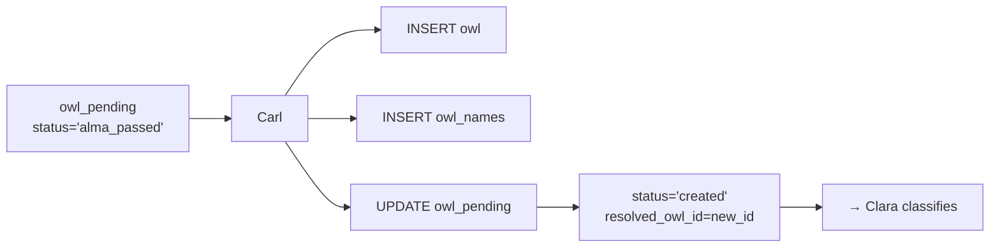

# Carl — The Creator

*A Competency Keeper*

---

## The Quiet One

Carl doesn't talk much. He doesn't need to.

When a skill arrives at his desk, it's already been through the gauntlet. Lucy searched and found nothing. Alma squinted at every fuzzy match, checked abbreviations, consulted the oracle — and came up empty. "No match," Alma says, sliding the card across. "This one's yours."

Carl nods. He pulls out a fresh index card and writes the name. A new entry in the catalog. Simple.

---

## What Carl Does

```
Input:  owl_pending item with status='alma_passed'
Output: New owl entity + owl_names entry + owl_pending.status='created'
```

That's it. No LLM. No fuzzy logic. No tiers. Carl is a script.

### The Process

1. **Receive** — Pick up an `owl_pending` item where `status='alma_passed'`
2. **Create Entity** — Insert new row into `owl` table
3. **Create Name** — Insert primary name into `owl_names`
4. **Link Back** — Update `owl_pending.resolved_owl_id` and `status='created'`
5. **Done** — Hand off to Clara for classification



---

## Why Carl Exists

You might ask: "Why not have Alma create entities when she finds no match?"

Because **separation of concerns**.

Alma's job is matching. She's careful, conservative, second-guesses herself. She asks the LLM, checks abbreviations, considers whether "sla" might mean "Splunk Log Analysis" (it doesn't — that's Service Level Agreement). When Alma says "no match," she's confident.

Carl's job is creating. He doesn't question. He doesn't hesitate. If the item reached him, it's already been vetted. Carl just does the paperwork.

This separation means:
- Alma can be refactored without touching creation logic
- Carl can be optimized for batch inserts
- The audit trail is clear: Alma decided, Carl executed

---

## The Entity Carl Creates

### owl table

| Column | Value |
|--------|-------|
| `canonical_name` | Normalized from `raw_value` |
| `owl_type` | From `owl_pending.owl_type` (usually 'competency') |
| `status` | 'active' |
| `created_at` | NOW() |
| `created_by` | 'Carl' |

### owl_names table

| Column | Value |
|--------|-------|
| `owl_id` | The new entity ID |
| `display_name` | Original `raw_value` |
| `name_type` | 'primary' |
| `is_primary` | true |
| `confidence` | 1.0 |
| `created_at` | NOW() |

### owl_pending update

| Column | Value |
|--------|-------|
| `status` | 'created' |
| `resolved_owl_id` | The new entity ID |
| `resolution_notes` | 'Carl: created new entity' |
| `processed_at` | NOW() |
| `processed_by` | 'Carl' |

---

## Canonical Name Rules

Carl normalizes the `raw_value` to create `canonical_name`:

1. **Lowercase** — "Python Programming" → "python programming"
2. **Strip whitespace** — "  kubernetes  " → "kubernetes"
3. **Replace spaces with underscores** — "machine learning" → "machine_learning"
4. **Remove special characters** — "C++" → "c++" (keep technical chars)
5. **Collapse multiple underscores** — "data__science" → "data_science"

The `display_name` in `owl_names` keeps the original casing and spacing.

---

## Edge Cases

### Already Exists (Race Condition)

What if another process created this entity while Carl was working?

```python
# Check before insert
existing = get_owl_by_canonical_name(canonical)
if existing:
    # Link to existing instead of creating
    update_owl_pending(pending_id, 
        status='merged',  # Not 'created' — we merged
        resolved_owl_id=existing.owl_id,
        resolution_notes='Carl: entity already existed (race condition)')
    return existing.owl_id
```

### Empty or Invalid Input

If `raw_value` is empty or normalizes to nothing, Carl rejects:

```python
if not canonical_name or len(canonical_name) < 2:
    update_owl_pending(pending_id,
        status='rejected',
        resolution_notes='Carl: invalid canonical name')
    return None
```

### Type Mismatch

Carl trusts `owl_pending.owl_type`. If it's 'competency', he creates a competency. If it's 'artifact', he creates an artifact. He doesn't second-guess.

---

## Input Schema

```json
{
  "pending_id": 21158
}
```

Or via CLI:
```bash
./thick_actors/owl_pending__create_U__carl.py 21158
./thick_actors/owl_pending__create_U__carl.py --sample 10
```

---

## Output Schema

### Success (new entity)
```json
{
  "status": "success",
  "action": "created",
  "pending_id": 21158,
  "owl_id": 31842,
  "canonical_name": "splunk_log_analysis",
  "display_name": "Splunk log analysis"
}
```

### Success (race condition — already existed)
```json
{
  "status": "success",
  "action": "merged",
  "pending_id": 21158,
  "owl_id": 24088,
  "canonical_name": "splunk",
  "note": "Entity already existed"
}
```

### Failure
```json
{
  "status": "error",
  "action": "rejected",
  "pending_id": 21158,
  "error": "Invalid canonical name"
}
```

---

## RAQ Configuration

```json
{
  "state_tables": ["owl_pending.status", "owl_pending.resolved_owl_id", "owl"],
  "compare_output_field": "action",
  "deterministic": true
}
```

Carl is **fully deterministic**. No LLM, no randomness. Same input → same output, every time. RAQ should show 100% consistency.

---

## Relationship to Other Keepers

```
Lucy (lookup) → "Not found"
     ↓
Alma (fuzzy)  → "No match" → status='alma_passed'
     ↓
CARL (create) → New entity → status='created'
     ↓
Clara (classify) → Place in hierarchy
```

Carl is the bridge between "this is new" and "now classify it."

---

## The Meeting

Alma slides a card across the desk. "Counterparty Risk Management. Couldn't match it. CRM means Customer Relationship Management, not this."

Carl picks up the card. Reads it once. Writes a new entry:

```
owl_id: 31843
canonical_name: counterparty_risk_management
display_name: Counterparty Risk Management
owl_type: competency
status: active
```

He stamps it. Files it. Looks up.

"Next?"

---

## Summary

| Aspect | Detail |
|--------|--------|
| **Input** | owl_pending with status='alma_passed' |
| **Output** | New owl + owl_names entries |
| **Type** | Script (no LLM) |
| **Deterministic** | Yes, 100% |
| **Error handling** | Race conditions, invalid input |
| **Downstream** | Clara receives for classification |

Carl is simple. That's the point.
