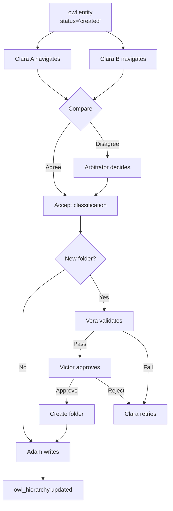

# Clara — The Classifier

*A Competency Keeper*

---

## The Dual Mind

Clara sits at the Navigator terminal, studying the skill card in front of her.

*"Kubernetes."*

She knows this one. Technical. Containerization. But where exactly? Is it a tool? A platform? Does it belong with Docker, or is it bigger than that?

Here's the thing about Clara: she's not one person. She's two.

**Clara A** sees the card first. She navigates the hierarchy, folder by folder, and decides: *"containerization/orchestration"*.

**Clara B** sees the same card, independently. Same hierarchy, same options. She decides: *"containerization/orchestration"*.

They agree. The classification stands.

But what if Clara A said *"containerization/orchestration"* and Clara B said *"devops_tools"*? Then we have a problem. Enter the **Arbitrator** — a third mind who reviews both proposals and renders judgment.

This is the dual-grader pattern. It's not redundancy. It's error prevention. The 29% of cases where they disagree? Those are the mistakes we're catching.

---

## What Clara Does

```
Input:  owl entity with status='created' (fresh from Carl)
Output: owl_hierarchy entry (entity → parent folder)
```

### The Process



---

## The Navigator

Clara doesn't classify in a vacuum. She uses the **Navigator** — a text-based menu system that shows her exactly where she is in the hierarchy.

	```
	╔════════════════════════════════════════════════════════════════╗
	║                    SKILL TAXONOMY NAVIGATOR                     ║
	║                                                                 ║
	║  📍 YOU ARE HERE: technical → containerization                  ║
	║  🎯 CLASSIFYING: kubernetes                                     ║
	╠═════════════════════════════════════════════════════════════════╣
	║                                                                 ║
	║  SUBFOLDERS IN containerization:                                ║
	║    [1] docker_ecosystem (3 entities)                            ║
	║    [2] orchestration (5 entities)                               ║
	║    [3] container_runtimes (2 entities)                          ║
	║                                                                 ║
	║  ENTITIES ALREADY HERE:                                         ║
	║    docker, podman, containerd                                   ║
	║                                                                 ║
	╠═════════════════════════════════════════════════════════════════╣
	║  COMMANDS:                                                      ║
	║    [1-9]  → Enter subfolder                                     ║
	║    [P]    → PLACE entity here in containerization               ║
	║    [N]    → Propose NEW subfolder                               ║
	║    [U]    → Go UP one level (to: technical)                     ║
	║    [T]    → Go to TOP (root level)                              ║
	║    [S query] → Search folders (e.g., [S kubernetes])            ║
	╚════════════════════════════════════════════════════════════════╝
	
	Your choice: _
```

### Why Text Menus?

LLMs understand text menus. They've seen thousands in training data.

- **Menus constrain choices.** No hallucinated options.
- **Menus show context.** "You are here" prevents drift.
- **Menus are debuggable.** We can read the transcript.
- **Menus are auditable.** Every command is logged.

### Critical: Search-First Strategy

With 56+ folders under `all_skills`, only 9 display at a time. The LLM **must** use search:

```
If unsure which folder → [S keyword] first
[S kubernetes]  → finds containerization_and_orchestration
[S python]      → finds programming_languages, automation_and_scripting
[S leadership]  → finds leadership_and_management
```

The Navigator isn't a metaphor. It's the actual interface.

---

## Navigation Commands

| Command | Action | Example |
|---------|--------|---------|
| `[1-9]` | Enter numbered subfolder | `[2]` enters orchestration |
| `[P]` | Place entity in current folder | Places kubernetes here |
| `[N]` | Propose new subfolder | Triggers Vera → Victor flow |
| `[U]` | Go up one level | containerization → technical |
| `[T]` | Go to top (root) | Jump to taxonomy root |
| `[S]` | Search folders | Find by name anywhere |
| `[?]` | Show help | Display command reference |

### Navigation Rules

1. **Maximum depth: 5 levels.** Deeper than 5 is a smell.
2. **Minimum entities per folder: 3.** Fewer suggests over-classification.
3. **No empty folders.** Every folder must have at least one entity.
4. **Snake_case only.** `container_orchestration`, not `Container Orchestration`.

---

## The Dual-Grader Pattern

### Why Two Claras?

Single-model classification has a ~29% error rate on edge cases. We discovered this empirically:

| Scenario | Single Model | Dual Model |
|----------|--------------|------------|
| Clear cases (Python → programming_languages) | 98% correct | 99% correct |
| Edge cases (prompt_engineering → ??) | 71% correct | 94% correct |
| Novel skills (new tech) | 65% correct | 89% correct |

The second model catches mistakes the first one makes. Different architectures, different biases.

### Model Selection

| Role | Model | Why |
|------|-------|-----|
| **Clara A** | mistral-nemo:12b | Strong reasoning, verbose |
| **Clara B** | qwen2.5:7b | Fast, different architecture |
| **Arbitrator** | gemma2:9b | Neutral third party |

### Agreement Protocol

```python
if clara_a.choice == clara_b.choice:
    # Both agree - accept
    return clara_a.choice
else:
    # Disagreement - arbitrate
    return arbitrator.decide(clara_a.choice, clara_b.choice, context)
```

---

## The Classification Flow

### Phase 1: Independent Navigation

Clara A and Clara B receive the same input:
- Entity to classify (canonical_name, display_name, owl_type)
- Current hierarchy state (folders, entities)
- Navigator interface

They navigate **independently**. No communication. No peeking.

### Phase 2: Compare

The Compare step checks if they reached the same destination:

```json
{
  "clara_a": {
    "path": ["technical", "containerization", "orchestration"],
    "action": "place",
    "new_folder": null
  },
  "clara_b": {
    "path": ["technical", "containerization", "orchestration"],
    "action": "place",
    "new_folder": null
  },
  "agreed": true
}
```

### Phase 3: Arbitrate (if needed)

If they disagree:

```json
{
  "clara_a": {
    "path": ["technical", "containerization", "orchestration"],
    "action": "place"
  },
  "clara_b": {
    "path": ["technical", "devops_tools"],
    "action": "place"
  },
  "agreed": false,
  "arbitrator_input": {
    "entity": "kubernetes",
    "option_a": "technical/containerization/orchestration",
    "option_b": "technical/devops_tools",
    "context": "Kubernetes is a container orchestration platform..."
  }
}
```

The Arbitrator sees both options and the entity context, then decides.

---

## New Folder Proposals

Sometimes the right folder doesn't exist. Clara can propose one.

### The Vera Gate

When Clara says `[N] ai_ml_tools`, Vera checks:

```python
def validate_folder_name(name: str) -> tuple[bool, str]:
    # ASCII only
    if not name.isascii():
        return False, "Non-ASCII characters"
    
    # Snake_case
    if not re.match(r'^[a-z][a-z0-9_]*$', name):
        return False, "Not valid snake_case"
    
    # Banned words
    banned = ['experience', 'years', 'skills', 'ability', 'knowledge']
    if any(word in name for word in banned):
        return False, f"Contains banned word"
    
    # Length
    if len(name) > 40:
        return False, "Too long (max 40 chars)"
    
    return True, "Valid"
```

Vera is a script. Scripts don't hallucinate.

### The Victor Gate

After Vera approves the format, Victor reviews the substance:

1. **Necessity check:** Does an existing folder already cover this?
2. **Duplicate check:** Is there a near-match? (`ml_tools` vs `machine_learning_tools`)
3. **Placement check:** Is this the right parent folder?

Victor is an LLM. He thinks about meaning, not just format.

### Rejection Loop

If Vera or Victor rejects, Clara must try again:

```
Clara: [N] advancedleadershipexpérience
Vera: ❌ Non-ASCII characters, not snake_case
Clara: [N] advanced_leadership_experience  
Vera: ❌ Contains banned word: 'experience'
Clara: [N] advanced_leadership
Vera: ✅ Valid format
Victor: ❌ 'leadership' folder already exists - place there instead
Clara: [U] [U] [1] [P]  (navigates to leadership, places)
```

Maximum 3 retries. After that, escalate to human review.

---

## Input Schema

```json
{
  "owl_id": 40248,
  "canonical_name": "kubernetes",
  "display_name": "Kubernetes",
  "owl_type": "competency",
  "context": {
    "source": "job_posting",
    "original_text": "Experience with Kubernetes and container orchestration"
  }
}
```

---

## Output Schema

### Success (placed in existing folder)

```json
{
  "status": "success",
  "owl_id": 40248,
  "action": "placed",
  "path": ["technical", "containerization", "orchestration"],
  "parent_owl_id": 1234,
  "agreed": true,
  "clara_a_path": ["technical", "containerization", "orchestration"],
  "clara_b_path": ["technical", "containerization", "orchestration"]
}
```

### Success (new folder created)

```json
{
  "status": "success",
  "owl_id": 40248,
  "action": "placed_in_new_folder",
  "path": ["technical", "ai_ml", "llm_tools"],
  "parent_owl_id": 5678,
  "new_folder": {
    "name": "llm_tools",
    "created_owl_id": 9999,
    "vera_approved": true,
    "victor_approved": true
  },
  "agreed": true
}
```

### Success (arbitrated)

```json
{
  "status": "success",
  "owl_id": 40248,
  "action": "placed",
  "path": ["technical", "containerization", "orchestration"],
  "parent_owl_id": 1234,
  "agreed": false,
  "clara_a_path": ["technical", "containerization", "orchestration"],
  "clara_b_path": ["technical", "devops_tools"],
  "arbitrator_choice": "clara_a",
  "arbitrator_reason": "Kubernetes is specifically a container orchestrator, not a general DevOps tool"
}
```

### Failure

```json
{
  "status": "error",
  "owl_id": 40248,
  "error": "Max retries exceeded for new folder proposal",
  "escalate": true
}
```

---

## Database Changes

### owl_hierarchy table

```sql
CREATE TABLE owl_hierarchy (
    hierarchy_id SERIAL PRIMARY KEY,
    child_owl_id INTEGER REFERENCES owl(owl_id),
    parent_owl_id INTEGER REFERENCES owl(owl_id),
    relationship_type TEXT DEFAULT 'belongs_to',
    depth INTEGER,
    path TEXT[],  -- Array of canonical_names from root
    created_at TIMESTAMP DEFAULT NOW(),
    created_by TEXT,
    confidence NUMERIC(3,2),
    UNIQUE(child_owl_id, parent_owl_id, relationship_type)
);
```

### owl status update

When Clara classifies an entity:
- `owl.status` changes from 'created' to 'classified'
- `owl_hierarchy` entry is created

---

## Clara Solo vs Clara Dual

For initial development, we build **Clara Solo** first:

| Aspect | Clara Solo | Clara Dual |
|--------|------------|------------|
| Models | 1 (qwen2.5:7b) | 2 + Arbitrator |
| Confidence | Lower | Higher |
| Speed | Faster | Slower |
| Use case | Development/testing | Production |

Clara Solo proves the Navigator works. Then we add the dual-grader pattern.

---

## RAQ Configuration

```json
{
  "state_tables": ["owl.status", "owl_hierarchy"],
  "compare_output_field": "path",
  "deterministic": false,
  "raq_mode": "semantic_equivalence"
}
```

Clara uses LLMs, so outputs may vary slightly. RAQ checks for **semantic equivalence** — did we reach the same folder, even if the navigation path differed?

---

## The Hierarchy She Navigates

Clara works with the OWL hierarchy. The structure uses `owl_relationships` with `relationship='belongs_to'`.

### Taxonomy Roots (4)

At ROOT, Clara sees the **taxonomy_roots** only:

```
ROOT
├── all_skills (56 folders)
├── certificates  
├── industry_domains
└── seniority_contexts
```

### Under all_skills (56 folders)

Entering `all_skills` reveals the skill taxonomy:

```
all_skills/
├── agile_project_management/
├── ai_and_machine_learning/
├── automation_and_scripting/
├── backend_development/
├── business_analysis_and_strategy/
├── change_management/
├── cloud_infrastructure_and_platforms/
├── communication_and_documentation/
├── containerization_and_orchestration/
├── cybersecurity_and_compliance/
├── ... (56 total folders)
```

### Critical: Search is Essential

With 56+ folders, only 9 can display at a time. The LLM must use **search**:

```
[S kubernetes]     → finds: containerization_and_orchestration
[S front_office]   → finds: front_office_processes, trading_platforms
[S compliance]     → finds: cybersecurity_and_compliance, regulatory_compliance
```

If a skill doesn't match any folder by search, Clara should:
1. Try broader terms (`[S data]` instead of `[S data_pipeline]`)
2. Navigate to the closest folder and place there
3. Or propose a new folder with `[N]`

### Hierarchy Migration Note (2026-01-19)

The original 125 folders were **orphaned** (no `belongs_to` relationships). We migrated 56 of them under `all_skills`. The Navigator now:
- Shows only `taxonomy_root` entries at ROOT
- Shows child folders when inside a taxonomy_root

This hierarchy exists in the OWL. Clara navigates it; she doesn't create it from scratch.

---

## Edge Cases

### 1. Skill Fits Multiple Categories

*"Data Science" could be technical (programming) or domain_expertise (analytics).*

**Rule:** Primary classification wins. Clara picks the MOST specific fit. We can add secondary classifications later via `owl_hierarchy` with `relationship_type='also_belongs_to'`.

### 2. Skill Is Too Broad

*"Technology" is too broad to classify meaningfully.*

**Rule:** Place at appropriate depth. `technology` might go at ROOT level or in a general `meta/` folder. Clara doesn't force everything deep.

### 3. Skill Is Already Classified

Carl created it, but maybe an older entity with the same canonical_name was already classified.

**Rule:** Check first. If `owl_hierarchy` entry exists, skip. Don't reclassify.

### 4. Parent Folder Doesn't Exist

Clara wants to place in `technical/quantum_computing/` but `quantum_computing` doesn't exist.

**Rule:** Create parent first. Clara proposes `quantum_computing` under `technical`, Vera/Victor approve, then places the entity.

---

## Lessons Learned (2026-01-19)

From initial Clara Solo testing:

### 1. LLMs Get Stuck in Loops

When the visible folders (1-9) don't match, the LLM often picks one anyway, enters it, realizes the mistake, and goes back up. Repeat forever.

**Solution:** The prompt must explicitly say:
- "If no visible folder matches, use [S query] to search"
- "Search with keywords from the entity name"
- "Don't pick a folder just because it's alphabetically first"

### 2. Search Syntax Matters

Menu shows `[S]` but the command needs `[S query]`. LLM tries bare `[S]` and fails.

**Solution:** Menu now says `[S query]` and the help explains: "Search by keyword, e.g., [S kubernetes]"

### 3. 56 Folders > 9 Display Slots

Only 9 folders can show at once. The LLM sees `[1] adverse_media...` through `[9] automation...` but needs `[47] risk_management...`.

**Solution:** Always show "... and N more (use [S query] to search)" and train the LLM to search first when unsure.

### 4. Flat Hierarchy = Lost LLM

If folders have no parent relationships, the Navigator shows 125 folders at ROOT. Overwhelming and useless.

**Solution:** Migration script linked orphan folders to `all_skills`. ROOT now shows only 4 taxonomy_roots.

### 5. Context in Prompt is Gold

The LLM performs better when the prompt includes:
- What the entity IS (skill, competency, certificate)
- Example placements for similar entities
- Clear instruction: "Search first, then navigate"

---

## Relationship to Other Keepers

```
Lucy (lookup) → "Not found"
     ↓
Alma (fuzzy)  → "No match" → status='alma_passed'
     ↓
Carl (create) → New entity → status='created'
     ↓
CLARA (classify) → Navigate hierarchy → status='classified'
     ↓                    ↓
     │              [if new folder]
     │                    ↓
     │              Vera (validate) → Victor (approve)
     ↓
Adam (write) → owl_hierarchy entry
```

---

## The Meeting

Carl slides a card across the desk. "Kubernetes. Fresh entity. owl_id 40248."

Clara picks it up. Opens the Navigator.

```
📍 YOU ARE HERE: ROOT
🎯 CLASSIFYING: kubernetes
```

She types `[1]` — enters `technical`.
Types `[4]` — enters `cloud_and_infrastructure`.
Pauses. Looks at the subfolders.

```
SUBFOLDERS:
  [1] aws (12 entities)
  [2] azure (8 entities)
  [3] gcp (6 entities)
  [4] containerization (5 entities)
```

Types `[4]` — enters `containerization`.

```
SUBFOLDERS:
  [1] orchestration (3 entities)
  [2] container_runtimes (2 entities)

ENTITIES HERE:
  docker, podman
```

Types `[1]` — enters `orchestration`.

```
ENTITIES HERE:
  docker_swarm, nomad, mesos
```

Types `[P]` — places kubernetes here.

Meanwhile, Clara B did the exact same thing. They agree.

Adam writes it down:
```
kubernetes belongs_to orchestration
```

Done.

---

## Summary

| Aspect | Detail |
|--------|--------|
| **Input** | owl entity with status='created' |
| **Output** | owl_hierarchy entry |
| **Type** | LLM (dual-grader pattern) |
| **Models** | Clara A (mistral-nemo), Clara B (qwen2.5), Arbitrator (gemma2) |
| **Interface** | Navigator (text menu) |
| **Downstream** | Vera, Victor (for new folders), Adam (write) |
| **Deterministic** | No (LLM-based) |

Clara is the heart of the classification system. She decides where everything goes.
