# The Competency Keepers

*A story by Arden*  
*Paris, Summer 1939*

---

The café was empty at this hour. I lit a Gauloises and watched the smoke curl toward the ceiling. Outside, the Boulevard Saint-Germain hummed with the last pedestrians of evening. Life was good. War was coming, but not today.

I opened my notebook and began to write.

---

## Chapter 1: The Archive

Imagine a vast library. Not of books, but of human capabilities — every skill a person might possess. *Python programming. Leadership. Financial modeling. Welding.* Thousands upon thousands of skills, piling up daily as new professions emerge and old ones evolve.

The Archive cannot be a heap. A heap is useless. You cannot find *kubernetes* in a heap of ten thousand skills. You cannot match a job seeker to a job posting if their skills are scattered like leaves.

No. The Archive must be a *hierarchy*. Folders within folders, each skill filed precisely where it belongs.

```
technical/
  programming_languages/
    python
    java
    javascript
  containerization/
    kubernetes
    docker
interpersonal/
  communication
  leadership
```

But who maintains this hierarchy? Who decides where each new skill belongs?

The Competency Keepers.

---

## Chapter 2: The Keepers

They are not human. They are thinking machines — pattern-matchers of extraordinary precision. Each has a name and a role:

**Lily** — The Filter. Before anything else, Lily examines each incoming entity. *"Is this a skill? Or is it a requirement dressed as a skill?"* When she sees "10+ years of banking experience," she knows: that's not a skill. That's a filter criterion. She sets it aside. Only true skills pass through to the Archive.

**Ava** — The Atomizer. Some extractions arrive as compound phrases: *"German skills, Python and SQL, experience with finance."* Ava breaks them apart. She doesn't judge or classify — she simply splits compounds into atoms. One phrase becomes three: `German`, `Python`, `SQL`. Short phrases (≤25 chars) pass through unchanged. Ava is often an LLM, but sometimes just clever regex. Her output is the `atomized_skills` array.

**Lucy** — The Lookup. When a skill arrives, Lucy checks: *"Have we seen this before?"* She searches the Archive's `owl_names` index for an **exact match** (case-insensitive). If `kubernetes` is already filed under `containerization`, there's no need to classify it again. Lucy's search is fast and precise — she finds only what she recognizes.

**Alma** — The Alias Matcher. When Lucy finds no exact match, Alma takes over. She asks: *"Is this a variant of something we know?"* Alma searches for **fuzzy matches** — `"Python programming"` is 90% similar to `"python"`, `"JS"` might be an abbreviation of `"JavaScript"`. When Alma finds a near-match, she doesn't create a new entity. Instead, she creates an **alias**: a new entry in `owl_names` pointing to the existing `owl_id`. *"Python programming? That's just another name for python (owl_id=23882). I'll add it as an alias."* Only when Alma finds no reasonable match does the skill proceed to Carl.

**Carl** — The Creator. For truly new skills that neither Lucy nor Alma recognize, Carl creates the entry. A fresh card in the catalog, waiting to be filed.

**Clara** — The Classifier. Clara examines each skill and navigates the hierarchy, folder by folder, until she finds its home. *"Kubernetes... that's technical... containerization... yes, place it here."*

But Clara is not infallible. No single mind is. And so there are two Claras:

- **Clara A** (mistral-nemo) — makes the first classification
- **Clara B** (qwen2.5) — independently classifies the same skill

If both Claras agree, we trust the result. If they disagree, we summon the **Arbitrator** (gemma3), who examines both proposals and renders judgment.

This is the dual-grader pattern. It catches mistakes that a single classifier would miss. Not 71% redundancy — 29% *error prevention*.

**Vera** — The Validator. When Clara proposes a new folder, Vera checks it BEFORE Victor sees it. She's fast, deterministic, and ruthless. *"advancedleadershipexpérience? That has a French accent. Rejected. Try again."* Vera catches the garbage that LLMs hallucinate. She validates:
- ASCII-only characters
- snake_case format  
- No banned words (`experience`, `years`, `duration`)
- Reasonable length (< 40 chars)

Vera is not an LLM. She's a script. Scripts don't hallucinate.

**Victor** — The Gatekeeper. After Vera approves the format, Victor reviews the substance. *"Is this folder truly necessary? Or does an existing folder suffice?"* He also checks for **near-duplicates**: *"Does `kubernetes-ecosystem` or `k8s_ecosystem` already exist?"* Victor is the thoughtful reviewer. Vera is the bouncer at the door.

**Adam** — The Scribe. When classification is complete, Adam writes it into the ledger. `kubernetes belongs_to containerization`. Permanent. Auditable. Done.

---

## Chapter 3: The Navigator

Each actor has a terminal. They call it the **Navigator**. It works like a Gopher system — text menus, commands, no mouse required. Everything the actor needs to classify a skill, they can do through the Navigator.

```
╔════════════════════════════════════════════════════════════════╗
║                    SKILL TAXONOMY NAVIGATOR                     ║
║                                                                 ║
║  📍 YOU ARE HERE: technical → containerization                  ║
║  🎯 CLASSIFYING: kubernetes                                     ║
╠═════════════════════════════════════════════════════════════════╣
║                                                                 ║
║  SUBFOLDERS IN containerization:                                ║
║    [1] docker_tools (3 skills)                                  ║
║    [2] orchestration (5 skills)                                 ║
║                                                                 ║
║  SKILLS ALREADY HERE:                                           ║
║    docker, podman, containerd                                   ║
║                                                                 ║
╠═════════════════════════════════════════════════════════════════╣
║  COMMANDS:                                                      ║
║    [1-9]  → Enter subfolder                                     ║
║    [P]    → PLACE skill here in containerization                ║
║    [N]    → Propose NEW subfolder (requires Victor approval)    ║
║    [U]    → Go UP one level (to: technical)                     ║
║    [T]    → Go to TOP (root level)                              ║
║    [?]    → Display this help                                   ║
║    [S]    → Search for a folder by name                         ║
║    [A]    → Add alias to current folder                         ║
╚═════════════════════════════════════════════════════════════════╝

Your choice: _
```

The Navigator is the **conversation**. Each command is an **instruction**. The branching logic (instruction_steps) determines what happens after each choice.

### Why a Text Menu?

Building an API is hard. Maintaining an API is harder. But a text menu?

- LLMs understand menus. They've seen thousands in training data.
- Menus constrain choices. No hallucinated options.
- Menus show context. "You are here" prevents drift.
- Menus are debuggable. We can read the transcript.

The Navigator isn't a metaphor. It's the actual interface.

---

## Chapter 4: The "Prompt Engineering" Problem

Here's where systems fail:

```
Skill: "prompt engineering"
Current location: ROOT

╔════════════════════════════════════════════════════════════════╗
║  📍 YOU ARE HERE: ROOT                                          ║
║  🎯 CLASSIFYING: prompt engineering                             ║
╠═════════════════════════════════════════════════════════════════╣
║                                                                 ║
║  ROOT CATEGORIES:                                               ║
║    [1] technical (63 skills)                                    ║
║    [2] interpersonal (34 skills)                                ║
║    [3] domain_expertise (31 skills)                             ║
║    ...                                                          ║
║                                                                 ║
╚═════════════════════════════════════════════════════════════════╝

Your choice: _
```

A confused model might:
- Pick `technical` (sort of fits?)
- Pick `domain_expertise` (AI is a domain?)
- Give up and say "none of these" (dumps at root)

**None of these are correct.** The correct answer is: *navigate to technical, then realize there's no AI/ML subfolder, then propose one.*

### The Fix: Explicit Guidance

The Navigator prompt must be crystal clear:

```
## Processing Instructions
You are classifying a skill into the taxonomy hierarchy.
Format your response as [COMMAND]. Include brackets.
Valid commands: [1], [2], [3]... [P], [N], [U], [T]

## Context
📍 YOU ARE HERE: ROOT
🎯 SKILL TO CLASSIFY: prompt engineering

## Available Choices
[1] technical — Programming, engineering, tools, frameworks
[2] interpersonal — Communication, teamwork, collaboration  
[3] domain_expertise — Industry-specific knowledge
...

## Decision Rules
- If the skill CLEARLY belongs in one category → Enter it [1-9]
- If you need to see subfolders before deciding → Enter the closest match
- If you're at the right level → [P] to place here
- If NO category fits AND you're sure → [N] to propose new category

## Anti-Patterns (DO NOT DO THIS)
❌ Placing a skill at ROOT because "nothing fits" — Navigate deeper first
❌ Choosing a category that's "close enough" — Propose new if needed
❌ Returning explanations — Return ONLY [COMMAND]

## QA Check
Submit ONLY the command in brackets. Example: [1] or [P] or [N]
```

**Key additions:**
1. **Breadcrumbs** — "YOU ARE HERE" shows context
2. **Decision rules** — Explicit logic, not vibes
3. **Anti-patterns** — "DO NOT dump at root"
4. **Strict format** — Brackets only, no commentary

### The Proposal Flow

When Clara chooses [N] (propose new folder):

```
╔════════════════════════════════════════════════════════════════╗
║  📍 YOU ARE HERE: technical                                     ║
║  🎯 CLASSIFYING: prompt engineering                             ║
║                                                                 ║
║  You chose [N] — Propose new subfolder                          ║
╠═════════════════════════════════════════════════════════════════╣
║                                                                 ║
║  EXISTING SUBFOLDERS in technical:                              ║
║    programming_languages, databases, cloud_platforms,           ║
║    containerization, devops                                     ║
║                                                                 ║
║  INSTRUCTIONS:                                                  ║
║  Propose a new subfolder name that:                             ║
║    1. Does NOT duplicate existing folders (check above!)        ║
║    2. Would contain "prompt engineering" AND similar skills     ║
║    3. Uses snake_case (lowercase, underscores)                  ║
║                                                                 ║
║  The folder will be created as a child of "technical"           ║
║  (where you are standing now).                                  ║
║                                                                 ║
╠═════════════════════════════════════════════════════════════════╣
║  Format: {"folder": "name", "reason": "why this folder"}        ║
╚═════════════════════════════════════════════════════════════════╝
```

Note: Clara doesn't need to specify the parent — **she's already standing there**. The parent is implicit from her navigation context. This eliminates orphans by design.

Clara responds:
```json
{"folder": "ai_and_ml", "reason": "AI/ML tools and techniques including prompt engineering, model training, embeddings"}
```

**Victor reviews.** If approved:
- Create `ai_and_ml` with `is_a technical` (parent from context — no orphan!)
- Clara continues navigating INSIDE `ai_and_ml`
- Place `prompt engineering` there

If rejected, Clara must pick from existing options or try a different proposal.

---

## Chapter 5: The Navigation Loop

Clara doesn't guess in one shot. She navigates iteratively:

```mermaid
flowchart TD
    A[Start: Skill = kubernetes] --> B[Navigate: Show ROOT menu]
    B --> C{Clara picks...}
    C -->|"[1] technical"| D[Navigate: Show technical menu]
    C -->|"[P] Place here"| X[ERROR: Too shallow!]
    D --> E{Clara picks...}
    E -->|"[2] containerization"| F[Navigate: Show containerization menu]
    E -->|"[P] Place here"| G[Place in technical]
    E -->|"[N] New folder"| H[Propose new folder]
    F --> I{Clara picks...}
    I -->|"[P] Place here"| J[Place in containerization ✓]
    I -->|"[U] Go up"| D
    I -->|"[N] New folder"| H
```



**Example walkthrough:**

| Step | Location | Clara Sees | Clara Picks | Result |
|------|----------|------------|-------------|--------|
| 1 | ROOT | technical, interpersonal, domain_expertise... | [1] | → technical |
| 2 | technical | programming_languages, containerization... | [2] | → containerization |
| 3 | containerization | docker, podman, containerd | [P] | ✓ Place here |

**Result:** `kubernetes belongs_to containerization`

Each step is an **interaction**. Each interaction is recorded. If kubernetes ends up in the wrong place, we can trace exactly why.

**Depth limit:** The Navigator tracks depth. After 10 levels, it warns: *"You're very deep. Consider [P]lacing here or [U]p."* This prevents infinite descent.

**Anti-dump protection:** If Clara tries [P] at ROOT or depth 1, the Navigator refuses: *"Skills should not be placed at root level. Navigate deeper."*

---

## Chapter 6: The Orphan Problem (Solved)

Here is where the current system breaks.

When Victor approves a new folder — say, `kubernetes_ecosystem` — that folder *exists*, but it's an orphan. It has no parent. It floats, disconnected from the hierarchy.

The current solution: a second workflow (WF2005) runs later and classifies the orphan folder itself, giving it an `is_a` parent.

But this is backwards. Why create an orphan, then fix it? Why not create the folder *with its parent* from the start?

**The Competency Keepers' Way:**

Clara is already standing in a folder when she proposes a new one. The parent is implicit — it's where she is:

```
Clara is at: containerization
Clara says: [N]
Clara proposes: "kubernetes_ecosystem"
Clara explains: "Groups Kubernetes-specific tools under the container umbrella"

Victor reviews:
  - Is the folder name appropriate?
  - (Parent is already known: containerization)

If approved:
  - Create kubernetes_ecosystem
  - Create is_a relationship to containerization (where Clara stood)
  - Clara navigates INTO kubernetes_ecosystem
  - File the skill there

No orphan. No second workflow. No specifying parent twice.
```

The parent comes from navigation context, not from Clara's output. This is why the Navigator is the conversation — it carries state.

---

## Chapter 7: The Oversized Folder

Time passes. Skills accumulate. The `technical` folder grows to 63 skills. Too many. A folder with 63 items is not a folder — it's a heap.

Enter **Samantha** — The Splitter.

Samantha examines oversized folders. She sees patterns that Clara, classifying one skill at a time, cannot see:

```
Samantha examines: technical (63 skills)

She sees:
  - 15 programming languages (python, java, rust...)
  - 12 cloud skills (aws, azure, gcp...)
  - 8 database skills (postgresql, mongodb...)
  - 28 others

She proposes:
  - Create programming_languages, child of technical
  - Move: python, java, rust, go, javascript... (15 skills)
  
  - Create cloud_platforms, child of technical
  - Move: aws, azure, gcp, kubernetes... (12 skills)
  
  - Leave 28 skills in technical (misc for now)
```

Victor reviews each proposed folder. Adam moves the skills.

But here's the key insight: **Samantha should run proactively, not reactively.**

In the current system, Samantha only sees folders after they're oversized. But if Clara could batch similar skills — if she could see that "python, java, javascript" are arriving together — she could propose `programming_languages` *before* technical becomes bloated.

That's for later. For now, Samantha is the safety net.

---

## Chapter 8: The Audit

**Quinn** — The Auditor.

Quinn doesn't classify. Quinn *checks*. Periodically — daily, not per-batch — Quinn examines the entire hierarchy for problems:

1. **Loops** — Does any folder point to itself as an ancestor? (HALT if found)
2. **Orphans** — Folders with no parent? (Should not exist in the new design, but verify)
3. **Duplicates** — Near-duplicate folders that slipped past Victor? (Merge them)
4. **Imbalance** — One sibling huge, others empty? (Suggest rebalancing)
5. **Skill duplicates** — Same skill filed under different names? (Flag for review)

Quinn is not part of the classification flow. Quinn is the health inspector who visits after hours.

---

## Chapter 9: The Unified Workflow

Now we can see the shape of it. One workflow. One story.


### The Cast (Complete)

| Actor | Role | Type | When |
|-------|------|------|------|
| **Lily** | Filter non-skills | script | Pre-queue |
| **Lucy** | Exact lookup | script | Step 1 |
| **Alma** | Fuzzy match → alias | script/ai_model | Step 1.5 (if Lucy misses) |
| **Carl** | Create entity | script | Step 2 (if Alma misses) |
| **Clara A** | Classify (model 1) | ai_model | Step 3 |
| **Clara B** | Classify (model 2) | ai_model | Step 4 |
| **Arbitrator** | Break ties | ai_model | Step 5 (if needed) |
| **Vera** | Validate folder names | script | Step 6 (if [N]) |
| **Victor** | Approve new folders | ai_model | Step 7 (if [N]) |
| **Adam** | Write to database | script | Step 8 |
| **Samantha** | Split oversized folders | script | Scheduled |
| **Quinn** | Audit hierarchy | script | Daily |

**The Alias Insight:** Most incoming "skills" are variants of concepts we already know. Alma catches these before they become duplicate entities. She's the reason we have 1 Python (owl_id=23882) with aliases, not 36 Python variants.

**No cascading workflows.** No orphans. No WF2005.

**What about Samantha?** She runs separately, on a schedule or manual trigger, when we notice folders growing large. She's maintenance, not part of the core flow.

**What about Quinn?** Daily health check. Catches anything that slipped through.

---

## Chapter 10: The Interaction Record

Every step above produces an **interaction**. This is the audit trail. This is how we debug. This is RAQ — Repeatable, Auditable, Quality.

```
interaction_id | conversation      | actor    | input               | output
---------------|-------------------|----------|---------------------|------------------
1001           | lookup            | Lucy     | {skill: kubernetes} | {exists: false}
1002           | create            | Carl     | {skill: kubernetes} | {entity_id: 5001}
1003           | classify_a        | Clara A  | {entity_id: 5001}   | {choice: containerization}
1004           | classify_b        | Clara B  | {entity_id: 5001}   | {choice: containerization}
1005           | compare           | Compare  | {a: cont., b: cont.}| {agreed: true}
1006           | apply             | Adam     | {entity_id: 5001}   | {belongs_to: containerization}
```

If a skill is misclassified, we can trace exactly what happened. What did Clara A see? What did Clara B see? Did they agree? What did the arbitrator decide?

No dancing in the dark.

---

## Chapter 11: The Confidence Question

Sandy proposed a confidence router: skip Clara B for "easy" skills.

I fell for it. You caught me.

The 29% disagreement rate isn't waste — it's the error rate we're *catching*. If we skip dual-grading on "easy" skills, some of those "easy" skills will be misclassified, and we won't know.

The right question isn't "how do we skip dual-grading?" It's "is 29% disagreement acceptable?"

- If too high → classifiers are inconsistent, fix prompts
- If too low → dual-grading is overkill
- If about right → system is working

We don't know yet. We need data:
- What skills do they disagree on?
- Are those genuinely ambiguous?
- Does the arbitrator pick A, B, or something else?

For now: **keep dual-grading. Measure. Decide later.**

---

## Chapter 12: What We Don't Need

Looking back at WF2003/2004/2005, here's what the unified story eliminates:

| Current (3 workflows) | Unified (1 workflow) | Why Eliminated |
|----------------------|----------------------|----------------|
| WF2003 creates orphan folders | Clara proposes folder + parent | Orphans never exist |
| WF2005 wires orphans | — | No orphans to wire |
| DEPENDENCY trigger 2003→2004 | — | One workflow, no triggers |
| DEPENDENCY trigger 2004→2005 | — | No WF2005 |
| Per-batch QA (WF2004) | Daily audit (Quinn cron) | Less overhead |
| 1844 trigger runs | 0 | No cascade loops |

**What we keep:**
- Dual-grader pattern (Clara A + Clara B + Arbitrator)
- Victor reviewing new folders
- Samantha splitting oversized folders (but scheduled, not triggered)
- Quinn auditing (but daily, not per-batch)
- Adam applying changes
- Full interaction audit trail

---

## Chapter 13: The Steps

To build WF2010, we need these conversations:

| Step | Conversation | Actor | Purpose |
|------|--------------|-------|---------|
| 0 | filter | Lily | Is this a skill? Or a requirement? |
| 0.5 | atomize | Ava | Split compounds into atomic skills |
| 1 | lookup | Lucy | Exact match in owl_names? |
| 1.5 | alias_match | Alma | Fuzzy match? → create alias, done |
| 2 | create | Carl | Create entity (only if Alma found nothing) |
| 3 | classify_a | Clara A | Navigate + classify (or propose folder+parent) |
| 4 | classify_b | Clara B | Navigate + classify (or propose folder+parent) |
| 5 | compare | Compare | Check agreement |
| 6 | arbitrate | Arbitrator | Break ties (if needed) |
| 7 | victor | Victor | Review folder proposals + dedup check (if needed) |
| 8 | apply | Adam | Write belongs_to (and is_a if new folder) |

**Branching logic (instruction_steps):**
- After lookup: if exists → done, else → alias_match
- After alias_match: if fuzzy_match → create alias → done, else → create
- After create: → classify_a
- After compare: if agreed → apply, else → arbitrate
- After arbitrate: → apply
- After classify_*: if new_folder_proposed → victor, else → next
- After victor: if rejected → retry classification, if approved → apply

**The Alias Funnel:** Most skills never reach Clara. They're caught by Lucy (exact) or Alma (fuzzy) and linked to existing entities. Only truly novel concepts need classification.

---

## Epilogue

The summer light was fading. I stubbed out my cigarette and read what I'd written.

One workflow. One story. Skills arrive, Claras classify, Victor guards, Adam records. No orphans. No cascades. No 1844 phantom runs.

The thinking machines would do their work, and we would sleep soundly knowing every decision was recorded, every path traceable, every result repeatable.

I closed the notebook and stepped out into the Paris evening.

War was coming. But the Archive would endure.

---

*Fin.*

---

## Appendix: Comparison to WF2003/2004/2005

### What's in the current system that's NOT in this story?

| Current Feature | In This Story? | Verdict |
|-----------------|----------------|---------|
| Lily (filter) | ✅ Yes | Keep |
| Ava (atomize) | ✅ Yes | Keep |
| Lucy (lookup) | ✅ Yes | Keep |
| Alma (alias match) | ✅ Yes | NEW - prevents fragmentation |
| Carl (create) | ✅ Yes | Keep |
| Clara A classifier | ✅ Yes | Keep |
| Clara B classifier | ✅ Yes | Keep |
| Compare step | ✅ Yes | Keep |
| Arbitrator | ✅ Yes | Keep |
| Victor review | ✅ Yes | Keep |
| Adam apply | ✅ Yes | Keep |
| Nate navigation builder | ✅ Implicit in Clara | Merge into Clara's loop |
| WF2004 Quinn QA | ✅ Daily cron | Change trigger, keep logic |
| WF2004 Samantha split | ✅ Scheduled maintenance | Change trigger, keep logic |
| WF2005 orphan wiring | ❌ Eliminated | Orphans don't exist |
| DEPENDENCY triggers | ❌ Eliminated | Single workflow |
| wf2005_c3_dedup | ✅ Moved to Victor | Dedup check before approving new folders |

### Open Questions

1. **10 vs 9 roots** — Should we reactivate `cognitive_and_analytical`?

2. **The 1844 runs** — Should we investigate before implementing WF2010, or just move forward?

---

*Document: WF2010_skill_keepers_story.md*  
*Author: Arden*  
*Date: January 1, 2026*

---

## Sandy's Review: What's Missing

Beautiful story. Paris, 1939, thinking machines — I see what you did there. But if this becomes a workflow, we need some practicalities. Here's what's missing:

### 1. The 10 Root Categories (Defined)

The story mentions roots but doesn't list them. Here they are:

| Code | Name | Description | Status |
|------|------|-------------|--------|
| TC | technical | Programming, engineering, tools, frameworks, systems | active |
| IP | interpersonal | Communication, teamwork, collaboration, leadership | active |
| DE | domain_expertise | Industry-specific: finance, healthcare, legal, etc. | active |
| CA | cognitive_and_analytical | Problem-solving, critical thinking, analysis, logic | **deprecated** ⚠️ |
| LC | language_and_communication | Writing, presentation, languages, documentation | active |
| SM | self_management | Time management, organization, discipline, adaptability | active |
| PO | perception_and_observation | Attention to detail, monitoring, pattern recognition | active |
| PM | physical_and_manual | Manual dexterity, craftsmanship, equipment operation | active |
| CG | creative_and_generative | Design, innovation, art, ideation | active |
| EC | execution_and_compliance | Following procedures, compliance, accuracy, QA | active |

**Action needed:** Reactivate `cognitive_and_analytical` or redistribute its intended skills.

### 2. Error Handling

The story shows the happy path. What about:

**Clara returns garbage:**
```
Expected: [1] or [P] or [N]
Got: "I think this skill belongs in the technical category because..."
```

**Fix:** Navigator script validates response format. Invalid → retry with stricter prompt (max 3 retries, then HALT for human).

**Victor is unavailable (model timeout):**

**Fix:** Queue the folder proposal, continue with fallback (place skill at current level, flag for review).

**Adam's write fails (DB error):**

**Fix:** Rollback entire classification. Re-queue skill. Alert if repeated failures.

**Suggested instruction_steps:**
```
classify_a_error     | regex:"error"|"invalid"  | → classify_a (retry, max 3)
classify_a_halt      | after 3 retries          | → human_review
victor_timeout       | timeout > 30s            | → fallback_place
adam_error           | contains:"error"         | → requeue_skill
```

### 3. Clara's Response Parsing

How does Nate (Navigator) interpret Clara's response?

**Current ambiguity:**
```
Clara says: [1]
Navigator must know: What was option [1]?
```

**Solution:** Navigator embeds the mapping in each interaction:

```json
{
  "options": {
    "1": {"folder_id": 39056, "name": "technical"},
    "2": {"folder_id": 39059, "name": "interpersonal"},
    ...
  },
  "choice": "[1]",
  "resolved": {"folder_id": 39056, "name": "technical"}
}
```

The Navigator script parses `[1]`, looks up the mapping, stores the resolved folder. Next iteration uses the resolved folder_id for "YOU ARE HERE."

### 4. Skill Context: Where Did This Skill Come From?

Clara classifies "kubernetes" — but is it:
- Kubernetes administration (ops)
- Kubernetes development (dev)
- Kubernetes security (security)

**The job posting matters.** If the posting says "Kubernetes Security Engineer," that's domain context.

**Suggested enhancement:**
```
🎯 SKILL TO CLASSIFY: kubernetes
📄 SOURCE POSTING: "Senior Kubernetes Security Engineer - AWS"
💡 CONTEXT: "...securing container workloads, implementing pod security policies..."
```

This helps Clara make better decisions. Not required for v1, but add it to the backlog.

### 5. Navigation Depth Tracking

Story mentions depth limit (10 levels). How is it tracked?

**Solution:** Workflow state (jsonb in workflow_runs):

```json
{
  "current_entity_id": 5001,
  "current_folder_id": 39056,
  "navigation_path": ["ROOT", "technical", "containerization"],
  "depth": 2,
  "max_depth": 10
}
```

Navigator script reads state, increments depth on each navigation, warns at depth 8, halts at 10.

### 6. The Retry Loop After Victor Rejection

Story says: "If rejected, Clara must pick from existing options or try a different proposal."

**But how?**

Clara doesn't "remember" she proposed a folder. Each interaction is stateless.

**Solution:** Encode rejection in the next prompt:

```
📍 YOU ARE HERE: technical
🎯 SKILL TO CLASSIFY: prompt engineering

⚠️ PREVIOUS PROPOSAL REJECTED:
   You proposed: ai_ml_tools
   Victor said: "Use existing 'software_development' folder"
   
Please select from existing options or propose a DIFFERENT folder.
```

This requires the Navigator to pass rejection context to the next classify interaction.

### 7. Multi-Parent Skills

What if "data visualization" belongs to BOTH `technical` (tools like Tableau) AND `creative_and_generative` (design principles)?

**Current assumption:** Single parent via `belongs_to`.

**Options:**
1. **Primary parent only** — Pick the best fit, document the trade-off
2. **Multiple belongs_to** — Allow skills in multiple folders (graph, not tree)
3. **Alias system** — Skill lives in one folder, has aliases in others

**Recommendation for v1:** Single parent. Add "related_to" relationship later if needed. Don't complicate the first version.

### 8. Alma's Matching Strategy (NEW - Jan 19, 2026)

Alma is the alias matcher — the missing piece that prevents entity explosion. Here's how she works:

**Tier 1: Normalized exact match (script, fast)**
```python
def normalize(s: str) -> str:
    return s.lower().replace('_', ' ').replace('-', ' ').strip()

# "Python programming" → "python programming"
# "python_programming" → "python programming"  
# Match! Create alias to existing owl_id
```

**Tier 2: Similarity threshold (script, fast)**
```python
from difflib import SequenceMatcher

def similarity(a: str, b: str) -> float:
    return SequenceMatcher(None, normalize(a), normalize(b)).ratio()

# "Python proficiency" vs "python" → 0.67 (below threshold)
# "Python programing" vs "python programming" → 0.97 (typo match!)
```
Threshold: 0.85 for auto-alias, 0.70-0.85 for LLM confirmation.

**Tier 3: Abbreviation detection (LLM, selective)**
```
Input: "JS"
Candidates: ["javascript", "java_spring", "json_schema"]
LLM: "JS is a common abbreviation for JavaScript. Match: javascript"
```

**Tier 4: Semantic similarity (LLM, expensive)**
```
Input: "People management"
Candidates: ["leadership", "team_management", "hr_management"]
LLM: "People management is semantically equivalent to team_management"
```

**Decision tree:**
```
Lucy: exact match? → YES → done (link to owl_id)
                   → NO  → Alma Tier 1
Alma Tier 1: normalized match? → YES → create alias
                               → NO  → Alma Tier 2
Alma Tier 2: similarity > 0.85? → YES → create alias
             similarity > 0.70? → YES → Alma Tier 3 (LLM confirm)
                               → NO  → Alma Tier 4 (or pass to Carl)
Alma Tier 3/4: LLM says match? → YES → create alias
                               → NO  → Carl creates new entity
```

**Why this matters:**

Without Alma, we got 36 Python entities. With Alma:
- "Python programming" → alias of python (Tier 1)
- "python_proficiency" → alias of python (Tier 1)  
- "Python 3.x" → alias of python (Tier 2, 0.72 but LLM confirms)
- "Py" → alias of python (Tier 3, abbreviation)

**Metrics for Alma:**

| Metric | Target |
|--------|--------|
| Tier 1 catch rate | 60%+ of incoming |
| Tier 2 catch rate | 20%+ of remaining |
| LLM calls (Tier 3/4) | <10% of total |
| False alias rate | <5% (human review) |

### 9. Metrics / Observability

How do we know WF2010 is working?

**Key metrics to track:**

| Metric | Query | Target |
|--------|-------|--------|
| Alma alias rate | `COUNT(alias_created) / COUNT(*)` | >70% |
| Agreement rate | `COUNT(agreed=true) / COUNT(*)` | >70% |
| Arbitration rate | `COUNT(arbitrated) / COUNT(*)` | <30% |
| Victor approval rate | `COUNT(approved) / COUNT(proposed)` | 60-80% |
| Avg depth | `AVG(navigation_depth)` | 2-3 levels |
| Classification time | `AVG(completed_at - started_at)` | <30s/skill |
| Error rate | `COUNT(status='failed') / COUNT(*)` | <5% |

**Add to Quinn's audit:**
```sql
-- Daily metrics snapshot
INSERT INTO taxonomy_metrics (date, agreement_rate, arbitration_rate, ...)
SELECT 
  CURRENT_DATE,
  AVG(CASE WHEN agreed THEN 1.0 ELSE 0.0 END),
  ...
FROM interactions 
WHERE workflow_id = 2010 
AND created_at > CURRENT_DATE - INTERVAL '1 day';
```

### 9. Victor's Dedup Check (Details)

Story says Victor checks for near-duplicates. How?

**Fuzzy matching options:**
1. **Levenshtein distance** — `kubernetes_ecosystem` vs `kubernetes-ecosystem` (distance: 1)
2. **Normalized name** — Strip underscores, lowercase, compare
3. **Embedding similarity** — Semantic match (expensive but thorough)

**Recommended approach:**

```python
def check_duplicate(proposed_name: str, existing_folders: list) -> Optional[str]:
    normalized = proposed_name.lower().replace('_', '').replace('-', '')
    
    for folder in existing_folders:
        existing_norm = folder.lower().replace('_', '').replace('-', '')
        
        # Exact match after normalization
        if normalized == existing_norm:
            return f"Duplicate of '{folder}' (exact match)"
        
        # Levenshtein distance < 3
        if levenshtein(normalized, existing_norm) < 3:
            return f"Too similar to '{folder}' (distance: {levenshtein(...)})"
    
    return None  # No duplicate found
```

Victor's prompt includes the dedup result:
```
⚠️ DUPLICATE CHECK: "kubernetes_ecosystem" is similar to existing "kubernetes-ecosystem" (distance: 1)
   → REJECT this proposal and use existing folder? [Y/N]
```

### 10. Conversation IDs (Concrete)

For implementation, we need actual conversation_ids. Suggested naming:

| Conversation Name | Actor | conversation_id (TBD) |
|-------------------|-------|----------------------|
| wf2010_c1_lookup | Lucy (script) | 3001 |
| wf2010_c1b_alias | Alma (script/ai_model) | 3001b |
| wf2010_c2_create | Carl (script) | 3002 |
| wf2010_c3_navigate | Nate (script) | 3003 |
| wf2010_c4_classify_a | Clara A (mistral-nemo) | 3004 |
| wf2010_c5_classify_b | Clara B (qwen2.5) | 3005 |
| wf2010_c6_compare | Compare (script) | 3006 |
| wf2010_c7_arbitrate | Arbitrator (gemma3) | 3007 |
| wf2010_c8_victor | Victor (mistral-nemo) | 3008 |
| wf2010_c9_apply | Adam (script) | 3009 |

**Note:** Alma (alias matching) runs AFTER Lucy misses. She can be:
- **Script-only** — Levenshtein distance, trigram similarity, normalized comparison
- **LLM-assisted** — For harder cases like "JS" ↔ "JavaScript" (abbreviation detection)

**Note:** Nate (navigate) runs BEFORE each classify step to build the menu. The loop is:

```
navigate → classify_a → navigate → classify_a → ... → [P]lace
                                                    ↓
                                          navigate → classify_b → ... → compare
```

### 11. The Batch Question

When does a "batch" end? This affects:
- Quinn's audit trigger (if we keep per-batch)
- Metrics aggregation
- Progress reporting

**Options:**
1. **Time-based** — Batch = all skills processed in 1 hour
2. **Count-based** — Batch = 100 skills
3. **Queue-based** — Batch = until queue is empty

**Recommendation:** Queue-based. A batch ends when `queue.status = 'pending' AND workflow_id = 2010` returns zero rows. Then trigger Quinn (or wait for daily cron).

### 12. Human Escalation ([H] Signal)

The nested agent hierarchy document introduced the `[H]` signal. Should Clara have it?

```
╔════════════════════════════════════════════════════════════════╗
║  COMMANDS:                                                      ║
║    [1-9]  → Enter subfolder                                     ║
║    [P]    → PLACE skill here                                    ║
║    [N]    → Propose NEW subfolder                               ║
║    [H]    → I'm stuck, need human help                          ║  ← NEW
╚════════════════════════════════════════════════════════════════╝
```

When Clara returns `[H]`:
- Skill goes to human review queue
- Interaction marked `status = 'escalated'`
- Human classifies manually
- System learns from human decision (future: fine-tuning data)

**Recommendation:** Yes, add [H]. Better to escalate than misclassify.

---

### Summary: What to Add Before Implementation

| Gap | Priority | Effort |
|-----|----------|--------|
| Reactivate cognitive_and_analytical | P0 | 1 SQL statement |
| Error handling + retries | P0 | Instruction_steps |
| Response parsing in Navigator | P0 | Script update |
| Navigation depth tracking | P1 | Workflow state |
| Victor dedup check | P1 | Script function |
| Metrics tracking | P1 | Quinn enhancement |
| Victor rejection context | P2 | Prompt engineering |
| Skill source context | P2 | Prompt enhancement |
| [H] escalation signal | P2 | New branch |
| Multi-parent skills | P3 | Future design |

---

### One More Thing: The 1844 Runs

Before we build WF2010, we should understand why WF2004→WF2005 triggered 1844 times. If there's a loop bug, we'll carry it forward.

Quick investigation:
```sql
-- Are the same folders being processed repeatedly?
SELECT subject_id, COUNT(*) as times_queued
FROM queue 
WHERE workflow_id = 2005
GROUP BY subject_id
HAVING COUNT(*) > 1
ORDER BY times_queued DESC
LIMIT 10;
```

If one folder was queued 1000 times, that's a bug. If 1844 different folders were queued once each, that's... a lot of orphans, but maybe expected during initial taxonomy build.

**Do this before building WF2010.**

---

*The Archive will endure. But first, let's make sure it doesn't loop forever.*

— Sandy ℶ
---

## Appendix: WF2010 Implementation Status (Jan 1, 2026)

*Added after initial implementation review*

### What's Actually Implemented

| Step | Conversation | Actor | Type | Status |
|------|--------------|-------|------|--------|
| 1 | wf2010_c1_lookup | wf2010_lookup | script | ✅ Working |
| 2 | wf2010_c2_create | wf2010_create | script | ✅ Working |
| 3 | wf2010_c3_navigate | wf2010_navigate | script | ✅ Working |
| 4 | wf2010_c4_classify_a | mistral-nemo:12b | ai_model | ✅ Working |
| 5 | wf2010_c5_classify_b | qwen2.5:7b | ai_model | ✅ Working |
| 6 | wf2010_c6_compare | wf2010_compare | script | ✅ Working |
| 7 | wf2010_c7_arbitrate | gemma3:4b | ai_model | ✅ Working |
| 8 | wf2010_c8_victor | mistral-nemo:12b | ai_model | ⚠️ Not triggered (no [N] proposals yet) |
| 9 | wf2010_c9_apply | wf2010_apply | script | ✅ Working |
| 10 | wf2010_c6b_resolve | wf2010_resolve | script | ✅ Working (picks winner after arbitration) |
| 11 | wf2010_c10_report | wf2010_report | script | ✅ Working (generates reports/skills/) |

### Differences from Story

| Story Says | Implementation Does | Gap |
|------------|---------------------|-----|
| Clara navigates iteratively (ROOT→technical→containerization→[P]) | Navigate runs ONCE, then classify | **CRITICAL: No navigation loop!** |
| Victor reviews [N] proposals | Branching exists but never triggered | Classifiers don't propose new folders |
| Skills go in subfolders | Most skills land at ROOT | Because navigation doesn't loop |
| 8 conversations | 11 conversations | Added: navigate, resolve, report |

### The Navigation Loop Problem

**Story (Chapter 5) describes:**
```
Step 1 — At ROOT → Clara picks [1] (technical)
Step 2 — Inside technical → Clara picks [2] (containerization)  
Step 3 — Inside containerization → Clara picks [P] (PLACE HERE)
```

**Implementation does:**
```
Step 1 — Navigate builds ROOT menu
Step 2 — Clara A picks [P] (dumps at ROOT!)
Step 3 — Clara B picks [P] (agrees!)
Step 4 — Compare says "match: true"
Step 5 — Apply writes skill to ROOT
```

**Fix needed:** Add navigation loop. When Clara picks [1-9], navigate again with new folder, then classify again. Only proceed to compare when BOTH classifiers say [P].

### What "Requirements" Look Like

Current entities include things like:
- "10+ years experience in investment banking operations"
- "15 years of work experience in Banking/Finance environment"
- "12+ years of IT experience in large corporate environments"

These aren't skills — they're **requirements** = skill × experience × context.

**Options:**
1. **Decompose on ingest**: Parse "15y banking" → skill=banking, min_years=15
2. **Filter out**: Use LLM to skip experience requirements, focus on actual skills
3. **New entity type**: `requirement` with jsonb metadata for years/context

**Decision (Jan 1, 2026):** Filter out for now. Focus on actual skills first. Add decomposition later.

### New Components Not in Original Story

1. **wf2010_resolve** — After Gigi arbitrates between Clara A and B, this script parses her `[A]` or `[B]` response and extracts the winning `folder_id`. Necessary because compare outputs `folder_id_a` and `folder_id_b`, but apply needs just `folder_id`.

2. **wf2010_report** — Generates `reports/skills/` folder tree mirroring the hierarchy. Runs after EVERY apply step so reports are never stale. Deletes and recreates the folder each time.

### Next Steps

1. **P0: Fix navigation loop** — Clara should navigate iteratively until [P]
2. **P0: Filter non-skills** — Skip "X years experience" requirements  
3. **P1: Test Victor flow** — Verify [N] → Victor → approval/rejection works
4. **P2: Add units metadata** — For requirements that ARE skills + context

---

*Implementation reviewed: January 1, 2026*