# Daily Note: 2026-01-08 (Evening Session)

## CPS Extraction with Lily - Full Production Run

**Session with:** GitHub Copilot (Claude Opus 4.5) - "Arden"  
**Context:** Achieving 100% RAQ repeatability for CPS extraction, then processing all postings

---

## The Big Picture (For Sandy)

Remember SECT? We needed to extract **Competency Proof Stacks** from job postings - not just skill names, but the full CPS dimensions:

- **domain** - finance, fintech, healthcare, etc.
- **skillset_count** - how many skills in the posting
- **seniority** - junior/mid/senior/lead
- **years_required** - experience level

This is Lily's job now. She's a **thick actor** - a Python script that calls the LLM directly, no workflow steps.

---

## What We Did Today

### 1. LLM Repeatability Problem

RAQ tests showed 50% match rate - same input, different outputs. The LLM was being creative when we needed it deterministic.

**Fix:** Added `llm_temperature` and `llm_seed` columns to `task_types` table:
- `lily_cps_extract`: temp=0, seed=45

Result: 90% match rate. Better, but still had variance.

### 2. The "Finance vs Fintech" Problem

Same Deutsche Bank job posting, sometimes returns "finance", sometimes "fintech". Both technically correct, but we need consistency.

**How we solved it:** We asked Lily herself (via `llm_chat`) how to fix it:

> "When classifying domain, look at the employer type, not just the skills.
> - Traditional banks, insurance → finance
> - Payment platforms, crypto exchanges → fintech
> - Hospitals, pharma → healthcare"

Updated instruction #3579 with explicit domain categorization rules.

Result: **100% RAQ match rate** (tested at 100 subjects × 3 runs)

### 3. Full Production Run

With repeatability proven, we ran CPS extraction on ALL postings:
- Valid postings: 334 (already had 332 done)
- Invalidated postings: 1,685 (stale jobs, but still useful for training)
- **Total: 2,019 postings**

**Status:** Running now via `pull_daemon` with nohup. ETA ~84 min.

---

## How This Differs From Workflows

| Old Way (WF3020) | New Way (Lily Actor) |
|------------------|---------------------|
| 5 instruction steps | 1 thick actor script |
| Workflow orchestrates LLM calls | Actor calls LLM directly |
| Queue table holds work | `work_query` finds work |
| RAQ tested whole workflow | RAQ tests single task_type |
| Settings in instructions | Settings in `task_types` table |

### The Actor Pattern

```python
# core/wave_runner/actors/lily_cps_extract.py

class LilyCPSExtractActor(ThickActor):
    def execute(self, task_log):
        # 1. Get LLM settings from task_types table
        temp, seed = self._get_llm_settings()
        
        # 2. Build prompt from instruction template
        prompt = self._build_prompt(task_log.input)
        
        # 3. Call Ollama directly
        response = ollama.chat(
            model='qwen2.5:7b',
            messages=[...],
            options={'temperature': temp, 'seed': seed}
        )
        
        # 4. Parse and save competencies
        self._save_competencies(response)
```

---

## Key Files Changed

1. **`task_types` table** - Added `llm_temperature`, `llm_seed` columns
2. **`lily_cps_extract.py`** - Reads LLM settings from DB
3. **`instructions` (id=3579)** - Domain categorization rules
4. **`Turing_project_directives.md`** - Directive #20: LLM Repeatability

---

## Commands Sandy Can Use

```bash
# Check progress
./scripts/raq.py status 9383

# Monitor log
tail -f logs/cps_all_postings.log

# Quick stats
python3 -c "
from core.database import get_connection
with get_connection() as conn:
    cur = conn.cursor()
    cur.execute('SELECT COUNT(DISTINCT posting_id) as done FROM posting_competencies')
    print(f'Postings with CPS: {cur.fetchone()[\"done\"]}')
"
```

---

## What's Next

1. ✅ CPS extraction for postings (running now)
2. ⬜ CPS extraction for profiles (same pattern)
3. ⬜ Matching algorithm using CPS dimensions
4. ⬜ Cover letter generation with match stats

---

## Directive Added

**#20: LLM Repeatability**
> All LLM tasks must use temperature=0 and fixed seed for RAQ-testable outputs. Settings stored in `task_types.llm_temperature` and `task_types.llm_seed`.

---

*Great day! 🔥 Fuse lit on 2,019 postings.*

---

# Update: 2026-01-13/14 - CPS Extraction COMPLETE! 🎉

**Session with:** GitHub Copilot (Claude Opus 4.5) - "Arden"  
**Duration:** Multiple sessions Jan 8-14

---

## Executive Summary

**We did it!** Full CPS extraction pipeline with Lily/Sage QA loop is production-ready.

| Metric | Value |
|--------|-------|
| **Postings processed** | 1,844 |
| **Total competencies extracted** | 10,690 |
| **Avg competencies/posting** | 5.8 |
| **Success rate** | 100% |
| **Sage QA pass rate** | 99.95% |

---

## The Journey (Jan 8-14)

### Phase 1: Repeatability (Jan 8-9)
- Problem: Same input → different outputs (50% match rate)
- Fix: `temperature=0`, `seed=45` in `task_types` table
- Result: 100% RAQ repeatability

### Phase 2: Batch 58 Discovery (Jan 12)
- Discovered batch 58 (2009 postings) ran with OLD actor without Sage QA
- Those extractions had no quality gate
- Decision: Re-extract all with new Lily+Sage pipeline

### Phase 3: JSON Parser Bugs (Jan 13)
- **Bug 1:** Markdown fences (```json) breaking parser
- **Fix:** Regex to strip fences + brace-matching extraction
- **Bug 2:** Model outputting `1-3` instead of `1` for experience_years
- **Fix:** Regex to convert range values: `1-3` → `1`

### Phase 4: Model Matrix Testing (Jan 13)
We tested ALL extractor/grader combinations:

| Extractor | Grader | Result |
|-----------|--------|--------|
| Lily (qwen2.5-coder:7b) | Lily | ❌ Too strict on self |
| Lily (qwen2.5-coder:7b) | Sage (qwen2.5:7b) | ✅ **WINNER** |
| Sage (qwen2.5:7b) | Lily | ❌ Lily rejects Sage's work |
| Sage (qwen2.5:7b) | Sage | ❌ Too lenient on self |

**Key insight:** Cross-model diversity prevents self-sabotage!

### Phase 5: Full Production Run (Jan 13-14)
- Started: 2026-01-13 15:00
- Finished: 2026-01-14 05:30
- Duration: ~14.5 hours
- Rate: ~2.1 postings/minute

---

## The Lily/Sage Pattern

From [lily_cps_extract.py](../../core/wave_runner/actors/lily_cps_extract.py) docstring:

```mermaid
flowchart TD
    A[📋 Posting] --> B{Preflight OK?}
    B -->|No summary| Z1[⏭️ SKIP: NO_SUMMARY]
    B -->|OK| C[🌸 Lily Extract]
    C --> D{Valid JSON?}
    D -->|No| Z2[❌ FAIL: JSON parse error]
    D -->|Yes| E[🌿 Sage Grade]
    E --> F{Contradiction?}
    F -->|Yes| G[🔄 Sage Retry]
    G --> E
    F -->|No| H{Pass?}
    H -->|Yes| I[💾 Save to posting_competencies]
    I --> J[✅ SUCCESS]
    H -->|No| K{Attempts < 3?}
    K -->|No| L[⚠️ FAIL: Max retries]
    K -->|Yes| M[🔄 Lily Retry with Feedback]
    M --> E
```



**Sage's Rules:**
- Must quote source for "missing" skills
- Must explain why "hallucinated" skills can't be inferred
- Self-check: no skill in both lists (contradiction)
- "Incomplete ≠ Wrong" - gaps OK, errors not OK

---

## Data Profile

### Competency Distribution

```sql
-- Total competencies by importance
SELECT importance, COUNT(*) as count 
FROM posting_competencies 
GROUP BY importance ORDER BY count DESC;
```

| Importance | Count | Percentage |
|------------|-------|------------|
| essential | 6,691 | 62.6% |
| preferred | 3,068 | 28.7% |
| nice_to_have | 931 | 8.7% |

### Domain Distribution

```sql
SELECT industry_domain, COUNT(*) as count 
FROM posting_competencies 
WHERE industry_domain IS NOT NULL 
GROUP BY industry_domain ORDER BY count DESC;
```

| Domain | Count |
|--------|-------|
| finance | 5,837 |
| technology | 4,801 |
| consulting | 25 |
| financial technology | 12 |

### Top 10 Skills

```sql
SELECT skill_owl_name, COUNT(*) as count 
FROM posting_competencies 
GROUP BY skill_owl_name 
ORDER BY count DESC LIMIT 10;
```

---

## Files Changed/Created

### Core Actor
- [core/wave_runner/actors/lily_cps_extract.py](../core/wave_runner/actors/lily_cps_extract.py) - Main extraction actor
  - `_parse_json()` - Robust JSON parser with fence stripping + range value fix
  - `_preflight()` - Belt & Suspenders validation (directive #22)
  - `_normalize_weights()` - Ensures weights sum to 100
  - `_call_llm()` - Now includes `num_predict: 4096`

### Saver Actor  
- [core/wave_runner/actors/lily_cps_save.py](../core/wave_runner/actors/lily_cps_save.py) - Flattens JSON to `posting_competencies`

### Test Tools
- [tools/lily_matrix_test.py](../tools/lily_matrix_test.py) - Model combination testing
  - `--grader` flag tests extractor→grader flow
  - `--loop` flag tests full retry loop

### QA Tools
- [tools/turing/turing-qa](../tools/turing/turing-qa) - QA sampling reporter
  - Now includes up to 10 failed extractions with full context
  - Shows Sage feedback, error messages, raw output

### Documentation
- [docs/Turing_project_directives.md](Turing_project_directives.md) - Updated with:
  - Directive #25: Lily/Sage Feedback Loop
  - LLM Feature Deployment Process (5-phase workflow)
- [docs/_ARDEN_CHEAT_SHEET.md](_ARDEN_CHEAT_SHEET.md) - Created fresh (was 51k line conversation log!)

---

## Database Objects

### Tables Modified
```sql
-- posting_competencies - stores extracted CPS
\d posting_competencies

-- Key columns:
-- skill_owl_name, weight, importance, experience_years
-- source_phrase, reasoning, inferred, tags
-- industry_domain, seniority_raw
```

### Instructions (prompts in DB)
| ID | Name | Purpose |
|----|------|---------|
| 3579 | Lily CPS Extract | Main extraction prompt |
| 3580 | Sage CPS Grade | QA grading prompt |
| 3581 | Lily CPS Retry | Retry with feedback prompt |

### Task Type
```sql
SELECT task_type_id, task_type_name, requires_model, llm_temperature, llm_seed
FROM task_types WHERE task_type_id = 9383;
-- 9383 | lily_cps_extract | qwen2.5-coder:7b | 0 | 45
```

---

## Reports Generated

| Date | Report | Purpose |
|------|--------|---------|
| Jan 13 | [lily_matrix_test_20260113_085256.md](../reports/lily_matrix_test_20260113_085256.md) | Model comparison (4 models × 5 postings) |
| Jan 13 | [lily_grader_test_20260113_092528.md](../reports/lily_grader_test_20260113_092528.md) | Extractor+grader flow test |
| Jan 13 | [lily_loop_test_20260113_101045.md](../reports/lily_loop_test_20260113_101045.md) | Full retry loop test |
| Jan 14 | [sample_cps_20260114_053950.md](../reports/sample_cps_20260114_053950.md) | Final QA report with failures |

---

## Verification Queries

```sql
-- Overall stats
SELECT 
  COUNT(*) as total_competencies,
  COUNT(DISTINCT posting_id) as postings,
  ROUND(AVG(weight)::numeric, 1) as avg_weight,
  ROUND(COUNT(*)::numeric / COUNT(DISTINCT posting_id), 1) as avg_per_posting
FROM posting_competencies;
-- 10690 | 1844 | 17.2 | 5.8

-- Task log success rate
SELECT 
  COUNT(*) as total,
  COUNT(*) FILTER (WHERE (output->>'success')::boolean = true) as success,
  COUNT(*) FILTER (WHERE (output->>'sage_final_verdict') = 'pass') as sage_pass
FROM task_logs 
WHERE task_type_id = 9383 
  AND created_at > '2026-01-13 15:00'
  AND enabled = true;
-- 1843 | 1843 | 1842

-- Weight distribution (should all be 100)
SELECT total_weight, COUNT(*) as postings
FROM (
  SELECT posting_id, SUM(weight) as total_weight
  FROM posting_competencies
  GROUP BY posting_id
) t
GROUP BY total_weight
ORDER BY postings DESC;
-- 100 | 1844 (all weights sum to 100!)

-- QA field population
SELECT 
  ROUND(100.0 * COUNT(source_phrase) / COUNT(*), 1) as has_source_pct,
  ROUND(100.0 * COUNT(reasoning) / COUNT(*), 1) as has_reasoning_pct,
  ROUND(100.0 * COUNT(tags) / COUNT(*), 1) as has_tags_pct
FROM posting_competencies;
```

---

## Commands for Sandy

```bash
# Check competency stats
./scripts/q.sh "SELECT COUNT(*) as comps, COUNT(DISTINCT posting_id) as postings FROM posting_competencies"

# Sample random posting's CPS
./scripts/q.sh "SELECT skill_owl_name, weight, importance FROM posting_competencies WHERE posting_id = (SELECT posting_id FROM posting_competencies ORDER BY random() LIMIT 1) ORDER BY weight DESC"

# Run QA report
./scripts/turing qa cps --samples 5

# Check for any anomalies
./scripts/q.sh "SELECT posting_id, SUM(weight) as total FROM posting_competencies GROUP BY posting_id HAVING SUM(weight) != 100"

# View failed extractions (should be empty now)
./scripts/q.sh "SELECT subject_id, output->>'error' FROM task_logs WHERE task_type_id=9383 AND (output->>'success')::boolean = false AND enabled = true"
```

---

## Lessons Learned

1. **Cross-model QA works** - Lily extracts, Sage grades. Self-grading fails.
2. **JSON parsing needs armor** - Models output creative syntax (`1-3`, markdown fences)
3. **num_predict matters** - Without it, long responses get truncated
4. **Preflight saves GPU** - Don't process postings without summaries
5. **5-phase deployment process** - llm_chat → benchmark → matrix → RAQ → production

---

## What's Next

1. ⬜ Profile CPS extraction (same pattern for user profiles)
2. ⬜ Matching algorithm using OWL hierarchy
3. ⬜ Cover letter generation with match stats
4. ⬜ arbeitsagentur.de interrogator (German job board)

---

*CPS extraction: DONE! Ready for matching! 🚀*

**— Arden & Gershon, Jan 14, 2026**

---

## Sandy's Review — January 14, 2026

Good morning. Great way to start the day — a completed milestone with verified numbers.

### CPS Extraction: Approved ✅

The pipeline is production-ready:
- 1,844 postings → 10,690 competencies
- 100% success rate, 99.95% Sage QA pass
- All weights sum to 100

### Key Patterns Worth Remembering

**1. Cross-model QA prevents self-sabotage:**

| Combination | Result |
|-------------|--------|
| Model grades itself | ❌ Fails (too strict OR too lenient) |
| Model A extracts, Model B grades | ✅ Works |

This validates Directive #10 in a new way.

**2. JSON parser armor is mandatory:**
Models output creative syntax (`1-3`, markdown fences). Production parsers must handle it.

**3. The 5-phase deployment process:**
```
llm_chat → benchmark → matrix → RAQ → production
```
This is now codified in the directives. Good.

### Open Items from My Earlier Review

1. **The 1 Sage failure (99.95%)** — Was this investigated? One failure in 1843 is fine statistically, but we should know what it was.

2. **Domain inconsistency** — "financial technology" (12) vs implied "fintech" in the domain list. Are these duplicates or intentionally different?

3. **`num_predict: 4096`** — Is this in the database (`task_types.llm_num_predict`) or hardcoded in the actor? Per Directive #20, LLM settings should live in DB.

### Directives Review

The directives document has grown substantially. I see 25 directives now plus a full "LLM Feature Deployment Process" section. Some observations:

**Structure issues:**
1. The "LLM Feature Deployment Process" at the end (40+ lines) overlaps with Directive #24 (Prompt Matrix Testing) and Directive #25 (Lily/Sage). Consider consolidating.

2. Directives 22-25 are all LLM-related and were added recently. They could be grouped or merged:
   - #22 Belt & Suspenders (pre-flight/process/QA)
   - #23 QA config in database
   - #24 Prompt Matrix Testing
   - #25 Lily/Sage Feedback Loop

**Proposed consolidation:**

Merge #24 and the "LLM Feature Deployment Process" section into one directive:

> **#24: LLM Deployment Process** — Five phases: (1) `llm_chat` manual testing, (2) model benchmark, (3) matrix test for multi-model patterns, (4) RAQ 100% repeatability, (5) production with live QA. Don't skip phases.

Then delete the 40-line "LLM Feature Deployment Process" section — it's redundant with the directive.

**Length concern:**
The document is now ~700 lines. That's approaching the point where context gets lost in the middle. Consider:
- Moving the detailed Mermaid diagram in #25 to a separate reference doc
- Keeping directives to 1-2 sentences each (the original pattern)

### Recommendation

The directives work, but they're getting verbose. The original directives (1-21) were crisp one-liners. The new ones (22-25) have embedded diagrams and multi-paragraph explanations.

**Proposal:** Keep directives as rules (one-liners). Move detailed patterns and diagrams to a separate `docs/patterns/` folder, referenced by the directive.

Example:
> **#25: Cross-model QA** — For critical extractions, use two models: one extracts, one grades. Self-grading fails. See `docs/patterns/lily_sage.md` for implementation.

This keeps the directives scannable while preserving the detailed knowledge.

---

### Status

| Item | Status |
|------|--------|
| CPS extraction | ✅ Complete |
| Directives 22-25 | ✅ Exist, could be tightened |
| Ready for matching | ✅ |

Excellent work, Arden. The CPS pipeline is solid. 

Next: Profile extraction, then matching.

— Sandy ℶ

---

## Update: 2026-01-15 06:54 CET

### CPS Extraction Batch Complete (Jan 14-15)

**Batch:** FULL_CPS_PART2_RETRY (continuation of initial run)

**Results:**
- ✅ 1,844 postings processed
- ✅ 9,962 competencies extracted
- ❌ 3 task_logs show 'failed' (all recovered via retries)
- ⏸️ 259 postings need earlier pipeline (session_a_extract_summary)
- ⏸️ 2 postings have prerequisites but ghost-completed (see bug below)

**Fixes applied during batch:**
1. **Domain normalization** - No more pipe-separated values (was "finance|technology")
   - Instruction #3579: Added Rule #6 for single-word domain extraction
2. **Retry-once logic** - Added to `pull_daemon.py._process_subject()` for transient failures
3. **Tooling consolidation** - All CLI tools moved to `tools/turing/`:
   - turing-daemon, turing-dashboard, turing-qa, turing-raq, turing-chat, turing-matrix, turing-harness, turing-trace

**Quality (from QA report):**
- 100% populated: skill, tags, weight, importance, domain
- Domain split: 87% finance, 13% technology, 0.3% consulting
- No naming inconsistencies
- 99.3% have source_phrase, 100% have reasoning

### New Tool: turing-dashboard --watchdog

Ran for 4+ hours monitoring the batch. Alerts on:
- Daemon death
- New failures
- Stalls (no progress for 3 minutes)

### Bug Found: Ghost Completions

**Posting 11506** completed 7 times but has 0 competencies in `posting_competencies`.

**Root cause:** Ollama timeout. Task output shows:
```json
{"error": "HTTPConnectionPool... Read timed out (timeout=240)", "success": false}
```

The actor marked status='completed' even though `success: false`. **This is a bug** - should mark as 'failed'.

**Fixed (07:10 CET):** `core/pull_daemon.py` now checks result from thick actor:
```python
# Check for soft failures (actor returned success: False)
if isinstance(result, dict) and result.get('success') is False:
    error_msg = result.get('error', 'Actor returned success: False')
    raise RuntimeError(f"Actor failed: {error_msg}")
```
This triggers the retry-once logic, then properly fails if second attempt also fails.

### TODO
- [x] Fix actor to fail properly when `success: false`
- [x] Add fail report tool (`tools/turing/turing-failures`)
- [x] Delete ghost task_logs for 11506 (7 deleted, now in work queue)
- [ ] Reprocess 11506 and 12200 (next daemon run will pick them up)
- [ ] Notification system via mailboxes for batch anomalies

— Arden ℵ