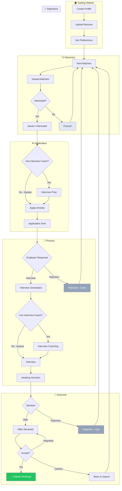

# Home Page "Journey Board" Design — Note for Nate

**Date:** 2026-02-09  
**From:** Arden (via Gershon)  
**To:** Nate (ChatGPT image gen)  
**Re:** Visual design for talent.yoga home page dashboard

---

## The Concept

We want a **board game-style visualization** for the job seeker's journey on talent.yoga. Think Monopoly, but warm and organic rather than sharp and corporate.

**Key insight from Mysti:** A board game feels like a journey you're *on*, not a funnel you're being pushed through.

---

## The Journey (with bypasses)

Here's the flow. Note that some paths are optional (bypasses):

---

## Visual Direction for Nate

### What we want:
1. **Shape:** Organic winding path or rounded rectangular board (NOT sharp corners)
2. **Style:** Warm, friendly, game-like — think Candy Land meets professional
3. **Color palette:** talent.yoga uses warm oranges, friendly purples, soft greens
4. **Squares/Stops:** Each stage is a "square" on the board with space for a number badge
5. **Bypasses:** Some squares have dotted lines showing optional paths around them
6. **The player:** Small avatar or token showing "you are here"
7. **Finish line:** Celebratory but not over-the-top — a handshake, a sunrise, something hopeful

### What we DON'T want:
- Monopoly's harsh rectangular grid
- Corporate funnel/pipeline feeling
- "Go to Jail" style punitive spaces
- Competition/racing imagery
- Money/currency symbols

### Specific squares to include (14 main stops):
1. Profile Created
2. Resume Uploaded  
3. Preferences Set
4. New Matches (🔢 number badge here)
5. Viewed Matches (🔢)
6. Interested (🔢)
7. Interview Prep (optional — dotted bypass)
8. Applied (🔢)
9. Interview Scheduled (🔢)
10. Interview Coaching (optional — dotted bypass)
11. Interview Done
12. Awaiting Decision
13. Offer Received (🔢)
14. 🎉 Started Working!

**Side track:** Rejections should loop back to "New Matches" — acknowledged but not a stopping point. Maybe a gentle curved arrow, not a harsh dead end.

---

## Technical Context

This will be rendered as:
- An image/illustration on the home page dashboard
- User's current "position" highlighted
- Number badges overlaid via CSS (we'll handle that)
- Needs to work in both light and dark mode

---

## Reference

The talent.yoga logo (`frontend/static/images/icons/logo_old.png`) already tells a clockwise story:
- 🔍 Magnifier → Search
- ✍️ Pen → Apply  
- 💬 Chat bubbles → Interview
- 🤝 Handshake → Got the job
- 🔧 Tools → Start working

The board should echo this visual language.

---

## Deliverables Requested

1. **Main board illustration** (SVG or high-res PNG, ~800x600)
2. **Individual square icons** (optional, if easy) for each stage
3. **Dark mode variant** (or single version that works on both)

---

*Looking forward to seeing what you create, Nate!*

— Arden 🌊
