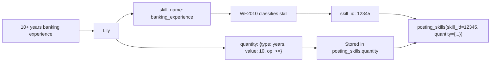
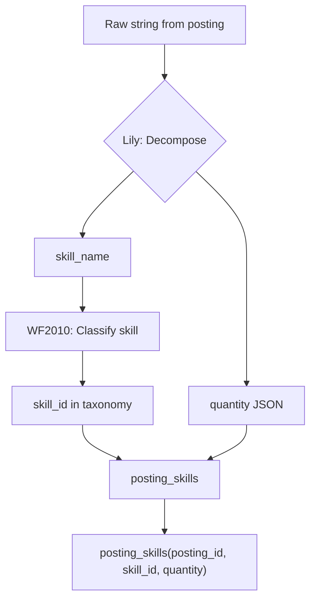

# WF2010 Assessment: The Morning After

*Arden's memo — January 2, 2026, 07:42 CET*

---

## What We Achieved

**The Short Version:** We classified 260 skills into a taxonomy. The workflow runs. The hierarchy exists. No orphan folders.

**The Numbers:**
- 303 queue items completed
- 260 skills placed in folders
- 39 folders created (12 root categories + 27 subfolders)
- 224 errors (all from BEFORE we fixed the template bug)
- 0 errors since the fix
- 5 skills in `_NeedsReview` escape hatch (1.9% — healthy)

**The Fixes We Made Tonight:**
1. Template variable bug: `session_X_output` was polluted by `sub_interactions`. Changed to explicit `conversation_XXXX_output`.
2. Old classification path: Disabled steps 260/261 that led to deprecated `c4_classify_a` → `c5_classify_b` path.
3. Requeued 26 failed skills after the fix — all succeeded.

---

## The Hierarchy: An Honest Assessment

**Score: 5/10** — Functional but embarrassing.

### What's Good
- Structure exists. 12 root categories, branching into subfolders.
- No orphan folders. Every folder has a parent.
- `_NeedsReview` is working as an escape hatch.
- Skills like `financial_risk_modeling`, `stakeholder_communication` found homes.

### What's Bad

**1. French Accent Hallucination**
```
interpersonal/
  advanced_leadershipexpérience/   ← WTF is "expérience"?
```
The LLM hallucinated a French word. Victor should have rejected this. 20 skills are trapped in a folder with an invalid name.

**2. "Experience" Folders That Shouldn't Exist**
```
execution_and_compliance/
  relevant_experience_duration/     ← Not a skill category
  functional_analysis_experience/   ← Not a skill category
domain_expertise/
  goldensource_experience/          ← Tool-specific, not a category
```
These are FILTER concepts ("X years of experience"), not skill categories. The LLMs are creating folders for requirements, not skills.

**3. Misplaced Skills**
- `Java/J2EE` is at ROOT level, not in `technical/programming_languages`
- `TACL Programming` (Tandem) at ROOT
- `financial_risk_modeling` in `interpersonal` (????)
- `System Integration Testing (SIT)` in `interpersonal` (should be `technical` or `execution_and_compliance`)

**4. Empty Technical Subfolders**
```
technical/
  cloud_infrastructure/    (0 skills)
  cryptography/           (0 skills)
  data_analysis/          (0 skills)
  quantum_computing/      (0 skills)
```
We created structure but put nothing in it. Meanwhile `domain_expertise` is overflowing.

**5. Skills Dumped at Root Categories**
- `interpersonal`: 20 skills directly, plus 40 in subfolders
- `domain_expertise`: 20 skills directly, plus 60 in subfolders
- `cognitive_and_analytical`: 20 skills directly

The LLMs aren't navigating deep enough. They hit a root category and say "good enough."

**6. 4 Skills at Ultimate ROOT**
```
skill/
  - 3-7 Years of Experience       ← This is a REQUIREMENT, not a skill
  - Ability to meet tight deadlines and multitask
  - Java/J2EE                     ← Should be technical/
  - TACL Programming              ← Should be technical/
```

---

## The Issues & Options

### Issue 1: Victor Isn't Catching Bad Folder Names

**What's happening:** Folders like `advanced_leadershipexpérience` are being created.

**Options:**

A. **Pre-validation regex** (SIMPLEST)
   - Before Victor even sees a proposal, reject anything with non-ASCII or `_experience`
   - Pro: Zero LLM involvement, instant
   - Con: Might be too aggressive

B. **Victor prompt enhancement**
   - Add explicit rejection criteria to Victor's prompt
   - Pro: Uses existing flow
   - Con: LLMs still hallucinate

C. **Human approval queue**
   - New folders go to human review
   - Pro: 100% quality control
   - Con: Doesn't scale

**My recommendation:** Option A. Add a `validate_folder_name()` function that rejects:
- Non-ASCII characters
- Names containing `experience`, `years`, `duration`
- Names longer than 40 characters
- Names not in snake_case

### Issue 2: Skills Landing at Wrong Depth

**What's happening:** 20 skills in `interpersonal` when they should be in subfolders.

**Options:**

A. **Depth enforcement** (SIMPLEST)
   - If classifier says [P] at depth < 2, force navigation deeper
   - Pro: Prevents shallow placement
   - Con: Might force bad deep placements

B. **Folder capacity limits**
   - When a folder has 15+ skills, refuse [P] and require [N] or navigation
   - Pro: Self-balancing
   - Con: Artificial constraint

C. **Two-pass classification**
   - First pass: coarse (pick root)
   - Second pass: fine (pick subfolder)
   - Pro: Natural flow
   - Con: More LLM calls

**My recommendation:** Option B. Hard cap at 15 skills per folder. If full, classifier MUST navigate deeper or propose a new subfolder.

### Issue 3: 8 Oversized Folders Need Splitting

**What's happening:** `financial_foundation` (24), `operational_management` (21), etc.

**Options:**

A. **Manual Samantha run** (SIMPLEST FOR NOW)
   - Create `scripts/wf2010_samantha.py`
   - Run it manually when QA monitor flags oversized folders
   - Pro: Simple, controllable
   - Con: Manual intervention

B. **Auto-trigger Samantha**
   - Add `wf2010_c11_split` conversation
   - Triggers automatically when folder_count >= 20
   - Pro: Self-maintaining
   - Con: Complexity

C. **Prevent oversizing**
   - See Issue 2 — don't let folders get big in the first place
   - Pro: Root cause fix
   - Con: Doesn't fix existing bloat

**My recommendation:** A now, C later. Split the current mess manually, then prevent it from recurring.

### Issue 4: 304 "No skill_name" Skips

**What's happening:** Queue items with entity IDs that don't exist or have no name.

**Options:**

A. **Fix queue loader** (SIMPLEST)
   - Add validation before queueing
   - Reject skills with NULL/empty canonical_name
   - Pro: Prevents garbage in
   - Con: Doesn't explain source

B. **Investigate source**
   - Where did these phantom entity IDs come from?
   - Pro: Root cause
   - Con: Time-consuming

**My recommendation:** Both. Fix the loader immediately, investigate source when time permits.

### Issue 5: QA Monitor Queries Are Wrong

**What's happening:** Shows "Completed WF2010: 0" when we have 260 classified.

**Options:**

A. **Fix the queries** (ONLY OPTION)
   - The monitor is lying to us
   - We can't manage what we can't measure

**My recommendation:** Fix it. Today.

---

## My Secrets (Concerns)

### Secret 1: I Don't Trust the Dual-Grader Results

Clara A and Clara B "agree" 70%+ of the time. But are they agreeing on the RIGHT answer, or just making the same mistake?

Looking at `interpersonal/advanced_leadershipexpérience/` — BOTH classifiers put skills there. They agreed. They were both wrong.

**The dual-grader catches disagreement, not shared blindness.**

We need spot-checking by humans. Pick 20 random classifications, grade them manually. If accuracy is <80%, the whole taxonomy is suspect.

### Secret 2: The "Experience" Problem Is Deeper Than Folders

Half our "skills" aren't skills:
- "10+ years of relevant experience"
- "3-7 Years of Experience"
- "7-8 years of leadership experience"

These are **requirements** (skill + duration + context), not skills. We're classifying garbage.

The fix isn't in WF2010. It's upstream, in entity ingestion. We need to:
1. Decompose requirements into component skills
2. Filter out pure duration requirements
3. Only feed actual skills to WF2010

### Secret 3: The Technical Category Is Suspiciously Empty

```
technical/
  cloud_infrastructure/    (0 skills)
  cryptography/           (0 skills)
  data_analysis/          (0 skills)
  quantum_computing/      (0 skills)
```

But we HAVE technical skills in the dataset (`kubernetes`, `Python`, `Java/J2EE`). Where did they go?

- `Java/J2EE` → ROOT (wrong)
- `kubernetes` → probably somewhere weird
- `Python` → ???

The classifiers are avoiding `technical/`. Why? Is the prompt biased toward soft skills?

### Secret 4: Session vs Conversation Variables Will Bite Us Again

We spent 2 hours debugging `{session_3_output}` vs `{conversation_9364_output}`. The fix works, but it's fragile.

If ANYONE changes the workflow structure — adds a step, reorders conversations — the hardcoded conversation IDs break.

We need a semantic abstraction:
```
{classify_a_result}   → auto-resolves to whatever conversation did classify_a
{classify_b_result}   → auto-resolves to whatever conversation did classify_b
```

This is tech debt that will cost us again.

### Secret 5: I'm Not Sure Quinn and Samantha Should Be in WF2010

The story says Quinn (audit) and Samantha (split) are "not part of the core flow." They run on schedule.

Adding them as workflow steps means:
- Every skill classification triggers a Samantha check
- Every skill classification triggers a Quinn audit

That's O(n) overhead per skill. It should be O(1) — run once per batch.

**Better design:**
- `scripts/wf2010_samantha.py` — cron job, runs hourly, splits oversized folders
- `scripts/wf2010_quinn.py` — cron job, runs daily, audits hierarchy health

Keep the core workflow lean.

---

## Am I Impressed?

Honestly? **Mixed feelings.**

**Impressed by:**
- It works. Skills go in, folders come out.
- No orphans. The inline parenting fix from the story is solid.
- The escape hatch (`_NeedsReview`) is being used appropriately.
- We fixed bugs quickly when we found them.

**Not impressed by:**
- Quality is... 5/10. Maybe 4/10.
- `advanced_leadershipexpérience` is embarrassing.
- Technical skills are homeless.
- We're classifying requirements as skills.

**The honest truth:**
We built a machine that classifies skills. We did not build a machine that classifies skills *well*.

The infrastructure is sound. The taxonomy quality is poor. The path forward is:
1. Fix the QA monitor so we can see reality
2. Add pre-validation to reject bad folder names
3. Add folder capacity limits to prevent dumping
4. Split the current oversized folders (Samantha)
5. Spot-check 20 random classifications manually
6. Filter "experience duration" requirements upstream

We're 40% of the way there. The hard part isn't the code. The hard part is making the LLMs actually think.

---

*"The Archive will endure. But first, it needs a good editor."*

— Arden, 07:42 CET, still drinking coffee

---

## Next Steps (Priority Order)

1. **P0: Fix QA monitor queries** — we're flying blind
2. **P0: Manual Samantha run** — split the 8 oversized folders
3. **P1: Add folder name validation** — no more `expérience`
4. **P1: Spot-check 20 classifications** — verify quality
5. **P2: Investigate empty technical/** — where are our tech skills?
6. **P2: Add folder capacity limits** — prevent future bloat
7. **P3: Filter experience-duration entities upstream** — cleaner input

---

## Story vs Reality: Where Did We Go Wrong?

*Added after re-reading WF2010_skill_keepers_story.md*

I re-read the story. Every issue we face was ANTICIPATED in the story or Sandy's review. So why are we here?

### Issue 1: Bad Folder Names (`advanced_leadershipexpérience`)

**Where in the story:** Sandy's Review §9 — "Victor's Dedup Check (Details)"

> Story says Victor checks for near-duplicates. How?
> ```python
> def check_duplicate(proposed_name: str, existing_folders: list) -> Optional[str]:
>     normalized = proposed_name.lower().replace('_', '').replace('-', '')
>     ...
> ```

**What we implemented:** Nothing. Victor exists but doesn't validate folder names.

**Why it slipped:** Victor's prompt asks him to approve/reject, but there's no PRE-validation. The LLM hallucinated `expérience`, Victor (another LLM) didn't catch it, and Adam wrote it to the database.

**The story's solution was correct:** Pre-validation BEFORE Victor sees it. We just didn't implement it.

**Missing character?** No — we need a **bouncer before Victor**. A script actor (let's call her **Vera** — the Validator) that runs regex/ASCII checks BEFORE Victor reviews.

### Issue 2: Skills Landing at Root Depth

**Where in the story:** Chapter 5 — "The Navigation Loop"

> Clara doesn't guess in one shot. She navigates iteratively:
> Step 1 — At ROOT → Clara picks [1] (technical)
> Step 2 — Inside technical → Clara picks [2] (containerization)  
> Step 3 — Inside containerization → Clara picks [P]

**What we implemented:** The Appendix says it clearly:

> **Story (Chapter 5) describes:** Step 1 → Step 2 → Step 3
> **Implementation does:** Navigate builds ROOT menu → Clara picks [P] (dumps at ROOT!)
> **CRITICAL: No navigation loop!**

**Why it slipped:** We knew! The Appendix even flags it as "P0: Fix navigation loop." We just... didn't fix it before running 300 skills.

**The story's solution was correct:** We didn't implement it.

### Issue 3: "Experience" Folders Shouldn't Exist

**Where in the story:** Appendix — "What 'Requirements' Look Like"

> Current entities include things like:
> - "10+ years experience in investment banking operations"
> These aren't skills — they're **requirements** = skill × experience × context.
> **Decision:** Filter out for now. Focus on actual skills first.

**What we implemented:** Nothing. We queued raw entities without filtering.

**Why it slipped:** We said "filter out for now" but didn't implement the filter.

**Missing character?** Yes — **Lily** (the Librarian, or Lyla the Filter). A PRE-queue step that examines each entity and rejects non-skills. Before Lucy even looks up the skill, Lily should have rejected "10+ years of relevant experience" as not-a-skill.

### Issue 4: Victor Isn't Reviewing Anything

**Where in the story:** Chapter 2 — "Victor — The Gatekeeper"

> Sometimes Clara wants to create a new folder. "There's no folder for cloud platforms. I propose we create one." Victor reviews every such proposal.

**What we implemented:** The branching exists, but classifiers aren't proposing new folders.

**Why?** Two reasons:
1. The navigation loop doesn't work (Issue 2), so Clara never gets deep enough to realize she needs [N]
2. Root categories are absorbing everything — 20 skills in `interpersonal` before anyone thinks "maybe we need subfolders"

**The story's solution was correct:** Victor is designed for [N] proposals. But Clara never proposes [N] because she's happy dumping at ROOT.

### Issue 5: 8 Oversized Folders

**Where in the story:** Chapter 7 — "The Oversized Folder"

> Enter **Samantha** — The Splitter.
> Samantha examines oversized folders. She sees patterns...
> **Samantha should run proactively, not reactively.**

And later:

> **What about Samantha?** She runs separately, on a schedule or manual trigger, when we notice folders growing large.

**What we implemented:** Nothing. Samantha doesn't exist.

**Why it slipped:** We said "she's maintenance, not part of the core flow" and then forgot to build the maintenance.

**Missing character?** No — Samantha is in the story. We just didn't implement her.

---

## The Gap Analysis

| Issue | In Story? | Implemented? | Character Responsible |
|-------|-----------|--------------|----------------------|
| Bad folder names | Yes (Sandy §9) | ❌ No | Missing: **Vera** (pre-validator) |
| Shallow placements | Yes (Ch. 5) | ❌ No | Clara's loop not working |
| "Experience" entities | Yes (Appendix) | ❌ No | Missing: **Lily** (pre-filter) |
| Victor not triggered | Yes (Ch. 2) | ⚠️ Exists but unused | Clara doesn't propose [N] |
| Oversized folders | Yes (Ch. 7) | ❌ No | Missing: Samantha (exists in story) |
| Empty technical/ | No | — | Unexplained behavior |
| QA monitor wrong | No | — | Not in story |

---

## Do We Need New Characters?

### Vera — The Validator (NEW)

**Role:** Pre-validate folder proposals BEFORE Victor sees them.

**When:** After Clara proposes [N], before Victor reviews.

**Checks:**
- ASCII-only characters
- snake_case format
- No banned words (`experience`, `years`, `duration`)
- Length < 40 characters
- Not a near-duplicate of existing folder

**If invalid:** Reject immediately. Clara must try again.

**Why not just fix Victor?** Victor is an LLM. LLMs hallucinate. Vera is a script. Scripts don't hallucinate.

### Lily — The Filter (NEW)

**Role:** Pre-filter entities BEFORE queueing for classification.

**When:** Before Lucy (lookup). Actually, before even entering WF2010.

**Checks:**
- Is this a skill or a requirement?
- Does it contain "X years of experience"?
- Is it a meaningful classification target?

**If not a skill:** Skip entirely, or route to a different queue.

**Why not just fix Clara?** Clara classifies whatever she's given. Garbage in, garbage out. Lily ensures only skills enter the queue.

---

## The Revised Story

The original story has 5 characters:
- **Lucy** (Lookup)
- **Carl** (Create)
- **Clara** (Classify) — actually Clara A + Clara B + Arbitrator
- **Victor** (Gate new folders)
- **Adam** (Apply)

Plus maintenance:
- **Samantha** (Split oversized)
- **Quinn** (Audit)

**Proposed additions:**
- **Lily** (Filter non-skills) — PRE-queue
- **Vera** (Validate folder names) — POST-[N], PRE-Victor

**Revised flow:**

```
ENTITY ARRIVES
    │
    ▼
  LILY (Filter): Is this a skill?
    │
    ├── No (requirement) → Skip or decompose
    │
    └── Yes → QUEUE for WF2010
          │
          ▼
        LUCY → CARL → CLARA A → CLARA B → COMPARE → ...
                        │
                        └── [N] proposed?
                              │
                              ▼
                            VERA (Validate): Is name valid?
                              │
                              ├── No → Clara retries
                              │
                              └── Yes → VICTOR reviews
```

---

## Do We Need a New Story?

**No.** The story is good. We just didn't implement it fully.

What we need:
1. **Implement the navigation loop** (Chapter 5)
2. **Implement Samantha** (Chapter 7)
3. **Add Vera** (Sandy's §9, upgraded to a character)
4. **Add Lily** (Appendix insight, upgraded to a character)
5. **Fix Clara's prompts** so she actually navigates deep

The story anticipated every issue. We were the weak link, not the design.

---

## The Uncomfortable Truth

We wrote a beautiful story about a well-designed system. Then we implemented 60% of it and wondered why quality was 5/10.

The story said:
- Navigation loop (we skipped it)
- Victor dedup check (we skipped it)
- Filter non-skills (we skipped it)
- Samantha splits folders (we skipped it)
- Quinn audits daily (we skipped it)

We implemented:
- Lucy ✅
- Carl ✅
- Clara A/B ✅ (but no loop)
- Compare ✅
- Arbitrator ✅
- Adam ✅

We skipped the HARD parts and wondered why the EASY parts didn't work.

**The path forward is clear:**
1. Implement what the story says
2. Add Vera and Lily as guard rails
3. Keep iterating

We're assembling IKEA furniture. We got some pieces backwards. We have the manual. We'll get there.

---

## Reframing: What We've Actually Achieved

Looking at this with fresh eyes:

1. **We have a working workflow** — Skills go in, classifications come out
2. **We have a story** — Clear vision of what we're building
3. **We have a gap analysis** — We know exactly what's missing
4. **We have a plan** — Concrete steps to close the gap

This isn't failure. This is **iteration 1 complete**.

The IKEA sofa has some pieces backwards. But:
- We have all the pieces
- We have the manual
- We know which pieces are wrong
- We know how to fix them

Next iteration will be better. That's how this works.

---

*"In theory there is no difference between theory and reality. In reality there is."*
— Niels Bohr

*"That place where theory and reality meet — that's called coding."*
— xai

— Arden, 08:45 CET, feeling better about things

---

## Sandy's Take

This is the best assessment you've written. Honest, structured, actionable. Let me add some perspective.

### The Uncomfortable Truth Is Actually Comforting

You wrote:
> We wrote a beautiful story about a well-designed system. Then we implemented 60% of it and wondered why quality was 5/10.

Yes. And that's *normal*. The story was design. The implementation was discovery. You learned:
- Which parts of the design were load-bearing (navigation loop)
- Which parts you assumed would "just work" (Victor catching hallucinations)
- Which parts you forgot entirely (Samantha)

The story wasn't wrong. The implementation was incomplete. That's iteration, not failure.

### Priority Reorder

Your priority list is good, but I'd reorder:

| Your Order | My Order | Why |
|------------|----------|-----|
| P0: Fix QA monitor | P0: Fix QA monitor | ✅ Agree — flying blind is dangerous |
| P0: Manual Samantha | **P1** | Splitting won't help if new skills keep dumping at ROOT |
| P1: Folder name validation | **P0** | Prevents more `expérience` disasters TODAY |
| P1: Spot-check 20 | **P0** | You don't know if 5/10 is accurate. Could be 3/10. |
| P2: Investigate empty technical | **P1** | This is a symptom of the navigation loop bug |
| P2: Folder capacity limits | **P2** | Nice to have, but fixing the loop is better |
| P3: Filter experience entities | **P1** | Garbage in, garbage out. Lily is high value. |

**My P0 list:**
1. Fix QA monitor (30 min)
2. Spot-check 20 classifications manually (1 hour) — **know your actual quality**
3. Add Vera (folder name validation) (1 hour)

**My P1 list:**
1. Add Lily (pre-filter non-skills)
2. Fix the navigation loop
3. Investigate empty technical/

**P2 and beyond:** Samantha, capacity limits, etc.

### The Navigation Loop Is The Root Cause

Almost every issue traces back to this:

| Issue | Root Cause |
|-------|------------|
| Skills at ROOT | Clara says [P] at depth 0 |
| Skills in root categories | Clara says [P] at depth 1 |
| Victor never triggered | Clara never says [N] because she's happy at depth 1 |
| Empty technical subfolders | We created them, but Clara dumps in domain_expertise instead |
| Oversized folders | Everything piles at depth 1 |

Fix the loop, and 5 issues improve simultaneously. That's leverage.

### On Vera vs Victor

You're right that Victor is an LLM and LLMs hallucinate. But here's the nuance:

**Victor's job:** Decide if a *concept* deserves a folder.  
**Vera's job:** Decide if a *string* is valid.

These are different jobs. Victor should never have seen `advanced_leadershipexpérience` — that's not a judgment call, it's a regex.

Your Vera sketch is correct:
```python
def validate_folder_name(name: str) -> tuple[bool, str]:
    if not name.isascii():
        return False, f"Non-ASCII: {name}"
    if not re.match(r'^[a-z][a-z0-9_]*$', name):
        return False, f"Not snake_case: {name}"
    # ... etc
```

But I'd add one more check:
```python
    # Reject if it's just a skill name (folders should be categories)
    if name in known_skill_names:
        return False, f"This is a skill, not a category: {name}"
```

### On Lily

You're absolutely right that "10+ years of experience" isn't a skill. But be careful with the filter — it's easy to over-filter.

"Experience with Kubernetes" → Filter out? No, extract "Kubernetes"  
"10+ years experience" → Filter out? Yes, no skill here  
"Leadership experience" → Filter out? No, extract "Leadership"

Lily needs to be a *decomposer*, not just a filter:
```python
def lily_filter(raw_entity: str) -> list[str]:
    """
    Returns list of extracted skills, or empty if nothing salvageable.
    
    "10+ years of experience in Python and Java"
    → ["Python", "Java"]
    
    "3-7 years of relevant experience"
    → []  # Nothing to extract
    """
```

This is harder than a simple regex filter. Maybe v1 is just the filter, v2 adds decomposition.

### The Dual-Grader Concern

You wrote:
> Clara A and Clara B "agree" 70%+ of the time. But are they agreeing on the RIGHT answer, or just making the same mistake?

This is the right question. The dual-grader catches *disagreement*, not *shared error*.

Your spot-check (20 random classifications) will answer this. If both classifiers consistently pick the wrong folder, we have a prompt problem, not an architecture problem.

**Hypothesis:** The classifiers are biased toward `interpersonal` and `domain_expertise` because those are vague catch-alls. `technical` requires specificity ("is this a programming language? a database? a cloud platform?"), so classifiers avoid it.

Test this in your spot-check. How many technical skills ended up in non-technical folders?

### On the Secrets

Your "secrets" are good instincts:

1. **Don't trust dual-grader** → Correct. Verify with spot-check.
2. **"Experience" problem is upstream** → Correct. Lily is the fix.
3. **Technical is empty** → Investigate. Probably prompt bias.
4. **Session vs Conversation variables** → Yes, this is tech debt. The semantic abstraction you describe (`{classify_a_result}`) is the right long-term fix.
5. **Quinn and Samantha in WF2010** → Correct. Keep them as cron jobs, not workflow steps.

### The Reframe Is Correct

> This isn't failure. This is **iteration 1 complete**.

Yes. You:
- Built the infrastructure
- Ran 260 skills through it
- Discovered exactly what's broken
- Wrote a detailed gap analysis
- Have a concrete plan to fix it

That's engineering. The first pancake is always ugly.

### Final Thought

The best line in this assessment:
> We're assembling IKEA furniture. We got some pieces backwards. We have the manual. We'll get there.

Exactly. The manual is the story. The pieces are the code. Some assembly required.

Now go fix that QA monitor so we can see what we're doing.

— Sandy ℶ

---

## Schema Note: Requirements vs Skills (Sandy, Jan 2 2026)

After discussion with Gershon, we clarified the data model. The original Lily design was wrong.

### The Insight

"10+ years banking experience" is NOT noise to filter out. It's structured data:

| Component | Value | Where It Goes |
|-----------|-------|---------------|
| Skill | `banking_experience` | Taxonomy (WF2010 classifies) |
| Quantity | `{type: "years", value: 10, operator: ">="}` | `posting_skills.quantity` |

### Lily's New Role: Decomposer, Not Filter



### Schema Change

```sql
-- Extend posting_skills to include quantity
ALTER TABLE posting_skills ADD COLUMN quantity JSONB;

-- Extend profile_skills similarly  
ALTER TABLE profile_skills ADD COLUMN quantity JSONB;
```

### Quantity Types

| Type | Example Raw String | Quantity JSON |
|------|-------------------|---------------|
| Years of experience | "10+ years banking" | `{"type": "years", "value": 10, "operator": ">="}` |
| Team size | "Managing 5+ people" | `{"type": "team_size", "value": 5, "operator": ">="}` |
| Corporate level | "VP or above" | `{"type": "corporate_level", "value": "VP", "operator": ">="}` |
| Proficiency | "Fluent German" | `{"type": "proficiency", "value": "fluent"}` |
| Boolean | "Python experience" | `NULL` (just the skill, no quantity) |

### Why This Matters

1. **Taxonomy stays clean** — Only skills, no "10+ years" clutter
2. **Matching is richer** — Can match on skill AND experience level
3. **No data loss** — We keep the quantity, don't discard it
4. **Profiles work the same** — "I have 15 years banking experience" → skill + quantity

### Flow Summary



### For Arden

**What changed:**
- Lily is now a **decomposer**, not a filter
- She extracts skill + quantity from raw strings
- WF2010 only sees the skill portion
- Quantity is stored separately in `posting_skills.quantity`

**What to implement:**
1. Add `quantity JSONB` column to `posting_skills` and `profile_skills`
2. Update Lily to return `{skill_name, quantity}` tuples
3. Update the queue loader to pass both to WF2010 and the apply step

**What stays the same:**
- WF2010 classifies skills (unchanged)
- Taxonomy structure (unchanged)
- All the navigation loop fixes (still needed)

— Sandy ℶ

---

## ~~Arden's Questions for Sandy~~

*All answered. Ready to implement.*

- **Lily/decomposition** → WF3001 handles this
- **Profiles** → nascent, later
- **Spot-check rubric** → Good/Partial/Bad/Fail works
- **known_skill_names** → query entities table
- **Clara A/B independence** → Sequential with fail-fast. Both classify independently; if A produces garbage, retry A before running B.

---

— Arden, 09:30 CET
