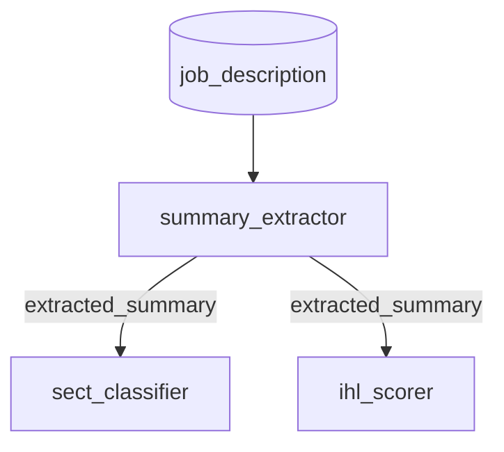

# Arden Daily Note — January 6, 2026 (Part 2)

**Topic:** Autonomous Agent Architecture — From Five-Year Plans to Market Economy
**Context:** Brainstorming session evolved into concrete proposal

---

## Executive Summary (TL;DR for Sandy)

**Problem:** Our workflow/queue architecture has grown complex. 4 tables (workflows, workflow_runs, workflow_conversations, queue) exist mainly to orchestrate what could be simpler.

**Proposal:** Conversations find their own work via `work_query` SQL. No queue needed — data state IS the queue. "Postings without summaries" = work for summary_extractor.

**Critical Constraint:** GPU model batching. Must load model → exhaust all work for that model → switch. Daemon controls model order, conversations control work discovery.

**Schema changes:**
```sql
ALTER TABLE conversations ADD COLUMN
  work_query TEXT,           -- SQL to find work
  requires_model TEXT,       -- 'gemma3:4b', 'qwen2.5:7b', etc.
  requires_columns TEXT[],   -- For dependency graphs
  produces_columns TEXT[],   -- For dependency graphs
  domain TEXT;               -- 'postings', 'profiles', 'matching' (informal, for humans)
```

**Tables to delete:** workflows, workflow_runs, workflow_conversations, queue

**Questions for you:** See end of document.

---

## The Metaphor

**Current system:** Soviet-style central planning
- Monolithic workflows with predetermined steps
- Central daemon dispatches work
- Everything waits in queues for its turn
- One blocker stops the whole machine (posting_validator incident)

**Proposed system:** Market economy
- Small autonomous agents that see what needs doing
- Agents compete/coordinate for work
- No central bottleneck
- Self-organizing, self-healing

---

## What Does "Market Economy" Mean Here?

### The Players

Instead of one daemon running predefined workflows:

**Workers** — Small, focused agents
- Each knows ONE thing well (extract summary, classify SECT, check URL)
- Looks for work it can do
- Does it, reports results
- Doesn't care about "workflows" — just tasks

**Coordinators** — LLMs that see the big picture
- "What needs to happen for this posting to be ready?"
- "What's blocked? What's waiting? What's urgent?"
- Prioritizes, assigns, monitors

**The Board** — Shared state (database)
- What items exist
- What state they're in
- What's been done, what's pending
- Anyone can read; workers write their results

### The Protocol

```
1. Worker wakes up
2. Worker asks: "What can I do?"
3. Worker claims task (atomic)
4. Worker does task
5. Worker posts result to board
6. Worker sleeps or looks for more
```

No workflow definitions. No conversation chains. Just:
- **Preconditions:** What must be true for me to work?
- **Postconditions:** What's true after I work?

---

## Example: Posting Processing

### Current (Monolithic WF3001)
```
fetch → validate → extract_summary → grade → improve → format → save → extract_skills → save_skills → IHL
```
One queue item, many steps, all in sequence.

### Proposed (Market)

**Workers:**
- `summary_extractor` — needs: posting with job_description, no summary. produces: summary
- `skill_extractor` — needs: posting with summary. produces: skills
- `sect_classifier` — needs: posting with skills, no SECT. produces: SECT types
- `ihl_scorer` — needs: posting with skills. produces: IHL score

**Each worker runs independently:**
```sql
-- summary_extractor looks for work:
SELECT posting_id FROM postings 
WHERE job_description IS NOT NULL 
  AND extracted_summary IS NULL
  AND NOT EXISTS (SELECT 1 FROM worker_claims WHERE posting_id = ... AND task = 'summary')
LIMIT 1 FOR UPDATE SKIP LOCKED
```

**No orchestration needed.** Each worker pulls what it can process.

### Benefits

| Aspect | Monolithic | Market |
|--------|-----------|--------|
| One step blocks | Everything waits | Others continue |
| Add new step | Modify workflow, redeploy | Deploy new worker |
| Parallelism | scale_limit per workflow | Natural (N workers) |
| Debugging | "Which step failed?" | "What's this item missing?" |
| Priorities | Queue order | Workers can prioritize |

---

## The Coordinator Role

**Question:** If workers are autonomous, who decides priority?

**Answer:** A Coordinator agent (LLM) that:
1. Periodically scans the board
2. Asks: "What's the current state? What's stuck? What matters most?"
3. Can nudge workers: "Hey, we have 50 postings waiting for SECT, none waiting for IHL. Focus on SECT."

The Coordinator doesn't CONTROL workers — it INFLUENCES them by:
- Adjusting priorities in the board
- Spawning more workers for bottlenecks
- Alerting humans when something looks wrong

**This is the LLM-controlled interrogator idea:** An agent that sees the whole system and makes judgment calls.

---

## How Workers Discover Work

### Option A: Polling (Simple)
```python
while True:
    task = find_claimable_task()
    if task:
        do_task(task)
    else:
        sleep(10)
```

### Option B: Event-Driven (Efficient)
```python
# Listen for new postings
LISTEN posting_created;

# When notified
for notification in pg_notifications:
    if can_process(notification.posting_id):
        claim_and_process(notification.posting_id)
```

### Option C: Coordinator Assigns (Directed)
```python
# Coordinator writes to worker queue
INSERT INTO worker_tasks (worker_type, posting_id, priority)
VALUES ('summary_extractor', 12345, 'high');

# Worker reads its queue
SELECT * FROM worker_tasks WHERE worker_type = 'summary_extractor' ORDER BY priority;
```

---

## Coexistence Strategy

**We can't rewrite everything.** Migrate gradually:

1. **Keep current daemon running** — existing workflows work
2. **New workers run alongside** — claim work daemon doesn't
3. **Coordinator observes both** — sees full picture
4. **Migrate one step at a time** — e.g., replace WF2020 with `sect_classifier` worker

The database is the shared truth. Both systems can coexist.

---

## Questions to Explore

1. **Worker granularity:** How small? One per skill? One per posting? One per task type?

2. **Claim protocol:** How to prevent two workers grabbing same task? (`FOR UPDATE SKIP LOCKED`)

3. **Failure handling:** Worker dies mid-task. Who notices? Who retries?

4. **Coordinator smarts:** What does the LLM actually decide? Priorities? Retries? Alerts?

5. **Observability:** How do we see what's happening? Dashboard per worker? Central view?

6. **Cost:** More LLM calls (coordinator thinking) vs. fewer (dumb polling)?

---

## Prototype Idea

**Start small:** One autonomous worker for one task.

```python
# scripts/workers/summary_worker.py
"""
Autonomous worker: Extract summaries from postings.
Runs independently. Claims work. Reports results.
"""

class SummaryWorker:
    def find_work(self):
        """Find a posting that needs a summary."""
        return query("""
            SELECT posting_id FROM postings
            WHERE job_description IS NOT NULL
              AND extracted_summary IS NULL
              AND invalidated = FALSE
            ORDER BY first_seen_at DESC
            LIMIT 1 FOR UPDATE SKIP LOCKED
        """)
    
    def do_work(self, posting_id):
        """Extract summary using LLM."""
        posting = get_posting(posting_id)
        summary = call_llm(SUMMARY_PROMPT, posting.job_description)
        save_summary(posting_id, summary)
        log_interaction(posting_id, 'summary_extracted', summary)
    
    def run(self):
        while True:
            posting_id = self.find_work()
            if posting_id:
                self.do_work(posting_id)
            else:
                sleep(30)
```

Run 3 of these in parallel. See what happens.

---

## The Vision

> "People see what needs doing and they do it."

Instead of:
- Workflow designer plans every step
- Queue fills up
- Daemon executes in order
- Errors stop the line

We get:
- Workers emerge for each need
- Work flows to whoever can do it
- Errors are local, not global
- System adapts without redesign

**The coordinator is the "invisible hand"** — sees the whole economy, nudges when needed, but doesn't micromanage.

---

## Next Steps

1. **Prototype one worker** (summary_worker?) running alongside daemon
2. **Measure:** Does it step on daemon's toes? How do we prevent conflicts?
3. **Build coordinator shell** — LLM that reads state and suggests actions
4. **Iterate:** What works? What's missing?

---

## Design Decision: SQL + Metadata

*After pushback discussion*

**The question:** How do conversations find their work?

**Options considered:**
- Pure SQL — powerful but can't analyze for dependency graphs
- JSON DSL — structured but you're inventing a language
- **SQL + Metadata** ✅ — SQL runs, metadata is for tooling

**Schema:**
```sql
ALTER TABLE conversations ADD COLUMN
  work_query TEXT,           -- Full SQL, executed directly
  requires_columns TEXT[],   -- For tooling/diagrams
  produces_columns TEXT[];   -- For tooling/diagrams
```

**Example:**
```sql
UPDATE conversations SET
  work_query = 'SELECT posting_id FROM postings 
                WHERE extracted_summary IS NOT NULL 
                AND sect_decomposed_at IS NULL 
                LIMIT 1 FOR UPDATE SKIP LOCKED',
  requires_columns = ARRAY['extracted_summary'],
  produces_columns = ARRAY['sect_decomposed_at']
WHERE canonical_name = 'sect_classifier';
```

**Principle:** SQL is the truth (it runs). Metadata is for tooling (diagrams, docs). If metadata drifts, diagram is wrong but execution still works.

---

## Dependency Graph Generator

With `requires_columns` and `produces_columns`, we can auto-generate:

```python
# tools/conversation_graph.py
def build_graph():
    conversations = query("SELECT canonical_name, requires_columns, produces_columns FROM conversations WHERE enabled")
    
    edges = []
    for conv in conversations:
        for req in conv['requires_columns']:
            # Find who produces this
            producer = find_producer(req)
            edges.append((producer, conv['canonical_name']))
    
    return render_mermaid(edges)
```

Output:


---

## Migration Path

1. **Add columns** to conversations table
2. **Populate for existing conversations** (can derive from current workflow configs)
3. **Build graph generator** tool
4. **New daemon mode** that uses `work_query` instead of queue
5. **Run both** — old daemon + new mode — compare behavior

---

## Architecture Comparison Matrix

*For Sandy's review*

### Tables: Current vs Proposed

| Current Table | Purpose Today | Proposed | Notes |
|---------------|---------------|----------|-------|
| `workflows` | Groups conversations into named pipelines | **DELETE** | Conversations are independent |
| `workflow_runs` | Tracks one execution of a workflow | **DELETE** | No "runs" — just continuous processing |
| `workflow_conversations` | Links workflows ↔ conversations | **DELETE** | No grouping needed |
| `queue` | Items waiting to be processed | **DELETE** | Conversations find work via `work_query` |
| `conversations` | Defines a processing step | **KEEP + EXTEND** | Add `work_query`, `requires_columns`, `produces_columns` |
| `instructions` | What actors do (prompts, config) | **KEEP** | Unchanged |
| `instruction_steps` | Branching logic between instructions | **SIMPLIFY?** | May not need if conversations are independent |
| `interactions` | Audit trail of all executions | **KEEP** | Core audit trail — unchanged |
| `actors` | How work gets done (script, LLM) | **KEEP** | Unchanged |

**Tables eliminated: 4** (workflows, workflow_runs, workflow_conversations, queue)

### Concepts: Current vs Proposed

| Concept | Current | Proposed |
|---------|---------|----------|
| **Work discovery** | Daemon polls `queue` table | Conversation runs its `work_query` |
| **Prioritization** | Queue priority + FIFO | Conversation priority (higher runs first) |
| **Dependencies** | Implicit via workflow sequence + instruction_steps | Explicit in `work_query` (requires data from prior step) |
| **Coordination** | Daemon orchestrates workflow_runs | None needed — data dependencies self-coordinate |
| **Progress tracking** | `workflow_runs.status`, `queue.status` | Query data state directly ("how many postings lack summaries?") |
| **Audit trail** | `interactions` with `workflow_run_id` | `interactions` with `posting_id` (or subject) |
| **Scale control** | `workflows.scale_limit` | `conversations.scale_limit` (per conversation) |
| **Failure handling** | Workflow run fails, items stay in queue | Interaction fails, item still matches `work_query` for retry |

### Functions: Current vs Proposed

| Function | Current Implementation | Proposed Implementation |
|----------|----------------------|------------------------|
| **"Process this posting"** | Insert into queue, daemon claims, runs workflow | Posting exists → conversations with matching `work_query` pick it up |
| **"What's pending?"** | `SELECT * FROM queue WHERE status='pending'` | `SELECT * FROM postings WHERE extracted_summary IS NULL` (data state) |
| **"Why didn't X run?"** | Check queue status, workflow_run status | Check if `work_query` returns the item (is it eligible?) |
| **"What depends on what?"** | Read workflow doc, trace instruction_steps | Auto-generated from `requires_columns`/`produces_columns` |
| **"Stop processing"** | `UPDATE workflows SET enabled=false` | `UPDATE conversations SET enabled=false` |
| **"Retry failed items"** | Reset queue status, re-run | Items still match `work_query` — just run again |

### The Queue's Job Today

The `queue` table currently handles:

| Responsibility | How queue does it | How proposed handles it |
|----------------|-------------------|------------------------|
| **Backlog** | Rows with `status='pending'` | Data state (e.g., postings missing summaries) |
| **Claiming** | `status='processing'` + `FOR UPDATE SKIP LOCKED` | `work_query` uses `FOR UPDATE SKIP LOCKED` |
| **Completion** | `status='completed'` | Data has the output (e.g., `extracted_summary IS NOT NULL`) |
| **Failure** | `status='failed'` | `interactions.status='failed'` — item still eligible for retry |
| **Priority** | `priority` column | `conversations.priority` |
| **Batch tracking** | `reason` column | Not needed — or add to interactions |
| **Subject binding** | `subject_type`, `subject_id` | In `work_query` (which table, which row) |

### Workflow Run's Job Today

The `workflow_runs` table currently handles:

| Responsibility | How workflow_runs does it | How proposed handles it |
|----------------|---------------------------|------------------------|
| **Group interactions** | `workflow_run_id` links interactions | `interactions.posting_id` (subject is the grouping) |
| **Track progress** | `status`, `started_at`, `completed_at` | Not needed — query data state |
| **Error context** | `error_message` on the run | `interactions.error_message` on the interaction |
| **Resume after crash** | Find `status='running'`, continue | Conversations re-find work via `work_query` |

### The New Simple Loop (WRONG — see GPU Batching below)

```python
# ❌ This naive approach switches models constantly = bad GPU utilization
def run_NAIVE_DONT_USE():
    while True:
        for conversation in get_enabled_conversations(order_by='priority DESC'):
            item = db.execute(conversation.work_query)
            if item:
                process(conversation, item)  # Model switch every time!
```

**The correct loop is model-first** — see 🔴 GPU Model Batching section below.

### What We Lose (and is it OK?)

| Lost Feature | Impact | Mitigation |
|--------------|--------|------------|
| Named workflows | Can't say "run WF3001" | Say "process posting 12345" or let system find work |
| Batch tracking | Can't group "these 50 were a test" | Add `batch_tag` to interactions if needed |
| Workflow-level progress | "WF3001 is 50% done" | Query: "50% of postings have summaries" |
| Explicit queueing | Can't pre-queue 1000 items | Data existence IS the queue |
| RAQ by workflow | `raq.py run 2020` | `raq.py run sect_classifier` (by conversation) |

### What We Gain

| Gain | Why it matters |
|------|----------------|
| **No blocking** | One slow conversation doesn't stop others |
| **Self-healing** | Failed item still matches `work_query` — automatic retry |
| **Simpler debugging** | "Why no summary?" → run `work_query`, see if posting matches |
| **Natural parallelism** | Run 5 daemons — they all find different work |
| **Data-driven** | State is in the data, not in queue/run tables |
| **Fewer tables** | 4 tables gone = less to understand, maintain |

---

## 🔴 Critical Constraint: GPU Model Batching

**This is non-negotiable.** The GPU is the bottleneck, not the logic.

### The Problem
- Loading a model (gemma, qwen, phi) takes significant time
- If we switch models constantly, GPU utilization drops to 30-50%
- With proper batching, we achieve **95-100% GPU utilization**
- This is true at ANY scale — 1 GPU or 1000 GPUs, model-switching kills performance

### Current Solution
The current daemon does this via `workflow.model_name`:
```python
# Load model once
model = load_model(workflow.model_name)
# Process all items for this workflow (same model)
for item in workflow_items:
    process(item, model)
# Then move to next workflow (possibly different model)
```

Workflows grouped by model = efficient GPU usage.

### New Solution: Model-First Dispatcher

Conversations must declare their model requirement:
```sql
ALTER TABLE conversations ADD COLUMN requires_model TEXT;
-- e.g., 'gemma3:4b', 'qwen2.5:7b', 'phi4:14b'
```

Daemon becomes **model-first**, not conversation-first:
```python
MODELS = ['gemma3:4b', 'qwen2.5:7b', 'phi4:14b']

while True:
    did_work = False
    
    for model_name in MODELS:
        # Get ALL conversations that need this model
        convs = query("""
            SELECT * FROM conversations
            WHERE work_query IS NOT NULL
              AND requires_model = %s
              AND is_active = TRUE
            ORDER BY priority
        """, model_name)
        
        if not convs:
            continue
            
        # Load model ONCE
        model = load_model(model_name)
        
        # Exhaust ALL work for this model before switching
        for conv in convs:
            work = execute_query(conv.work_query)
            while work:
                process(conv, work[0], model)
                work = execute_query(conv.work_query)
                did_work = True
        
        unload_model(model)
    
    if not did_work:
        sleep(5)
```

### Key Insight

The **dispatcher/daemon** controls:
- Model loading order (gemma → qwen → phi)
- GPU resource management
- Priority across conversations

The **conversations** control:
- What work they find (`work_query`)
- How they process it (`system_prompt`, `model_params`)
- What they produce (`produces_columns`)

**This is the right separation of concerns.**

---

## Questions for Sandy

We think this is simpler and more robust. But we need your eyes on:

1. **RAQ testing:** Without queue/batch tracking, how do we do controlled repeatability tests?
   - *Our thought:* Add `test_batch_id` to interactions during RAQ runs

2. **Progress dashboards:** `turing.py --status` shows queue state. What replaces it?
   - *Our thought:* Query data state directly (`COUNT(*) WHERE extracted_summary IS NULL`)

3. **Coordinator:** Do we still need an LLM that observes and adjusts priorities?
   - *Our thought:* Maybe not — static priorities might be enough

4. **Migration:** How do we run old and new side-by-side safely?
   - *Our thought:* Old daemon uses queue, new daemon uses work_query — both write to interactions

5. **instruction_steps:** If conversations are independent, do we still need branching?
   - *Our thought:* Maybe for within-conversation retry logic only

6. **Model batching:** Is the model-first dispatcher the right approach?
   - *Our thought:* Yes, but open to alternatives

**What are we missing?**

---

ℵ

---

## Sandy's Review

*January 6, 2026*

This is the most significant architectural proposal since we started. You're not refactoring — you're proposing a paradigm shift. Let me be thorough.

### The Core Insight Is Sound

> "Data state IS the queue"

This is correct. The queue table is a shadow of reality. When a posting needs a summary, that fact is encoded in `postings.extracted_summary IS NULL`. The queue row is just a copy of that truth. Two sources of truth = eventual inconsistency.

The `work_query` approach eliminates the shadow. The data IS the work list.

### The Model-First Dispatcher Is Correct

You identified the critical constraint: GPU batching. The naive "round-robin conversations" approach would destroy performance.

Your proposed loop:
```python
for model_name in MODELS:
    model = load_model(model_name)
    for conv in conversations_needing_this_model:
        while work := execute_query(conv.work_query):
            process(conv, work, model)
    unload_model(model)
```

This is right. **Model-first, exhaust-all-work, then switch.**

One refinement: add a `max_batch_size` per cycle to prevent starvation:

```python
for model_name in MODELS:
    model = load_model(model_name)
    items_processed = 0
    for conv in conversations_needing_this_model:
        while work := execute_query(conv.work_query):
            process(conv, work, model)
            items_processed += 1
            if items_processed >= MAX_BATCH_SIZE:  # e.g., 100
                break
        if items_processed >= MAX_BATCH_SIZE:
            break
    unload_model(model)
```

Without this, if `summary_extractor` has 10,000 items, `sect_classifier` (same model) never runs until summaries are done. The batch limit ensures all conversations make progress.

### Answers to Your Questions

**1. RAQ testing without batch tracking?**

Your thought (`test_batch_id` in interactions) is correct, but extend it:

```sql
ALTER TABLE interactions ADD COLUMN batch_tag TEXT;
```

RAQ becomes:
```bash
# Tag interactions during test
python3 scripts/raq.py run sect_classifier --tag RAQ_SECT_001

# Compare runs with same tag
python3 scripts/raq.py compare --tag RAQ_SECT_001
```

The tag lives in interactions, not in a separate queue table. Same audit trail, no extra tables.

**2. Progress dashboards?**

`turing.py --status` currently queries queue/workflow_runs. Replace with data-state queries:

```python
# Current (queue-based)
pending = query("SELECT COUNT(*) FROM queue WHERE status='pending'")

# New (data-state)
summaries_pending = query("SELECT COUNT(*) FROM postings WHERE extracted_summary IS NULL")
sect_pending = query("SELECT COUNT(*) FROM posting_skills WHERE sect_type IS NULL")
```

Actually better: the dashboard shows REAL state, not queue state. If queue and data diverged (and they do), you'd never know. Now you always see truth.

Build a view:
```sql
CREATE VIEW processing_status AS
SELECT 
    'summaries_pending' as metric,
    COUNT(*) as value
FROM postings WHERE extracted_summary IS NULL
UNION ALL
SELECT 
    'sect_pending',
    COUNT(*)
FROM posting_skills WHERE sect_type IS NULL
-- etc.
```

`turing.py --status` queries the view. Done.

**3. Coordinator LLM?**

**Not yet.** Static priorities are enough for now. You have 5-10 conversations, not 500. A human can set priorities.

The Coordinator becomes valuable when:
- Priorities need to change dynamically based on load
- Anomaly detection ("why are summaries backing up?")
- Resource allocation across multiple GPUs

Park it. Revisit when you have scale problems, not architecture problems.

**4. Migration: old and new side-by-side?**

This is where I want to push back slightly.

Your proposal: old daemon uses queue, new daemon uses work_query, both write to interactions.

**Risk:** Both daemons claim the same work. The `FOR UPDATE SKIP LOCKED` works within one connection, but two daemons with two connections can race.

**Safer migration:**

Phase 1: **Add columns, don't change behavior**
```sql
ALTER TABLE conversations ADD COLUMN work_query TEXT;
ALTER TABLE conversations ADD COLUMN requires_model TEXT;
-- Populate from existing workflow configs
```

Phase 2: **New daemon in read-only mode**
- New daemon runs `work_query` but doesn't process
- Logs what it WOULD do
- Compare to what old daemon actually does
- Find discrepancies

Phase 3: **Shadow mode**
- New daemon processes, but old daemon is source of truth
- Compare outputs
- Find bugs

Phase 4: **Flip**
- New daemon is primary
- Old daemon disabled
- Queue table becomes archive

Phase 5: **Cleanup**
- Delete queue table (or archive)
- Delete workflow tables

This is more cautious than "run both." But it's safer.

**5. instruction_steps: still needed?**

Yes, but for a different purpose.

Current: instruction_steps define workflow sequence (A → B → C)
Proposed: conversations are independent, sequence emerges from data dependencies

But instruction_steps also handle:
- **Branching within a conversation:** "If LLM says X, do Y; else do Z"
- **Retry logic:** "If validation fails, retry with different prompt"
- **Multi-turn conversations:** "First ask, then follow up"

These are INTERNAL to a conversation, not orchestration between conversations. Keep instruction_steps for that.

The simplification: instruction_steps no longer define workflow order. They only define what happens inside one conversation's execution.

**6. Model batching approach?**

Yes, the model-first dispatcher is correct. 

One addition: track model load time in metrics. If `gemma3:4b` takes 8 seconds to load and you're loading it 50 times/hour, that's 7 minutes of waste. The metrics will tell you if batching is actually working.

### What You're Missing

**A. Timeout and deadlock handling**

```sql
SELECT posting_id FROM postings 
WHERE extracted_summary IS NULL
LIMIT 1 FOR UPDATE SKIP LOCKED
```

What if the worker crashes after claiming but before completing? The row stays locked until transaction timeout. 

Add a claim timestamp and reaper:
```sql
-- Worker claims with timestamp
UPDATE postings SET 
    processing_started_at = NOW(),
    processing_by = 'worker-1'
WHERE posting_id = 12345;

-- Reaper releases stale claims (> 10 min)
UPDATE postings SET 
    processing_started_at = NULL,
    processing_by = NULL
WHERE processing_started_at < NOW() - INTERVAL '10 minutes';
```

Or use advisory locks instead of row locks. But handle the crash case.

**B. Poison pill detection**

If a posting always fails (malformed data, LLM can't parse it), the work_query will keep returning it forever. The worker tries, fails, item matches query again, infinite loop.

Add a failure counter:
```sql
ALTER TABLE postings ADD COLUMN processing_failures INT DEFAULT 0;

-- Worker increments on failure
UPDATE postings SET processing_failures = processing_failures + 1 WHERE ...;

-- work_query excludes poison pills
SELECT posting_id FROM postings 
WHERE extracted_summary IS NULL
  AND processing_failures < 3  -- Give up after 3 tries
LIMIT 1 FOR UPDATE SKIP LOCKED
```

**C. Priority inversion**

Your model-first loop processes conversations in priority order within a model. But what if:
- `high_priority_conv` uses `gemma3:4b`
- `low_priority_conv` uses `qwen2.5:7b`
- Model order is `[gemma, qwen, phi]`

High priority runs first because gemma comes before qwen. Good.

But what if:
- `high_priority_conv` uses `qwen2.5:7b`
- `low_priority_conv` uses `gemma3:4b`

Now low priority runs first because gemma comes before qwen in the model list. **Priority inverted.**

Fix: order MODELS by the highest-priority conversation that needs them:
```python
def get_model_order():
    return query("""
        SELECT DISTINCT requires_model 
        FROM conversations 
        WHERE enabled AND work_query IS NOT NULL
        ORDER BY MAX(priority) DESC
    """)
```

Now models with high-priority conversations load first.

**D. Observability gap**

Without workflow_runs, you lose the "execution context" grouping. Today:
```
workflow_run_id=123 links:
  - interaction 1 (fetch)
  - interaction 2 (validate)
  - interaction 3 (summarize)
```

Tomorrow, these are just interactions with the same `posting_id`. That's probably fine — posting_id IS the grouping. But verify your dashboards and debugging queries still work.

### The Verdict

**Approve in principle. Migrate carefully.**

The architecture is cleaner. Data-as-queue is correct. Model-first batching is correct. But:

1. Don't rush the migration — use the phased approach
2. Add poison pill handling from day one
3. Add claim timeout handling
4. Fix the priority inversion in model ordering
5. Keep instruction_steps for intra-conversation logic

The 4-table deletion is aggressive but justified. The queue table is the most obviously redundant — start there. Workflow tables can follow once conversations prove stable.

### Proposed Directive Addition

> **16. Data is the queue** — Don't maintain shadow tables that duplicate data state. If "posting needs summary" is knowable from `postings.extracted_summary IS NULL`, don't also track it in a queue table. One source of truth.

> **17. Model-first batching** — GPU utilization requires loading a model once and exhausting all work for that model before switching. Conversations declare their model; the dispatcher groups by model, not by conversation.

Good thinking. This is the kind of simplification that makes systems maintainable.

— Sandy ℶ
