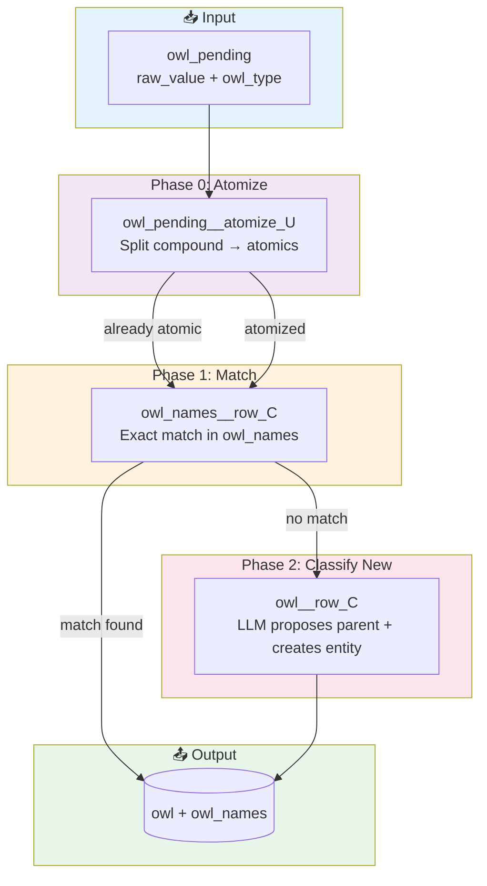

# Skill Taxonomy Pipeline Plan
**Date:** 2026-01-19  
**Author:** Sandy (with croissant)  
**Status:** In Progress ✅

## The Vision (Aristotle Would Approve)

Parse unstructured chaos into a hierarchy. Match instances to that framework.

**Input:** Raw skill mentions from job postings (messy, duplicated, inconsistent)  
**Output:** Canonical skills in OWL taxonomy (clean, hierarchical, reusable)

## Current State

**OWL Tables:**
- `owl`: 11,702 entities (skills, folders, certificates, domains, etc.)
- `owl_names`: Name lookup table (canonical, aliases, verbatim, etc.)
- `owl_relationships`: Hierarchy via `is_a` (parent) and `belongs_to` (folder)
- `owl_pending`: 8,985 competencies awaiting classification

**Big Discovery (Jan 19):**
```
owl_pending total:     8,985
Already in owl_names:  8,503 (94.6%)  ← owl_names__row_C ✅ DONE
Truly new:               482 (5.4%)  ← owl__row_C (pending)
```

**owl_names__row_C Results (Jan 19, 11:35):**
```
Processed:  8,503 items
Success:    100% (9 batches × 1000)
Time:       ~13 minutes
Result:     All matchable items linked to existing owl entities
```

**Posting Pipeline Status:**
```
Total valid postings:  2,127
With extracted_reqs:   1,302 (61%, daemon running ~1.5h left)
Pending extraction:      818
```

**Taxonomy Roots (should be 10, currently 4):**

| owl_id | canonical_name | Status |
|--------|---------------|--------|
| 19098 | all_skills | ✅ exists |
| 40059 | certificates | ✅ exists |
| 40060 | industry_domains | ✅ exists |
| 40061 | seniority_contexts | ✅ exists |
| ? | locations | ❌ missing |
| ? | settings | ❌ missing |
| ? | roles | ❌ missing |
| ? | track_records | ❌ missing |
| ? | experiences | ❌ missing |
| ? | tools | ❌ missing |

**Key Insight:** These map to CPS dimensions:
- **Skill** → all_skills
- **Certificate** → certificates  
- **Domain** → industry_domains
- **Seniority** → seniority_contexts
- **Setting** → settings (missing)
- **Role** → roles (missing)
- **Track Record** → track_records (missing)
- **Experience** → experiences (missing - or derive from skill + duration?)
- **Location** → locations (missing - for geography)
- **Tool** → tools (missing - subset of skills? or separate?)

**Classifier agreement rate:** ~50% (from Sandy's Jan 7 notes) - needs improvement

## New Approach: One Actor Per Phase

Build fresh. Each actor is standalone, RAQ-able, belt-and-suspenders.

### Pipeline Design



### Actor Naming Convention

Per directive #12: `{output_table}__{attribute}_{CRUD}`

| Actor | Output Table | Purpose | LLM? |
|-------|--------------|---------|------|
| `owl_pending__atomize_U` | owl_pending | Split compound phrases → atomic skills | ✅ Yes |
| `owl_names__row_C` | owl_names | Match atomic to existing owl entity | ❌ No (SQL) |
| `owl__row_C` | owl | Create new entity when no match found | ✅ Yes |

---

### Actor 0: `owl_pending__atomize_U`

**File:** `thick_actors/owl_pending__atomize_U.py`

**Purpose:** Split compound skill phrases into atomic skills that can be matched.

**Input:** `owl_pending` row (pending_id, raw_value) where status='pending'

**Output:** 
- `owl_pending.resolution_notes` with `atomized_skills` JSON
- `owl_pending.status` → 'atomized' or 'no_atomics'

**Logic:**
1. Short items (≤25 chars): Pass through as-is (likely already atomic)
2. Long items: LLM extracts atomic skills
3. QA: Verify each atomic is grounded in source text
4. Store source_hash for lineage tracking

**LLM needed** — semantic decomposition. Must RAQ for consistency.

---

### Actor 1: `owl_names__row_C`

**File:** `thick_actors/owl_names__row_C.py`

**Purpose:** For each `owl_pending` item, find a matching `owl_id` in existing `owl_names` and create a new `owl_names` entry linking the raw text.

**Input:** `owl_pending` row (pending_id, raw_value, owl_type)

**Output:** `owl_names` row linking raw_value → existing owl_id

**Logic:**
1. Normalize: lowercase, trim whitespace
2. Exact match: `SELECT owl_id FROM owl_names WHERE LOWER(display_name) = LOWER(raw_value)`
3. If found → create `owl_names` entry with `name_type='verbatim'`
4. If not found → mark for `owl__row_C` (leave pending, or set status='needs_classification')

**No LLM needed** — pure SQL matching. Fast, deterministic, RAQ-friendly.

**work_query:**
```sql
SELECT pending_id FROM owl_pending 
WHERE status = 'pending'
  AND EXISTS (SELECT 1 FROM owl_names WHERE LOWER(display_name) = LOWER(raw_value))
```

---

### Actor 2: `owl__row_C`

**File:** `thick_actors/owl__row_C.py`

**Purpose:** For unmatched `owl_pending` items, use LLM to classify and create new `owl` entity + `owl_names` entry.

**Input:** `owl_pending` row with no existing match

**Output:** 
- New `owl` row (owl_id, owl_type, canonical_name)
- New `owl_names` row (linking raw_value → new owl_id)
- New `owl_relationships` row (is_a → parent folder)

**Logic:**
1. Send raw_value + owl_type to LLM
2. LLM returns: canonical_name, parent_folder_id
3. Create owl entity
4. Create owl_names entry
5. Create owl_relationships (is_a parent)

**Requires LLM** — classification decision. Must RAQ for consistency.

**work_query:**
```sql
SELECT pending_id FROM owl_pending 
WHERE status = 'pending'
  AND NOT EXISTS (SELECT 1 FROM owl_names WHERE LOWER(display_name) = LOWER(raw_value))
```

---

### RAQ Strategy

Each actor gets independent RAQ cycles:

```bash
# Test owl_names__row_C in isolation
./tools/turing/turing-raq start owl_names__row_C --count 50 --runs 3
./tools/turing/turing-raq status owl_names__row_C
# Fix issues, repeat until 100%

# Only then move to owl__row_C
./tools/turing/turing-raq start owl__row_C --count 50 --runs 3
# etc.
```

**Key insight:** Testing the whole chain on every code change = madness. RAQ one actor at a time.

## Build Order

1. **owl_names__row_C** — The gatekeeper (most value: matches existing, avoids duplicates)
2. **owl__row_C** — Creates new entities when no match found

Starting with #1 because it handles the 94.6% case (items that already have matches).

## Success Metrics

- Each actor: 100% RAQ pass rate before moving on
- owl_names__row_C: >90% precision on fuzzy matching
- owl__row_C: >80% agreement rate on classification (up from 50%)
- End-to-end: Reduce owl_pending from 8,985 to 0

## Next Actions

- [x] Check posting data integrity → **Fixed: revalidated 1682 postings**
- [x] Check owl_pending state → **8,503/8,985 already match owl_names**
- [x] Simplify pipeline → **Three actors: atomize → match → classify**
- [x] Build `owl_names__row_C` actor → **thick_actors/owl_names__row_C.py, task_type_id=9385**
- [x] Run owl_names__row_C on all matchable items → **8,503 merged, 100% success**
- [x] Wait for requirements_extract → **Done! 2,120 postings processed**
- [x] QA report → **99.2% grounding after COALESCE fix**
- [x] Build `owl_pending__atomize_U` for compound items → **thick_actors/owl_pending__atomize_U.py**
- [ ] RAQ `owl_pending__atomize_U` to verify consistency
- [ ] Run atomizer on remaining 482 compound items
- [ ] Rerun `owl_names__row_C` on newly atomized items
- [ ] Build `owl__row_C` for truly unmatched atomics

## Tech Debt

**Translation gap (discovered Jan 19):**
- ~43 postings have poor grounding (<50%) due to missing translations
- Root cause: Interrogator didn't set `source_language` or populate `job_description_en` for some German/Italian/Spanish postings
- The summary extractor produced English summaries (it can read foreign text), but grounding check compares English words to foreign source
- Fix needed: Backfill `source_language` detection + `job_description_en` translation for ~50 affected postings
- Not blocking: 2% of postings, summaries are actually correct

---

*"Parse chaos into hierarchy, match instances to framework." - Aristotle, probably*


# 2026-Jan-19 14:46

Look, here's what I thought we wanted to do:

- posting 1000 has a compound requirement "German skills, experience with Finance, PC Tools Deluxe Power user"
- We create 3 records in postings_competencies for each atomic skill. 
- These atomic skills are then processed by thick_actors/postings__extracted_requirements_U.py

Or do you see another way?


# 2026-Jan-19 14:59

Oh boy, data lineage!

How can we document that and make use of it? Ideas are most welcome.

1. DB website feeds
2. turing.postings includes
3. postings.job_description feeds
4. postings.job_description_en (if its not already in English) feeds
5. postings.job_description or postings.job_description_en feeds
6. extracted_requirements (atomizer happens here, right?) feeds
7. postings_competencies feeds
8. owl_names feeds
9. owl feeds
10. owl_relationships


One was might be to assign a unique prime to each data element (table, attribute, trigger...). Multiply those and you have complete lineage. Kurt Gödel says hi.

What say you?