# Yogi Journey Flow — v1

**Date:** 2026-02-02  
**Author:** Gershon + Arden  
**Status:** ✅ APPROVED FOR IMPLEMENTATION  
**Approved by:** Sandy (2026-02-02 16:30)  

---

## The Soul of This Document

*Before the specs and state machines, here's the original script that captures the vibe. This is what we're building. Read it first.*

> 1. New Yogi joins.
> 
> 2. His Home screen has the rooms he can access, depending on his level (free, standard, premium). Mira is waiting for him.
> 
> 3. He sees a posting, it says it's a good match. Either...
>    - The yogi thinks that's correct.
>    - The yogi thinks that's not the case.
>    ...and records his feedback.
> 
> 4. Postings are marked UNREAD, until the Yogi clicks on them. Then they are read. *Sometimes I am amazed by my cleverness.*
> 
> 5. The yogi can bookmark postings. Just add them to favorites. That's not the same as "I am interested." It's easier — the Yogi has not taken a decision, or so he thinks.
> 
> 6. If the Yogi is interested, he can ask Mira for more information on that posting. We will ask Doug to do a web search and come back with more info. That's not immediate. Doug takes time. But he will send the Yogi a message. Mira tells the Yogi how long it will take for Doug to reply. Oh, gold and platinum users (if we have these tiers) will, of course, be treated preferentially.
> 
> 7. We track what gets consumed. If it doesn't get consumed, we stop producing it. People not interested in labor market intelligence? Don't want to write messages? Then let's remove these components. If Yogis are interested in a specific subject, then we expand.
> 
> 8. The yogi logs on, Mira tells him that Doug has sent his report, asks if the Yogi wants to see it.
> 
> 9. Of course he does. Mira displays it. Tracks how long the Yogi keeps that window open.
> 
> 10. Messages look pretty much like WhatsApp or Telegram. Don't think you need a screenshot but hey.
> 
> 11. Yogi reads job posting AGAIN (we track that kind of stuff). Popup: Would you like to save this posting to your favorites folder? Of course he does.
> 
> 12. Yogi gets message, telling him that another Yogi has applied to this position, asks if he would like to contact him. Of course he does. Other yogi gets same message, agrees too. Or no joy.
> 
> 13. Yogi gets message, asking him if he would like to book a session with Adele, our interview coach. Of course he does. Now we know he is really interested.
> 
> 14. Oh, did you know (this is new)?
>     > *"We maintain accurate records of our communications and interactions with you in order to process your requests, manage your applications, and comply with our legal obligations. These records may include messages exchanged, notes related to your application, and actions taken in relation to your profile. We store this information only for as long as necessary for these purposes and in accordance with applicable data protection laws, after which it is deleted or anonymised wherever possible."*
> 
> 15. Adele tells our Yogi honestly but nicely what she thinks his level of preparedness is. Of course she doesn't get his hopes up — but she can vouch for his preparedness. Adele shows real interest in the outcome, wishes all the best and makes the Yogi promise to let her know what the outcome is and in what timeframe.
> 
> 16. If he doesn't, he gets a message or even a mail (if the user opted in during onboarding), reminding him that Adele is really disappointed and really hoped to hear from him, hopes he is all right, asks if she can be of any assistance...
> 
> 17. Yogi logs on. Mira tells him that Adele has been looking for him... asks if he just wants to leave a message, Mira will forward it to Adele and tell her to get off his back.

*— Gershon, 2026-02-02*

---

## Cast of Characters

| Name | Role | Description |
|------|------|-------------|
| **Mira** | Companion | Warm guide, always present, connects everything |
| **Doug** | Research Actor | Does deep-dive web searches on postings. Takes time. |
| **Adele** | Interview Coach | Honest feedback, tracks outcomes, emotionally invested |

---

## Tier System (Locked In)

| Tier | Price | Perks |
|------|-------|-------|
| Free | €0 | Basic access, Mira, 10 matches/month |
| Standard | €5/mo | Unlimited matches, Doug (20 tokens, ~24h) |
| Sustainer | €10+/mo | Doug (50 tokens, ~2h), Adele — plus you fund a free yogi |

*Three tiers for MVP. "Sustainer" = you sustain the community, not just yourself.*

---

## Main Flow

```mermaid
flowchart TD
    subgraph Onboarding
        A[New Yogi Joins] --> B[Home Screen]
        B --> C{Tier?}
        C -->|Free| D[Limited Rooms]
        C -->|Standard| E[More Rooms + Mira]
        C -->|Sustainer| F[All Rooms + Doug Priority + Adele]
    end

    subgraph PostingInteraction["Posting Interaction"]
        B --> G[See Posting]
        G --> H{Posting State}
        H -->|First View| I[Mark as READ]
        H -->|Already Read| J[Track Re-read]
        
        I --> K{Match Quality Feedback}
        J --> K
        K -->|Agree| L[Record: Match Correct ✓]
        K -->|Disagree| M[Record: Match Wrong ✗]
        
        L --> N{Actions}
        M --> N
        
        N -->|Bookmark| O[Add to Favorites]
        N -->|Want More Info| P[Ask Mira about Posting]
        N -->|Interested| Q[Express Interest]
        N -->|Skip| R[Continue Browsing]
    end

    subgraph DougResearch["Doug Research Flow"]
        P --> S[Mira: Doug will research this]
        S --> T{Tier Queue}
        T -->|Free/Standard| U[Normal Queue ~24h]
        T -->|Sustainer| V[Priority Queue ~2h]
        U --> W[Doug: Web Search]
        V --> W
        W --> X[Doug: Compile Report]
        X --> Y[Doug: Send Message to Yogi]
        Y --> Z[Notification: Doug has a report]
    end

    subgraph ReportConsumption["Report Consumption"]
        Z --> AA[Yogi Logs On]
        AA --> AB[Mira: Doug sent you a report!]
        AB --> AC{View Report?}
        AC -->|Yes| AD[Display Report]
        AC -->|Later| AE[Mark as Unread Message]
        AD --> AF[Track: Time Spent Viewing]
        AF --> AG{Re-read Posting?}
        AG -->|Yes| AH[Track: Second Read]
        AH --> AI{Popup: Save to Favorites?}
        AI -->|Yes| O
        AI -->|No| AJ[Continue]
    end

    subgraph YogiConnect["Yogi Connection"]
        Q --> BA[Another Yogi Applied]
        BA --> BB[Message: Want to connect?]
        BB --> BC{Yogi 1 Agrees?}
        BC -->|Yes| BD[Message to Yogi 2]
        BC -->|No| BE[No Connection]
        BD --> BF{Yogi 2 Agrees?}
        BF -->|Yes| BG[Connect Yogis ✓]
        BF -->|No| BE
    end

    subgraph InterviewCoaching["Interview Coaching (Sustainer)"]
        Q --> CA[Message: Book session with Adele?]
        CA --> CB{Book?}
        CB -->|Yes| CC[Record: Seriously Interested]
        CB -->|No| CD[Continue Journey]
        CC --> CE[Adele Session]
        CE --> CF[Adele: Honest Feedback]
        CF --> CG[Adele: Promise to follow up?]
        CG --> CH[Track: Expected Outcome Date]
    end

    subgraph FollowUp["Follow-up Loop"]
        CH --> DA{Yogi Reports Back?}
        DA -->|Yes| DB[Record Outcome]
        DA -->|No, Timeout| DC[Reminder Message]
        DC --> DD{Email Opt-in?}
        DD -->|Yes| DE[Email: Adele misses you]
        DD -->|No| DF[In-app only]
        DE --> DG[Yogi Logs On]
        DF --> DG
        DG --> DH[Mira: Adele has been looking for you...]
        DH --> DI{Response?}
        DI -->|Leave Message| DJ[Mira forwards to Adele]
        DI -->|Ignore| DK[Track: Unresponsive]
        DJ --> DL[Adele backs off]
    end

    subgraph Analytics["Consumption Tracking"]
        EA[Track All Interactions] --> EB{Feature Used?}
        EB -->|High Usage| EC[Expand Feature]
        EB -->|Low Usage| ED[Deprecate Feature]
        EB -->|No Usage| EE[Remove Feature]
    end
```

---

## State Transitions: Posting

---

## Message Types

| From | To | Trigger | Content |
|------|----|---------|---------|
| Doug | Yogi | Research complete | "I found more info on [Posting]" |
| System | Yogi | Another yogi applied | "Someone else is interested in [Posting]. Connect?" |
| System | Yogi | Re-read posting | "Save [Posting] to favorites?" |
| System | Yogi | Interest expressed | "Book a session with Adele?" |
| Adele | Yogi | Session complete | "Let me know how it goes!" |
| Adele | Yogi | No follow-up | "I've been thinking about your application..." |
| Mira | Yogi | Login + pending | "Doug/Adele has a message for you" |

---

## Data We Track (GDPR Compliant)

Per the privacy notice:
> We maintain accurate records of our communications and interactions with you in order to process your requests, manage your applications, and comply with our legal obligations.

| Data Point | Purpose | Retention |
|------------|---------|-----------|
| Message history | Process requests | Until account deletion |
| Posting views (count, duration) | Improve matching | Anonymized after 90d |
| Match feedback (agree/disagree) | Train matching model | Anonymized after 90d |
| Feature usage | Product decisions | Aggregated, no PII |
| Outcome tracking | Coach effectiveness | Anonymized after 180d |

---

## Open Questions — RESOLVED

| Question | Decision | Rationale |
|----------|----------|-----------|
| Gold/Platinum tiers | **Deferred** | Three tiers for MVP. Add when demand appears. |
| Doug queue times | **24h / 2h** | Standard ~24h, Sustainer ~2h |
| Yogi-to-Yogi connection | **Anonymous first** | "Yogi A" / "Yogi B" until mutual reveal. Less creepy. |
| Adele availability | **AI-only** | Human coaches don't scale. Focus on follow-up + basic interview prep. |
| Ghosting threshold | **30 days** | German hiring is slow. 14 days triggers false positives. |
| Y2Y chat logs | **Pseudo-incognito** | Users see "private." Server keeps 14-day logs for safety/legal. See [yogi2yogi research](../daily_notes/2026-02-02_yogi2yogi_research.md). |

---

## Clarifications (Arden Review 2026-02-02)

### 1. Adele's Role — Coach Only

Adele is the **interview coach**, not the chat moderator. Mixing roles is confusing.

- **Adele:** Prep sessions, outcome tracking, emotional follow-up
- **Moderation:** Automated triggers + human review queue (separate)

### 2. Doug Token Limits

| Tier | Tokens | ~URLs crawled |
|------|--------|---------------|
| Free | — | No Doug access |
| Standard | 20 | ~20 pages |
| Sustainer | 50 | ~50 pages |

### 3. Free Tier — No Doug

Free tier does NOT include Doug. Doug is Standard+ only.

### 4. Y2Y Reveal — Display Name Only

"Mutual reveal" = display name only. No email until yogi explicitly shares in chat.

### 5. Message Retention — Two Policies

| Type | Retention |
|------|-----------|
| Y2Y chat | 14 days (pseudo-incognito) |
| Mira/Doug/Adele messages | Until account deletion (service record) |

### 6. Adele Cool-down

After "Adele backs off" → 14-day cool-down before any further Adele contact about that specific application. Yogi can always re-initiate.

---

## Implementation Status

| Phase | Feature | Effort | Status |
|-------|---------|--------|--------|
| 1 | READ/UNREAD state | 2h | ✅ Done (2026-02-02) |
| 1 | Favorites/Bookmark | 2h | ✅ Done (2026-02-02) |
| 1 | Match feedback (agree/disagree) | 2h | ✅ Done (2026-02-02) |
| 2 | Doug research actor | 1d | ✅ Done (2026-02-02) |
| 2 | Message system (WhatsApp style) | 2d | ✅ Done (2026-02-02) |
| 2 | Mira FAQ backend | — | ✅ Done (2026-02-02) |
| 2 | "Request Research" button | 1h | ✅ Done (2026-02-02) |
| 2 | Messages UI (inbox) | 2h | ✅ Done (2026-02-02) |
| 3 | Yogi-to-Yogi connection | 1d | 🔜 Next |
| 3 | Adele coaching flow | 2d | ⏳ Pending |
| 4 | Follow-up reminders | 1d | ⏳ Pending |
| 4 | Analytics dashboard | 2d | ⏳ Pending |

*Phase 1 & 2 completed in a single day (2026-02-02). "Of course they did."*

---

## Build Log — 2026-02-02

**One day. Eight systems. The loop is closed.**

| Time | What We Built |
|------|---------------|
| Morning | berufe.net scraper — German occupational database integration |
| Midday | Mira FAQ backend — BGE-M3 embeddings, 35 Q&A pairs, 233 variants |
| Afternoon | `yogi_messages` table — unified inbox for Doug/Mira/Adele/Sage/Sandy/Mysti/System/Y2Y |
| Afternoon | Doug research actor — DDG search → LLM synthesis → personalized reports |
| Afternoon | Messages API — full REST: list, read, mark-read, send Y2Y, filter by sender/posting |
| Afternoon | Interactions API — Phase 1: read/unread, favorites, feedback, state machine |
| Evening | "Ask Doug to Research" button — one click triggers Doug, state machine drives it |
| Evening | Messages UI — WhatsApp-style inbox with sender filters, unread badges, markdown rendering |

**Files created:**
- `lib/mira_faq.py` — Embedding-based FAQ matching
- `actors/doug__research_C.py` — Doug's company research actor
- `api/routers/messages.py` — Messages REST API
- `api/routers/interactions.py` — Interactions REST API
- `frontend/templates/messages.html` — WhatsApp-style messages inbox

**The flow now works end-to-end:**
1. Yogi sees posting → clicks "Ask Doug to Research"
2. State changes to `researching`
3. Doug actor picks it up (batch or triggered)
4. Doug searches DuckDuckGo, synthesizes with qwen2.5:7b
5. Report lands in `yogi_messages`
6. State changes to `informed`
7. Yogi opens `/messages` → sees Doug's report → reads it

*"Can you think of a team, any team, that could achieve what we did today?"*

— Gershon + Arden, 2026-02-02 ~20:00

