# Yogi Journey Flow — v1

**Date:** 2026-02-02  
**Author:** Gershon + Arden  
**Status:** ✅ APPROVED FOR IMPLEMENTATION  
**Approved by:** Sandy (2026-02-02 16:30)  

---

## Cast of Characters

| Name | Role | Description |
|------|------|-------------|
| **Mira** | Companion | Warm guide, always present, connects everything |
| **Doug** | Research Actor | Does deep-dive web searches on postings. Takes time. |
| **Adele** | Interview Coach | Honest feedback, tracks outcomes, emotionally invested |

---

## Tier System (Locked In)

| Tier | Price | Perks |
|------|-------|-------|
| Free | €0 | Basic access, limited rooms |
| Standard | €5/mo | More rooms, Mira, Doug (normal queue ~24h) |
| Sustainer | €10+/mo | All rooms, Doug (priority ~2h), Adele — plus you fund a free yogi |

*Three tiers for MVP. "Sustainer" = you sustain the community, not just yourself.*

---

## Main Flow

```mermaid
flowchart TD
    subgraph Onboarding
        A[New Yogi Joins] --> B[Home Screen]
        B --> C{Tier?}
        C -->|Free| D[Limited Rooms]
        C -->|Standard| E[More Rooms + Mira]
        C -->|Sustainer| F[All Rooms + Doug Priority + Adele]
    end

    subgraph PostingInteraction["Posting Interaction"]
        B --> G[See Posting]
        G --> H{Posting State}
        H -->|First View| I[Mark as READ]
        H -->|Already Read| J[Track Re-read]
        
        I --> K{Match Quality Feedback}
        J --> K
        K -->|Agree| L[Record: Match Correct ✓]
        K -->|Disagree| M[Record: Match Wrong ✗]
        
        L --> N{Actions}
        M --> N
        
        N -->|Bookmark| O[Add to Favorites]
        N -->|Want More Info| P[Ask Mira about Posting]
        N -->|Interested| Q[Express Interest]
        N -->|Skip| R[Continue Browsing]
    end

    subgraph DougResearch["Doug Research Flow"]
        P --> S[Mira: Doug will research this]
        S --> T{Tier Queue}
        T -->|Free/Standard| U[Normal Queue ~24h]
        T -->|Sustainer| V[Priority Queue ~2h]
        U --> W[Doug: Web Search]
        V --> W
        W --> X[Doug: Compile Report]
        X --> Y[Doug: Send Message to Yogi]
        Y --> Z[Notification: Doug has a report]
    end

    subgraph ReportConsumption["Report Consumption"]
        Z --> AA[Yogi Logs On]
        AA --> AB[Mira: Doug sent you a report!]
        AB --> AC{View Report?}
        AC -->|Yes| AD[Display Report]
        AC -->|Later| AE[Mark as Unread Message]
        AD --> AF[Track: Time Spent Viewing]
        AF --> AG{Re-read Posting?}
        AG -->|Yes| AH[Track: Second Read]
        AH --> AI{Popup: Save to Favorites?}
        AI -->|Yes| O
        AI -->|No| AJ[Continue]
    end

    subgraph YogiConnect["Yogi Connection"]
        Q --> BA[Another Yogi Applied]
        BA --> BB[Message: Want to connect?]
        BB --> BC{Yogi 1 Agrees?}
        BC -->|Yes| BD[Message to Yogi 2]
        BC -->|No| BE[No Connection]
        BD --> BF{Yogi 2 Agrees?}
        BF -->|Yes| BG[Connect Yogis ✓]
        BF -->|No| BE
    end

    subgraph InterviewCoaching["Interview Coaching (Sustainer)"]
        Q --> CA[Message: Book session with Adele?]
        CA --> CB{Book?}
        CB -->|Yes| CC[Record: Seriously Interested]
        CB -->|No| CD[Continue Journey]
        CC --> CE[Adele Session]
        CE --> CF[Adele: Honest Feedback]
        CF --> CG[Adele: Promise to follow up?]
        CG --> CH[Track: Expected Outcome Date]
    end

    subgraph FollowUp["Follow-up Loop"]
        CH --> DA{Yogi Reports Back?}
        DA -->|Yes| DB[Record Outcome]
        DA -->|No, Timeout| DC[Reminder Message]
        DC --> DD{Email Opt-in?}
        DD -->|Yes| DE[Email: Adele misses you]
        DD -->|No| DF[In-app only]
        DE --> DG[Yogi Logs On]
        DF --> DG
        DG --> DH[Mira: Adele has been looking for you...]
        DH --> DI{Response?}
        DI -->|Leave Message| DJ[Mira forwards to Adele]
        DI -->|Ignore| DK[Track: Unresponsive]
        DJ --> DL[Adele backs off]
    end

    subgraph Analytics["Consumption Tracking"]
        EA[Track All Interactions] --> EB{Feature Used?}
        EB -->|High Usage| EC[Expand Feature]
        EB -->|Low Usage| ED[Deprecate Feature]
        EB -->|No Usage| EE[Remove Feature]
    end
```

---

## State Transitions: Posting

---

## Message Types

| From | To | Trigger | Content |
|------|----|---------|---------|
| Doug | Yogi | Research complete | "I found more info on [Posting]" |
| System | Yogi | Another yogi applied | "Someone else is interested in [Posting]. Connect?" |
| System | Yogi | Re-read posting | "Save [Posting] to favorites?" |
| System | Yogi | Interest expressed | "Book a session with Adele?" |
| Adele | Yogi | Session complete | "Let me know how it goes!" |
| Adele | Yogi | No follow-up | "I've been thinking about your application..." |
| Mira | Yogi | Login + pending | "Doug/Adele has a message for you" |

---

## Data We Track (GDPR Compliant)

Per the privacy notice:
> We maintain accurate records of our communications and interactions with you in order to process your requests, manage your applications, and comply with our legal obligations.

| Data Point | Purpose | Retention |
|------------|---------|-----------|
| Message history | Process requests | Until account deletion |
| Posting views (count, duration) | Improve matching | Anonymized after 90d |
| Match feedback (agree/disagree) | Train matching model | Anonymized after 90d |
| Feature usage | Product decisions | Aggregated, no PII |
| Outcome tracking | Coach effectiveness | Anonymized after 180d |

---

## Open Questions — RESOLVED

| Question | Decision | Rationale |
|----------|----------|-----------|
| Gold/Platinum tiers | **Deferred** | Three tiers for MVP. Add when demand appears. |
| Doug queue times | **24h / 2h** | Standard ~24h, Sustainer ~2h |
| Yogi-to-Yogi connection | **Anonymous first** | "Yogi A" / "Yogi B" until mutual reveal. Less creepy. |
| Adele availability | **AI-only** | Human coaches don't scale. Focus on follow-up + basic interview prep. |
| Ghosting threshold | **30 days** | German hiring is slow. 14 days triggers false positives. |
| Y2Y chat logs | **Pseudo-incognito** | Users see "private." Server keeps 14-day logs for safety/legal. See [yogi2yogi research](../daily_notes/2026-02-02_yogi2yogi_research.md). |

---

## Implementation Priority

| Phase | Feature | Effort |
|-------|---------|--------|
| 1 | READ/UNREAD state | 2h |
| 1 | Favorites/Bookmark | 2h |
| 1 | Match feedback (agree/disagree) | 2h |
| 2 | Doug research actor | 1d |
| 2 | Message system (WhatsApp style) | 2d |
| 3 | Yogi connection | 1d |
| 3 | Adele coaching flow | 2d |
| 4 | Follow-up reminders | 1d |
| 4 | Analytics dashboard | 2d |

---

*Ice cream consumed: 🍦🍦🍦*
