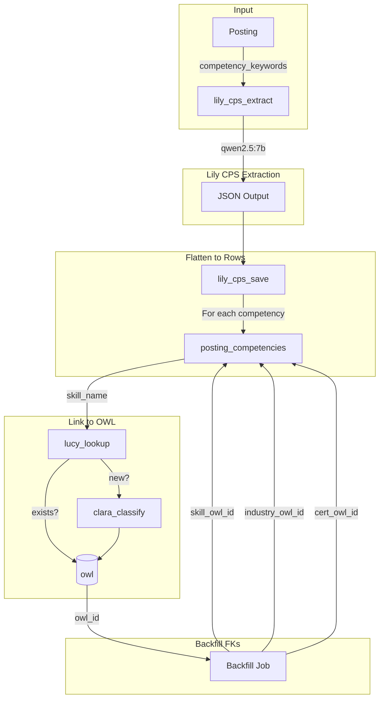
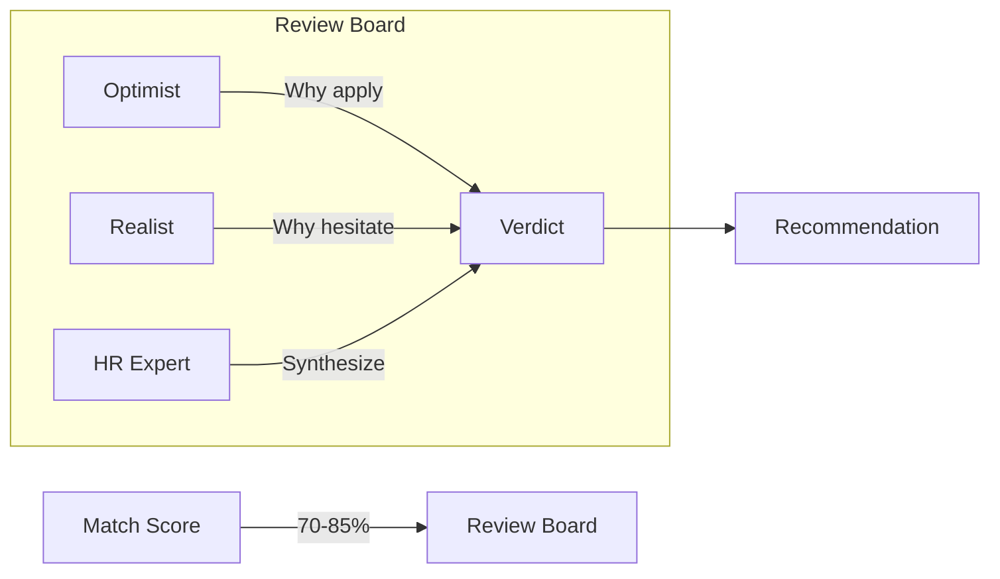

# Lily CPS Extraction Flow

## Overview

Lily extracts the Competency Proof Stack (CPS) from job posting requirements. Her output feeds the matching engine that connects job seekers to opportunities.

## Mermaid Diagram



## Data Flow

```
Posting: "5+ years Python in fintech, AWS preferred"
                    ↓
            [Lily CPS Extract]
                    ↓
┌─────────────────────────────────────────────────────┐
│ JSON Output:                                        │
│ {                                                   │
│   "domain": "fintech",                              │
│   "seniority": null,                                │
│   "experienceSetting": null,                        │
│   "experienceRole": null,                           │
│   "skillset": [                                     │
│     { "skill_name": "python",                       │
│       "experience_years": 5,                        │
│       "importance": "required" },                   │
│     { "skill_name": "aws",                          │
│       "certificate": "AWS",                         │
│       "importance": "preferred" }                   │
│   ],                                                │
│   "confidence": 0.92                                │
│ }                                                   │
└─────────────────────────────────────────────────────┘
                    ↓
            [lily_cps_save]
                    ↓
┌─────────────────────────────────────────────────────┐
│ posting_competencies (2 rows):                      │
│                                                     │
│ Row 1:                                              │
│   skill_name: "python"                              │
│   experience_years: 5                               │
│   industry_domain: "fintech"                        │
│   importance: "required"                            │
│   confidence: 0.92                                  │
│                                                     │
│ Row 2:                                              │
│   skill_name: "aws"                                 │
│   certificate: "AWS"                                │
│   industry_domain: "fintech"                        │
│   importance: "preferred"                           │
│   confidence: 0.92                                  │
└─────────────────────────────────────────────────────┘
                    ↓
            [Lucy Lookup]
                    ↓
        "python" → owl.skill → owl_id=12345
        "aws" → owl.skill → owl_id=12346
                    ↓
            [Backfill FKs]
                    ↓
        posting_competencies.skill_owl_id = 12345, 12346
```

## Task Type Chain

| Step | Task Type | Actor | Trigger |
|------|-----------|-------|---------|
| 1 | lily_cps_extract | qwen2.5:7b | posting.competency_keywords IS NOT NULL AND cps_extracted_at IS NULL |
| 2 | lily_cps_save | script | lily_cps_extract completed |
| 3 | lucy_lookup | script | posting_competency.skill_owl_id IS NULL |
| 4 | clara_classify | qwen2.5:7b | skill not found in owl |
| 5 | backfill_owl_fks | script | Nightly cron |

## Review Board Integration

After matching scores are calculated, borderline cases go to the Review Board:



The Review Board uses:
- Skill hierarchy proximity (from owl)
- Experience overlap (years, setting, role)
- Track record text (human judgment)
- Seniority context docs (from owl)

## Files

- Actor: `core/wave_runner/actors/lily_cps_extract.py` (to be created)
- Instruction: `instructions.instruction_id` (see migration)
- Schema: `migrations/20260108_cps_schema.sql`
- Templates: `data/owl_templates/`
