# 08: The Daemon — Pipeline Orchestration

*How actors find work and hand off to each other*

---

## The Problem

We have 8+ actors (Lucy, Alma, Carl, Clara A, Clara B, Arbitrator, Commit, Samantha). Each is a sovereign script. But:

1. **Who runs them?** — Can't rely on humans to babysit
2. **When?** — Each actor needs work before it can run
3. **In what order?** — Pipeline has dependencies

The naive solution: central coordinator that knows the graph, schedules tasks, manages queues.

**That's socialism.** Requires omniscience. Breaks when the graph changes.

---

## The Pull Model

Each actor declares what work looks like. The daemon just executes.

### The Contract

Every actor registers in `task_types` with:

```sql
INSERT INTO task_types (task_type_name, work_query, script_path, requires_model)
VALUES (
  'clara_a',                                    -- name
  'SELECT owl_id FROM owl WHERE status=....',  -- what work looks like
  'thick_actors/owl__classify_U__clara_a.py',  -- what to run
  'mistral-nemo:12b'                           -- GPU resource needed
);
```

### The Flow

```
┌─────────────────────────────────────────────────────────────────────┐
│                         Pull Daemon                                  │
│                                                                      │
│   ┌──────────┐     ┌──────────┐     ┌──────────┐     ┌──────────┐  │
│   │ Lucy     │     │ Alma     │     │ Clara A  │     │ Clara B  │  │
│   │ work_q   │     │ work_q   │     │ work_q   │     │ work_q   │  │
│   └────┬─────┘     └────┬─────┘     └────┬─────┘     └────┬─────┘  │
│        │                │                │                │         │
│        ▼                ▼                ▼                ▼         │
│   ┌──────────────────────────────────────────────────────────────┐ │
│   │                    work_query executor                        │ │
│   │  "Any subjects?" → "Yes, 50 pending" → Execute actor         │ │
│   └──────────────────────────────────────────────────────────────┘ │
└─────────────────────────────────────────────────────────────────────┘
```

### Status as Price Signal

The magic: **status columns are the coordination mechanism**.

```
Lucy writes:     status = 'lucy_passed'      ← Lucy's outbox
Alma reads:      WHERE status = 'lucy_passed' ← Alma's inbox
Alma writes:     status = 'alma_passed'      ← Alma's outbox
Carl reads:      WHERE status = 'alma_passed' ← Carl's inbox
```

No coordinator decides "Alma runs after Lucy." Alma's work_query naturally finds Lucy's output. Market coordination.

---

## Current Implementation

### File: `core/pull_daemon.py`

```
Usage:
  pull_daemon.py                      # Run all pull-enabled task_types
  pull_daemon.py --task_type 9364     # Run only Clara A
  pull_daemon.py --limit 100          # Process at most 100 items
```

### The Lock Problem 🔴

The daemon enforces single-instance with file + DB advisory locks:

```python
LOCK_FILE = PROJECT_ROOT / '.pull_daemon.lock'
fcntl.flock(lock_file, LOCK_EX | LOCK_NB)  # Exclusive, non-blocking
```

**Why:** Directive #7 says "batch by model for GPU efficiency." Don't want two daemons competing for the same GPU.

**Problem:** This prevents parallel execution of actors that use DIFFERENT models:
- Clara A: mistral-nemo:12b
- Clara B: qwen2.5-coder:7b

These COULD run in parallel, but the global lock prevents it.

### What Happened Jan 20-21

```
22:36 - Started: turing-daemon start --task_type 9364  (Clara A only)
01:59 - Clara A finished all 4,144 entities
01:59-05:03 - Daemon idled (pending=0, no other task_types enabled)
05:03 - Manual stop

⏱️ 3 hours wasted polling an empty queue
```

**Root cause:** `--task_type 9364` restricted daemon to ONLY Clara A. When Clara A finished, it didn't switch to Clara B (9365).

---

## Pipeline Stages

### OWL Pipeline (current)

| Stage | Actor | Task Type | Inbox (work_query) | Outbox (status) | Model |
|-------|-------|-----------|-------------------|-----------------|-------|
| 1 | Lucy | 9388 | `pending` | `lucy_passed` | — |
| 2 | Alma | 9389 | `lucy_passed` | `alma_passed` / `merged` | mistral-nemo |
| 3 | Carl | 9390 | `alma_passed` | `created` | — |
| 4a | Clara A | 9364 | `_needs_review` | proposal | mistral-nemo |
| 4b | Clara B | 9365 | `_needs_review` | proposal | qwen2.5-coder |
| 5 | Arbitrator | 9397 | `disagreement` | resolved | gemma2 |
| 6 | Commit | 9398 | `resolved` | classified | — |

### Parallel Opportunities

Clara A and Clara B are independent — they read the same `_needs_review` entities but write to separate proposal rows. They SHOULD run in parallel.

**Current:** Sequential (forced by daemon lock)
**Ideal:** Parallel (different models, no GPU contention)

---

## Diagrams

### Pipeline Flow

```mermaid
flowchart LR
    subgraph DAEMON["🔄 Pull Daemon"]
        direction TB
        POLL[Poll Loop]
        EXEC[Execute Actor]
    end

    subgraph INBOX["📥 Inboxes (work_query)"]
        WQ1["pending"]
        WQ2["lucy_passed"]  
        WQ3["alma_passed"]
        WQ4["_needs_review"]
    end

    subgraph ACTORS["🎭 Actors"]
        Lucy --> WQ1
        Alma --> WQ2
        Carl --> WQ3
        Clara --> WQ4
    end

    subgraph OUTBOX["📤 Outboxes (status)"]
        Lucy -->|writes| WQ2
        Alma -->|writes| WQ3
        Carl -->|writes| WQ4
    end

    POLL --> INBOX
    INBOX --> EXEC
    EXEC --> ACTORS
```



### The Lock Bottleneck


**Total:** 12+ hours sequential when it could be ~6 hours parallel.

---

## Proposed Fixes

### Option 1: Per-Model Locking

```python
# Instead of global lock:
LOCK_FILE = PROJECT_ROOT / '.pull_daemon.lock'

# Per-model locks:
def get_lock_file(model: str) -> Path:
    safe_model = model.replace(':', '_').replace('/', '_')
    return PROJECT_ROOT / f'.pull_daemon.{safe_model}.lock'
```

Allows parallel execution when models differ.

### Option 2: Pipeline Mode

```bash
# Run full OWL pipeline (stages 1-6)
turing-daemon start --pipeline owl

# Daemon knows the sequence, runs each stage until done, then next
```

### Option 3: Explicit Inbox/Outbox in task_types

```sql
ALTER TABLE task_types ADD COLUMN inbox_status TEXT;
ALTER TABLE task_types ADD COLUMN outbox_status TEXT;
```

Then daemon can auto-chain: when Lucy's outbox fills, start Alma.

---

## Best Practices

1. **Don't run daemon with --task_type for overnight jobs** — it won't switch actors
2. **Check daemon status periodically** — `turing daemon status`
3. **Run parallel Claras manually** if needed:
   ```bash
   nohup python3 thick_actors/owl__classify_U__clara_a.py --batch 5000 &
   nohup python3 thick_actors/owl__classify_U__clara_b.py --batch 5000 &
   ```

---

## Related Documentation

- [Turing_project_directives.md](../Turing_project_directives.md) - Directive #7 (model batching)
- [tools/turing/README.md](../../tools/turing/README.md) - turing-daemon CLI
- [00_competency_keepers.md](00_competency_keepers.md) - All actors overview

---

*The daemon executes. The actors decide. Status coordinates.*
