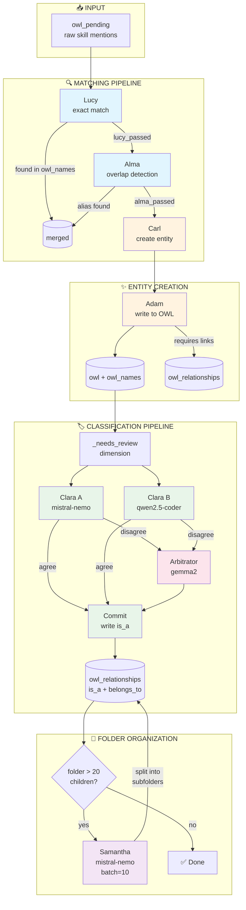

# OWL Stories: The Competency Keepers

*Specifications through narrative*

---

## The Cast

The **Competency Keepers** are the actors who transform raw skill mentions from job postings into a structured, queryable taxonomy. Each has a distinct role in the pipeline.

| Keeper | Type | Model | Role |
|--------|------|-------|------|
| **Lucy** | Script | — | Exact match lookup in owl_names |
| **Alma** | Script+LLM | mistral-nemo:12b | Fuzzy/overlap matching |
| **Carl** | Script | — | Entity creation, calls Adam |
| **Adam** | Script | — | The Scribe - writes to OWL tables |
| **Clara A** | LLM | mistral-nemo:12b | First classifier |
| **Clara B** | LLM | qwen2.5-coder:7b | Second classifier |
| **Arbitrator** | LLM | gemma2:latest | Resolves disagreements |
| **Commit** | Script | — | Writes classification to OWL |
| **Vera** | Script | — | Folder name format validator |
| **Victor** | LLM | gemma2:latest | Folder substance reviewer |
| **Samantha** | LLM | mistral-nemo:12b | Splits oversized folders (>20 children) |

---

## Reading Order

### Part 1: The Overview
1. [**00_competency_keepers.md**](00_competency_keepers.md) — The big picture, all actors introduced

### Part 2: Entity Creation Pipeline
*owl_pending → owl*

2. [**01_lucy.md**](01_lucy.md) — Exact match (not yet split from Alma)
3. [**02_alma.md**](02_alma.md) — Overlap detection, alias vs create decision
4. [**03_carl.md**](03_carl.md) — Entity creation, wiring to Adam

### Part 3: Classification Pipeline  
*owl (_needs_review) → owl_relationships (classified)*

5. [**04_clara.md**](04_clara.md) — The dual-grader pattern (Clara A + Clara B)
6. [**05_arbitrator.md**](05_arbitrator.md) — Resolving disagreements (in clara.md)
7. [**06_commit.md**](06_commit.md) — Writing final classification (in clara.md)

### Part 4: Folder Management
*When new categories are needed*

8. [**07_vera_victor_adam.md**](07_vera_victor_adam.md) — Folder creation pipeline (in alma.md)

### Part 5: Orchestration
*How actors find work and coordinate*

9. [**08_daemon.md**](08_daemon.md) — The Pull Daemon, status-based routing, pipeline execution

---

## Pipeline Diagram

### Pipeline Summary

| Stage | Actor(s) | Input | Output | Model |
|-------|----------|-------|--------|-------|
| 1. Match | Lucy | owl_pending | merged OR lucy_passed | — |
| 2. Overlap | Alma | lucy_passed | alias OR alma_passed + requires | mistral-nemo |
| 3. Create | Carl → Adam | alma_passed | owl entity + names | — |
| 4. Classify | Clara A + B | _needs_review | proposals | mistral-nemo + qwen |
| 5. Arbitrate | Arbitrator | disagreements | final pick | gemma2 |
| 6. Commit | Commit | proposals | is_a relationships | — |
| 7. Organize | Samantha | folders > 20 | split subfolders | mistral-nemo |

---

## Key Design Decisions

### Why dual-grader Clara?
Two different models (mistral-nemo + qwen) reduce hallucination risk. If they agree, high confidence. If they disagree, Arbitrator (gemma2) breaks the tie.

### Why no folders under skill_dimensions?
Skills go DIRECTLY under the 11 dimensions. Victor enforces this. Rationale: flat structure is easier to query, and prevents "quantum_computing" folders from swallowing unrelated skills.

**📍 Detailed Rules:** See [Folder Creation Rules](../alma_story.md#-folder-creation-rules) in alma_story.md.

### Why Lucy before Alma?
Lucy is O(1) exact match. Alma is O(n) with LLM calls. Most skills are repeats → Lucy catches 80%+ cheaply.

---

## Current Status

| File | Status | Notes |
|------|--------|-------|
| 00_competency_keepers.md | ✅ Exists | `competency_keepers_story.md` |
| 01_lucy.md | 📝 In alma | Needs extraction |
| 02_alma.md | ✅ Exists | `alma_story.md` |
| 03_carl.md | ✅ Exists | `carl_story.md` |
| 04_clara.md | ✅ Exists | `clara_story.md` |
| 05-07 | 📝 In other files | Could be extracted |

---

*The stories are the specs. If the code doesn't match the story, fix one of them.*
