# Lily/Sage Cross-Model QA Pattern

*Reference for Directive #25*

## The Pattern

For critical AI extractions, use two models: one extracts, one grades.

```mermaid
flowchart TD
    A[Posting] --> B[🌸 Lily Extract]
    B --> C{Valid JSON?}
    C -->|No| Z[❌ Fail]
    C -->|Yes| D[🌿 Sage Grade]
    D --> E{Contradiction?}
    E -->|Yes| F[Sage Retry]
    F --> D
    E -->|No| G{Pass?}
    G -->|Yes| H[✅ Save]
    G -->|No| I{Attempts < 3?}
    I -->|No| J[⚠️ Flag]
    I -->|Yes| K[🔄 Retry with Feedback]
    K --> D
```

## Model Assignments

| Role | Model | Why |
|------|-------|-----|
| Lily (extractor) | qwen2.5-coder:7b | Better at structured output |
| Sage (grader) | qwen2.5:7b | Better at reasoning about correctness |

## Why Cross-Model Works

| Combination | Result |
|-------------|--------|
| Model grades itself | ❌ Too strict OR too lenient |
| Model A extracts, Model B grades | ✅ Catches different errors |

Self-grading fails because models have blind spots to their own patterns.

## Sage's Grading Rules

1. **Must quote source** for any "missing" skill claim
2. **Must explain** why "hallucinated" skills can't be inferred
3. **Self-check:** No skill in both missing AND hallucinated lists (contradiction)
4. **"Incomplete ≠ Wrong"** — Gaps OK, fabrications not OK

## Implementation

See `core/wave_runner/actors/lily_cps_extract.py` for the reference implementation.
