```mermaid
flowchart TD
    START([⏰ Midnight Trigger]) --> QUERY[Query postings<br/>not seen in last 3 fetches]
    QUERY --> CHECK{Any stale?}
    CHECK -->|No| DONE([✅ Done])
    CHECK -->|Yes| INVALIDATE[SET invalidated = TRUE<br/>reason = 'STALE_NOT_SEEN_3X']
    INVALIDATE --> DONE
```

```mermaid
flowchart TD
    START([🌐 Fetch]) --> SCRAPE[Scrape DB Careers]
    SCRAPE --> DUPE{Already exists?}
    DUPE -->|Yes| TOUCH[Update last_seen_at]
    DUPE -->|No| INSERT[INSERT new posting]
    TOUCH --> DONE([✅])
    INSERT --> DONE
```

```mermaid
flowchart LR
    C1["⚙️ Fetch Orphans<br/>batch_size=50"] --> C2["🤖 Classify Batch<br/>gemma3:4b"]
    C2 --> C3["⚙️ Apply Hierarchy"]
    C3 --> C4["⚙️ Rebalance Check"]
```

```mermaid
flowchart LR
    C1["🤖 Extract Summary<br/>gemma3:1b"] --> C2["🤖 Extract Skills<br/>qwen2.5:7b"]
    C2 --> C3["⚙️ Map to Taxonomy<br/>simple_skill_mapper.py"]
    C3 --> C4["⚙️ Save to DB"]
```

# Turing Pipeline Architecture

**Created:** 2026-01-15  
**Status:** DRAFT - Cleanup in progress

## Overview

The Turing system has **THREE main pipelines**, each with their own thick actors:

1. **Job Posting Pipeline** - Fetch, summarize, and score job postings
2. **Skill Taxonomy Pipeline** - Build and maintain skill hierarchy
3. **Profile Analysis Pipeline** - Extract skills from candidate profiles

---

## System Overview

```mermaid
flowchart TB
    subgraph JOBS["🌐 JOB POSTING PIPELINE"]
        direction LR
        J1[Fetch Postings] --> J2[Fetch Details]
        J2 --> J3[Create Summary]
        J3 --> J4[Create IHL Score]
    end
    
    subgraph TAXONOMY["🏗️ SKILL TAXONOMY PIPELINE"]
        direction LR
        T1[Skill Atomizer<br/>WF3008] --> T2[Skill Classifier<br/>WF2010]
        T2 --> T3[Hierarchy Builder<br/>WF3010/3011/3012]
    end
    
    subgraph PROFILES["👤 PROFILE ANALYSIS PIPELINE"]
        direction LR
        P1[Profile Import<br/>WF1126?] --> P2[Skill Extraction<br/>WF1122]
        P2 --> P3[Deep Analysis<br/>WF1125]
    end
    
    JOBS -.->|skills from postings| TAXONOMY
    PROFILES -.->|skills from profiles| TAXONOMY
    TAXONOMY -.->|matching| PROFILES
    
    style JOBS fill:#e1f5fe
    style TAXONOMY fill:#e8f5e9
    style PROFILES fill:#fff3e0
```

---

## Thick Actor Pattern (All Actors Follow This)

---

# 🌐 JOB POSTING PIPELINE

## J1. Midnight Runner

**Purpose:** Invalidate stale postings no longer on the website  
**Actor:** TBD (cron script)  
**Task Type:** TBD

---

## J2. Fetch DB Postings

**Purpose:** Scrape job listings from Deutsche Bank careers website  
**Actor:** `core/wave_runner/actors/db_job_fetcher.py`  
**Task Type:** TBD

---

## J3. Fetch Job Details

**Purpose:** Load full job description  
**Actor:** `core/wave_runner/actors/db_job_fetcher.py` (second pass)  
**Task Type:** TBD

---

## J4. Create Summary (thick_actors/summary_extract.py)

**Purpose:** Extract structured summary from verbose job description  
**Actor:** `thick_actors/summary_extract.py`  
**Task Type:** `3335`

```mermaid
flowchart TD
    PRE{job_description<br/>> 100 chars?} -->|No| SKIP[SKIP: NO_DESCRIPTION]
    PRE -->|Yes| LLM[🤖 qwen2.5-coder:7b]
    LLM --> QA1{Word overlap > 50%?}
    QA1 -->|No| RETRY{Retry?}
    RETRY -->|Yes| LLM
    RETRY -->|No| WARN1[⚠️ HALLUCINATION]
    QA1 -->|Yes| QA2{Bad data patterns?}
    QA2 -->|Yes| WARN2[⚠️ BAD_INPUT_DATA]
    QA2 -->|No| SAVE[✅ Save]
```

---

## J5. Create IHL Score

**Purpose:** Predict if job is internal hire (process compliance posting)  
**Actor:** TBD (new thick actor)  
**Task Type:** TBD

---

# 🏗️ SKILL TAXONOMY PIPELINE

## T1. WF3008 - Skill Atomizer

**Purpose:** Split compound skill descriptions into individual atomic skills  
**Status:** ✅ KEEP  
**Conversations:** 3

```mermaid
flowchart LR
    C1["⚙️ Fetch Compound<br/>wf3008_fetch_compound"] --> C2["🤖 Split Compound<br/>gemma3:4b"]
    C2 --> C3["⚙️ Save Atomized<br/>wf3008_save_atomized"]
```

**Example:**
- Input: `"Knowledge with Agile techniques: User Stories, ATDD, BDD"`
- Output: `agile`, `user_stories`, `atdd`, `bdd`

---

## T2. WF2010 - Unified Skill Taxonomy (Dual Classifier)

**Purpose:** Classify skills into taxonomy with dual-classifier + arbitration  
**Status:** ✅ KEEP (primary classifier)  
**Conversations:** 10

```mermaid
flowchart TD
    C1["⚙️ Lookup<br/>Already classified?"] -->|No| C2["⚙️ Create Entity"]
    C2 --> C3a["🤖 Classify A<br/>mistral-nemo:12b"]
    C3a --> C3b["🤖 Classify B<br/>qwen2.5:7b"]
    C3b --> C6{Compare}
    
    C6 -->|Match| C9["⚙️ Apply"]
    C6 -->|Disagree| C7["🤖 Arbitrate<br/>gemma3:4b"]
    C6 -->|New folder| C8["⚙️ Victor Review"]
    
    C7 --> C6b["⚙️ Resolve"]
    C6b --> C9
    C8 -->|Approve| C9
    C8 -->|Retry| C3a
    
    C9 --> C10["⚙️ Report"]
```

**Key Features:**
- Two independent classifiers (A/B) for reliability
- Arbitrator breaks ties
- Victor reviews new folder proposals

---

## T3. Hierarchy Builders (POTENTIAL DUPLICATES)

These three workflows all do hierarchy classification but differently:

### WF3010 - Hierarchy Builder (Batch)

**Purpose:** Batch assign orphan entities to groups  
**Status:** ⚠️ REVIEW - Overlaps with WF3011?  
**Conversations:** 4

---

### WF3011 - Conversational Hierarchy Classifier (Interactive)

**Purpose:** Interactive navigation through hierarchy for single skill  
**Status:** ⚠️ REVIEW - Overlaps with WF3010/WF2010?  
**Conversations:** 5

```mermaid
flowchart TD
    C1["⚙️ Fetch Orphan"] --> C2["🤖 Navigate<br/>qwen2.5:7b"]
    C2 -->|Letter| C3["⚙️ Update State"]
    C3 --> C2
    C2 -->|#here| C5["⚙️ Apply"]
    C2 -->|#create| C4["⚙️ Create Group"]
    C4 --> C5
```

**Interactive Loop:** LLM navigates folder tree by selecting letters

---

### WF3012 - Group Hierarchy Classifier

**Purpose:** Classify skill_groups (not atomics) into parent groups  
**Status:** ✅ KEEP (different entity type)  
**Conversations:** 4

---

# 👤 PROFILE ANALYSIS PIPELINE

## P1. WF1122 - Profile Skill Extraction

**Purpose:** Extract skills from candidate profile/CV  
**Status:** ✅ KEEP  
**Conversations:** 4

---

## P2. WF1125 - Profile Career Deep Analysis

**Purpose:** Deep career analysis with multiple expert personas  
**Status:** ⚠️ REVIEW - Overlaps with WF1122?  
**Conversations:** 8

```mermaid
flowchart TD
    subgraph PARALLEL["Parallel Expert Extraction"]
        E1["🤖 Tech Skills<br/>mistral"]
        E2["🤖 Domain Expert<br/>qwen2.5:7b"]
        E3["🤖 Leadership<br/>mistral"]
        E4["🤖 Creative<br/>mistral"]
        E5["🤖 Business<br/>mistral"]
    end
    
    E1 --> R["🤖 Tech Review<br/>qwen2.5:7b"]
    R --> SYNTH["🤖 Synthesizer<br/>qwen2.5:7b"]
    E2 --> SYNTH
    E3 --> SYNTH
    E4 --> SYNTH
    E5 --> SYNTH
    
    SYNTH --> SAVE["⚙️ Save Skills"]
```

**5 Expert Personas:**
1. Technical Skills Extractor (tools/software)
2. Domain Expert (functional disciplines)
3. Leadership Coach (soft skills)
4. Creative Director (media skills)
5. Business Analyst (quantified achievements)

---

# Data Model

---

# Cleanup Analysis

## Workflows to KEEP

| WF ID | Name | Pipeline | Notes |
|-------|------|----------|-------|
| 3335 | summary_extract | Job Posting | ✅ Active thick actor |
| 3008 | Skill Atomizer | Taxonomy | ✅ Unique function |
| 2010 | Unified Skill Taxonomy | Taxonomy | ✅ Primary classifier |
| 3012 | Group Hierarchy Classifier | Taxonomy | ✅ Different entity type |
| 1122 | Profile Skill Extraction | Profile | ✅ Core extraction |

## Workflows to REVIEW (Potential Duplicates)

| WF ID | Name | Overlaps With | Decision Needed |
|-------|------|---------------|-----------------|
| 3010 | Hierarchy Builder (Batch) | WF2010, WF3011 | Batch vs single - keep both? |
| 3011 | Conversational Hierarchy Classifier | WF2010, WF3010 | Interactive nav - unique? |
| 1125 | Profile Career Deep Analysis | WF1122 | 8 experts vs 4 - overkill? |

## Questions

1. **WF3010 vs WF3011 vs WF2010** - Three ways to classify skills:
   - WF2010: Dual classifier + arbitration (robust but complex)
   - WF3010: Batch LLM (fast but less accurate?)
   - WF3011: Interactive navigation (human-like but slow)
   - **Recommendation:** Keep WF2010 as primary, deprecate 3010/3011?

2. **WF1122 vs WF1125** - Two ways to analyze profiles:
   - WF1122: 4 steps, clean pipeline
   - WF1125: 8 steps, 5 expert personas (more thorough but expensive)
   - **Recommendation:** Keep both? WF1122 for quick, WF1125 for deep?

---

# Next Steps

1. [ ] **Audit task_types table** - Match to this doc
2. [ ] **Decide on duplicates** - WF3010/3011/2010 overlap
3. [ ] **Create missing actors:**
   - [ ] Midnight Runner
   - [ ] IHL Score actor
4. [ ] **Standardize all to thick actor pattern**
5. [ ] **Add QA validation to all workflows**
