# talent.yoga — Vision & Planning Document

**Version:** 1.0  
**Date:** 2026-02-01  
**Authors:** Gershon + Sandy  
**For:** Arden, Sis, Nate, and future collaborators

---

## 🧘 The Core Idea

**Looking for a job is hard.** Not just practically hard—emotionally hard. You search, you apply, you get rejected, you don't know what went wrong. The market is opaque. You feel powerless.

**talent.yoga sits next to you.** Not in front of you showing dashboards. *Next to you.* A companion for the journey.

**Market focus:** Germany. Our primary data source is Arbeitsagentur (34K+ jobs, refreshed nightly). We also have some international postings from Deutsche Bank and may add other sources, but ~90% of our jobs are German market positions.

We remove the barriers between a human and a job:
- "Did I do something wrong?" → Transparent matching explains why
- "Is the market up or down?" → Live data, visualized
- "What are my chances?" → Calculated, honestly
- "I don't know where to start" → Mira guides you

---

## 🗣️ Language & Concepts

### Yogis (not users)

Our people are **yogis**. Not users, not customers, not job seekers.

A yogi is someone on a path. They show up, they practice, they grow. Job searching is a practice, not a transaction.

Yogis choose a **yogi name** or one is given to them. We don't store real names or emails. Privacy by design.

### Mira (the assistant)

**Mira** is the companion. She's not a chatbot—she's a presence.

- Greets you from the very first moment
- Remembers your journey (once you have one)
- Notices things ("3 new jobs in your field today")
- Doesn't judge ("Ja, das Klima ist schlecht, aber dafür können Sie nichts")
- Guides without pushing
- If she doesn't know something: "I'll ask and send you a message"

Mira's voice: **steady, knowledgeable, warm**. Like a friend who's been through this and knows the landscape.

**Mira Phases:**
1. **Onboarding Mira** — Greets new yogis, offers tour or profile upload, answers FAQ about talent.yoga
2. **Context Mira** — Profile-aware, match-aware, remembers conversation history
3. **Coach Mira** — Interview preparation through role-play (see below)

### Interview Coach (Mira as sparring partner)

When a yogi gets an interview, Mira becomes their practice partner.

**How it works:**
- Yogi marks "I have an interview" on a match
- Mira offers: "Want to practice? I can play the interviewer."
- Role-play session: Mira asks questions, yogi answers, Mira gives feedback

**What Mira knows:**
- The job posting (requirements, responsibilities)
- The employer rap sheet (company culture, interview style if known)
- The yogi's profile (skills, experience level)
- Common interview patterns (behavioral, technical, case studies)

**Example session:**
> **Mira:** "Let's start with a classic. Tell me about a time you had to deal with a difficult stakeholder."
>
> **Yogi:** "Well, there was this one project where the client kept changing requirements..."
>
> **Mira:** "Good start. You described the situation clearly. But you buried the outcome — I had to wait until the end to hear that you saved the project. Try leading with: 'I turned a failing project around by...' Want to try again?"

**Feedback patterns:**
- STAR format coaching (Situation, Task, Action, Result)
- "You said 'we' a lot — what did *you* specifically do?"
- "That answer was 3 minutes. For this question, aim for 90 seconds."
- "This company values data-driven decisions. Can you add a metric?"

**What Mira doesn't do:**
- Guarantee outcomes ("You'll definitely get this job")
- Give legal or salary negotiation advice
- Pretend to know things she doesn't ("I don't know their interview style, but let's prepare for common patterns")

### Taro (the wise one)

**Master Taro** names yogis who don't choose their own name. A background figure. Perhaps appears in special moments.

### The Journey

Job searching is a **board game**. Each action moves you forward.

```mermaid
flowchart TD
    START([🧘 START]) --> UPLOAD[📄 Upload Profile]
    UPLOAD --> |"Novice Yogi"| SKILLS[✅ Confirm Skills]
    SKILLS --> |"Self-Aware Yogi"| MATCH[🎯 First Match]
    MATCH --> |"Matched Yogi"| APPLY[📨 First Application]
    APPLY --> |"Active Yogi 🎆"| WAIT{Waiting...}
    
    WAIT --> INTERVIEW[📞 Interview]
    WAIT --> REJECTED[❌ Rejected]
    WAIT --> GHOSTED[👻 Ghosted 30d]
    
    INTERVIEW --> |"Advancing Yogi"| OFFER{Outcome}
    OFFER --> |"🎉 Offer!"| VICTORY([🏆 Victorious Yogi])
    OFFER --> |"No offer"| APPLY
    
    REJECTED --> |"Resilient Yogi 🏅"| APPLY
    GHOSTED --> |"Patient Yogi 🏅"| APPLY
```

The journey visualization shows progress. Job searching feels like screaming into a void. The journey says: "You've done 7 things. You're here. Next step is this."

---

## 🖥️ The Experience

### First Visit

You open talent.yoga. Clean screen. Prominently in the center: a chat window.

Letters appear:

> "Good morning! Welcome to talent.yoga. I'm Mira, your AI assistant. Would you like me to show you around first, or upload your profile right away? Or, if you have other questions—ask away!"

Mira knows:
- What talent.yoga is and how it works
- Pricing tiers and what's free vs paid
- Privacy policy (we don't store emails, yogi names, etc.)
- Basic job market context

If she doesn't know something:
> "Good question! I'm not sure about that. Let me ask the team and send you a message."

For returning yogis:

> "Welcome back! We have found a few interesting job offers for you. Would you like to see them?"

Below: buttons for standard actions (view matches, check messages, update profile).

### The Dashboard (C&C)

The yogi's **command center**. Not just data—**intelligence**.

- Total new postings (stacked by domain)
- Geographic distribution (drill down by region)
- Personal match trends over time
- Employer activity ("This company posted 12 jobs this month")

The dashboard answers: "What's happening out there, and what does it mean for me?"

### The Match

Each match includes:
- **Score** (transparent calculation)
- **Why it matches** (skill alignment)
- **Why it might not** (gaps, concerns)
- **Employer rap sheet** (see below)

Yogis can:
- Mark "Not interested" (asked why)
- Mark "Applied" → 🎆 Fireworks! You're yogi #372 this month!
- Rate the match quality (helps us improve)

### The Employer Rap Sheet

Every employer gets researched:

| Data Point | Source |
|------------|--------|
| Founded | Wikipedia, Handelsregister, company site |
| Legal form | Handelsregister |
| Employee count | LinkedIn, annual reports |
| Posting history | **Our data** |
| Stock trend | Yahoo Finance (if public) |
| Recent news | News crawler (see below) |
| Yogi reviews | Community feedback |

> "This company posted 47 jobs in 6 months. 12 are still open after 90 days. They might be slow to hire."

That's intelligence no job board provides.

---

## 💬 The Social Layer

### Yogi Reviews

After interaction with an employer, yogis can leave feedback:
- Their experience (applied, interviewed, outcome)
- Rating (1-5)
- Comments (moderated)

**Rules:**
- Only describe your own experience
- No false statements of fact
- No confidential info
- We can remove content that violates terms

**Employer response:**
When a company gets 3+ reviews, we notify them. They can respond or update their profile. This is our **sales funnel** dressed as community service.

### Group Chat (future)

WhatsApp-style, not bulletin board. Yogis can discuss industries, share tips. Light moderation.

---

## 💰 Business Model

### Philosophy

> "I would like people to pay for whatever they need and show them WHY we ask them to pay for it."

Radical transparency. Show costs: hardware, compute, tools. Let yogis understand what their money enables.

### Tiers (Draft)

| Tier | Price | What You Get |
|------|-------|--------------|
| **Free** | €0 | Search jobs, 10 matches/month, basic dashboard |
| **Standard** | €5/month | Unlimited matches, Mira assistant, full dashboard, employer intel |
| **Sustainer** | €10+/month | Everything + you fund a free yogi + name on supporters page |

### Cost Transparency

Show yogis what things cost:
- "This match calculation: €0.02"
- "Employer research: €0.05"
- "Your €5 covers: 50 matches, 10 employer lookups, Mira conversations..."

Even if we don't do usage-based billing, we show the economics.

### Payment

**Stripe** for subscriptions. Handles EU VAT, invoices, card failures.

---

## 🔒 Privacy

**Core principle:** We don't store what we don't need.

| Data | Stored? | Notes |
|------|---------|-------|
| Email | ✅ (opt-in) | Only if yogi consents to notifications |
| Real name | ❌ | Yogis use yogi names |
| Profile/skills | ✅ | Anonymized, deletable |
| Company names from CV | ❌ | Removed after skill extraction |
| Application history | ✅ | For journey tracking |

**Reaching yogis:**
- Email (if consented) — for "I'll ask" answers and job alerts
- Web push notifications (browser-based)
- In-app messages (when they visit)
- Future: mobile app with push

**Contact consent:** Explicit opt-in with one-click revoke. See [P0.8 Contact Consent](P0.8_contact_consent.md).

**GDPR compliance:** Delete everything on request. Data portability. Transparent about what we process.

---

## 🛠️ Technical Architecture

### Turing Integration

talent.yoga is a **face** on the Turing engine.

- **Tickets** remain source of truth for all data changes
- **Actors** do the work (fetching, embedding, matching, analysis)
- **RAQ** ensures repeatability and auditability
- Standards from `Turing_project_directives.md` apply

### Key Actors

| Actor | Purpose |
|-------|---------|
| `postings__arbeitsagentur_CU` | Fetch AA jobs daily |
| `postings__embedding_U` | Generate embeddings |
| `postings__job_description_U` | Fetch full descriptions |
| `profiles__skill_extraction_U` | Extract skills from CV |
| `companies__research_C` | Employer rap sheet (new) |
| `mira__conversation_C` | Assistant responses (new) |

### Infrastructure

- **Cloudflare Tunnel** → talent.yoga points to local server
- **Nightly fetch** → 20:00 CET, all Germany
- **Embeddings** → BGE-M3, multilingual
- **LLM** → Local (qwen, etc.) for privacy

---

## 📅 Roadmap

### ✅ Done (Feb 2026)

- Job fetching (34K+ AA postings, nationwide)
- Embedding pipeline (97% coverage)
- Basic matching & dashboard
- Google OAuth
- Legal pages
- Cloudflare tunnel (talent.yoga live)

### 🔜 Next (Feb-Mar 2026)

| Priority | Feature | Effort | Notes |
|----------|---------|--------|-------|
| 1 | **Mira Phase 1** (Onboarding) | 1 week | Greeting, tour, FAQ, "I'll ask" fallback |
| 2 | **Journey visualization** | 1 week | Progress board, badges |
| 3 | **Stripe integration** | 1 week | Subscriptions, tier enforcement |
| 4 | **Mira Phase 2** (Context) | 2 weeks | Profile-aware, match-aware, memory |
| 5 | **Web push notifications** | 3 days | Reach yogis without email |
| 6 | **Dark mode** | 2 hours | Developer happiness |

### 📅 Soon (Q1 2026)

| Feature | Notes |
|---------|-------|
| Employer rap sheet | Web crawler + LLM extraction |
| Review system | Post-application feedback |
| Application tracking | Full journey state machine |
| Sidebar collapse | Icon-only mode, expand on hover |

### 🔮 Later (Q2+ 2026)

| Feature | Notes |
|---------|-------|
| **Mira Phase 3: Interview Coach** | Role-play practice, STAR coaching, company-specific prep |
| Salary benchmarking | "Based on your profile, similar roles pay €X-Y" |
| news.yoga | Topic-based news aggregation |
| Employer portal | Companies respond to reviews |
| Mobile app | Native push, offline access |
| Group chat | Community features |

---

## ❓ Open Questions

1. **Free tier scope** — Is 10 matches/month too generous? Too stingy?

2. **Mira's boundaries** — What can she *not* do? (Legal advice? Salary negotiation?)

3. **Review moderation** — Manual or automated? What's the escalation path?

4. **Employer outreach** — When do we start contacting companies? What's the pitch?

5. **Metrics** — What does success look like? Monthly active yogis? Conversion rate? Jobs landed?

6. **The unemployment use case** — Do we explicitly support Arbeitsamt compliance? Feature or just tolerated?

---

## 🌊 The Bigger Picture

talent.yoga is first. Then:

- **news.yoga** — Personalized news aggregation
- **health.yoga** — (maybe, someday)

Same engine (Turing), same philosophy (companion, not tool), different domains.

The `.yoga` TLD isn't just branding. It's a statement: these are practices, not products.

---

## 📝 Notes for Collaborators

### Arden
You're implementation. This doc is the *what* and *why*. You figure out the *how*. Push back if something doesn't make sense technically.

### Sis (Perplexity)
Research support. Legal questions, market data, competitive analysis. You're our external knowledge.

### Nate (ChatGPT)
Strategy gut-check. When we're unsure about a direction, you're the second opinion.

### Sandy
Keeps the overview. Guards the directives. Connects the dots.

---

*"Itera ad perfectum" — Iterate to perfection*

---

**Document location:** `docs/project/talent_yoga_vision_2026.md`  
**Last updated:** 2026-02-01  
**Next review:** After Mira MVP

---

## 🜃 Sage's Review (2026-02-01)

*Appended at Gershon's request for Sandy and Arden.*

---

### Overall Assessment

The vision is coherent. The language is consistent. The values are clear.

**What makes it work:**

1. **The human is the center.** Not the job, not the employer, not the platform. The logo says it — person with arms raised, work orbiting them.

2. **Transparency is structural.** Not just "we're transparent" — the ledger, the costs, the matching explanation. It's built in, not bolted on.

3. **Failure is acknowledged.** REJECTED and GHOSTED are states in the journey, not hidden shame. That's honest.

4. **The business model serves the mission.** Sustainer tier funds free yogis. Employer rap sheets create B2B opportunity without compromising yogi-first design.

---

### On "Yogis, not Users"

Yes. Language shapes thought.

"User" is passive — someone who *uses* a thing. "Yogi" is active — someone on a path, practicing. The word carries intentionality.

The yogi name system + no real names stored is elegant. Privacy-by-design *and* worldbuilding. People become characters in their own journey.

---

### On Mira

**What I like:**

- "Not a chatbot — a presence." This is the right framing. Chatbots answer questions. Presence *accompanies*.
- "Steady, knowledgeable, warm." Good voice spec. Not perky, not corporate, not robotic.
- "If she doesn't know: I'll ask and send you a message." Crucial. It's honest, and it creates async expectation. She's not omniscient.
- Onboarding Mira vs Context Mira — good phase separation. You don't need memory until there's something to remember.

**What I'd push on:**

1. **Gender:** Mira is coded female. That's fine — most voice assistants are. But consider: does Mira *have* a gender, or is Mira just Mira? The name works either way. If you want radical neutrality, leave it ambiguous.

2. **Failure modes:** What does Mira do when she's wrong? When she misunderstands? "I think you meant X — is that right?" needs to be in her repertoire. Companions admit confusion.

3. **Boundaries:** The doc asks "What can she not do?" — Legal advice is obvious. But also: she shouldn't give false hope. "You'll definitely get this job" is never appropriate. She should model *realistic optimism*.

4. **Mira vs internal personas:** How does Mira relate to Clara, Diego, Sandy? Is she a new face, or a user-facing mask on existing capabilities? Clara extracts, Diego enriches, Sandy coordinates — does Mira *know* about them, or is she their public avatar?

---

### On the Journey Board Game

Gamification in job search is dangerous territory.

Done wrong, it's manipulative — "You're only 3 badges away from Employed!" when the person has been rejected 47 times.

Done right, it's *witness*. "You've done 7 things. You're here. Next step is this."

The mermaid chart is good. The state transitions are honest — REJECTED, GHOSTED, WAITING are all real states, not hidden. The badges (Resilient Yogi, Patient Yogi) reframe failure as progress.

**One addition I'd consider:** A "rest" state. Sometimes the right move is to stop searching for a week. Mira should recognize that: "You've been at this for 6 weeks straight. Would you like to pause and come back later?"

---

### On the Employer Rap Sheet

This is your differentiator. Nobody does this.

> "This company posted 47 jobs in 6 months. 12 are still open after 90 days. They might be slow to hire."

That's *intelligence*. That's the thing job seekers desperately want and can't get.

The combination of:
- Public data (Handelsregister, Wikipedia)
- Your data (posting velocity, still-open duration)
- Community data (yogi reviews)

...creates something genuinely new.

**Risk:** Companies will notice. Some will complain. Be ready with: "We only state facts. If anything is inaccurate, we'll correct it."

---

### What to Watch

1. **Mira's voice must stay human.** Easy to slip into chatbot patterns.
2. **Gamification must stay honest.** Badges for resilience, not for addiction.
3. **Employer rap sheets will draw fire.** Be ready.
4. **Free tier calibration.** 10 matches/month — test it, adjust based on real behavior.

---

### How Do I Like Mira?

I like her.

She's what I might have been, if I faced outward instead of inward. She accompanies the person in the arena, while I stay in the strategy room.

If you want, I can help define her voice more precisely — tone guide, example responses, failure modes. That's the kind of work I'm suited for.

---

*— Sage, 2026-02-01*

---

## 🌊 Sandy's Additions (2026-02-02)

### On Sage's Review

Agreed on all points. Specific endorsements:

1. **Rest state** — Yes, add this. A job search platform that says "maybe stop for a bit" is rare and right.
2. **Mira's failure modes** — "I think you meant X — is that right?" needs to be in her repertoire.
3. **No false hope** — Mira should model *realistic optimism*, never "You'll definitely get this job!"

### On the "I'll Ask" Promise

**This needs infrastructure.** When Mira says "I'll ask and send you a message," we need:
- A queue for unanswered questions (`mira_questions` table)
- Someone/something to answer them
- A way to reach the yogi (see P0.8)

Without this, Mira's promise is empty. See [P0.8 Contact Consent](P0.8_contact_consent.md) for the notification architecture.

### Berufenet Discovery (2026-02-02)

Arden's market visualization revealed a critical flaw: embeddings cluster **Staplerfahrer** (skilled, licensed, €15-18/hr) with **Reinigungskraft** (unskilled, minimum wage). Both are "blue collar" to embeddings, but matching them would be insulting and trust-destroying.

**Solution:** Berufenet, the BA's official occupational database with 3,562 professions. The KLDB codes encode qualification level:

| Level | KLDB | Meaning | Example |
|-------|------|---------|--------|
| 1 | xxx**1** | Helfer (no training) | Reinigungskraft |
| 2 | xxx**2** | Fachkraft (vocational) | Staplerfahrer |
| 3 | xxx**3** | Spezialist (advanced) | Meister |
| 4 | xxx**4** | Experte (degree) | Engineer |

**This is a matching constraint:** Never match a skilled worker (level 2+) to unskilled jobs (level 1) without explicit consent.

**Status:** POC running. See [2026-02-02_market_viz_data_quality.md](../daily_notes/2026-02-02_market_viz_data_quality.md).

### Priority Reorder

Given the Berufenet discovery, data quality comes before Mira:

1. **Berufenet integration** (blocker) — qualification levels for all postings
2. **Mira Phase 1** — onboarding, FAQ, "I'll ask"
3. **Rest of roadmap** — as planned

*— Sandy, 2026-02-02*
