# Workflow 1121: Job Skills Extraction

**Generated:** 2025-11-26 04:13:04
**Status:** ✅ Enabled
**Created:** 2025-10-28 18:20:01.265781
**Updated:** 2025-11-24 13:31:57.660747

---

## Purpose & Goals

**Purpose:** _[Why does this workflow exist? What problem does it solve?]_

**Expected Outcome:** _[What is produced when this workflow completes successfully?]_

**Success Criteria:** _[How do you know this workflow succeeded?]_

---

## Input & Output

### Input
_[What data/parameters does this workflow expect?]_

### Output
_[What data/artifacts does this workflow produce?]_

---

## Table of Contents

1. [Hybrid Job Skills Extraction](#hybrid-job-skills-extraction)
2. [Save Job Skills to Database](#save-job-skills-to-database)

---

## Workflow Diagram

```mermaid
graph TD

    Start([Start Workflow]) --> C1

    C1["Hybrid Job Skills Extraction<br/>🤖 qwen2.5:7b"]
    style C1 fill:#e1f5ff,stroke:#01579b
    C2{"Save Job Skills to Database<br/>⚙️ job_skills_saver"}
    style C2 fill:#fff3e0,stroke:#e65100

    C1 --> C2
    C2 --> End([End])

```



---

## Conversations

### 1. Hybrid Job Skills Extraction

**Canonical Name:** `gopher_skill_extraction`
**Description:** Extract skills with importance, proficiency, years, and reasoning
**Type:** single_actor
**Context Strategy:** isolated
**Max Instruction Runs:** 20

#### Actor

- **Name:** qwen2.5:7b
- **Type:** ai_model
- **Execution Type:** ollama_api
- **Script:** `qwen2.5:7b`

#### Execution Conditions

- **Execute When:** always
- **On Success:** continue
- **On Failure:** stop

#### Instructions

##### Instruction 1: Extract hybrid skills from job posting

**Description:** Extract hybrid skills from job posting

**Timeout:** 120s
**Terminal:** False

**Prompt:**

```
You are a skills extraction expert. Analyze the following job summary and extract EVERY skill requirement mentioned.

For each skill, output a JSON object with these exact keys:
- "skill": exact skill name (string)
- "importance": one of "essential", "critical", "important", or "preferred" (string)
- "weight": integer 10-100 matching importance level (number)
- "proficiency": one of "expert", "advanced", "intermediate", or "beginner" (string)
- "years_required": integer, 0 if not specified (number)
- "reasoning": brief explanation (string)

Importance guidelines:
* essential (90-100): Deal-breaker requirements, "must have" or "required"
* critical (65-89): Very important but may have workarounds
* important (35-64): Expected but not mandatory
* preferred (10-34): Nice to have, bonus qualifications

Proficiency guidelines:
* expert: deep mastery, can teach others, lead initiatives
* advanced: strong working knowledge, 3-5 years typical
* intermediate: working knowledge, 1-3 years typical
* beginner: basic familiarity, <1 year

JOB SUMMARY (cleaned and standardized):
{extracted_summary}

Output ONLY a valid JSON array with no markdown formatting. Each element must be an object (not an array) with the 6 keys above.
```

---

### 2. Save Job Skills to Database

**Canonical Name:** `save_job_skills`
**Description:** Saves extracted skills to job_skills table with taxonomy linking
**Type:** single_actor
**Context Strategy:** isolated
**Max Instruction Runs:** 50

#### Actor

- **Name:** job_skills_saver
- **Type:** script
- **Execution Type:** python_script
- **Script:** `tools/save_job_skills.py`

#### Execution Conditions

- **Execute When:** always
- **On Success:** continue
- **On Failure:** stop

#### Instructions

##### Instruction 1: Save Job Skills to Database

**Timeout:** 60s
**Terminal:** True

**Prompt:**

```
POSTING_ID:{variations_posting_id}
SKILLS:{session_1_output}
```

---

## Statistics

- **Total Conversations:** 2
- **Total Instructions:** 2
- **Total Branch Points:** 0

---

## Error Handling

**On Failure:**
- stop

---

## Dependencies

**AI Models:**
- qwen2.5:7b

**Scripts:**
- `tools/save_job_skills.py`

**Database Tables:** _[List tables this workflow reads from or writes to]_

---

## Usage Examples

### Trigger this workflow
```python
from core.turing_orchestrator import TuringOrchestrator

orchestrator = TuringOrchestrator()
result = orchestrator.run_workflow(1121, task_data={})
```

### Expected Input Format
```json
{
  "example_param": "value"
}
```

---

## Change Log

- **2025-10-28 18:20:01.265781** - Workflow created
- **2025-11-24 13:31:57.660747** - Last updated

_Add manual notes about changes here_
