# Workflow 1122: Profile Skill Extraction

**Generated:** 2025-12-04 18:18:21
**Status:** ✅ Enabled
**Created:** 2025-12-04 14:05:12.311289
**Updated:** 2025-12-04 14:06:43.809326

---

## Purpose & Goals

**Purpose:** _[Why does this workflow exist? What problem does it solve?]_

**Expected Outcome:** _[What is produced when this workflow completes successfully?]_

**Success Criteria:** _[How do you know this workflow succeeded?]_

---

## Input & Output

### Input
_[What data/parameters does this workflow expect?]_

**Detected Parameters:**
- `profile_raw_text`

### Output
_[What data/artifacts does this workflow produce?]_

---

## Table of Contents

1. [r2_extract_profile_summary](#r2-extract-profile-summary)
2. [r2_extract_skills](#r2-extract-skills)
3. [r2_map_to_taxonomy](#r2-map-to-taxonomy)
4. [r2_save_skills_to_database](#r2-save-skills-to-database)

---

## Workflow Diagram

```mermaid
graph TD

    Start([Start Workflow]) --> C1

    C1["r2_extract_profile_summary<br/>🤖 gemma3:1b"]
    style C1 fill:#e1f5ff,stroke:#01579b
    C2["r2_extract_skills<br/>🤖 qwen2.5:7b"]
    style C2 fill:#e1f5ff,stroke:#01579b
    C3{"r2_map_to_taxonomy<br/>⚙️ simple_skill_mapper"}
    style C3 fill:#fff3e0,stroke:#e65100
    C4{"r2_save_skills_to_database<br/>⚙️ profile_skills_saver"}
    style C4 fill:#fff3e0,stroke:#e65100

    C1 -->|DEFAULT| C2
    C2 -->|DEFAULT| C3
    C3 -->|DEFAULT| C4
    C4 --> End([End])

```



---

## Conversations

### 1. r2_extract_profile_summary

**Canonical Name:** `w1122_profile_summary`
**Description:** Extract professional summary from candidate profile/CV
**Type:** single_actor
**Context Strategy:** isolated
**Max Instruction Runs:** 50

#### Actor

- **Name:** gemma3:1b
- **Type:** ai_model

#### Execution Conditions

- **Execute When:** always
- **On Success:** continue
- **On Failure:** stop

#### Instructions

##### Instruction 1: extract_profile_summary

**Description:** Extract professional summary from profile

**Timeout:** 300s
**Terminal:** False

**Prompt:**

```
# Task: Extract Professional Summary from Profile

You are analyzing a candidate profile/CV. Extract a clean, structured professional summary.

## Input
{profile_raw_text}

## Instructions
1. Extract core information:
   - Professional identity (current role, specialization)
   - Years of experience and career level
   - Key domains/industries worked in
   - Core competencies and strengths

2. Format as bullet points

## Output
**Professional Identity:** [Current role/specialization]

**Experience Level:** [Years] years, [Level]

**Core Domains:**
- [Domain 1]
- [Domain 2]

**Key Competencies:**
- [Competency 1]
- [Competency 2]
```

**Branching Logic:**

- **Condition:** `DEFAULT`
  - **Step:** summary_to_skills
  - **Description:** After summary, proceed to skill extraction
  - **Next Conversation:** r2_extract_skills

---

### 2. r2_extract_skills

**Canonical Name:** `w1122_skill_extraction`
**Description:** Extract raw skills from profile summary and work history
**Type:** single_actor
**Context Strategy:** isolated
**Max Instruction Runs:** 50

#### Actor

- **Name:** qwen2.5:7b
- **Type:** ai_model
- **Execution Type:** ollama_api
- **Script:** `qwen2.5:7b`

#### Execution Conditions

- **Execute When:** always
- **On Success:** continue
- **On Failure:** stop

#### Instructions

##### Instruction 1: extract_skills_from_profile

**Description:** Extract skills with proficiency and years

**Timeout:** 300s
**Terminal:** False

**Prompt:**

```
# Task: Comprehensive Skill Extraction from Career Profile

You are analyzing a 30-year career profile. Extract ALL skills across technical, domain, soft skills, AND creative categories.

## Input Summary
{session_1_output}

## Full Profile Text
{profile_raw_text}

## CRITICAL: Extract These Skill Categories

### 1. DOMAIN EXPERTISE (Role-based skills)
- **Software License Management (SLM)** - if managing licenses, compliance, vendor relationships
- **Vendor Management** - if negotiating contracts, managing vendor relationships
- **Procurement/Sourcing** - if managing purchasing, RFPs, supplier selection
- **Contract Compliance** - if ensuring contractual adherence
- **Telecom Expense Management** - if managing telecom costs, TEMS
- **Software Asset Management (SAM)** - if tracking software inventory

### 2. TECHNICAL SKILLS
- **Tools by name**: ServiceNow, SAM Pro, HP Mercury, SAP CLM, Ariba, SharePoint, JIRA
- **Databases**: Oracle (include version: 19c, RAC, RMAN), SQL Server, PostgreSQL
- **Programming**: Python, Java, SQL, PowerShell
- **Cloud**: Azure, AWS, cloud infrastructure
- **BI/Reporting**: Tableau, Power BI, Excel advanced

### 3. FRAMEWORKS & STANDARDS
- **Methodologies**: Agile, Scrum, ITIL, Lean Six Sigma, CMM, Waterfall
- **Compliance**: SOX, GDPR, Basel III, ISO 27001
- **Process**: Change Management, ITSM

### 4. SOFT SKILLS (Infer from achievements)
- **Negotiation** - if contract negotiations, vendor deals, €M savings mentioned
- **Stakeholder Management** - if C-level engagement, Board reporting
- **Team Leadership** - if managing teams (note size: "200+ person team")
- **Influence Without Authority** - if matrix organization, cross-functional leadership
- **Political Savvy** - if navigating complex organizations

- **Television Production** - if TV/film production mentioned
- **Video Editing** - if editing, post-production work
- **CGI/Visual Effects** - if graphics, animation work
- **Documentary Filmmaking** - if documentary production
- **Scriptwriting** - if writing scripts, narratives

## Extraction Rules
1. **Extract 25-40 skills** for a 30-year career
2. **Be specific**: "Software License Management" not "License Management"
3. **Include tools by name**: "ServiceNow" not "ITSM tool"
4. **Quantify achievements**: "Negotiation" → "years: 10, context: €12M+ IBM deal"
5. **Dont miss creative period**: If TV/video production mentioned, extract those skills!
6. **Calculate years accurately**: Sum job durations where skill was used

## Proficiency Guidelines
- **expert**: Led organization/team, 200+ people, €M deals, recognized SME (5+ yrs)
- **advanced**: Strong delivery, complex projects, 3-5 years
- **intermediate**: Working knowledge, guided projects, 1-3 years  
- **beginner**: Basic exposure, <1 year

## Output Format
Return ONLY a JSON array:
[
  {"skill": "Software License Management", "proficiency": "expert", "years_experience": 15, "context": "Built 200+ person global team, €2M systematic savings p.a."},
  {"skill": "Vendor Management", "proficiency": "expert", "years_experience": 10, "context": "70+ contracts, €680K+ savings, IBM €12M deal"},
  {"skill": "Television Production", "proficiency": "advanced", "years_experience": 3, "context": "ZDF documentaries: 3x45min historical, 45min reenactment"},
  {"skill": "ServiceNow", "proficiency": "intermediate", "years_experience": 3, "context": "PoE data upload to ServiceNow/SAM Pro"}
]

Extract ALL skills. Do not limit to typical IT skills. Include domain expertise, creative skills, and soft skills.
```

**Branching Logic:**

- **Condition:** `DEFAULT`
  - **Step:** skills_to_taxonomy
  - **Description:** After skill extraction, map to taxonomy
  - **Next Conversation:** r2_map_to_taxonomy

---

### 3. r2_map_to_taxonomy

**Canonical Name:** `w1122_skill_mapping`
**Description:** Translate skills to English and map to canonical job taxonomy
**Type:** single_actor
**Context Strategy:** isolated
**Max Instruction Runs:** 50

#### Actor

- **Name:** simple_skill_mapper
- **Type:** script
- **Execution Type:** python_script
- **Script:** `tools/simple_skill_mapper.py`

#### Execution Conditions

- **Execute When:** always
- **On Success:** continue
- **On Failure:** stop

#### Instructions

##### Instruction 1: map_skills_to_taxonomy

**Description:** Map extracted skills to taxonomy

**Timeout:** 180s
**Terminal:** False

**Prompt:**

```
{session_2_output}
```

**Branching Logic:**

- **Condition:** `DEFAULT`
  - **Step:** taxonomy_to_save
  - **Description:** After taxonomy mapping, save to database
  - **Next Conversation:** r2_save_skills_to_database

---

### 4. r2_save_skills_to_database

**Canonical Name:** `w1122_skill_saver`
**Description:** Save taxonomy-mapped skills to profile_skills table
**Type:** single_actor
**Context Strategy:** isolated
**Max Instruction Runs:** 50

#### Actor

- **Name:** profile_skills_saver
- **Type:** script

#### Execution Conditions

- **Execute When:** always
- **On Success:** continue
- **On Failure:** stop

#### Instructions

##### Instruction 1: save_profile_skills

**Description:** Save taxonomy-mapped skills to profile_skills table

**Timeout:** 60s
**Terminal:** True

**Prompt:**

```
profile_id: {profile_id}
skills: {session_2_output}
```

---

## Statistics

- **Total Conversations:** 4
- **Total Instructions:** 4
- **Total Branch Points:** 3

---

## Error Handling

**On Failure:**
- stop

---

## Dependencies

**AI Models:**
- gemma3:1b
- qwen2.5:7b

**Scripts:**
- `tools/simple_skill_mapper.py`

**Database Tables:** _[List tables this workflow reads from or writes to]_

---

## Usage Examples

### Trigger this workflow
```python
from core.turing_orchestrator import TuringOrchestrator

orchestrator = TuringOrchestrator()
result = orchestrator.run_workflow(1122, task_data={})
```

### Expected Input Format
```json
{
  "example_param": "value"
}
```

---

## Change Log

- **2025-12-04 14:05:12.311289** - Workflow created
- **2025-12-04 14:06:43.809326** - Last updated

_Add manual notes about changes here_
