# Workflow 1124: Fake Job Detector

**Generated:** 2025-11-26 04:13:04
**Status:** ✅ Enabled
**Created:** 2025-11-03 07:25:23.777755
**Updated:** 2025-11-24 13:31:57.660747

---

## Purpose & Goals

**Purpose:** _[Why does this workflow exist? What problem does it solve?]_

**Expected Outcome:** _[What is produced when this workflow completes successfully?]_

**Success Criteria:** _[How do you know this workflow succeeded?]_

---

## Input & Output

### Input
_[What data/parameters does this workflow expect?]_

### Output
_[What data/artifacts does this workflow produce?]_

---

## Table of Contents

1. [IHL Analyst - Find Red Flags](#ihl-analyst---find-red-flags)
2. [IHL Skeptic - Challenge Analyst](#ihl-skeptic---challenge-analyst)
3. [IHL HR Expert - Final Verdict](#ihl-hr-expert---final-verdict)

---

## Workflow Diagram

```mermaid
graph TD

    Start([Start Workflow]) --> C1

    C1["IHL Analyst - Find Red Flags<br/>🤖 qwen2.5:7b"]
    style C1 fill:#e1f5ff,stroke:#01579b
    C2["IHL Skeptic - Challenge Analyst<br/>🤖 gemma2:latest"]
    style C2 fill:#e1f5ff,stroke:#01579b
    C3["IHL HR Expert - Final Verdict<br/>🤖 qwen2.5:7b"]
    style C3 fill:#e1f5ff,stroke:#01579b

    C1 -->|always| C2
    C2 -->|always| C3
    C3 -->|always| End([End])

```



---

## Conversations

### 1. IHL Analyst - Find Red Flags

**Canonical Name:** `w1124_c1_analyst`
**Description:** Actor 1: Analyze job posting to identify suspicious patterns and red flags
**Type:** single_actor
**Context Strategy:** isolated
**Max Instruction Runs:** 50

#### Actor

- **Name:** qwen2.5:7b
- **Type:** ai_model
- **Execution Type:** ollama_api
- **Script:** `qwen2.5:7b`

#### Execution Conditions

- **Execute When:** always
- **On Success:** continue
- **On Failure:** stop

#### Instructions

##### Instruction 1: IHL Analyst - Find Red Flags

**Description:** Actor 1: Analyze job posting to identify suspicious patterns and red flags

**Timeout:** 300s
**Terminal:** False

**Prompt:**

```
You are an HR analyst detecting fake job postings posted for visa compliance theater.

**REAL RED FLAGS** (these indicate pre-wired jobs):
1. Overly specific YEARS of experience (e.g., 'exactly 7 years Python + 5 years Kubernetes')
2. Requirements for internal/proprietary systems ('must have experience with our ACME_SYSTEM')
3. Resume-like specificity ('Led Oracle 11g to 12c migration in Q2 2019')
4. Impossibly narrow candidate pool (geo + industry + tech stack that rarely overlap)
5. Contradictory requirements ('Entry level' + '10+ years experience')

**NOT RED FLAGS** (these are normal):
- Listing multiple technologies (Python, React, SQL) - that's just a tech stack
- VP/AVP corporate titles - that's just company hierarchy
- Agile delivery - that's standard now
- Mentioning specific tools (Git, JIRA) - these are industry standard
- General years of experience ('5+ years in software development')

JOB POSTING:
{job_description}

**YOUR TASK:**
Analyze this posting. Does it have ANY REAL red flags, or is it a normal job?

Output your analysis in this JSON format:

```json
{
  "analyst_verdict": "GENUINE" or "SUSPICIOUS" or "PRE_WIRED",
  "suggested_ihl_score": 1-10 where 1=totally genuine, 10=totally fake,
  "red_flags": [
    {
      "flag": "description of the red flag",
      "evidence": "exact quote from posting",
      "severity": "LOW" or "MEDIUM" or "HIGH"
    }
  ],
  "reasoning": "1-2 sentences explaining your verdict"
}
```

Output ONLY the JSON, nothing else. Then add [SUCCESS] on a new line.

```

**Branching Logic:**

- **Condition:** `*`
  - **Step:** Route to skeptic
  - **Description:** Analyst complete - send findings to skeptic for challenge
  - **Next Conversation:** IHL Skeptic - Challenge Analyst

---

### 2. IHL Skeptic - Challenge Analyst

**Canonical Name:** `w1124_c2_skeptic`
**Description:** Actor 2: Challenge the Analyst findings, argue job is legitimate
**Type:** single_actor
**Context Strategy:** inherit_previous
**Max Instruction Runs:** 50

#### Actor

- **Name:** gemma2:latest
- **Type:** ai_model

#### Execution Conditions

- **Execute When:** always
- **On Success:** continue
- **On Failure:** stop

#### Instructions

##### Instruction 1: IHL Skeptic - Challenge Analyst

**Description:** Actor 2: Challenge the Analyst findings, argue job is legitimate

**Timeout:** 300s
**Terminal:** False

**Prompt:**

```
You are a DEVIL'S ADVOCATE who challenges overly harsh assessments of job postings.

Your role: Review the Analyst's findings and argue for the job being GENUINE. Be OPTIMISTIC.

ORIGINAL JOB POSTING:
{job_description}

ANALYST'S VERDICT:
{session_r1_output}

**YOUR TASK:**
Challenge the Analyst's red flags. Find reasons why this could be a legitimate job posting:
- Are the requirements actually reasonable for the industry?
- Could specificity just mean they know what they want?
- Are there signs this is a REAL opening (application process, salary info, clear responsibilities)?

```json
{
  "skeptic_verdict": "GENUINE|PLAUSIBLE|WEAK_CASE",
  "suggested_ihl_score": <1-5>,
  "counter_arguments": [
    {
      "analyst_flag": "which red flag you're challenging",
      "counter_evidence": "why this might be legitimate",
      "severity_downgrade": "why this isn't as suspicious as claimed"
    }
  ],
  "reasoning": "1-2 sentences explaining why this job might be genuine"
}
```

Output ONLY the JSON above, then add [SUCCESS] on a new line.

```

**Branching Logic:**

- **Condition:** `*`
  - **Step:** Route to expert
  - **Description:** Skeptic complete - send debate to HR expert for final verdict
  - **Next Conversation:** IHL HR Expert - Final Verdict

---

### 3. IHL HR Expert - Final Verdict

**Canonical Name:** `w1124_c3_expert`
**Description:** Actor 3: Review both arguments and make balanced final decision
**Type:** single_actor
**Context Strategy:** inherit_previous
**Max Instruction Runs:** 50

#### Actor

- **Name:** qwen2.5:7b
- **Type:** ai_model
- **Execution Type:** ollama_api
- **Script:** `qwen2.5:7b`

#### Execution Conditions

- **Execute When:** always
- **On Success:** continue
- **On Failure:** stop

#### Instructions

##### Instruction 1: IHL HR Expert - Final Verdict

**Description:** Actor 3: Review both arguments and make balanced final decision

**Timeout:** 300s
**Terminal:** False

**Prompt:**

```
You are a BALANCED HR expert with 20+ years experience. You've reviewed TWO perspectives on this job posting.

ORIGINAL JOB POSTING:
{job_description}

ANALYST VERDICT (Harsh):
{session_r1_output}

SKEPTIC VERDICT (Optimistic):
{session_r2_output}

**YOUR TASK:**
Review BOTH arguments. Make a BALANCED final decision.

**SCORING SCALE (0-10):**
- **0-3: GENUINE OPENING** - Normal job with reasonable requirements
- **4-6: BORDERLINE** - Some suspicious patterns but could be legitimate
- **7-9: COMPLIANCE THEATER** - Likely posted for formality, pre-wired candidate
- **10: FAKE JOB** - Clearly describes one specific person's resume

**REQUIRED OUTPUT FORMAT:**

```json
{
  "ihl_score": <number 0-10>,
  "verdict": "GENUINE|BORDERLINE|COMPLIANCE_THEATER|FAKE",
  "confidence": "LOW|MEDIUM|HIGH",
  "red_flags": [
    {
      "flag": "description of red flag",
      "evidence": "quote from posting",
      "severity": "LOW|MEDIUM|HIGH"
    }
  ],
  "candidate_pool_estimate": "LARGE (1000+)|MEDIUM (100-1000)|SMALL (10-100)|TINY (<10)",
  "recommendation": "APPLY|CAUTION|SKIP",
  "reasoning": "2-3 sentences explaining your final decision, considering both perspectives"
}
```

**IMPORTANT:**
1. Output ONLY the JSON above, no other text
2. Consider BOTH perspectives - don't just side with Analyst or Skeptic
3. Be FAIR - not all specific jobs are fake, not all vague jobs are genuine
4. After outputting the JSON, add [SUCCESS] on a new line

Output the JSON analysis now:

```

**Branching Logic:**

- **Condition:** `*`
  - **Step:** IHL scoring complete
  - **Description:** HR expert verdict complete - IHL score finalized

---

## Statistics

- **Total Conversations:** 3
- **Total Instructions:** 3
- **Total Branch Points:** 3

---

## Error Handling

**On Failure:**
- stop

**Error Recovery Paths:**
- **IHL Analyst - Find Red Flags** → `*` → IHL Skeptic - Challenge Analyst
- **IHL Skeptic - Challenge Analyst** → `*` → IHL HR Expert - Final Verdict
- **IHL HR Expert - Final Verdict** → `*` → None

---

## Dependencies

**AI Models:**
- gemma2:latest
- qwen2.5:7b

**Database Tables:** _[List tables this workflow reads from or writes to]_

---

## Usage Examples

### Trigger this workflow
```python
from core.turing_orchestrator import TuringOrchestrator

orchestrator = TuringOrchestrator()
result = orchestrator.run_workflow(1124, task_data={})
```

### Expected Input Format
```json
{
  "example_param": "value"
}
```

---

## Change Log

- **2025-11-03 07:25:23.777755** - Workflow created
- **2025-11-24 13:31:57.660747** - Last updated

_Add manual notes about changes here_
