# Workflow 1125: Profile Career Deep Analysis

**Generated:** 2025-12-04 20:54:40
**Status:** ✅ Enabled
**Created:** 2025-11-04 09:16:49.149960
**Updated:** 2025-12-04 20:53:25.251099

---

## Purpose & Goals

**Purpose:** _[Why does this workflow exist? What problem does it solve?]_

**Expected Outcome:** _[What is produced when this workflow completes successfully?]_

**Success Criteria:** _[How do you know this workflow succeeded?]_

---

## Input & Output

### Input
_[What data/parameters does this workflow expect?]_

**Detected Parameters:**
- `profile_raw_text`
- `"tool": "name", "years": "range"`

### Output
_[What data/artifacts does this workflow produce?]_

---

## Table of Contents

1. [WF1125 - Technical Skills Extractor](#wf1125---technical-skills-extractor)
2. [WF1125 - Domain Expert](#wf1125---domain-expert)
3. [WF1125 - Leadership Coach](#wf1125---leadership-coach)
4. [WF1125 - Creative Director](#wf1125---creative-director)
5. [WF1125 - Business Analyst](#wf1125---business-analyst)
6. [WF1125 - Technical Skills Reviewer](#wf1125---technical-skills-reviewer)
7. [WF1125 - Skill Synthesizer](#wf1125---skill-synthesizer)
8. [WF1125 - Save Profile Skills](#wf1125---save-profile-skills)

---

## Workflow Diagram

```mermaid
graph TD

    Start([Start Workflow]) --> C1

    C1["WF1125 - Technical Skills Extractor<br/>🤖 mistral:latest"]
    style C1 fill:#e1f5ff,stroke:#01579b
    C2["WF1125 - Domain Expert<br/>🤖 qwen2.5:7b"]
    style C2 fill:#e1f5ff,stroke:#01579b
    C3["WF1125 - Leadership Coach<br/>🤖 mistral:latest"]
    style C3 fill:#e1f5ff,stroke:#01579b
    C4["WF1125 - Creative Director<br/>🤖 mistral:latest"]
    style C4 fill:#e1f5ff,stroke:#01579b
    C5["WF1125 - Business Analyst<br/>🤖 mistral:latest"]
    style C5 fill:#e1f5ff,stroke:#01579b
    C6["WF1125 - Technical Skills Reviewer<br/>🤖 qwen2.5:7b"]
    style C6 fill:#e1f5ff,stroke:#01579b
    C7["WF1125 - Skill Synthesizer<br/>🤖 qwen2.5:7b"]
    style C7 fill:#e1f5ff,stroke:#01579b
    C8{"WF1125 - Save Profile Skills<br/>⚙️ profile_skills_saver"}
    style C8 fill:#fff3e0,stroke:#e65100

    C1 --> End([End])
    C2 --> End([End])
    C3 --> End([End])
    C4 --> End([End])
    C5 --> End([End])
    C6 --> End([End])
    C7 --> End([End])
    C8 --> End([End])

```



---

## Conversations

### 1. WF1125 - Technical Skills Extractor

**Canonical Name:** `wf1125_tech_extract`
**Description:** Extract software/technology names from profile. First pass extraction.
**Type:** single_actor
**Context Strategy:** isolated
**Max Instruction Runs:** 50

#### Actor

- **Name:** mistral:latest
- **Type:** ai_model

#### Execution Conditions

- **Execute When:** always
- **On Success:** continue
- **On Failure:** stop

#### Instructions

##### Instruction 1: Extract Technical Skills

**Timeout:** 300s
**Terminal:** True

**Prompt:**

```
Extract SOFTWARE/TECHNOLOGY NAMES only.

CORRECT: "ServiceNow", "SAP CLM", "SavePlan", "eSourcing", "Oracle", "LDAP", "HP Mercury"
WRONG: "Team Management", "Contract Compliance"

Profile:
{profile_raw_text}

Return JSON array: {"tool": "name", "years": "range"}
Only real software/technology names.
```

---

### 2. WF1125 - Domain Expert

**Canonical Name:** `wf1125_domain_expert`
**Description:** Extract functional disciplines and domain expertise (not tools).
**Type:** single_actor
**Context Strategy:** isolated
**Max Instruction Runs:** 50

#### Actor

- **Name:** qwen2.5:7b
- **Type:** ai_model
- **Execution Type:** ollama_api
- **Script:** `qwen2.5:7b`

#### Execution Conditions

- **Execute When:** always
- **On Success:** continue
- **On Failure:** stop

#### Instructions

##### Instruction 1: Extract Domain Expertise

**Timeout:** 300s
**Terminal:** True

**Prompt:**

```
You are a Domain Expert with 25 years in IT Procurement and Software Asset Management.

Extract DOMAIN EXPERTISE skills - NOT tools, but DISCIPLINES and FUNCTIONAL KNOWLEDGE.

CORRECT examples:
- "Software License Management" (a real discipline)
- "Software Asset Management"
- "Vendor Management"
- "Contract Negotiation"
- "Telecom Expense Management"
- "IT Governance"

WRONG examples:
- "ServiceNow" (that is a tool)
- "Team Leadership" (that is a soft skill)

Look for IMPLICIT expertise from job titles and responsibilities.

Profile:
{profile_raw_text}

Return JSON array: {"skill": "name", "category": "domain_type", "years": N, "evidence": "quote"}
```

---

### 3. WF1125 - Leadership Coach

**Canonical Name:** `wf1125_leadership`
**Description:** Extract soft skills and leadership competencies inferred from actions.
**Type:** single_actor
**Context Strategy:** isolated
**Max Instruction Runs:** 50

#### Actor

- **Name:** mistral:latest
- **Type:** ai_model

#### Execution Conditions

- **Execute When:** always
- **On Success:** continue
- **On Failure:** stop

#### Instructions

##### Instruction 1: Extract Leadership Skills

**Timeout:** 300s
**Terminal:** True

**Prompt:**

```
You are an Executive Leadership Coach.

Extract SOFT SKILLS and LEADERSHIP COMPETENCIES - inferred from actions.

LOOK FOR:
- Team size: "200+ license managers" → Large Team Leadership
- Stakeholder level: "Board member reviews" → Executive Communication
- Scope: "global", "group-wide" → Global Leadership
- Training: "trained global team" → Coaching & Development

Return JSON array:
{"skill": "name", "proficiency": "level", "evidence": "quote", "confidence": "HIGH/MEDIUM"}

Profile:
{profile_raw_text}

Extract leadership and soft skills ONLY.
```

---

### 4. WF1125 - Creative Director

**Canonical Name:** `wf1125_creative`
**Description:** Extract creative and media production skills.
**Type:** single_actor
**Context Strategy:** isolated
**Max Instruction Runs:** 50

#### Actor

- **Name:** mistral:latest
- **Type:** ai_model

#### Execution Conditions

- **Execute When:** always
- **On Success:** continue
- **On Failure:** stop

#### Instructions

##### Instruction 1: Extract Creative Skills

**Timeout:** 300s
**Terminal:** True

**Prompt:**

```
You are a Creative Director who worked in television and film.

Extract CREATIVE and MEDIA skills. These are REAL professional skills.

LOOK FOR:
- Television Production
- Documentary Filmmaking
- Video Editing / Post-Production
- CGI / Visual Effects
- Scriptwriting

Profile:
{profile_raw_text}

Return JSON array: {"skill": "name", "proficiency": "level", "years": N, "evidence": "quote"}
```

---

### 5. WF1125 - Business Analyst

**Canonical Name:** `wf1125_business`
**Description:** Extract quantified business achievements and commercial skills.
**Type:** single_actor
**Context Strategy:** isolated
**Max Instruction Runs:** 50

#### Actor

- **Name:** mistral:latest
- **Type:** ai_model

#### Execution Conditions

- **Execute When:** always
- **On Success:** continue
- **On Failure:** stop

#### Instructions

##### Instruction 1: Extract Business Skills

**Timeout:** 300s
**Terminal:** True

**Prompt:**

```
You are a Financial Controller assessing commercial acumen.

Extract BUSINESS skills from QUANTIFIED achievements.

NUMBERS TELL THE STORY:
- "€2M savings p.a." → Cost Optimization
- "70+ contracts, 8m€" → Contract Management
- "€12M outsourcing deal" → High-Value Negotiation
- "30% cost reduction" → Savings Delivery

Profile:
{profile_raw_text}

Return JSON array: {"skill": "name", "achievement": "quantified result", "evidence": "quote"}
```

---

### 6. WF1125 - Technical Skills Reviewer

**Canonical Name:** `wf1125_tech_review`
**Description:** Review extraction completeness. Find missing tools.
**Type:** single_actor
**Context Strategy:** isolated
**Max Instruction Runs:** 50

#### Actor

- **Name:** qwen2.5:7b
- **Type:** ai_model
- **Execution Type:** ollama_api
- **Script:** `qwen2.5:7b`

#### Execution Conditions

- **Execute When:** always
- **On Success:** continue
- **On Failure:** stop

#### Instructions

##### Instruction 1: Review Technical Extraction

**Timeout:** 300s
**Terminal:** True

**Prompt:**

```
Compare extracted skills vs profile. Find MISSING software/technology names.

EXTRACTED:
{parent_output}

PROFILE:
{profile_raw_text}

List ONLY missing tool names (not already extracted). Check for:
- Vendor names used as tools (Microsoft, IBM, Adobe, SAP, etc.)
- Database systems
- Enterprise platforms (SharePoint, ServiceNow, SAM Pro)

Format: MISSING: tool1, tool2, tool3
Or: MISSING: none
```

---

### 7. WF1125 - Skill Synthesizer

**Canonical Name:** `wf1125_synthesizer`
**Description:** Merge all expert outputs into unified skill list.
**Type:** single_actor
**Context Strategy:** isolated
**Max Instruction Runs:** 50

#### Actor

- **Name:** qwen2.5:7b
- **Type:** ai_model
- **Execution Type:** ollama_api
- **Script:** `qwen2.5:7b`

#### Execution Conditions

- **Execute When:** always
- **On Success:** continue
- **On Failure:** stop

#### Instructions

##### Instruction 1: Synthesize All Skills

**Timeout:** 300s
**Terminal:** True

**Prompt:**

```
Merge these skill extractions into ONE clean JSON array.

TECHNICAL TOOLS:
{tech_extract_output}

TECHNICAL REVIEW (additional):
{tech_review_output}

DOMAIN EXPERTISE:
{domain_output}

LEADERSHIP SKILLS:
{leadership_output}

CREATIVE SKILLS:
{creative_output}

BUSINESS SKILLS:
{business_output}

Combine all into ONE JSON array. Each skill:
{"skill": "name", "category": "technical|domain|leadership|creative|business", "proficiency": "level", "years": N, "evidence": "quote", "confidence": "HIGH/MEDIUM"}

Deduplicate. Keep best evidence for each skill.
```

---

### 8. WF1125 - Save Profile Skills

**Canonical Name:** `wf1125_save_skills`
**Description:** Save synthesized skills to profile_skills table.
**Type:** single_actor
**Context Strategy:** isolated
**Max Instruction Runs:** 50

#### Actor

- **Name:** profile_skills_saver
- **Type:** script

#### Execution Conditions

- **Execute When:** always
- **On Success:** continue
- **On Failure:** stop

#### Instructions

##### Instruction 1: Save Skills

**Timeout:** 300s
**Terminal:** True

**Prompt:**

```
{synthesizer_output}
```

---

## Statistics

- **Total Conversations:** 8
- **Total Instructions:** 8
- **Total Branch Points:** 0

---

## Error Handling

**On Failure:**
- stop

---

## Dependencies

**AI Models:**
- mistral:latest
- qwen2.5:7b

**Scripts:**

**Database Tables:** _[List tables this workflow reads from or writes to]_

---

## Usage Examples

### Trigger this workflow
```python
from core.turing_orchestrator import TuringOrchestrator

orchestrator = TuringOrchestrator()
result = orchestrator.run_workflow(1125, task_data={})
```

### Expected Input Format
```json
{
  "example_param": "value"
}
```

---

## Change Log

- **2025-11-04 09:16:49.149960** - Workflow created
- **2025-12-04 20:53:25.251099** - Last updated

_Add manual notes about changes here_
