# Workflow 1126: Profile Document Import

**Generated:** 2025-12-04 18:18:22
**Status:** ✅ Enabled
**Created:** 2025-11-04 13:06:58.110633
**Updated:** 2025-11-24 13:31:57.660747

---

## Purpose & Goals

**Purpose:** _[Why does this workflow exist? What problem does it solve?]_

**Expected Outcome:** _[What is produced when this workflow completes successfully?]_

**Success Criteria:** _[How do you know this workflow succeeded?]_

---

## Input & Output

### Input
_[What data/parameters does this workflow expect?]_

**Detected Parameters:**
- `document_text`

### Output
_[What data/artifacts does this workflow produce?]_

---

## Table of Contents

1. [w1126_extract_profile_data](#w1126-extract-profile-data)
2. [w1126_validate_profile_data](#w1126-validate-profile-data)
3. [w1126_import_to_database](#w1126-import-to-database)
4. [w1126_generate_error_report](#w1126-generate-error-report)

---

## Workflow Diagram

```mermaid
graph TD

    Start([Start Workflow]) --> C1

    C1["w1126_extract_profile_data<br/>🤖 qwen2.5:7b"]
    style C1 fill:#e1f5ff,stroke:#01579b
    C2["w1126_validate_profile_data<br/>🤖 gemma2:latest"]
    style C2 fill:#e1f5ff,stroke:#01579b
    C3{"w1126_import_to_database<br/>⚙️ profile_importer"}
    style C3 fill:#fff3e0,stroke:#e65100
    C4["w1126_generate_error_report<br/>🤖 qwen2.5:7b"]
    style C4 fill:#e1f5ff,stroke:#01579b

    C1 -->|SUCCESS| C2
    C1 -->|FAIL| C4
    C2 -->|PASS| C3
    C2 -->|FAIL| C4
    C3 -->|SUCCESS| End([End])
    C3 -->|FAIL| C4
    C4 --> End([End])

```



---

## Conversations

### 1. w1126_extract_profile_data

**Canonical Name:** `w1126_c1_extract`
**Description:** Parse document and extract structured profile data (work history, education, skills, languages) into JSON format
**Type:** single_actor
**Context Strategy:** isolated
**Max Instruction Runs:** 5

#### Actor

- **Name:** qwen2.5:7b
- **Type:** ai_model
- **Execution Type:** ollama_api
- **Script:** `qwen2.5:7b`

#### Execution Conditions

- **Execute When:** always
- **On Success:** continue
- **On Failure:** stop

#### Instructions

##### Instruction 1: Extract Profile Data from Document

**Description:** Parse document and extract structured JSON with profile info, work history, skills, education

**Timeout:** 300s
**Terminal:** False

**Prompt:**

```
You are an expert at extracting structured career data from profile documents.

DOCUMENT:
{document_text}

Your task: Extract ALL information into structured JSON format. Be thorough and accurate.

OUTPUT FORMAT (valid JSON only, no markdown, no code blocks):
{
  "profile": {
    "full_name": "string (REQUIRED)",
    "email": "string or null",
    "phone": "string or null",
    "location": "string or null",
    "current_title": "string or null (most recent job title)",
    "linkedin_url": "string or null",
    "years_of_experience": number (calculate from dates, e.g., 2025 - 1996 = 29),
    "experience_level": "entry|junior|mid|senior|lead|executive (infer from roles)",
    "profile_summary": "string or null (2-3 sentence summary)"
  },
  "work_history": [
    {
      "company_name": "string (REQUIRED)",
      "job_title": "string (REQUIRED)",
      "department": "string or null",
      "start_date": "YYYY-MM-DD (use YYYY-01-01 if only year known)",
      "end_date": "YYYY-MM-DD or null if current",
      "is_current": boolean,
      "location": "string or null",
      "job_description": "string (2-4 sentences)",
      "achievements": ["array of key achievements"],
      "technologies_used": ["array of tools, technologies, methodologies"]
    }
  ],
  "skills": ["array of all skills mentioned"],
  "languages": [
    {
      "language_name": "string",
      "proficiency_level": "native|fluent|professional|intermediate|basic"
    }
  ],
  "education": [
    {
      "institution": "string",
      "degree": "string",
      "field_of_study": "string or null",
      "start_year": number or null,
      "end_year": number or null,
      "is_current": boolean
    }
  ],
  "certifications": [
    {
      "certification_name": "string",
      "issuing_organization": "string or null",
      "issue_date": "YYYY-MM-DD or null",
      "expiry_date": "YYYY-MM-DD or null"
    }
  ]
}

CRITICAL RULES:
1. Output ONLY valid JSON - no markdown, no explanations, no code blocks
2. If information missing, use null (not empty strings)
3. Dates always YYYY-MM-DD format
4. Work history ordered by start_date DESC (most recent first)
5. is_current = true if end_date is null
6. Experience level: executive (C-level/VP/Director 15+ years), lead (Senior+Team Lead 10+ years), senior (10+ years), mid (5-10), junior (2-5), entry (<2)
7. Extract ALL work history entries, not just recent ones
8. For technologies_used: include programming languages, tools, frameworks, methodologies, platforms

Output the JSON now, then on a new line output [SUCCESS]:
```

**Branching Logic:**

- **Condition:** `[SUCCESS]`
  - **Step:** Extraction successful - validate data
  - **Description:** If extraction produced valid JSON with required fields, proceed to validation
  - **Next Conversation:** w1126_validate_profile_data

- **Condition:** `[FAIL]`
  - **Step:** Extraction failed - generate error report
  - **Description:** If extraction failed or produced invalid JSON, generate error report
  - **Next Conversation:** w1126_generate_error_report

---

### 2. w1126_validate_profile_data

**Canonical Name:** `w1126_c2_validate`
**Description:** Independent validation of extracted profile data. Check required fields, date formats, data quality. Provide corrections if needed.
**Type:** single_actor
**Context Strategy:** isolated
**Max Instruction Runs:** 5

#### Actor

- **Name:** gemma2:latest
- **Type:** ai_model

#### Execution Conditions

- **Execute When:** always
- **On Success:** continue
- **On Failure:** stop

#### Instructions

##### Instruction 1: Validate Extracted Profile Data

**Description:** Review extracted data for completeness, accuracy, and quality. Provide corrections if needed.

**Timeout:** 120s
**Terminal:** False

**Prompt:**

```
You are a data quality validator. Review the extracted profile data.

EXTRACTED DATA:
{session_1_output}

VALIDATION CHECKLIST:
1. ✅ REQUIRED FIELDS (must have for [PASS]):
   - profile.full_name (cannot be null or empty)
   - work_history array (must have at least 1 entry)
   - work_history[].company_name (cannot be null)
   - work_history[].job_title (cannot be null)
   - work_history[].start_date (cannot be null)

2. ✅ OPTIONAL FIELDS (warnings only, do not cause [FAIL]):
   - profile.email, phone, linkedin_url, location
   - education, certifications, languages arrays

3. ✅ DATA QUALITY CHECKS:
   - Date formats valid: YYYY-MM-DD, start_date < end_date (if both present)
   - Boolean fields correct: is_current matches end_date (null = true)
   - Experience level reasonable: Years roughly match level
   - Work history ordered: Most recent first (start_date DESC)
   - No placeholder data: No "N/A", "Not specified", "Unknown"

OUTPUT FORMAT (valid JSON only, no markdown):
{
  "validation_status": "PASS|FAIL",
  "issues": [
    {
      "severity": "ERROR|WARNING",
      "field": "string (e.g., 'profile.full_name' or 'work_history[0].start_date')",
      "issue": "string (what's wrong)",
      "suggestion": "string (how to fix)"
    }
  ],
  "corrected_data": {
    "comment": "Include ONLY fields that need correction, in same structure as input"
  },
  "summary": "string (1-2 sentence validation summary)"
}

CRITICAL RULES:
- Output [PASS] if ALL REQUIRED fields are present and valid (WARNINGs for optional fields are OK)
- Output [FAIL] ONLY if REQUIRED fields are missing/invalid or dates are malformed
- ERROR severity = blocks import (missing required fields, invalid dates)
- WARNING severity = import OK but quality could be better (missing optional fields)
- If PASS, corrected_data should be empty {}
- For corrections, provide ONLY the fixed fields in same structure as input

Output the validation result now:

After your validation report, output:
- [PASS] if all required fields are present (WARNING status is acceptable for import)
- [FAIL] if any critical errors found (validation_status = FAIL)
```

**Branching Logic:**

- **Condition:** `[PASS]`
  - **Step:** Validation passed - import to database
  - **Description:** If validation status is PASS or WARNING (with corrections), proceed to database import
  - **Next Conversation:** w1126_import_to_database

- **Condition:** `[FAIL]`
  - **Step:** Validation failed - cannot recover
  - **Description:** If validation found unrecoverable errors (missing required fields), generate error report
  - **Next Conversation:** w1126_generate_error_report

---

### 3. w1126_import_to_database

**Canonical Name:** `w1126_c3_import`
**Description:** Merge validated data and insert into profiles, profile_work_history, profile_languages, profile_education tables. Returns profile_id.
**Type:** single_actor
**Context Strategy:** isolated
**Max Instruction Runs:** 5

#### Actor

- **Name:** profile_importer
- **Type:** script
- **Execution Type:** python_script
- **Script:** `tools/import_profile.py`

#### Execution Conditions

- **Execute When:** always
- **On Success:** continue
- **On Failure:** stop

#### Instructions

##### Instruction 1: Import Profile to Database

**Description:** Merge validated data and insert into database tables. Return profile_id.

**Timeout:** 180s
**Terminal:** False

**Prompt:**

```
Import the validated profile data into the Turing database.

EXTRACTION DATA:
{session_1_output}

VALIDATION RESULT:
{session_2_output}

Your task is to insert the profile data into the following tables:
- profiles (main profile information)
- work_history (employment records)
- languages (language proficiencies)  
- education (degrees and institutions)
- certifications (professional certifications)
- Link skills to taxonomy (for matching)

The profile_importer script will:
1. Parse the validated JSON data
2. Use corrected_data if validation made corrections
3. Insert records into all relevant tables
4. Return profile_id and statistics

Expected output format:
{
  "status": "SUCCESS|FAILED",
  "profile_id": number or null,
  "records_inserted": {
    "profiles": 1,
    "work_history": number,
    "languages": number,
    "education": number,
    "certifications": number,
    "skills": number
  },
  "message": "Profile imported successfully (profile_id=123)",
  "error": "string or null"
}

After import, output:
- [SUCCESS] if profile was imported successfully
- [FAIL] if import failed
```

**Branching Logic:**

- **Condition:** `[SUCCESS]`
  - **Step:** Import successful - workflow complete
  - **Description:** Database import successful. profile_id available for Workflow 1122 (skill extraction)

- **Condition:** `[FAIL]`
  - **Step:** Import failed - database error
  - **Description:** Database import failed (constraint violation, connection error, etc.)
  - **Next Conversation:** w1126_generate_error_report

---

### 4. w1126_generate_error_report

**Canonical Name:** `w1126_c4_error`
**Description:** Generate human-readable error report when extraction/validation/import fails
**Type:** single_actor
**Context Strategy:** isolated
**Max Instruction Runs:** 5

#### Actor

- **Name:** qwen2.5:7b
- **Type:** ai_model
- **Execution Type:** ollama_api
- **Script:** `qwen2.5:7b`

#### Execution Conditions

- **Execute When:** always
- **On Success:** stop
- **On Failure:** stop

#### Instructions

##### Instruction 1: Generate Error Report

**Description:** Create human-readable error report for failed extraction/validation/import

**Timeout:** 60s
**Terminal:** True

**Prompt:**

```
Generate a clear error report for the failed profile import.

CONTEXT:
- Extraction output: {session_1_output}
- Validation output: {session_2_output}
- Import output: {session_3_output}

Create a helpful error report in this format:

# Profile Import Failed

## What Happened
[Brief summary of where the failure occurred: extraction, validation, or import]

## Issues Identified
[List each issue with severity level]

1. **[ERROR/WARNING]** Field: `profile.full_name` - Issue description
2. **[ERROR/WARNING]** Field: `work_history[0].start_date` - Issue description

## Recommendations
[What needs to be fixed in the source document]

- Add missing required fields
- Correct date formats
- Clarify ambiguous information

## Technical Details
[Any technical error messages for debugging]

Keep it clear and actionable for a human to fix the source document.
```

---

## Statistics

- **Total Conversations:** 4
- **Total Instructions:** 4
- **Total Branch Points:** 6

---

## Error Handling

**On Failure:**
- stop

---

## Dependencies

**AI Models:**
- gemma2:latest
- qwen2.5:7b

**Scripts:**
- `tools/import_profile.py`

**Database Tables:** _[List tables this workflow reads from or writes to]_

---

## Usage Examples

### Trigger this workflow
```python
from core.turing_orchestrator import TuringOrchestrator

orchestrator = TuringOrchestrator()
result = orchestrator.run_workflow(1126, task_data={})
```

### Expected Input Format
```json
{
  "example_param": "value"
}
```

---

## Change Log

- **2025-11-04 13:06:58.110633** - Workflow created
- **2025-11-24 13:31:57.660747** - Last updated

_Add manual notes about changes here_
