# Workflow 2002: workflow_1127_hybrid_extraction

**Generated:** 2025-12-04 18:18:22
**Status:** ✅ Enabled
**Created:** 2025-11-05 15:42:41.372048
**Updated:** 2025-11-24 13:31:57.660747

---

## Purpose & Goals

**Purpose:** _[Why does this workflow exist? What problem does it solve?]_

**Expected Outcome:** _[What is produced when this workflow completes successfully?]_

**Success Criteria:** _[How do you know this workflow succeeded?]_

---

## Input & Output

### Input
_[What data/parameters does this workflow expect?]_

### Output
_[What data/artifacts does this workflow produce?]_

---

## Table of Contents

10. [Technical Skill Extraction (qwen2.5:7b)](#technical-skill-extraction-(qwen2.5:7b))
11. [Organizational Skill Extraction (DeepSeek-R1:8b)](#organizational-skill-extraction-(deepseek-r1:8b))
20. [Skill Merger](#skill-merger)
30. [Taxonomy Mapping (simple_skill_mapper)](#taxonomy-mapping-(simple-skill-mapper))
40. [Save Skills (skill_saver)](#save-skills-(skill-saver))

---

## Workflow Diagram

```mermaid
graph TD

    Start([Start Workflow]) --> C1

    C10["Technical Skill Extraction (qwen2.5:7b)<br/>🤖 qwen2.5:7b"]
    style C10 fill:#e1f5ff,stroke:#01579b
    C11["Organizational Skill Extraction (DeepSeek-R1:8b)<br/>🤖 deepseek-r1:8b"]
    style C11 fill:#e1f5ff,stroke:#01579b
    C20{"Skill Merger<br/>⚙️ skill_merger"}
    style C20 fill:#fff3e0,stroke:#e65100
    C30{"Taxonomy Mapping (simple_skill_mapper)<br/>⚙️ simple_skill_mapper"}
    style C30 fill:#fff3e0,stroke:#e65100
    C40{"Save Skills (skill_saver)<br/>⚙️ skill_saver"}
    style C40 fill:#fff3e0,stroke:#e65100

    C10 --> End([End])
    C11 --> End([End])
    C20 --> End([End])
    C30 --> End([End])
    C40 --> End([End])

```



---

## Conversations

### 10. Technical Skill Extraction (qwen2.5:7b)

**Canonical Name:** `conv_1127_step1_qwen_technical`
**Description:** Fast extraction of technical skills: languages, frameworks, tools, databases
**Type:** single_actor
**Context Strategy:** isolated
**Max Instruction Runs:** 5

#### Actor

- **Name:** qwen2.5:7b
- **Type:** ai_model
- **Execution Type:** ollama_api
- **Script:** `qwen2.5:7b`

#### Execution Conditions

- **Execute When:** always
- **On Success:** continue
- **On Failure:** stop

#### Instructions

##### Instruction 1: Extract Technical Skills

**Timeout:** 300s
**Terminal:** True

**Prompt:**

```
Extract all technical skills from this profile document. Focus on: programming languages, frameworks, tools, platforms, databases, technical methodologies.

Document:
{document_text}

Return JSON array of technical skills with confidence scores (0-1):
{
  "skills": [
    {"skill_name": "Python", "confidence": 0.95, "evidence": "15 years experience"},
    {"skill_name": "SQL", "confidence": 0.98, "evidence": "Expert level, multiple projects"}
  ]
}
```

---

### 11. Organizational Skill Extraction (DeepSeek-R1:8b)

**Canonical Name:** `conv_1127_step2_deepseek_org`
**Description:** Deep reasoning for organizational skills: leadership, negotiation, influence, strategic thinking
**Type:** single_actor
**Context Strategy:** isolated
**Max Instruction Runs:** 5

#### Actor

- **Name:** deepseek-r1:8b
- **Type:** ai_model

#### Execution Conditions

- **Execute When:** always
- **On Success:** continue
- **On Failure:** stop

#### Instructions

##### Instruction 1: Extract Organizational Skills

**Timeout:** 300s
**Terminal:** True

**Prompt:**

```
Extract all organizational and soft skills from this profile document. Focus on: leadership, communication, teamwork, project management, negotiation, stakeholder management, problem-solving.

Document:
{document_text}

Return JSON array of soft/organizational skills with confidence scores (0-1):
{
  "skills": [
    {"skill_name": "Project Management", "confidence": 0.92, "evidence": "Led multiple strategic initiatives"},
    {"skill_name": "Stakeholder Management", "confidence": 0.88, "evidence": "Global team collaboration"}
  ]
}
```

---

### 20. Skill Merger

**Canonical Name:** `conv_1127_step3_merge`
**Description:** Deduplicate and merge skills from both extractors with source tracking
**Type:** single_actor
**Context Strategy:** isolated
**Max Instruction Runs:** 1

#### Actor

- **Name:** skill_merger
- **Type:** script
- **Execution Type:** python_script
- **Script:** `tools/skill_merger.py`

#### Execution Conditions

- **Execute When:** always
- **On Success:** continue
- **On Failure:** stop

#### Instructions

##### Instruction 1: Merge Skills

**Timeout:** 300s
**Terminal:** True

**Prompt:**

```
Merge skills from qwen and deepseek extractors. Remove duplicates, choose best display names, combine confidence scores.

Input:
{qwen_results}
{deepseek_results}

The tool expects JSON with qwen_results and deepseek_results arrays.
```

---

### 30. Taxonomy Mapping (simple_skill_mapper)

**Canonical Name:** `conv_1127_step4_map`
**Description:** Map merged skills to taxonomy with fuzzy matching
**Type:** single_actor
**Context Strategy:** isolated
**Max Instruction Runs:** 1

#### Actor

- **Name:** simple_skill_mapper
- **Type:** script
- **Execution Type:** python_script
- **Script:** `tools/simple_skill_mapper.py`

#### Execution Conditions

- **Execute When:** always
- **On Success:** continue
- **On Failure:** stop

#### Instructions

##### Instruction 1: Map Skills to Taxonomy

**Timeout:** 300s
**Terminal:** True

**Prompt:**

```
Map extracted skills to canonical skill_aliases in database.

Merged skills:
{merged_skills}

Profile ID: {profile_id}

Tool will automatically map to skill_aliases table.
```

---

### 40. Save Skills (skill_saver)

**Canonical Name:** `conv_1127_step5_save`
**Description:** Save mapped skills to profile_skills table
**Type:** single_actor
**Context Strategy:** isolated
**Max Instruction Runs:** 1

#### Actor

- **Name:** skill_saver
- **Type:** script
- **Execution Type:** python_script
- **Script:** `tools/save_profile_skills.py`

#### Execution Conditions

- **Execute When:** always
- **On Success:** continue
- **On Failure:** stop

#### Instructions

##### Instruction 1: Save Skills to Profile

**Timeout:** 300s
**Terminal:** True

**Prompt:**

```
Save mapped skills to profile_skills table.

Mapped skills:
{mapped_skills}

Profile ID: {profile_id}

Tool will insert into profile_skills with years_experience and proficiency_level inferred from evidence.
```

**Branching Logic:**

- **Condition:** `*`
  - **Step:** Route to IHL Analyst
  - **Next Conversation:** IHL Analyst - Find Red Flags

---

## Statistics

- **Total Conversations:** 5
- **Total Instructions:** 5
- **Total Branch Points:** 1

---

## Error Handling

**On Failure:**
- stop

**Error Recovery Paths:**
- **Save Skills to Profile** → `*` → IHL Analyst - Find Red Flags

---

## Dependencies

**AI Models:**
- deepseek-r1:8b
- qwen2.5:7b

**Scripts:**
- `tools/save_profile_skills.py`
- `tools/simple_skill_mapper.py`
- `tools/skill_merger.py`

**Database Tables:** _[List tables this workflow reads from or writes to]_

---

## Usage Examples

### Trigger this workflow
```python
from core.turing_orchestrator import TuringOrchestrator

orchestrator = TuringOrchestrator()
result = orchestrator.run_workflow(2002, task_data={})
```

### Expected Input Format
```json
{
  "example_param": "value"
}
```

---

## Change Log

- **2025-11-05 15:42:41.372048** - Workflow created
- **2025-11-24 13:31:57.660747** - Last updated

_Add manual notes about changes here_
