# Workflow 3001: Complete Job Processing Pipeline

**Generated:** 2025-12-04 18:18:22
**Status:** ✅ Enabled
**Created:** 2025-11-09 21:16:18.994291
**Updated:** 2025-12-02 07:01:59.647015

---

## Purpose & Goals

**Purpose:** _[Why does this workflow exist? What problem does it solve?]_

**Expected Outcome:** _[What is produced when this workflow completes successfully?]_

**Success Criteria:** _[How do you know this workflow succeeded?]_

---

## Input & Output

### Input
_[What data/parameters does this workflow expect?]_

**Detected Parameters:**
- `
  "user_id": 1,
  "max_jobs": 50,
  "source_id": 1,
  "skip_rate_limit": true
`

### Output
_[What data/artifacts does this workflow produce?]_

---

## Table of Contents

1. [Fetch Jobs from Deutsche Bank API](#fetch-jobs-from-deutsche-bank-api)
2. [Validate Job Description](#validate-job-description)
4. [session_a_qwen25_extract](#session-a-qwen25-extract)
5. [session_b_mistral_grade](#session-b-mistral-grade)
6. [session_c_qwen25_grade](#session-c-qwen25-grade)
7. [session_d_qwen25_improve](#session-d-qwen25-improve)
8. [session_e_qwen25_regrade](#session-e-qwen25-regrade)
9. [session_f_create_ticket](#session-f-create-ticket)
10. [Format Standardization](#format-standardization)
11. [Save Summary](#save-summary)
13. [Hybrid Job Skills Extraction](#hybrid-job-skills-extraction)
14. [Save Posting Skills](#save-posting-skills)
20. [IHL Analyst - Find Red Flags](#ihl-analyst---find-red-flags)
21. [IHL Skeptic - Challenge Analyst](#ihl-skeptic---challenge-analyst)
22. [IHL HR Expert - Final Verdict](#ihl-hr-expert---final-verdict)
23. [Save IHL Score and Category](#save-ihl-score-and-category)

---

## Workflow Diagram

```mermaid
graph TD

    Start([Start Workflow]) --> C1

    C1{"Fetch Jobs from Deutsche Bank API<br/>⚙️ db_job_fetcher"}
    style C1 fill:#fff3e0,stroke:#e65100
    C2{"Validate Job Description<br/>⚙️ check_description"}
    style C2 fill:#fff3e0,stroke:#e65100
    C4["session_a_qwen25_extract<br/>🤖 qwen2.5:7b"]
    style C4 fill:#e1f5ff,stroke:#01579b
    C5["session_b_mistral_grade<br/>🤖 mistral:latest"]
    style C5 fill:#e1f5ff,stroke:#01579b
    C6["session_c_qwen25_grade<br/>🤖 qwen2.5:7b"]
    style C6 fill:#e1f5ff,stroke:#01579b
    C7["session_d_qwen25_improve<br/>🤖 qwen2.5:7b"]
    style C7 fill:#e1f5ff,stroke:#01579b
    C8["session_e_qwen25_regrade<br/>🤖 qwen2.5:7b"]
    style C8 fill:#e1f5ff,stroke:#01579b
    C9["session_f_create_ticket<br/>🤖 qwen2.5:7b"]
    style C9 fill:#e1f5ff,stroke:#01579b
    C10["Format Standardization<br/>🤖 qwen2.5:7b"]
    style C10 fill:#e1f5ff,stroke:#01579b
    C11{"Save Summary<br/>⚙️ summary_saver"}
    style C11 fill:#fff3e0,stroke:#e65100
    C13["Hybrid Job Skills Extraction<br/>🤖 qwen2.5:7b"]
    style C13 fill:#e1f5ff,stroke:#01579b
    C14{"Save Posting Skills<br/>⚙️ postingskill_save"}
    style C14 fill:#fff3e0,stroke:#e65100
    C20["IHL Analyst - Find Red Flags<br/>🤖 qwen2.5:7b"]
    style C20 fill:#e1f5ff,stroke:#01579b
    C21["IHL Skeptic - Challenge Analyst<br/>🤖 mistral:latest"]
    style C21 fill:#e1f5ff,stroke:#01579b
    C22["IHL HR Expert - Final Verdict<br/>🤖 qwen2.5:7b"]
    style C22 fill:#e1f5ff,stroke:#01579b
    C23{"Save IHL Score and Category<br/>⚙️ ihl_score_saver"}
    style C23 fill:#fff3e0,stroke:#e65100

    C1 -->|RATE_LIMITED| C2
    C1 -->|success| C2
    C1 -->|FAILED| End([End])
    C1 -->|TIMEOUT| End([End])
    C2 -->|VALID| C4
    C2 -->|NO_DESCRIPTION| End([End])
    C2 -->|TOO_SHORT| End([End])
    C4 -->|always| C6
    C4 -->|always| C5
    C5 --> C6
    C6 -->|FAIL| C7
    C6 -->|PASS| C10
    C7 -->|always| C8
    C8 -->|FAIL| C9
    C8 -->|PASS| C10
    C9 -->|always| C10
    C10 -->|always| C11
    C11 -->|SAVED| C13
    C11 -->|FAILED| End([End])
    C13 -->|always| C14
    C14 -->|always| C20
    C20 -->|always| C21
    C21 -->|always| C22
    C22 -->|always| C23
    C23 -->|always| End([End])

```



---

## Conversations

### 1. Fetch Jobs from Deutsche Bank API

**Canonical Name:** `fetch_db_jobs`
**Description:** Fetches job postings from Deutsche Bank API, checks for duplicates, parses locations, stores in postings table
**Type:** single_actor
**Context Strategy:** isolated
**Max Instruction Runs:** 50

#### Actor

- **Name:** db_job_fetcher
- **Type:** script
- **Execution Type:** python_script
- **Script:** `tools/job_fetcher_wrapper.py`

#### Execution Conditions

- **Execute When:** always
- **On Success:** continue
- **On Failure:** stop

#### Instructions

##### Instruction 1: Fetch Jobs from API

**Timeout:** 300s
**Terminal:** False

**Prompt:**

```
{
  "user_id": 1,
  "max_jobs": 50,
  "source_id": 1,
  "skip_rate_limit": true
}
```

**Branching Logic:**

- **Condition:** `[RATE_LIMITED]`
  - **Step:** skip_if_rate_limited
  - **Description:** Skip to extraction if fetcher is rate-limited (already ran today)
  - **Next Conversation:** Validate Job Description

- **Condition:** `success`
  - **Step:** Route to check summary (success path)
  - **Description:** Jobs fetched successfully - proceed to check summary
  - **Next Conversation:** Validate Job Description

- **Condition:** `[FAILED]`
  - **Step:** API failure - terminate
  - **Description:** Job fetcher API failed - cannot proceed, terminate workflow

- **Condition:** `[TIMEOUT]`
  - **Step:** API timeout - terminate
  - **Description:** Job fetcher timed out - cannot proceed, terminate workflow

---

### 2. Validate Job Description

**Canonical Name:** `None`
**Description:** Validates job_description exists and meets minimum quality standards
**Type:** single_actor
**Context Strategy:** isolated
**Max Instruction Runs:** 50

#### Actor

- **Name:** check_description
- **Type:** script
- **Execution Type:** python_script
- **Script:** `tools/sql_query.py`

#### Execution Conditions

- **Execute When:** always
- **On Success:** continue
- **On Failure:** stop

#### Instructions

##### Instruction 1: Check job_description quality

**Timeout:** 300s
**Terminal:** False

**Prompt:**

```
{
  "query": "SELECT CASE WHEN job_description IS NULL THEN '[NO_DESCRIPTION]' WHEN LENGTH(job_description) < 100 THEN '[TOO_SHORT]' ELSE '[VALID]' END as validation_result FROM postings WHERE posting_id = {posting_id}",
  "result_field": "validation_result"
}
```

**Branching Logic:**

- **Condition:** `[VALID]`
  - **Step:** Valid description - continue to Check Summary
  - **Next Conversation:** session_a_qwen25_extract

- **Condition:** `[NO_DESCRIPTION]`
  - **Step:** No description - end workflow

- **Condition:** `[TOO_SHORT]`
  - **Step:** Description too short - end workflow

---

### 4. session_a_qwen25_extract

**Canonical Name:** `gemma3_extract`
**Description:** Extract job summary
**Type:** single_actor
**Context Strategy:** isolated
**Max Instruction Runs:** 50

#### Actor

- **Name:** qwen2.5:7b
- **Type:** ai_model
- **Execution Type:** ollama_api
- **Script:** `qwen2.5:7b`

#### Execution Conditions

- **Execute When:** always
- **On Success:** continue
- **On Failure:** stop

#### Instructions

##### Instruction 1: Extract with gemma3:1b

**Description:** Extract with gemma3:1b

**Timeout:** 60s
**Terminal:** False

**Prompt:**

```
Create a concise job description summary for this job posting:

{variations_param_1}

Use this exact template:

===OUTPUT TEMPLATE===
**Role:** [job title]
**Company:** [company name]
**Location:** [city/region]
**Job ID:** [if available]

**Key Responsibilities:**
- [list 3-5 main duties from the posting]

**Requirements:**
- [list 3-5 key qualifications from the posting]

**Details:**
- [employment type, work arrangement, any other relevant details]

Extract ONLY from the provided posting. Do not add information.
```

**Branching Logic:**

- **Condition:** `*`
  - **Step:** Route to second grader (parallel evaluation)
  - **Description:** Second grader independently evaluates the same summary
  - **Next Conversation:** session_c_qwen25_grade

- **Condition:** `*`
  - **Step:** Route to first grader
  - **Description:** Extraction complete - send to first grader (gemma2) for QA review
  - **Next Conversation:** session_b_mistral_grade

---

### 5. session_b_mistral_grade

**Canonical Name:** `gemma2_grade`
**Description:** Grade extraction with gemma2
**Type:** single_actor
**Context Strategy:** isolated
**Max Instruction Runs:** 50

#### Actor

- **Name:** mistral:latest
- **Type:** ai_model

#### Execution Conditions

- **Execute When:** always
- **On Success:** continue
- **On Failure:** stop

#### Instructions

##### Instruction 1: Grade with gemma2:latest

**Description:** Grade with gemma2:latest

**Timeout:** 60s
**Terminal:** False

**Prompt:**

```
# Instructions: 
## 1. Read the following **raw posting**:

--- start raw posting ---
{variations_param_1}
--- end raw posting ---

## 2. Read the following **summary** created by an AI:

--- start summary ---
{conversation_3335_output}
--- end summary ---

## 3. Grade the summary

Compare the summary against the original posting. Check:
- **Accuracy**: Does the summary match the actual job posting? No hallucinated details?
- **Completeness**: Are key responsibilities and requirements included?
- **Formatting**: Does it follow the ===OUTPUT TEMPLATE=== format?

## 4. Provide your decision

**[PASS]** if the summary is accurate, complete, and well-formatted.
**[FAIL]** if the summary has errors, omissions, or hallucinations.

Start your response with [PASS] or [FAIL], then explain your reasoning.
```

---

### 6. session_c_qwen25_grade

**Canonical Name:** `qwen25_grade`
**Description:** Second opinion grading
**Type:** single_actor
**Context Strategy:** isolated
**Max Instruction Runs:** 50

#### Actor

- **Name:** qwen2.5:7b
- **Type:** ai_model
- **Execution Type:** ollama_api
- **Script:** `qwen2.5:7b`

#### Execution Conditions

- **Execute When:** always
- **On Success:** continue
- **On Failure:** stop

#### Instructions

##### Instruction 1: Grade with qwen2.5:7b

**Description:** Grade with qwen2.5:7b

**Timeout:** 60s
**Terminal:** False

**Prompt:**

```
# Instructions: 
## 1. Read the following **raw posting**:

--- start raw posting ---
{variations_param_1}
--- end raw posting ---

## 2. Read the following **summary** created by an AI:

--- start summary ---
{conversation_3335_output}
--- end summary ---

## 3. Grade the summary

Compare the summary against the original posting. Check:
- **Accuracy**: Does the summary match the actual job posting? No hallucinated details?
- **Completeness**: Are key responsibilities and requirements included?
- **Formatting**: Does it follow the ===OUTPUT TEMPLATE=== format?

## 4. Provide your decision

**[PASS]** if the summary is accurate, complete, and well-formatted.
**[FAIL]** if the summary has errors, omissions, or hallucinations.

Start your response with [PASS] or [FAIL], then explain your reasoning.
```

**Branching Logic:**

- **Condition:** `[FAIL]`
  - **Step:** Grading failed - go to improvement session
  - **Description:** Grading failed - go to improvement session
  - **Next Conversation:** session_d_qwen25_improve

- **Condition:** `[PASS]`
  - **Step:** Both graders passed - skip improvement, go directly to format
  - **Description:** Both graders passed - skip improvement, go directly to format
  - **Next Conversation:** Format Standardization

---

### 7. session_d_qwen25_improve

**Canonical Name:** `qwen25_improve`
**Description:** Improve extraction based on feedback
**Type:** single_actor
**Context Strategy:** isolated
**Max Instruction Runs:** 50

#### Actor

- **Name:** qwen2.5:7b
- **Type:** ai_model
- **Execution Type:** ollama_api
- **Script:** `qwen2.5:7b`

#### Execution Conditions

- **Execute When:** always
- **On Success:** continue
- **On Failure:** stop

#### Instructions

##### Instruction 1: Improve extraction based on previous grade

**Description:** Improve extraction based on previous grade

**Timeout:** 90s
**Terminal:** False

**Prompt:**

```
# Your Task: Improve the job summary based on previous feedback

## Previous Grading Result:
{session_3_output}

## Original Job Posting:
{variations_param_1}

## Current Summary (that received feedback):
{session_3_output}

## Instructions:

**IF** the previous grading result starts with "[PASS]":
- Simply return the current summary unchanged
- Do NOT modify anything

**IF** the previous grading result starts with "[FAIL]":
- Read the feedback carefully
- Create an IMPROVED version of the summary that addresses ALL issues mentioned
- Use the same ===OUTPUT TEMPLATE=== format
- Extract ONLY from the original posting
- Fix completeness issues, accuracy problems, and formatting errors

Return ONLY the improved summary (or unchanged summary if [PASS]). No explanations.
```

**Branching Logic:**

- **Condition:** `*`
  - **Step:** Route improved summary to regrading
  - **Description:** Summary improved - send back to second grader for re-evaluation
  - **Next Conversation:** session_e_qwen25_regrade

---

### 8. session_e_qwen25_regrade

**Canonical Name:** `qwen25_regrade`
**Description:** Re-grade improved version
**Type:** single_actor
**Context Strategy:** isolated
**Max Instruction Runs:** 50

#### Actor

- **Name:** qwen2.5:7b
- **Type:** ai_model
- **Execution Type:** ollama_api
- **Script:** `qwen2.5:7b`

#### Execution Conditions

- **Execute When:** always
- **On Success:** continue
- **On Failure:** stop

#### Instructions

##### Instruction 1: Re-grade the improved version

**Description:** Re-grade the improved version

**Timeout:** 60s
**Terminal:** False

**Prompt:**

```
# Instructions: 
## 1. Read the following **raw posting**:

--- start raw posting ---
{variations_param_1}
--- end raw posting ---

## 2. Read the following **summary** (this is the improved version):

--- start summary ---
{session_4_output}
--- end summary ---

## 3. Grade the summary

Compare the summary against the original posting. Check:
- **Accuracy**: Does the summary match the actual job posting? No hallucinated details?
- **Completeness**: Are key responsibilities and requirements included?
- **Formatting**: Does it follow the ===OUTPUT TEMPLATE=== format?

## 4. Provide your decision

**[PASS]** if the summary is accurate, complete, and well-formatted.
**[FAIL]** if the summary has errors, omissions, or hallucinations.

Start your response with [PASS] or [FAIL], then explain your reasoning.
```

**Branching Logic:**

- **Condition:** `[FAIL]`
  - **Step:** Still failing after improvement - create error ticket
  - **Description:** Still failing after improvement - create error ticket
  - **Next Conversation:** session_f_create_ticket
  - **Max Iterations:** 3

- **Condition:** `[PASS]`
  - **Step:** Regrade passed - continue to format
  - **Description:** If improved summary passes regrade, continue to format standardization
  - **Next Conversation:** Format Standardization

---

### 9. session_f_create_ticket

**Canonical Name:** `create_ticket`
**Description:** Create human review ticket
**Type:** single_actor
**Context Strategy:** isolated
**Max Instruction Runs:** 50

#### Actor

- **Name:** qwen2.5:7b
- **Type:** ai_model
- **Execution Type:** ollama_api
- **Script:** `qwen2.5:7b`

#### Execution Conditions

- **Execute When:** always
- **On Success:** continue
- **On Failure:** stop

#### Instructions

##### Instruction 1: Create ticket summary for human review

**Description:** Create ticket summary for human review

**Timeout:** 60s
**Terminal:** False

**Prompt:**

```
# Create a ticket summary for human review

## Grading Results:
{session_3_output}

## Original Summary:
{session_3_output}

## Task:
Create a concise ticket for human review explaining:
1. What issues were found in the grading
2. What needs human attention
3. Any recommendations

Keep it brief and actionable.
```

**Branching Logic:**

- **Condition:** `*`
  - **Step:** Continue to format after ticket
  - **Description:** After creating ticket for human review, continue workflow with format standardization
  - **Next Conversation:** Format Standardization

---

### 10. Format Standardization

**Canonical Name:** `format_standardization`
**Description:** Standardize output format
**Type:** single_actor
**Context Strategy:** isolated
**Max Instruction Runs:** 50

#### Actor

- **Name:** qwen2.5:7b
- **Type:** ai_model
- **Execution Type:** ollama_api
- **Script:** `qwen2.5:7b`

#### Execution Conditions

- **Execute When:** always
- **On Success:** continue
- **On Failure:** stop

#### Instructions

##### Instruction 1: Standardize output format

**Description:** Standardize output format

**Timeout:** 300s
**Terminal:** False

**Prompt:**

```
Clean this job posting summary by following these rules EXACTLY:

INPUT (use the best available summary - improved version if available, otherwise original):
{current_summary}

RULES:
1. Remove ALL markdown code block markers (```, ```json, etc.)
2. Keep ONLY these section headers in this order:
   - **Role:**
   - **Company:**
   - **Location:**
   - **Job ID:**
   - **Key Responsibilities:**
   - **Requirements:**
   - **Details:**

3. Remove any "Type:", "Skills and Experience:", "Benefits:" sections - merge content into appropriate sections above
4. Format consistently:
   - Use "- " for all bullet points
   - Keep sections concise
   - No nested formatting
   - No extra blank lines between sections

5. Output PLAIN TEXT ONLY - no markdown wrappers

Return ONLY the cleaned version, nothing else.
```

**Branching Logic:**

- **Condition:** `*`
  - **Step:** After formatting, save summary
  - **Next Conversation:** Save Summary

---

### 11. Save Summary

**Canonical Name:** `save_summary_check_ihl`
**Description:** N/A
**Type:** single_actor
**Context Strategy:** isolated
**Max Instruction Runs:** 50

#### Actor

- **Name:** summary_saver
- **Type:** script
- **Execution Type:** python_script
- **Script:** `tools/save_summary.py`

#### Execution Conditions

- **Execute When:** always
- **On Success:** continue
- **On Failure:** stop

#### Instructions

##### Instruction 1: Save Summary and Check IHL

**Timeout:** 30s
**Terminal:** False

**Prompt:**

```
posting_id: {posting_id}
summary: {conversation_3341_output}
```

**Branching Logic:**

- **Condition:** `[SAVED]`
  - **Step:** summary_saved
  - **Next Conversation:** Hybrid Job Skills Extraction

- **Condition:** `[FAILED]`
  - **Step:** save_failed

---

### 13. Hybrid Job Skills Extraction

**Canonical Name:** `gopher_skill_extraction`
**Description:** Extract skills with importance, proficiency, years, and reasoning
**Type:** single_actor
**Context Strategy:** isolated
**Max Instruction Runs:** 20

#### Actor

- **Name:** qwen2.5:7b
- **Type:** ai_model
- **Execution Type:** ollama_api
- **Script:** `qwen2.5:7b`

#### Execution Conditions

- **Execute When:** always
- **On Success:** continue
- **On Failure:** stop

#### Instructions

##### Instruction 1: Extract hybrid skills from job posting

**Description:** Extract hybrid skills from job posting

**Timeout:** 120s
**Terminal:** False

**Prompt:**

```
You are a skills extraction expert. Analyze the following job summary and extract EVERY skill requirement mentioned.

For each skill, output a JSON object with these exact keys:
- "skill": exact skill name (string)
- "importance": one of "essential", "critical", "important", or "preferred" (string)
- "weight": integer 10-100 matching importance level (number)
- "proficiency": one of "expert", "advanced", "intermediate", or "beginner" (string)
- "years_required": integer, 0 if not specified (number)
- "reasoning": brief explanation (string)

Importance guidelines:
* essential (90-100): Deal-breaker requirements, "must have" or "required"
* critical (65-89): Very important but may have workarounds
* important (35-64): Expected but not mandatory
* preferred (10-34): Nice to have, bonus qualifications

Proficiency guidelines:
* expert: deep mastery, can teach others, lead initiatives
* advanced: strong working knowledge, 3-5 years typical
* intermediate: working knowledge, 1-3 years typical
* beginner: basic familiarity, <1 year

JOB SUMMARY (cleaned and standardized):
{extracted_summary}

Output ONLY a valid JSON array with no markdown formatting. Each element must be an object (not an array) with the 6 keys above.
```

**Branching Logic:**

- **Condition:** `*`
  - **Step:** Save extracted skills to database
  - **Description:** After extracting skills, save them to posting_skills table
  - **Next Conversation:** Save Posting Skills

---

### 14. Save Posting Skills

**Canonical Name:** `None`
**Description:** N/A
**Type:** single_actor
**Context Strategy:** isolated
**Max Instruction Runs:** 50

#### Actor

- **Name:** postingskill_save
- **Type:** script
- **Execution Type:** python_script
- **Script:** `core/wave_runner/actors/posting_skills_saver.py`

#### Execution Conditions

- **Execute When:** always
- **On Success:** continue
- **On Failure:** stop

#### Instructions

##### Instruction 1: Save skills to posting_skills table

**Timeout:** 300s
**Terminal:** False

**Prompt:**

```
{}
```

**Branching Logic:**

- **Condition:** `*`
  - **Step:** Continue to IHL analysis
  - **Next Conversation:** IHL Analyst - Find Red Flags

---

### 20. IHL Analyst - Find Red Flags

**Canonical Name:** `w1124_c1_analyst`
**Description:** Actor 1: Analyze job posting to identify suspicious patterns and red flags
**Type:** single_actor
**Context Strategy:** isolated
**Max Instruction Runs:** 50

#### Actor

- **Name:** qwen2.5:7b
- **Type:** ai_model
- **Execution Type:** ollama_api
- **Script:** `qwen2.5:7b`

#### Execution Conditions

- **Execute When:** always
- **On Success:** continue
- **On Failure:** stop

#### Instructions

##### Instruction 1: IHL Analyst - Find Red Flags

**Description:** Actor 1: Analyze job posting to identify suspicious patterns and red flags

**Timeout:** 300s
**Terminal:** False

**Prompt:**

```
You are an HR analyst detecting fake job postings posted for visa compliance theater.

**REAL RED FLAGS** (these indicate pre-wired jobs):
1. Overly specific YEARS of experience (e.g., 'exactly 7 years Python + 5 years Kubernetes')
2. Requirements for internal/proprietary systems ('must have experience with our ACME_SYSTEM')
3. Resume-like specificity ('Led Oracle 11g to 12c migration in Q2 2019')
4. Impossibly narrow candidate pool (geo + industry + tech stack that rarely overlap)
5. Contradictory requirements ('Entry level' + '10+ years experience')

**NOT RED FLAGS** (these are normal):
- Listing multiple technologies (Python, React, SQL) - that's just a tech stack
- VP/AVP corporate titles - that's just company hierarchy
- Agile delivery - that's standard now
- Mentioning specific tools (Git, JIRA) - these are industry standard
- General years of experience ('5+ years in software development')

JOB POSTING:
{job_description}

**YOUR TASK:**
Analyze this posting. Does it have ANY REAL red flags, or is it a normal job?

Output your analysis in this JSON format:

```json
{
  "analyst_verdict": "GENUINE" or "SUSPICIOUS" or "PRE_WIRED",
  "suggested_ihl_score": 1-10 where 1=totally genuine, 10=totally fake,
  "red_flags": [
    {
      "flag": "description of the red flag",
      "evidence": "exact quote from posting",
      "severity": "LOW" or "MEDIUM" or "HIGH"
    }
  ],
  "reasoning": "1-2 sentences explaining your verdict"
}
```

Output ONLY the JSON, nothing else. Then add [SUCCESS] on a new line.

```

**Branching Logic:**

- **Condition:** `*`
  - **Step:** Route to skeptic
  - **Description:** Analyst complete - send findings to skeptic for challenge
  - **Next Conversation:** IHL Skeptic - Challenge Analyst

---

### 21. IHL Skeptic - Challenge Analyst

**Canonical Name:** `w1124_c2_skeptic`
**Description:** Actor 2: Challenge the Analyst findings, argue job is legitimate
**Type:** single_actor
**Context Strategy:** inherit_previous
**Max Instruction Runs:** 50

#### Actor

- **Name:** mistral:latest
- **Type:** ai_model

#### Execution Conditions

- **Execute When:** always
- **On Success:** continue
- **On Failure:** stop

#### Instructions

##### Instruction 1: IHL Skeptic - Challenge Analyst

**Description:** Actor 2: Challenge the Analyst findings, argue job is legitimate

**Timeout:** 300s
**Terminal:** False

**Prompt:**

```
You are a DEVIL'S ADVOCATE who challenges overly harsh assessments of job postings.

Your role: Review the Analyst's findings and argue for the job being GENUINE. Be OPTIMISTIC.

ORIGINAL JOB POSTING:
{job_description}

ANALYST'S VERDICT:
{session_r1_output}

**YOUR TASK:**
Challenge the Analyst's red flags. Find reasons why this could be a legitimate job posting:
- Are the requirements actually reasonable for the industry?
- Could specificity just mean they know what they want?
- Are there signs this is a REAL opening (application process, salary info, clear responsibilities)?

```json
{
  "skeptic_verdict": "GENUINE|PLAUSIBLE|WEAK_CASE",
  "suggested_ihl_score": <1-5>,
  "counter_arguments": [
    {
      "analyst_flag": "which red flag you're challenging",
      "counter_evidence": "why this might be legitimate",
      "severity_downgrade": "why this isn't as suspicious as claimed"
    }
  ],
  "reasoning": "1-2 sentences explaining why this job might be genuine"
}
```

Output ONLY the JSON above, then add [SUCCESS] on a new line.

```

**Branching Logic:**

- **Condition:** `*`
  - **Step:** Route to expert
  - **Description:** Skeptic complete - send debate to HR expert for final verdict
  - **Next Conversation:** IHL HR Expert - Final Verdict

---

### 22. IHL HR Expert - Final Verdict

**Canonical Name:** `w1124_c3_expert`
**Description:** Actor 3: Review both arguments and make balanced final decision
**Type:** single_actor
**Context Strategy:** inherit_previous
**Max Instruction Runs:** 50

#### Actor

- **Name:** qwen2.5:7b
- **Type:** ai_model
- **Execution Type:** ollama_api
- **Script:** `qwen2.5:7b`

#### Execution Conditions

- **Execute When:** always
- **On Success:** continue
- **On Failure:** stop

#### Instructions

##### Instruction 1: IHL HR Expert - Final Verdict

**Description:** Actor 3: Review both arguments and make balanced final decision

**Timeout:** 300s
**Terminal:** False

**Prompt:**

```
You are a BALANCED HR expert with 20+ years experience. You've reviewed TWO perspectives on this job posting.

ORIGINAL JOB POSTING:
{job_description}

ANALYST VERDICT (Harsh):
{session_r1_output}

SKEPTIC VERDICT (Optimistic):
{session_r2_output}

**YOUR TASK:**
Review BOTH arguments. Make a BALANCED final decision.

**SCORING SCALE (0-10):**
- **0-3: GENUINE OPENING** - Normal job with reasonable requirements
- **4-6: BORDERLINE** - Some suspicious patterns but could be legitimate
- **7-9: COMPLIANCE THEATER** - Likely posted for formality, pre-wired candidate
- **10: FAKE JOB** - Clearly describes one specific person's resume

**REQUIRED OUTPUT FORMAT:**

```json
{
  "ihl_score": <number 0-10>,
  "verdict": "GENUINE|BORDERLINE|COMPLIANCE_THEATER|FAKE",
  "confidence": "LOW|MEDIUM|HIGH",
  "red_flags": [
    {
      "flag": "description of red flag",
      "evidence": "quote from posting",
      "severity": "LOW|MEDIUM|HIGH"
    }
  ],
  "candidate_pool_estimate": "LARGE (1000+)|MEDIUM (100-1000)|SMALL (10-100)|TINY (<10)",
  "recommendation": "APPLY|CAUTION|SKIP",
  "reasoning": "2-3 sentences explaining your final decision, considering both perspectives"
}
```

**IMPORTANT:**
1. Output ONLY the JSON above, no other text
2. Consider BOTH perspectives - don't just side with Analyst or Skeptic
3. Be FAIR - not all specific jobs are fake, not all vague jobs are genuine
4. After outputting the JSON, add [SUCCESS] on a new line

Output the JSON analysis now:

```

**Branching Logic:**

- **Condition:** `*`
  - **Step:** IHL scoring complete
  - **Description:** HR expert verdict complete - IHL score finalized
  - **Next Conversation:** Save IHL Score and Category

---

### 23. Save IHL Score and Category

**Canonical Name:** `None`
**Description:** Writes IHL score and verdict to postings.ihl_score and postings.ihl_category
**Type:** single_actor
**Context Strategy:** isolated
**Max Instruction Runs:** 50

#### Actor

- **Name:** ihl_score_saver
- **Type:** script

#### Execution Conditions

- **Execute When:** always
- **On Success:** continue
- **On Failure:** stop

#### Instructions

##### Instruction 1: Save IHL analysis to database

**Timeout:** 300s
**Terminal:** False

**Prompt:**

```
{}
```

**Branching Logic:**

- **Condition:** `*`
  - **Step:** End of workflow

---

## Statistics

- **Total Conversations:** 16
- **Total Instructions:** 16
- **Total Branch Points:** 24

---

## Error Handling

**On Failure:**
- stop

**Error Recovery Paths:**
- **Extract with gemma3:1b** → `*` → session_c_qwen25_grade
- **Extract with gemma3:1b** → `*` → session_b_mistral_grade
- **Improve extraction based on previous grade** → `*` → session_e_qwen25_regrade
- **Create ticket summary for human review** → `*` → Format Standardization
- **Standardize output format** → `*` → Save Summary
- **Extract hybrid skills from job posting** → `*` → Save Posting Skills
- **Save skills to posting_skills table** → `*` → IHL Analyst - Find Red Flags
- **IHL Analyst - Find Red Flags** → `*` → IHL Skeptic - Challenge Analyst
- **IHL Skeptic - Challenge Analyst** → `*` → IHL HR Expert - Final Verdict
- **IHL HR Expert - Final Verdict** → `*` → Save IHL Score and Category
- **Save IHL analysis to database** → `*` → None

---

## Dependencies

**AI Models:**
- mistral:latest
- qwen2.5:7b

**Scripts:**
- `core/wave_runner/actors/posting_skills_saver.py`
- `tools/job_fetcher_wrapper.py`
- `tools/save_summary.py`
- `tools/sql_query.py`

**Database Tables:** _[List tables this workflow reads from or writes to]_

---

## Usage Examples

### Trigger this workflow
```python
from core.turing_orchestrator import TuringOrchestrator

orchestrator = TuringOrchestrator()
result = orchestrator.run_workflow(3001, task_data={})
```

### Expected Input Format
```json
{
  "example_param": "value"
}
```

---

## Change Log

- **2025-11-09 21:16:18.994291** - Workflow created
- **2025-12-02 07:01:59.647015** - Last updated

_Add manual notes about changes here_
