# Workflow 3004: Entity Registry Reorganization

**Generated:** 2025-12-05 15:43:16  
**Updated:** 2025-12-08 (terminology standardized)  
**Status:** ✅ Enabled

---

## Purpose & Goals

**Purpose:** Complete reorganization of the skill entities: backup → consolidate categories → deduplicate → design hierarchy → export.

**Expected Outcome:** Clean 10-category Entity Registry with no duplicates.

**Success Criteria:** 
- All skills assigned to one of 10 top-level categories
- No duplicate skills remaining
- Backup tables created for rollback

---

## Input & Output

### Input
_[What data/parameters does this workflow expect?]_

**Detected Parameters:**
- `timestamp`

### Output
_[What data/artifacts does this workflow produce?]_

---

## Table of Contents

1. [Backup Skill Tables](#backup-skill-tables)
2. [Consolidate Categories](#consolidate-categories)
3. [Find Duplicate Skills](#find-duplicate-skills)
4. [Design Top-Level Hierarchy](#design-top-level-hierarchy)
5. [Export Taxonomy](#export-taxonomy)

---

## Workflow Diagram

```mermaid
graph TD

    Start([Start Workflow]) --> C1

    C1{"Backup Skill Tables<br/>⚙️ backup_skill_tables"}
    style C1 fill:#fff3e0,stroke:#e65100
    C2{"Consolidate Categories<br/>⚙️ consolidate_categories"}
    style C2 fill:#fff3e0,stroke:#e65100
    C3{"Find Duplicate Skills<br/>⚙️ find_duplicate_skills"}
    style C3 fill:#fff3e0,stroke:#e65100
    C4["Design Top-Level Hierarchy<br/>🤖 qwen2.5:7b"]
    style C4 fill:#e1f5ff,stroke:#01579b
    C5{"Export Taxonomy<br/>⚙️ rebuild_skills_taxonomy"}
    style C5 fill:#fff3e0,stroke:#e65100

    C1 --> End([End])
    C2 --> C3
    C3 --> C4
    C4 --> End([End])
    C5 --> End([End])

```



---

## Conversations

### 1. Backup Skill Tables

**Canonical Name:** `w3004_c1_backup`
**Description:** Creates timestamped backups of skill_hierarchy and skill_aliases before any modifications
**Type:** single_actor
**Context Strategy:** isolated
**Max Instruction Runs:** 1

#### Actor

- **Name:** backup_skill_tables
- **Type:** script
- **Execution Type:** python_script

#### Execution Conditions

- **Execute When:** always
- **On Success:** continue
- **On Failure:** stop

#### Instructions

##### Instruction 1: Create Backup Tables

**Timeout:** 60s
**Terminal:** True

**Prompt:**

```
CREATE TABLE skill_hierarchy_backup_{timestamp} AS SELECT * FROM skill_hierarchy;
CREATE TABLE skill_aliases_backup_{timestamp} AS SELECT * FROM skill_aliases;

Verify backups exist and have correct row counts.
```

---

### 2. Consolidate Categories

**Canonical Name:** `w3004_c2_consolidate`
**Description:** Uses LLM to identify similar categories and merge them. Normalizes naming to Title_Case_With_Underscores
**Type:** single_actor
**Context Strategy:** isolated
**Max Instruction Runs:** 1

#### Actor

- **Name:** consolidate_categories
- **Type:** script
- **Execution Type:** python_script

#### Execution Conditions

- **Execute When:** always
- **On Success:** continue
- **On Failure:** stop

#### Instructions

##### Instruction 1: Identify Similar Categories

**Timeout:** 120s
**Terminal:** False

**Prompt:**

```
You are a Skills Taxonomy Architect analyzing category names for consolidation.

## CATEGORIES:
{category_list}

## TASK:
Find categories that are semantically THE SAME (duplicates, synonyms, variations).

## RULES:
- Only merge if they mean the EXACT same thing
- Suggest canonical name in Title_Case_With_Underscores
- Preserve acronyms: DevOps, SAP, ESG, AI, API, SQL, KYC, AML, GDPR

## RESPONSE FORMAT (JSON):
{"merges": [{"keep": "Canonical_Name", "merge": ["Duplicate1", "Duplicate2"]}]}
```

##### Instruction 2: Apply Category Merges

**Timeout:** 300s
**Terminal:** True

**Prompt:**

```
For each merge decision:
1. Move all children from duplicate categories to canonical
2. Delete duplicate from hierarchy
3. Update display_name in skill_aliases
```

---

### 3. Find Duplicate Skills

**Canonical Name:** `w3004_c3_dedupe`
**Description:** Finds skills with identical names in different locations. LLM picks canonical location based on full hierarchy path
**Type:** single_actor
**Context Strategy:** isolated
**Max Instruction Runs:** 1

#### Actor

- **Name:** find_duplicate_skills
- **Type:** script
- **Execution Type:** python_script

#### Execution Conditions

- **Execute When:** always
- **On Success:** continue
- **On Failure:** stop

#### Instructions

##### Instruction 1: Find Duplicate Skills

**Timeout:** 60s
**Terminal:** False

**Prompt:**

```
Query all skills with same display_name but different skill_ids.
Group by name and include full hierarchy paths.
```

##### Instruction 2: Pick Canonical Locations

**Timeout:** 120s
**Terminal:** False

**Prompt:**

```
You are organizing a skills taxonomy. For each skill that appears in multiple places, pick the BEST location.

## SKILLS WITH MULTIPLE LOCATIONS:
{duplicate_list}

Consider:
- Which category is most specific/appropriate?
- Which path makes the most sense semantically?
- Skills should be in ONE place only

## RESPONSE FORMAT:
1: A
2: B
(number: letter of best choice)
```

##### Instruction 3: Apply Deduplication

**Timeout:** 300s
**Terminal:** True

**Prompt:**

```
For each LLM decision:
1. Move children from duplicate to canonical skill_id
2. Delete duplicate from skill_hierarchy
3. Log changes to /tmp/skill_dedup_decisions.json
```

---

### 4. Design Top-Level Hierarchy

**Canonical Name:** `w3004_c4_design`
**Description:** LLM proposes optimal top-level domain structure (10-15 categories) based on skill distribution
**Type:** single_actor
**Context Strategy:** isolated
**Max Instruction Runs:** 1

#### Actor

- **Name:** qwen2.5:7b
- **Type:** ai_model
- **Execution Type:** ollama_api
- **Script:** `qwen2.5:7b`

#### Execution Conditions

- **Execute When:** always
- **On Success:** continue
- **On Failure:** stop

#### Instructions

##### Instruction 1: Propose Top-Level Domains

**Timeout:** 180s
**Terminal:** True

**Prompt:**

```
You are designing a professional skills taxonomy. Given the current categories, propose 10-15 top-level DOMAINS.

## CURRENT CATEGORIES:
{category_list}

## REQUIREMENTS:
- Domains should be broad enough to contain multiple categories
- Use Title_Case_With_Underscores naming
- Cover all professional skill areas
- Suggested domains: Technology, Data_And_Analytics, Finance_And_Investment, Business_Operations, People_And_Communication, Compliance_And_Risk, etc.

## RESPONSE FORMAT (JSON):
{"domains": ["Domain1", "Domain2", ...], "assignments": {"Category1": "Domain1", ...}}
```

---

### 5. Export Taxonomy

**Canonical Name:** `w3004_c5_export`
**Description:** Rebuilds skills_taxonomy folder structure from database hierarchy
**Type:** single_actor
**Context Strategy:** isolated
**Max Instruction Runs:** 1

#### Actor

- **Name:** rebuild_skills_taxonomy
- **Type:** script
- **Execution Type:** python_script

#### Execution Conditions

- **Execute When:** always
- **On Success:** stop
- **On Failure:** stop

#### Instructions

##### Instruction 1: Rebuild Taxonomy Folders

**Timeout:** 120s
**Terminal:** True

**Prompt:**

```
Execute rebuild_skills_taxonomy.py to:
1. Delete existing skills_taxonomy folder
2. Create folder structure from skill_hierarchy
3. Create _README.md in each category
4. Create .md file for each leaf skill

Output: skills_taxonomy/ with Domain/Category/Skill.md structure
```

---

## Statistics

- **Total Conversations:** 5
- **Total Instructions:** 8
- **Total Branch Points:** 0

---

## Error Handling

**On Failure:**
- stop

---

## Dependencies

**AI Models:**
- qwen2.5:7b

**Scripts:**

**Database Tables:** _[List tables this workflow reads from or writes to]_

---

## Usage Examples

### Trigger this workflow
```python
from core.turing_orchestrator import TuringOrchestrator

orchestrator = TuringOrchestrator()
result = orchestrator.run_workflow(3004, task_data={})
```

### Expected Input Format
```json
{
  "example_param": "value"
}
```

---

## Change Log

- **2025-12-05 09:23:56.267309** - Workflow created
- **2025-12-05 15:43:12.304468** - Last updated

_Add manual notes about changes here_
