# Workflow 3005: Entity Registry - Skill Maintenance

**Generated:** 2025-12-15 05:28:10
**Status:** ✅ Enabled
**Created:** 2025-12-07 10:27:55.816849
**Updated:** 2025-12-12 11:02:31.198106

---

## Purpose & Goals

**Purpose:** _[Why does this workflow exist? What problem does it solve?]_

**Expected Outcome:** _[What is produced when this workflow completes successfully?]_

**Success Criteria:** _[How do you know this workflow succeeded?]_

---

## Input & Output

### Input
_[What data/parameters does this workflow expect?]_

### Output
_[What data/artifacts does this workflow produce?]_

---

## Table of Contents

1. [w3005_fetch_pending_skills](#w3005-fetch-pending-skills)
2. [w3005_triage_pending_skills](#w3005-triage-pending-skills)
3. [Grade Pending Triage](#grade-pending-triage)
4. [w3005_apply_pending_decisions](#w3005-apply-pending-decisions)
5. [w3005_fetch_orphan_skills](#w3005-fetch-orphan-skills)
6. [w3005_triage_skills](#w3005-triage-skills)
7. [w3005_classify_skills](#w3005-classify-skills)
8. [w3005_grade_classifications](#w3005-grade-classifications)
9. [w3005_skeptic](#w3005-skeptic)
10. [w3005_optimist](#w3005-optimist)
11. [w3005_editor](#w3005-editor)
12. [w3005_validate_parents](#w3005-validate-parents)
13. [w3005_save_decisions](#w3005-save-decisions)
14. [WF3005 Step 9: Apply Decisions](#wf3005-step-9:-apply-decisions)
15. [w3005_export_registry](#w3005-export-registry)

---

## Workflow Diagram

```mermaid
graph TD

    Start([Start Workflow]) --> C1

    C1{"w3005_fetch_pending_skills<br/>⚙️ pending_skills_fetcher"}
    style C1 fill:#fff3e0,stroke:#e65100
    C2["w3005_triage_pending_skills<br/>🤖 qwen2.5:7b"]
    style C2 fill:#e1f5ff,stroke:#01579b
    C3["Grade Pending Triage<br/>🤖 qwen2.5:7b"]
    style C3 fill:#e1f5ff,stroke:#01579b
    C4{"w3005_apply_pending_decisions<br/>⚙️ pending_skills_applier"}
    style C4 fill:#fff3e0,stroke:#e65100
    C5{"w3005_fetch_orphan_skills<br/>⚙️ entity_orphan_fetcher"}
    style C5 fill:#fff3e0,stroke:#e65100
    C6["w3005_triage_skills<br/>🤖 qwen2.5:7b"]
    style C6 fill:#e1f5ff,stroke:#01579b
    C7["w3005_classify_skills<br/>🤖 gemma3:4b"]
    style C7 fill:#e1f5ff,stroke:#01579b
    C8["w3005_grade_classifications<br/>🤖 qwen2.5:7b"]
    style C8 fill:#e1f5ff,stroke:#01579b
    C9["w3005_skeptic<br/>🤖 qwen2.5:7b"]
    style C9 fill:#e1f5ff,stroke:#01579b
    C10["w3005_optimist<br/>🤖 gemma3:4b"]
    style C10 fill:#e1f5ff,stroke:#01579b
    C11["w3005_editor<br/>🤖 gemma3:4b"]
    style C11 fill:#e1f5ff,stroke:#01579b
    C12["w3005_validate_parents<br/>🤖 qwen2.5:7b"]
    style C12 fill:#e1f5ff,stroke:#01579b
    C13{"w3005_save_decisions<br/>⚙️ entity_decision_saver"}
    style C13 fill:#fff3e0,stroke:#e65100
    C14{"WF3005 Step 9: Apply Decisions<br/>⚙️ entity_decision_applier"}
    style C14 fill:#fff3e0,stroke:#e65100
    C15{"w3005_export_registry<br/>⚙️ entity_registry_exporter"}
    style C15 fill:#fff3e0,stroke:#e65100

    C1 -->|always| C2
    C2 -->|always| C3
    C3 -->|always| C4
    C4 -->|always| C5
    C5 -->|always| C6
    C6 -->|always| C7
    C7 -->|always| C8
    C8 -->|always| C9
    C9 -->|always| C10
    C10 -->|always| C11
    C11 -->|always| C12
    C12 -->|always| C13
    C13 -->|always| C14
    C14 -->|always| C15
    C15 --> End([End])

```



---

## Conversations

### 1. w3005_fetch_pending_skills

**Canonical Name:** `w3005_c0a_fetch_pending`
**Description:** N/A
**Type:** single_actor
**Context Strategy:** isolated
**Max Instruction Runs:** 50

#### Actor

- **Name:** pending_skills_fetcher
- **Type:** script
- **Execution Type:** python_script
- **Script:** `core/wave_runner/actors/pending_skills_fetcher.py`

#### Execution Conditions

- **Execute When:** always
- **On Success:** continue
- **On Failure:** stop

#### Instructions

##### Instruction 1: w3005_fetch_pending

**Timeout:** 300s
**Terminal:** True

**Prompt:**

```
Fetch pending skills batch
```

**Branching Logic:**

- **Condition:** `*`
  - **Step:** fetch_to_triage
  - **Next Conversation:** w3005_triage_pending_skills

---

### 2. w3005_triage_pending_skills

**Canonical Name:** `w3005_c0b_triage_pending`
**Description:** N/A
**Type:** single_actor
**Context Strategy:** isolated
**Max Instruction Runs:** 50

#### Actor

- **Name:** qwen2.5:7b
- **Type:** ai_model
- **Execution Type:** ollama_api
- **Script:** `qwen2.5:7b`

#### Execution Conditions

- **Execute When:** always
- **On Success:** continue
- **On Failure:** stop

#### Instructions

##### Instruction 1: w3005_triage_pending

**Timeout:** 300s
**Terminal:** True

**Prompt:**

```
You are a strict skill registry curator. Categorize each pending skill.

**EXISTING SKILLS (format: entity_id|skill_name):**
{existing_skills}

**PENDING SKILLS (format: pending_id|skill_name):**
{pending_skills}

**DECISIONS:**
- ALIAS = SAME skill, different name. Use the NUMERIC entity_id (just the number, not the name).
- NEW = Genuinely different skill not in list. Must include clean canonical_name.
- SKIP = Not a skill (years experience, degrees, language levels, market knowledge, job titles).

**STRICT RULES:**
- ALIAS only if semantically identical (e.g., "Python programming" = Coding/Programming)
- Do NOT alias unrelated skills (e.g., "market knowledge" ≠ Machine Learning)
- Translate foreign language skills before matching (German, French, etc.)
- When unsure between ALIAS and NEW, prefer NEW to avoid wrong aliases

**EXAMPLES TO SKIP:** "3+ years experience", "Bachelor degree", "German B2", "knowledge of local markets"

**OUTPUT FORMAT (one JSON object per line, no markdown, no code blocks):**
For ALIAS: {"pending_id": 123, "decision": "ALIAS", "target_entity_id": 8469, "reasoning": "..."}
For NEW:   {"pending_id": 123, "decision": "NEW", "canonical_name": "Clean Skill Name", "reasoning": "..."}
For SKIP:  {"pending_id": 123, "decision": "SKIP", "reasoning": "..."}

IMPORTANT: target_entity_id must be a NUMBER (e.g., 8469), not "8469|Cloud Computing"
```

**Branching Logic:**

- **Condition:** `*`
  - **Step:** triage_to_apply
  - **Next Conversation:** Grade Pending Triage

---

### 3. Grade Pending Triage

**Canonical Name:** `w3005_c0b2_grade_triage`
**Description:** Grade/verify triage decisions before applying
**Type:** single_actor
**Context Strategy:** isolated
**Max Instruction Runs:** 50

#### Actor

- **Name:** qwen2.5:7b
- **Type:** ai_model
- **Execution Type:** ollama_api
- **Script:** `qwen2.5:7b`

#### Execution Conditions

- **Execute When:** always
- **On Success:** continue
- **On Failure:** stop

#### Instructions

##### Instruction 1: grade_triage_decisions

**Timeout:** 300s
**Terminal:** True

**Prompt:**

```
You are a strict quality reviewer. FAIL any ALIAS decision that doesn't make sense.

**PENDING SKILLS (original input):**
{pending_skills}

**EXISTING SKILLS (reference):**
{existing_skills}

**TRIAGE DECISIONS TO REVIEW:**
{conversation_9244_output}

**CRITICAL: FOR EACH ALIAS DECISION:**
Look at the pending skill name and the target entity name. Ask yourself:
"Does [pending skill] actually mean the same thing as [target skill]?"

**EXAMPLES OF WRONG ALIASES (should be FAIL):**
- "JPA (Java Persistence API)" → Customer Service = WRONG (completely unrelated)
- "Collaboration Skills" → Project Management = WRONG (different concepts)
- "HR System Familiarity" → Benchmarking = WRONG (unrelated)
- "Market Knowledge" → Machine Learning = WRONG (unrelated)
- "Python Programming" → Communication = WRONG (unrelated)

**EXAMPLES OF CORRECT ALIASES (should be PASS):**
- "Python programming" → Coding/Programming = CORRECT (same concept)
- "Written Communication" → Communication Skills = CORRECT (subset)
- "AWS Cloud Services" → Cloud Computing = CORRECT (related)

**GRADING:**
- PASS: Only if the mapping is semantically correct
- FAIL: If skills are unrelated - provide corrected_decision: "NEW" with proper canonical_name

**OUTPUT (one JSON per line, no markdown):**
{"pending_id": X, "grade": "PASS", "original_decision": "ALIAS|NEW|SKIP"}
{"pending_id": X, "grade": "FAIL", "original_decision": "ALIAS", "corrected_decision": "NEW", "canonical_name": "Clean Name", "reasoning": "Why wrong"}
```

**Branching Logic:**

- **Condition:** `*`
  - **Step:** grading_to_apply
  - **Next Conversation:** w3005_apply_pending_decisions

---

### 4. w3005_apply_pending_decisions

**Canonical Name:** `w3005_c0c_apply_pending`
**Description:** N/A
**Type:** single_actor
**Context Strategy:** isolated
**Max Instruction Runs:** 50

#### Actor

- **Name:** pending_skills_applier
- **Type:** script
- **Execution Type:** python_script
- **Script:** `core/wave_runner/actors/pending_skills_applier.py`

#### Execution Conditions

- **Execute When:** always
- **On Success:** continue
- **On Failure:** stop

#### Instructions

##### Instruction 1: w3005_apply_pending

**Timeout:** 300s
**Terminal:** True

**Prompt:**

```
Apply pending skill decisions
```

**Branching Logic:**

- **Condition:** `*`
  - **Step:** apply_to_fetch_orphans
  - **Next Conversation:** w3005_fetch_orphan_skills

---

### 5. w3005_fetch_orphan_skills

**Canonical Name:** `w3005_c1_fetch`
**Description:** Fetch next batch of 25 orphan skills from entities table
**Type:** single_actor
**Context Strategy:** isolated
**Max Instruction Runs:** 50

#### Actor

- **Name:** entity_orphan_fetcher
- **Type:** script
- **Script:** `core/wave_runner/actors/entity_orphan_fetcher.py`

#### Execution Conditions

- **Execute When:** always
- **On Success:** continue
- **On Failure:** stop

#### Instructions

##### Instruction 1: w3005_fetch_instruction

**Timeout:** 300s
**Terminal:** False

**Prompt:**

```
Fetch orphan skills batch
```

**Branching Logic:**

- **Condition:** `*`
  - **Step:** w3005_fetch_to_classify
  - **Description:** After fetch, triage skills first
  - **Next Conversation:** w3005_triage_skills

---

### 6. w3005_triage_skills

**Canonical Name:** `w3005_c1b_triage`
**Description:** Triage each skill: ALIAS (map to existing), NEW (genuinely new skill), SPLIT (compound skill), SKIP (not a skill)
**Type:** single_actor
**Context Strategy:** isolated
**Max Instruction Runs:** 50

#### Actor

- **Name:** qwen2.5:7b
- **Type:** ai_model
- **Execution Type:** ollama_api
- **Script:** `qwen2.5:7b`

#### Execution Conditions

- **Execute When:** always
- **On Success:** continue
- **On Failure:** stop

#### Instructions

##### Instruction 1: w3005_triage_orphans

**Description:** Classify each skill as ALIAS/NEW/SPLIT/SKIP before categorization

**Timeout:** 300s
**Terminal:** False

**Prompt:**

```
You are a skill registry expert. For each orphan skill, decide its fate:

**Decision options:**
1. **ALIAS** - This is another name for an existing skill. Map it to the existing entity_id.
2. **NEW** - This is a genuinely new skill that should be added to the registry.
3. **SPLIT** - This is a compound skill (like "Python/R" or "SQL and Excel"). Split into components.
4. **SKIP** - This is NOT a skill (e.g., "3+ years experience", "team player", "German B2", job titles).

**Skills to triage (format: entity_id|display_name):**
{orphan_skills}

**Existing skills in registry (sample for ALIAS matching):**
{sample_skills}

For EACH skill, output ONE JSON object per line:

For ALIAS:
{"entity_id": 123, "decision": "ALIAS", "target_entity_id": 456, "confidence": 0.9, "reasoning": "Same as existing Python"}

For NEW:
{"entity_id": 123, "decision": "NEW", "confidence": 0.85, "reasoning": "Genuine new skill not in registry"}

For SPLIT:
{"entity_id": 123, "decision": "SPLIT", "split_into": ["Python", "R"], "confidence": 0.9, "reasoning": "Compound skill Python/R"}

For SKIP:
{"entity_id": 123, "decision": "SKIP", "confidence": 0.95, "reasoning": "Not a skill - experience requirement"}

Output ONLY JSON objects, one per line. No other text.
```

**Branching Logic:**

- **Condition:** `*`
  - **Step:** triage_to_classify
  - **Description:** After triage, proceed to categorize NEW skills
  - **Next Conversation:** w3005_classify_skills

---

### 7. w3005_classify_skills

**Canonical Name:** `w3005_c2_classify`
**Description:** Categorize batch of orphan skills into domains with reasoning
**Type:** single_actor
**Context Strategy:** isolated
**Max Instruction Runs:** 50

#### Actor

- **Name:** gemma3:4b
- **Type:** ai_model

#### Execution Conditions

- **Execute When:** always
- **On Success:** continue
- **On Failure:** stop

#### Instructions

##### Instruction 1: w3005_classify_orphans

**Timeout:** 300s
**Terminal:** True

**Prompt:**

```
You are a professional skill categorization expert. Your task is to categorize orphan skills into the appropriate domain.

CURRENT DOMAINS (ID|name|description):
8452|technology|Programming, software, infrastructure
8453|data_and_analytics|Data science, BI, statistics
8454|business_operations|Operations, logistics, supply chain
8455|people_and_communication|Leadership, teamwork, presentation
8456|compliance_and_risk|Legal, audit, regulatory
8457|project_and_product|PM, product management, agile
8458|corporate_culture|DEI, values, ethics
8459|specialized_knowledge|Domain-specific expertise

SKILLS TO CATEGORIZE (format: entity_id|display_name):
{orphan_skills}

For EACH skill, output a JSON object on its own line:
{"entity_id": 8431, "skill": "Data_Analysis", "parent_id": 8453, "parent_name": "data_and_analytics", "confidence": 0.85, "reasoning": "One sentence"}

If no domain fits, use parent_id=0:
{"entity_id": 1234, "skill": "Some_Skill", "parent_id": 0, "parent_name": "NEW:Suggested_Category", "confidence": 0.7, "reasoning": "Why new"}

Output ONLY the JSON objects, one per line. No other text.
```

**Branching Logic:**

- **Condition:** `*`
  - **Step:** w3005_classify_to_grade
  - **Next Conversation:** w3005_grade_classifications

---

### 8. w3005_grade_classifications

**Canonical Name:** `w3005_c3_grade`
**Description:** Review classifier decisions, confirm or correct with reasoning
**Type:** single_actor
**Context Strategy:** isolated
**Max Instruction Runs:** 50

#### Actor

- **Name:** qwen2.5:7b
- **Type:** ai_model
- **Execution Type:** ollama_api
- **Script:** `qwen2.5:7b`

#### Execution Conditions

- **Execute When:** always
- **On Success:** continue
- **On Failure:** stop

#### Instructions

##### Instruction 1: w3005_grade_classifications

**Timeout:** 300s
**Terminal:** True

**Prompt:**

```
You are an expert skill categorization reviewer. Review the classifier's categorization decisions.

VALID DOMAINS:
- Technology (programming, software, infrastructure)
- Data_And_Analytics (data science, BI, statistics)
- Business_Operations (operations, logistics, supply chain)
- People_And_Communication (leadership, teamwork, presentation)
- Compliance_And_Risk (legal, audit, regulatory)
- Project_And_Product (PM, product management, agile)
- Corporate_Culture (DEI, values, ethics)
- Specialized_Knowledge (domain-specific expertise)

CLASSIFIER DECISIONS TO REVIEW:
{parent_response}

For EACH decision, output a JSON object on its own line. PRESERVE the entity_id:
{"entity_id": 5655, "skill": "Data_Analysis", "agree": true, "original_parent": "Data_And_Analytics", "corrected_parent": null, "reasoning": "Correct categorization"}

If you disagree:
{"entity_id": 5655, "skill": "Data_Analysis", "agree": false, "original_parent": "Technology", "corrected_parent": "Data_And_Analytics", "reasoning": "Better fit because..."}

Output ONLY the JSON objects, one per line. No other text.
```

**Branching Logic:**

- **Condition:** `*`
  - **Step:** w3005_grade_to_save
  - **Next Conversation:** w3005_skeptic

---

### 9. w3005_skeptic

**Canonical Name:** `w3005_c4_skeptic`
**Description:** Skeptic challenges the proposed skill assignment. Looks for flaws, better alternatives.
**Type:** single_actor
**Context Strategy:** isolated
**Max Instruction Runs:** 50

#### Actor

- **Name:** qwen2.5:7b
- **Type:** ai_model
- **Execution Type:** ollama_api
- **Script:** `qwen2.5:7b`

#### Execution Conditions

- **Execute When:** always
- **On Success:** continue
- **On Failure:** stop

#### Instructions

##### Instruction 1: Challenge assignment

**Description:** Skeptic challenges the proposed parent

**Timeout:** 300s
**Terminal:** False

**Prompt:**

```
You are a SKEPTIC reviewing skill category assignments. Your job is to challenge weak assignments.

GRADER OUTPUT (proposed assignments):
{{parent_response}}

For each skill, critically evaluate:
1. Is this really the best parent category?
2. What are the flaws in this assignment?
3. Is there a better alternative?

Output ONE JSON line per skill:
{"entity_id": N, "skill": "X", "proposed_parent": "Y", "challenge": "Why this might be wrong", "alternative": "Better parent if any", "confidence_in_challenge": 0.0-1.0}

Be skeptical but fair. If the assignment is genuinely good, say so with low confidence_in_challenge.
```

**Branching Logic:**

- **Condition:** `*`
  - **Step:** Continue to optimist
  - **Next Conversation:** w3005_optimist

---

### 10. w3005_optimist

**Canonical Name:** `w3005_c5_optimist`
**Description:** Optimist defends the assignment or proposes a better fit. Sees potential.
**Type:** single_actor
**Context Strategy:** isolated
**Max Instruction Runs:** 50

#### Actor

- **Name:** gemma3:4b
- **Type:** ai_model

#### Execution Conditions

- **Execute When:** always
- **On Success:** continue
- **On Failure:** stop

#### Instructions

##### Instruction 1: Defend assignment

**Description:** Optimist defends or improves the proposal

**Timeout:** 300s
**Terminal:** False

**Prompt:**

```
You are an OPTIMIST reviewing skill category assignments. Your job is to find merit and improve.

ORIGINAL PROPOSAL (from grader):
{{conversation_9231_output}}

SKEPTIC CHALLENGE:
{{parent_response}}

For each skill, respond to the skeptic:
1. Defend the original if it makes sense
2. If skeptic has a point, propose the best solution
3. Find common ground

Output ONE JSON line per skill:
{"entity_id": N, "skill": "X", "defend_original": true/false, "defense": "Why original works" OR null, "accept_alternative": true/false, "best_parent": "Final recommendation", "reasoning": "Why this is best"}

Be constructive. The goal is the best taxonomy, not winning arguments.
```

**Branching Logic:**

- **Condition:** `*`
  - **Step:** Continue to editor
  - **Next Conversation:** w3005_editor

---

### 11. w3005_editor

**Canonical Name:** `w3005_c6_editor`
**Description:** Editor makes final decision after considering skeptic and optimist arguments.
**Type:** single_actor
**Context Strategy:** isolated
**Max Instruction Runs:** 50

#### Actor

- **Name:** gemma3:4b
- **Type:** ai_model

#### Execution Conditions

- **Execute When:** always
- **On Success:** continue
- **On Failure:** stop

#### Instructions

##### Instruction 1: Final decision

**Description:** Editor makes final call after debate

**Timeout:** 300s
**Terminal:** False

**Prompt:**

```
You are the EDITOR making final categorization decisions. You have heard both sides.

SKEPTIC ARGUMENTS:
{{conversation_9234_output}}

OPTIMIST RESPONSE:
{{parent_response}}

AVAILABLE PARENT CATEGORIES:
Technology, Data_And_Analytics, Business_Operations, People_And_Communication,
Compliance_And_Risk, Project_And_Product, Corporate_Culture, Specialized_Knowledge

For each skill, make the FINAL decision:
1. Consider both perspectives
2. Choose the best parent (can be original, skeptic alternative, or optimist suggestion)
3. Assign final confidence

Output ONE JSON line per skill:
{"entity_id": N, "skill": "X", "final_parent": "Y", "confidence": 0.0-1.0, "reasoning": "Brief explanation citing which arguments convinced you"}

Be decisive. Your decision is final.
```

**Branching Logic:**

- **Condition:** `*`
  - **Step:** Continue to validate
  - **Next Conversation:** w3005_validate_parents

---

### 12. w3005_validate_parents

**Canonical Name:** `w3005_c4_validate`
**Description:** Validates proposed parent categories exist or finds best match. Creates new if needed.
**Type:** single_actor
**Context Strategy:** isolated
**Max Instruction Runs:** 50

#### Actor

- **Name:** qwen2.5:7b
- **Type:** ai_model
- **Execution Type:** ollama_api
- **Script:** `qwen2.5:7b`

#### Execution Conditions

- **Execute When:** always
- **On Success:** continue
- **On Failure:** stop

#### Instructions

##### Instruction 1: Validate parent categories

**Description:** Check if proposed parents exist or need creation

**Timeout:** 300s
**Terminal:** False

**Prompt:**

```
You are validating parent category assignments for skills.

EDITOR DECISION (final assignments after debate):
{parent_response}

VALID PARENT CATEGORIES (entity_id|name):
8452|technology
8453|data_and_analytics
8454|business_operations
8455|people_and_communication
8456|compliance_and_risk
8457|project_and_product
8458|corporate_culture
8459|specialized_knowledge

For each skill, match the editor's parent to a valid entity.
Output ONE JSON line per skill:
{"entity_id": N, "proposed": "X", "action": "use_existing", "matched_id": 8452, "matched_name": "technology"}
OR for new categories:
{"entity_id": N, "proposed": "X", "action": "create_new", "create_name": "new_category_name", "reason": "why new"}

Match case-insensitively. Output ONLY JSON lines, no other text.
```

**Branching Logic:**

- **Condition:** `*`
  - **Step:** Continue to saver
  - **Next Conversation:** w3005_save_decisions

---

### 13. w3005_save_decisions

**Canonical Name:** `w3005_c4_save`
**Description:** Write decisions to registry_decisions, auto-approve if high confidence + grader agrees
**Type:** single_actor
**Context Strategy:** isolated
**Max Instruction Runs:** 50

#### Actor

- **Name:** entity_decision_saver
- **Type:** script
- **Script:** `core/wave_runner/actors/entity_decision_saver.py`

#### Execution Conditions

- **Execute When:** always
- **On Success:** continue
- **On Failure:** stop

#### Instructions

##### Instruction 1: w3005_save_instruction

**Timeout:** 300s
**Terminal:** False

**Prompt:**

```
Actor: entity_decision_saver handles this step
```

**Branching Logic:**

- **Condition:** `*`
  - **Step:** to_export
  - **Next Conversation:** WF3005 Step 9: Apply Decisions

---

### 14. WF3005 Step 9: Apply Decisions

**Canonical Name:** `w3005_c9_apply`
**Description:** Final step - applies approved/auto-approved registry decisions to entity_relationships
**Type:** single_actor
**Context Strategy:** isolated
**Max Instruction Runs:** 50

#### Actor

- **Name:** entity_decision_applier
- **Type:** script
- **Execution Type:** python_script
- **Script:** `core/wave_runner/actors/entity_decision_applier.py`

#### Execution Conditions

- **Execute When:** always
- **On Success:** continue
- **On Failure:** stop

#### Instructions

##### Instruction 1: w3005_apply_decisions

**Description:** Apply approved registry decisions to entity_relationships

**Timeout:** 60s
**Terminal:** False

**Prompt:**

```
Actor: entity_decision_applier handles this step
```

**Branching Logic:**

- **Condition:** `*`
  - **Step:** apply_to_export
  - **Next Conversation:** w3005_export_registry

---

### 15. w3005_export_registry

**Canonical Name:** `w3005_export_registry`
**Description:** N/A
**Type:** single_actor
**Context Strategy:** isolated
**Max Instruction Runs:** 50

#### Actor

- **Name:** entity_registry_exporter
- **Type:** script

#### Execution Conditions

- **Execute When:** always
- **On Success:** continue
- **On Failure:** stop

#### Instructions

##### Instruction 1: w3005_export_registry

**Timeout:** 300s
**Terminal:** False

**Prompt:**

```
Export entity registry results
```

---

## Statistics

- **Total Conversations:** 15
- **Total Instructions:** 15
- **Total Branch Points:** 14

---

## Error Handling

**On Failure:**
- stop

**Error Recovery Paths:**
- **w3005_fetch_pending** → `*` → w3005_triage_pending_skills
- **w3005_triage_pending** → `*` → Grade Pending Triage
- **grade_triage_decisions** → `*` → w3005_apply_pending_decisions
- **w3005_apply_pending** → `*` → w3005_fetch_orphan_skills
- **w3005_fetch_instruction** → `*` → w3005_triage_skills
- **w3005_triage_orphans** → `*` → w3005_classify_skills
- **w3005_classify_orphans** → `*` → w3005_grade_classifications
- **w3005_grade_classifications** → `*` → w3005_skeptic
- **Challenge assignment** → `*` → w3005_optimist
- **Defend assignment** → `*` → w3005_editor
- **Final decision** → `*` → w3005_validate_parents
- **Validate parent categories** → `*` → w3005_save_decisions
- **w3005_save_instruction** → `*` → WF3005 Step 9: Apply Decisions
- **w3005_apply_decisions** → `*` → w3005_export_registry

---

## Dependencies

**AI Models:**
- gemma3:4b
- qwen2.5:7b

**Scripts:**
- `core/wave_runner/actors/entity_decision_applier.py`
- `core/wave_runner/actors/entity_decision_saver.py`
- `core/wave_runner/actors/entity_orphan_fetcher.py`
- `core/wave_runner/actors/pending_skills_applier.py`
- `core/wave_runner/actors/pending_skills_fetcher.py`

**Database Tables:** _[List tables this workflow reads from or writes to]_

---

## Usage Examples

### Trigger this workflow
```python
from core.turing_orchestrator import TuringOrchestrator

orchestrator = TuringOrchestrator()
result = orchestrator.run_workflow(3005, task_data={})
```

### Expected Input Format
```json
{
  "example_param": "value"
}
```

---

## Change Log

- **2025-12-07 10:27:55.816849** - Workflow created
- **2025-12-12 11:02:31.198106** - Last updated

_Add manual notes about changes here_
