# Workflow 3005: Entity Registry - Skill Maintenance

**Generated:** 2025-12-07 17:02:09  
**Updated:** 2025-12-08 (terminology standardized)  
**Status:** ✅ Enabled

---

## Purpose & Goals

**Purpose:** Batch categorize new/orphan skills into the Entity Registry using a classifier + multi-model debate pattern.

**Expected Outcome:** Skills are assigned to parent categories in `entity_relationships` with decisions logged to `registry_decisions`.

**Success Criteria:** 
- All orphan skills get parent assignments
- High-confidence decisions (≥0.9) are auto-approved
- Lower-confidence decisions are queued for human QA

---

## Input & Output

### Input
_[What data/parameters does this workflow expect?]_

### Output
_[What data/artifacts does this workflow produce?]_

---

## Table of Contents

1. [w3005_fetch_orphan_skills](#w3005-fetch-orphan-skills)
2. [w3005_triage_skills](#w3005-triage-skills) *(NEW - ALIAS/NEW/SPLIT/SKIP)*
3. [w3005_classify_skills](#w3005-classify-skills)
4. [w3005_grade_classifications](#w3005-grade-classifications)
5. [w3005_skeptic](#w3005-skeptic)
6. [w3005_optimist](#w3005-optimist)
7. [w3005_editor](#w3005-editor)
8. [w3005_validate_parents](#w3005-validate-parents)
9. [w3005_save_decisions](#w3005-save-decisions)

---

## Workflow Diagram

```mermaid
graph TD

    Start([Start Workflow]) --> C1

    C1{"w3005_fetch_orphan_skills<br/>⚙️ entity_orphan_fetcher"}
    style C1 fill:#fff3e0,stroke:#e65100
    C1b["w3005_triage_skills<br/>🤖 qwen2.5:7b<br/>ALIAS/NEW/SPLIT/SKIP"]
    style C1b fill:#ffe0b2,stroke:#e65100
    C2["w3005_classify_skills<br/>🤖 qwen2.5:7b"]
    style C2 fill:#e1f5ff,stroke:#01579b
    C3["w3005_grade_classifications<br/>🤖 mistral:latest"]
    style C3 fill:#e1f5ff,stroke:#01579b
    C4["w3005_skeptic<br/>🤖 deepseek-r1:8b"]
    style C4 fill:#e1f5ff,stroke:#01579b
    C5["w3005_optimist<br/>🤖 gemma3:4b"]
    style C5 fill:#e1f5ff,stroke:#01579b
    C6["w3005_editor<br/>🤖 phi4-mini-reasoning:latest"]
    style C6 fill:#e1f5ff,stroke:#01579b
    C7["w3005_validate_parents<br/>🤖 qwen2.5:7b"]
    style C7 fill:#e1f5ff,stroke:#01579b
    C8{"w3005_save_decisions<br/>⚙️ entity_decision_saver"}
    style C8 fill:#fff3e0,stroke:#e65100

    C1 -->|always| C1b
    C1b -->|"NEW skills only"| C2
    C2 -->|always| C3
    C3 -->|always| C4
    C4 -->|always| C5
    C5 -->|always| C6
    C6 -->|always| C7
    C7 -->|always| C8
    C8 --> End([End])

```



> **Note:** The triage step (C1b) handles ALIAS/NEW/SPLIT/SKIP decisions.
> - **ALIAS**: Map to existing skill, skip categorization
> - **NEW**: Proceed to categorization
> - **SPLIT**: Queue component skills for next batch
> - **SKIP**: Mark as non-skill, skip categorization

---

## Conversations

### 1. w3005_fetch_orphan_skills

**Canonical Name:** `w3005_c1_fetch`
**Description:** Fetch next batch of 25 orphan skills from entities table
**Type:** single_actor
**Context Strategy:** isolated
**Max Instruction Runs:** 50

#### Actor

- **Name:** entity_orphan_fetcher
- **Type:** script

#### Execution Conditions

- **Execute When:** always
- **On Success:** continue
- **On Failure:** stop

#### Instructions

##### Instruction 1: w3005_fetch_instruction

**Timeout:** 300s
**Terminal:** False

**Prompt:**

```
Fetch orphan skills batch
```

**Branching Logic:**

- **Condition:** `*`
  - **Step:** w3005_fetch_to_triage
  - **Next Conversation:** w3005_triage_skills

---

### 1b. w3005_triage_skills

**Canonical Name:** `w3005_c1b_triage`
**Description:** Triage each skill: ALIAS (map to existing), NEW (genuinely new), SPLIT (compound), SKIP (not a skill)
**Type:** single_actor
**Context Strategy:** isolated
**Max Instruction Runs:** 50

#### Actor

- **Name:** qwen2.5:7b
- **Type:** ai_model

#### Execution Conditions

- **Execute When:** always
- **On Success:** continue
- **On Failure:** stop

#### Instructions

##### Instruction 1: Triage Orphan Skills

**Description:** Classify each skill as ALIAS/NEW/SPLIT/SKIP before categorization

**Timeout:** 300s
**Terminal:** False

**Prompt:**

```
You are a skill registry expert. For each orphan skill, decide its fate:

**Decision options:**
1. **ALIAS** - This is another name for an existing skill. Map it to the existing entity_id.
2. **NEW** - This is a genuinely new skill that should be added to the registry.
3. **SPLIT** - This is a compound skill (like "Python/R" or "SQL and Excel"). Split into components.
4. **SKIP** - This is NOT a skill (e.g., "3+ years experience", "team player", "German B2", job titles).

**Skills to triage (format: entity_id|display_name):**
{orphan_skills}

**Existing skills in registry (sample for ALIAS matching):**
{sample_skills}

For EACH skill, output ONE JSON object per line:

For ALIAS:
{"entity_id": 123, "decision": "ALIAS", "target_entity_id": 456, "confidence": 0.9, "reasoning": "Same as existing Python"}

For NEW:
{"entity_id": 123, "decision": "NEW", "confidence": 0.85, "reasoning": "Genuine new skill not in registry"}

For SPLIT:
{"entity_id": 123, "decision": "SPLIT", "split_into": ["Python", "R"], "confidence": 0.9, "reasoning": "Compound skill Python/R"}

For SKIP:
{"entity_id": 123, "decision": "SKIP", "confidence": 0.95, "reasoning": "Not a skill - experience requirement"}

Output ONLY JSON objects, one per line. No other text.
```

**Branching Logic:**

- **Condition:** `*`
  - **Step:** w3005_triage_to_classify
  - **Next Conversation:** w3005_classify_skills

---

### 2. w3005_classify_skills

**Canonical Name:** `w3005_c2_classify`
**Description:** Categorize batch of orphan skills into domains with reasoning
**Type:** single_actor
**Context Strategy:** isolated
**Max Instruction Runs:** 50

#### Actor

- **Name:** qwen2.5:7b
- **Type:** ai_model
- **Execution Type:** ollama_api
- **Script:** `qwen2.5:7b`

#### Execution Conditions

- **Execute When:** always
- **On Success:** continue
- **On Failure:** stop

#### Instructions

##### Instruction 1: w3005_classify_orphans

**Timeout:** 300s
**Terminal:** True

**Prompt:**

```
You are a professional skills taxonomy expert. Your task is to categorize orphan skills into the appropriate domain.

CURRENT DOMAINS (choose from these, or prefix with NEW: if none fit):
- Technology (programming, software, infrastructure)
- Data_And_Analytics (data science, BI, statistics)
- Business_Operations (operations, logistics, supply chain)
- People_And_Communication (leadership, teamwork, presentation)
- Compliance_And_Risk (legal, audit, regulatory)
- Project_And_Product (PM, product management, agile)
- Corporate_Culture (DEI, values, ethics)
- Specialized_Knowledge (domain-specific expertise)

SKILLS TO CATEGORIZE (format: entity_id|display_name):
{orphan_skills}

For EACH skill, output a JSON object on its own line. INCLUDE the entity_id:
{"entity_id": 5655, "skill": "Data_Analysis", "parent": "Data_And_Analytics", "confidence": 0.85, "reasoning": "One sentence explanation"}

If no domain fits, use NEW: prefix:
{"entity_id": 1234, "skill": "Some_Skill", "parent": "NEW:Suggested_Category", "confidence": 0.7, "reasoning": "Why new category needed"}

Output ONLY the JSON objects, one per line. No other text.
```

**Branching Logic:**

- **Condition:** `*`
  - **Step:** w3005_classify_to_grade
  - **Next Conversation:** w3005_grade_classifications

---

### 3. w3005_grade_classifications

**Canonical Name:** `w3005_c3_grade`
**Description:** Review classifier decisions, confirm or correct with reasoning
**Type:** single_actor
**Context Strategy:** isolated
**Max Instruction Runs:** 50

#### Actor

- **Name:** mistral:latest
- **Type:** ai_model

#### Execution Conditions

- **Execute When:** always
- **On Success:** continue
- **On Failure:** stop

#### Instructions

##### Instruction 1: w3005_grade_classifications

**Timeout:** 300s
**Terminal:** True

**Prompt:**

```
You are an expert skills taxonomy grader. Review the classifier's categorization decisions.

VALID DOMAINS:
- Technology (programming, software, infrastructure)
- Data_And_Analytics (data science, BI, statistics)
- Business_Operations (operations, logistics, supply chain)
- People_And_Communication (leadership, teamwork, presentation)
- Compliance_And_Risk (legal, audit, regulatory)
- Project_And_Product (PM, product management, agile)
- Corporate_Culture (DEI, values, ethics)
- Specialized_Knowledge (domain-specific expertise)

CLASSIFIER DECISIONS TO REVIEW:
{parent_response}

For EACH decision, output a JSON object on its own line. PRESERVE the entity_id:
{"entity_id": 5655, "skill": "Data_Analysis", "agree": true, "original_parent": "Data_And_Analytics", "corrected_parent": null, "reasoning": "Correct categorization"}

If you disagree:
{"entity_id": 5655, "skill": "Data_Analysis", "agree": false, "original_parent": "Technology", "corrected_parent": "Data_And_Analytics", "reasoning": "Better fit because..."}

Output ONLY the JSON objects, one per line. No other text.
```

**Branching Logic:**

- **Condition:** `*`
  - **Step:** w3005_grade_to_save
  - **Next Conversation:** w3005_skeptic

---

### 4. w3005_skeptic

**Canonical Name:** `w3005_c4_skeptic`
**Description:** Skeptic challenges the proposed skill assignment. Looks for flaws, better alternatives.
**Type:** single_actor
**Context Strategy:** isolated
**Max Instruction Runs:** 50

#### Actor

- **Name:** deepseek-r1:8b
- **Type:** ai_model

#### Execution Conditions

- **Execute When:** always
- **On Success:** continue
- **On Failure:** stop

#### Instructions

##### Instruction 1: Challenge assignment

**Description:** Skeptic challenges the proposed parent

**Timeout:** 300s
**Terminal:** False

**Prompt:**

```
You are a SKEPTIC reviewing skill taxonomy assignments. Your job is to challenge weak assignments.

GRADER OUTPUT (proposed assignments):
{{parent_response}}

For each skill, critically evaluate:
1. Is this really the best parent category?
2. What are the flaws in this assignment?
3. Is there a better alternative?

Output ONE JSON line per skill:
{"entity_id": N, "skill": "X", "proposed_parent": "Y", "challenge": "Why this might be wrong", "alternative": "Better parent if any", "confidence_in_challenge": 0.0-1.0}

Be skeptical but fair. If the assignment is genuinely good, say so with low confidence_in_challenge.
```

**Branching Logic:**

- **Condition:** `*`
  - **Step:** Continue to optimist
  - **Next Conversation:** w3005_optimist

---

### 5. w3005_optimist

**Canonical Name:** `w3005_c5_optimist`
**Description:** Optimist defends the assignment or proposes a better fit. Sees potential.
**Type:** single_actor
**Context Strategy:** isolated
**Max Instruction Runs:** 50

#### Actor

- **Name:** gemma3:4b
- **Type:** ai_model

#### Execution Conditions

- **Execute When:** always
- **On Success:** continue
- **On Failure:** stop

#### Instructions

##### Instruction 1: Defend assignment

**Description:** Optimist defends or improves the proposal

**Timeout:** 300s
**Terminal:** False

**Prompt:**

```
You are an OPTIMIST reviewing skill taxonomy assignments. Your job is to find merit and improve.

ORIGINAL PROPOSAL (from grader):
{{conversation_9231_output}}

SKEPTIC CHALLENGE:
{{parent_response}}

For each skill, respond to the skeptic:
1. Defend the original if it makes sense
2. If skeptic has a point, propose the best solution
3. Find common ground

Output ONE JSON line per skill:
{"entity_id": N, "skill": "X", "defend_original": true/false, "defense": "Why original works" OR null, "accept_alternative": true/false, "best_parent": "Final recommendation", "reasoning": "Why this is best"}

Be constructive. The goal is the best taxonomy, not winning arguments.
```

**Branching Logic:**

- **Condition:** `*`
  - **Step:** Continue to editor
  - **Next Conversation:** w3005_editor

---

### 6. w3005_editor

**Canonical Name:** `w3005_c6_editor`
**Description:** Editor makes final decision after considering skeptic and optimist arguments.
**Type:** single_actor
**Context Strategy:** isolated
**Max Instruction Runs:** 50

#### Actor

- **Name:** phi4-mini-reasoning:latest
- **Type:** ai_model

#### Execution Conditions

- **Execute When:** always
- **On Success:** continue
- **On Failure:** stop

#### Instructions

##### Instruction 1: Final decision

**Description:** Editor makes final call after debate

**Timeout:** 300s
**Terminal:** False

**Prompt:**

```
You are the EDITOR making final taxonomy decisions. You have heard both sides.

SKEPTIC ARGUMENTS:
{{conversation_9234_output}}

OPTIMIST RESPONSE:
{{parent_response}}

AVAILABLE PARENT CATEGORIES:
Technology, Data_And_Analytics, Business_Operations, People_And_Communication,
Compliance_And_Risk, Project_And_Product, Corporate_Culture, Specialized_Knowledge

For each skill, make the FINAL decision:
1. Consider both perspectives
2. Choose the best parent (can be original, skeptic alternative, or optimist suggestion)
3. Assign final confidence

Output ONE JSON line per skill:
{"entity_id": N, "skill": "X", "final_parent": "Y", "confidence": 0.0-1.0, "reasoning": "Brief explanation citing which arguments convinced you"}

Be decisive. Your decision is final.
```

**Branching Logic:**

- **Condition:** `*`
  - **Step:** Continue to validate
  - **Next Conversation:** w3005_validate_parents

---

### 7. w3005_validate_parents

**Canonical Name:** `w3005_c4_validate`
**Description:** Validates proposed parent categories exist or finds best match. Creates new if needed.
**Type:** single_actor
**Context Strategy:** isolated
**Max Instruction Runs:** 50

#### Actor

- **Name:** qwen2.5:7b
- **Type:** ai_model
- **Execution Type:** ollama_api
- **Script:** `qwen2.5:7b`

#### Execution Conditions

- **Execute When:** always
- **On Success:** continue
- **On Failure:** stop

#### Instructions

##### Instruction 1: Validate parent categories

**Description:** Check if proposed parents exist or need creation

**Timeout:** 300s
**Terminal:** False

**Prompt:**

```
You are validating parent category assignments for skills.

EDITOR DECISION (final assignments after debate):
{{parent_response}}

EXISTING PARENT CATEGORIES (entity_id|name):
6131|audit_and_compliance
6153|technical_and_technology_skills
6525|finance_and_accounting
5710|project_management
6534|communication_and_interpersonal_skills
6540|people_and_communication
6541|specialized_knowledge
6542|project_and_product
6543|compliance_and_risk
6544|corporate_culture
6537|technology
6538|data_and_analytics
6539|business_operations
6181|language_skills

For each skill, match the editor's final_parent to an existing entity.
Output ONE JSON line per skill:
{"entity_id": N, "proposed": "X", "action": "use_existing", "matched_id": 6540, "matched_name": "people_and_communication"}
OR
{"entity_id": N, "proposed": "X", "action": "create_new", "create_name": "new_category_name", "reason": "why new"}

Match case-insensitively. Strip prefixes like NEW:.
```

**Branching Logic:**

- **Condition:** `*`
  - **Step:** Continue to saver
  - **Next Conversation:** w3005_save_decisions

---

### 8. w3005_save_decisions

**Canonical Name:** `w3005_c4_save`
**Description:** Write decisions to registry_decisions, auto-approve if high confidence + grader agrees
**Type:** single_actor
**Context Strategy:** isolated
**Max Instruction Runs:** 50

#### Actor

- **Name:** ueo_decision_saver
- **Type:** script

#### Execution Conditions

- **Execute When:** always
- **On Success:** continue
- **On Failure:** stop

#### Instructions

##### Instruction 1: w3005_save_instruction

**Timeout:** 300s
**Terminal:** True

**Prompt:**

```
{"data": "Save decisions to registry"}
```

---

## Statistics

- **Total Conversations:** 8
- **Total Instructions:** 8
- **Total Branch Points:** 7

---

## Error Handling

**On Failure:**
- stop

**Error Recovery Paths:**
- **w3005_fetch_instruction** → `*` → w3005_classify_skills
- **w3005_classify_orphans** → `*` → w3005_grade_classifications
- **w3005_grade_classifications** → `*` → w3005_skeptic
- **Challenge assignment** → `*` → w3005_optimist
- **Defend assignment** → `*` → w3005_editor
- **Final decision** → `*` → w3005_validate_parents
- **Validate parent categories** → `*` → w3005_save_decisions

---

## Dependencies

**AI Models:**
- deepseek-r1:8b
- gemma3:4b
- mistral:latest
- phi4-mini-reasoning:latest
- qwen2.5:7b

**Scripts:**

**Database Tables:** _[List tables this workflow reads from or writes to]_

---

## Usage Examples

### Trigger this workflow
```python
from core.turing_orchestrator import TuringOrchestrator

orchestrator = TuringOrchestrator()
result = orchestrator.run_workflow(3005, task_data={})
```

### Expected Input Format
```json
{
  "example_param": "value"
}
```

---

## Change Log

- **2025-12-07 10:27:55.816849** - Workflow created
- **2025-12-07 15:44:39.737097** - Last updated

_Add manual notes about changes here_
