# Workflow 3006: Entity Classification - Skill Domain Assignment

**Generated:** 2025-12-15
**Status:** 🔨 DRAFT - Pending Implementation
**Created:** 2025-12-15

---

## Purpose & Goals

**Purpose:** Classify orphan skill entities into domain categories (technology, data_and_analytics, etc.) using a multi-model debate panel, with support for de-classification and reclassification. The workflow learns from past decisions and mistakes.

**Expected Outcome:** 
- All orphan skills assigned to exactly one domain via `entity_relationships.is_a`
- Classification reasoning stored in `classification_reasoning` table
- Decisions auditable and reversible

**Success Criteria:**
- Zero orphan skills remaining (all classified or explicitly marked as unclassifiable)
- High confidence (≥0.8) on 80%+ of classifications
- Reclassified skills don't repeat previous mistakes

---

## Input & Output

### Input
- Orphan skills: entities with `entity_type='skill'` that have no `is_a` relationship to a `skill_domain`
- Optional: Manual reset requests (for de-classification)

### Output
- `entity_relationships` rows: skill → domain (is_a)
- `registry_decisions` rows: classification decision with status
- `classification_reasoning` rows: full reasoning chain for learning

---

## Table of Contents

1. [C1: Fetch Orphan Batch](#c1-fetch-orphan-batch)
2. [C2: Check Existing Alias](#c2-check-existing-alias)
3. [C3: Classify Skill](#c3-classify-skill)
4. [C3a: Create Domain](#c3a-create-domain-new) ← NEW
5. [C3b: Split Domain](#c3b-split-domain-new) ← NEW
6. [C4: Challenge Classification](#c4-challenge-classification)
7. [C5: Defend Classification](#c5-defend-classification)
8. [C6: Judge Final Decision](#c6-judge-final-decision)
9. [C7: Save Decision](#c7-save-decision)
10. [C8: Apply Decision](#c8-apply-decision)
11. [C9: Check More Orphans](#c9-check-more-orphans)
12. [C10: Reset Classification](#c10-reset-classification)

---

## Workflow Diagram

```mermaid
graph TD
    Start([Start Workflow]) --> C1

    C1{"C1: Fetch Orphan Batch<br/>⚙️ orphan_fetcher_v2"}
    style C1 fill:#fff3e0,stroke:#e65100

    C2{"C2: Check Existing Alias<br/>⚙️ alias_checker"}
    style C2 fill:#fff3e0,stroke:#e65100

    C3["C3: Classify Skill<br/>🤖 gemma3:4b"]
    style C3 fill:#e1f5ff,stroke:#01579b

    C3a{"C3a: Create Domain<br/>⚙️ domain_creator"}
    style C3a fill:#e8f5e9,stroke:#1b5e20

    C3b{"C3b: Split Domain<br/>⚙️ domain_splitter"}
    style C3b fill:#e8f5e9,stroke:#1b5e20

    C4["C4: Challenge Classification<br/>🤖 qwen2.5:7b"]
    style C4 fill:#ffe0e0,stroke:#c62828

    C5["C5: Defend Classification<br/>🤖 gemma3:4b"]
    style C5 fill:#e0ffe0,stroke:#2e7d32

    C6["C6: Judge Final Decision<br/>🤖 gemma3:4b"]
    style C6 fill:#f3e5f5,stroke:#7b1fa2

    C7{"C7: Save Decision<br/>⚙️ classification_saver"}
    style C7 fill:#fff3e0,stroke:#e65100

    C8{"C8: Apply Decision<br/>⚙️ classification_applier"}
    style C8 fill:#fff3e0,stroke:#e65100

    C9{"C9: Check More Orphans<br/>⚙️ orphan_counter"}
    style C9 fill:#fff3e0,stroke:#e65100

    C10{"C10: Reset Classification<br/>⚙️ classification_resetter"}
    style C10 fill:#ffcdd2,stroke:#b71c1c

    %% Main flow
    C1 -->|HAS_ORPHANS| C2
    C1 -->|NO_ORPHANS| End([End: All Done])
    
    C2 -->|IS_ALIAS| C7
    C2 -->|NEW_SKILL| C3
    
    C3 -->|ASSIGN + HIGH_CONF| C7
    C3 -->|ASSIGN + NEEDS_DEBATE| C4
    C3 -->|NEW_DOMAIN| C3a
    C3 -->|SUGGEST_SPLIT| C3b
    
    C3a -->|CREATED| C3
    C3a -->|PENDING_APPROVAL| C7
    C3a -->|SIMILAR_EXISTS| C3
    
    C3b -->|PROPOSAL_CREATED| C7
    
    C4 -->|CHALLENGE| C5
    C5 -->|DEFENSE| C6
    C6 -->|VERDICT| C7
    
    C7 -->|SAVED| C8
    C7 -->|FAILED| End
    
    C8 -->|APPLIED| C9
    C8 -->|SKIPPED| C9
    
    C9 -->|HAS_MORE| C1
    C9 -->|DONE| End

    %% Reset flow (triggered manually or by QC)
    C10 -->|RESET| C1

    %% Legend
    subgraph Legend
        L1[🤖 LLM Conversation]
        L2{⚙️ Actor/Script}
        L3{⚙️ Domain Management}
    end
```



---

## Data Model

### New Table: classification_reasoning

```sql
CREATE TABLE classification_reasoning (
    reasoning_id SERIAL PRIMARY KEY,
    entity_id INTEGER REFERENCES entities(entity_id),
    decision_id INTEGER REFERENCES registry_decisions(decision_id),
    
    -- The reasoning chain
    model TEXT NOT NULL,                    -- which model made this
    role TEXT NOT NULL,                     -- 'classifier', 'challenger', 'defender', 'judge', 'reset'
    reasoning TEXT NOT NULL,                -- full explanation
    confidence NUMERIC(3,2),                -- 0.00 to 1.00
    suggested_domain TEXT,                  -- domain this step suggested
    
    -- For learning
    was_overturned BOOLEAN DEFAULT FALSE,   -- was this later proven wrong?
    overturn_reason TEXT,                   -- why was it wrong?
    
    created_at TIMESTAMP DEFAULT NOW()
);

CREATE INDEX idx_reasoning_entity ON classification_reasoning(entity_id);
CREATE INDEX idx_reasoning_decision ON classification_reasoning(decision_id);
```

### New View: v_orphan_skills

```sql
CREATE OR REPLACE VIEW v_orphan_skills AS
SELECT e.entity_id, e.canonical_name, e.description
FROM entities e
WHERE e.entity_type = 'skill'
  AND e.status = 'active'
  AND NOT EXISTS (
      SELECT 1 FROM entity_relationships er
      JOIN entities domain ON er.related_entity_id = domain.entity_id
      WHERE er.entity_id = e.entity_id
        AND er.relationship = 'is_a'
        AND domain.entity_type = 'skill_domain'
  );
```

---

## Conversations

### C1: Fetch Orphan Batch

**Canonical Name:** `w3006_c1_fetch`
**Description:** Fetch next batch of unclassified skills with their reasoning history
**Type:** single_actor
**Context Strategy:** isolated
**Max Instruction Runs:** 1000

#### Actor

- **Name:** orphan_fetcher_v2
- **Type:** script
- **Execution Type:** python_script
- **Script:** `core/wave_runner/actors/orphan_fetcher_v2.py`

#### Instruction 1: Fetch Orphans with History

**Timeout:** 60s
**Terminal:** False

**Prompt:**
```json
{
  "batch_size": 10,
  "include_history": true,
  "include_similar": true
}
```

**Actor Logic:**
```python
def execute(interaction_data, db_conn):
    batch_size = interaction_data.get('batch_size', 10)
    
    # Fetch orphans
    orphans = query("""
        SELECT entity_id, canonical_name, description
        FROM v_orphan_skills
        ORDER BY entity_id
        LIMIT %s
    """, (batch_size,))
    
    if not orphans:
        return {"status": "NO_ORPHANS", "skills": []}
    
    # Enrich with history
    for orphan in orphans:
        orphan['history'] = get_reasoning_history(orphan['entity_id'])
        orphan['similar'] = get_similar_classified(orphan['canonical_name'], limit=3)
    
    return {
        "status": "HAS_ORPHANS",
        "skills": orphans,
        "batch_count": len(orphans),
        "remaining": count_remaining_orphans()
    }
```

**Branching Logic:**
| Condition | Step | Next Conversation |
|-----------|------|-------------------|
| `HAS_ORPHANS` | Process batch | C2: Check Existing Alias |
| `NO_ORPHANS` | All done | End |

---

### C2: Check Existing Alias

**Canonical Name:** `w3006_c2_alias_check`
**Description:** Check if skill already exists under a different name in entity_names
**Type:** single_actor
**Context Strategy:** isolated
**Max Instruction Runs:** 1000

#### Actor

- **Name:** alias_checker
- **Type:** script
- **Execution Type:** python_script
- **Script:** `core/wave_runner/actors/alias_checker.py`

#### Instruction 1: Check Alias

**Timeout:** 30s
**Terminal:** False

**Prompt:**
```json
{
  "skill_name": "{current_skill.canonical_name}",
  "skill_id": "{current_skill.entity_id}"
}
```

**Actor Logic:**
```python
def execute(interaction_data, db_conn):
    skill_name = interaction_data['skill_name']
    skill_id = interaction_data['skill_id']
    
    # Check entity_names for existing alias
    existing = query("""
        SELECT en.entity_id, e.canonical_name
        FROM entity_names en
        JOIN entities e ON en.entity_id = e.entity_id
        WHERE LOWER(en.display_name) = LOWER(%s)
          AND en.entity_id != %s
    """, (skill_name, skill_id))
    
    if existing:
        return {
            "status": "IS_ALIAS",
            "alias_of": existing[0]['entity_id'],
            "canonical_name": existing[0]['canonical_name'],
            "decision_type": "skill_alias"
        }
    
    return {"status": "NEW_SKILL"}
```

**Branching Logic:**
| Condition | Step | Next Conversation |
|-----------|------|-------------------|
| `IS_ALIAS` | Record alias, skip classification | C7: Save Decision |
| `NEW_SKILL` | Needs classification | C3: Classify Skill |

---

### C3: Classify Skill

**Canonical Name:** `w3006_c3_classify`
**Description:** Use LLM to classify skill into a domain (dynamically loaded from DB)
**Type:** single_actor
**Context Strategy:** isolated
**Max Instruction Runs:** 1000

#### Actor

- **Name:** gemma3:4b
- **Type:** ai_model
- **Execution Type:** ollama_api
- **Script:** `gemma3:4b`
- **Temperature:** 0.3

#### Pre-processing: Fetch Current Domains

Before prompting the LLM, the actor fetches current domains from the database:

```python
def get_current_domains(db_conn):
    """Dynamically fetch root-level skill domains from entities table."""
    cursor = db_conn.cursor()
    cursor.execute("""
        SELECT e.entity_id, e.canonical_name, e.description,
               COUNT(er.entity_id) as skill_count
        FROM entities e
        LEFT JOIN entity_relationships er ON e.entity_id = er.related_entity_id 
            AND er.relationship = 'is_a'
        WHERE e.entity_type = 'skill_domain'
          AND e.status = 'active'
        GROUP BY e.entity_id, e.canonical_name, e.description
        ORDER BY e.canonical_name
    """)
    return cursor.fetchall()
```

This ensures:
- New domains created by the workflow are immediately available
- Domain descriptions can be updated without code changes
- Skill counts give context for hierarchy decisions

#### Instruction 1: Classify into Domain

**Timeout:** 120s
**Terminal:** False

**Prompt:**
```
You are a skill classification expert. Your job is to assign professional skills to the correct domain category.

## SKILL TO CLASSIFY
**Name:** {skill_name}
**Description:** {skill_description}

## AVAILABLE DOMAINS
These are the current root-level domains. Choose ONE, or suggest a new domain if none fit.

{domains_table}

{history_section}

{similar_section}

## YOUR TASK
Classify this skill. You have THREE options:

### Option 1: Assign to Existing Domain
If the skill clearly belongs to one of the domains above:
```json
{
  "action": "ASSIGN",
  "domain": "existing_domain_name",
  "confidence": 0.0-1.0,
  "reasoning": "2-3 sentences explaining your classification",
  "needs_debate": true/false
}
```

### Option 2: Suggest New Domain
If the skill doesn't fit ANY existing domain well (confidence < 0.6 for all):
```json
{
  "action": "NEW_DOMAIN",
  "suggested_name": "new_domain_name_in_snake_case",
  "suggested_description": "What skills belong in this domain",
  "example_skills": ["this skill", "other examples"],
  "reasoning": "Why existing domains don't work",
  "confidence": 0.0-1.0
}
```

### Option 3: Request Split
If the best-fit domain is getting too large (>50 skills) and could be subdivided:
```json
{
  "action": "SUGGEST_SPLIT",
  "parent_domain": "domain_to_split",
  "suggested_children": ["sub_domain_1", "sub_domain_2"],
  "reasoning": "Why this domain should be split",
  "assign_to": "which sub-domain for this skill"
}
```

Set `needs_debate: true` if confidence < 0.75 or skill could fit multiple domains.

Output ONLY the JSON, no other text.
```

**Dynamic Template Variables:**

`{domains_table}` is built from DB query:
```
| Domain | Description | Current Skills |
|--------|-------------|----------------|
| technology | Software, hardware, infrastructure... | 48 |
| compliance_and_risk | Legal, regulatory, audit... | 37 |
| ... | ... | ... |
```

**Dynamic Sections:**

`{history_section}` - populated if skill has previous attempts:
```
## PREVIOUS CLASSIFICATION ATTEMPTS
This skill was classified before. Learn from past decisions:

{for attempt in history}
- **{attempt.model}** ({attempt.role}): {attempt.suggested_domain} (confidence: {attempt.confidence})
  Reasoning: "{attempt.reasoning}"
  {if attempt.was_overturned}⚠️ OVERTURNED: "{attempt.overturn_reason}"{endif}
{endfor}
```

`{similar_section}` - populated if similar skills exist:
```
## SIMILAR SKILLS ALREADY CLASSIFIED
Use these as reference:

{for skill in similar}
- **{skill.name}** → {skill.domain} (confidence: {skill.confidence})
{endfor}
```

**Branching Logic:**
| Condition | Step | Next Conversation |
|-----------|------|-------------------|
| `action == "ASSIGN" && confidence >= 0.8 && !needs_debate` | High confidence assignment | C7: Save Decision |
| `action == "ASSIGN" && (confidence < 0.8 || needs_debate)` | Needs peer review | C4: Challenge Classification |
| `action == "NEW_DOMAIN"` | Create new domain first | C3a: Create Domain |
| `action == "SUGGEST_SPLIT"` | Split domain first | C3b: Split Domain |

---

### C3a: Create Domain (NEW)

**Canonical Name:** `w3006_c3a_create_domain`
**Description:** Create a new root-level skill domain when none fit
**Type:** single_actor
**Context Strategy:** inherit_previous
**Max Instruction Runs:** 100

#### Actor

- **Name:** domain_creator
- **Type:** script
- **Execution Type:** python_script
- **Script:** `core/wave_runner/actors/domain_creator.py`

#### Instruction 1: Create New Domain

**Timeout:** 30s
**Terminal:** False

**Prompt:**
```json
{
  "suggested_name": "{suggested_name}",
  "suggested_description": "{suggested_description}",
  "example_skills": "{example_skills}",
  "reasoning": "{reasoning}",
  "requesting_skill_id": "{skill_id}"
}
```

**Actor Logic:**
```python
def execute(interaction_data, db_conn):
    """
    Create a new skill_domain entity.
    
    Requires human approval if we've created >3 domains this week
    (to prevent runaway domain proliferation).
    """
    name = interaction_data['suggested_name']
    description = interaction_data['suggested_description']
    
    # Check for similar existing domains (fuzzy match)
    similar = find_similar_domains(name, threshold=0.7)
    if similar:
        return {
            "status": "SIMILAR_EXISTS",
            "similar_domain": similar[0]['canonical_name'],
            "suggestion": f"Consider using '{similar[0]['canonical_name']}' instead"
        }
    
    # Check domain creation rate (prevent proliferation)
    recent_count = count_domains_created_this_week()
    needs_approval = recent_count >= 3
    
    # Create the domain
    domain_id = insert("""
        INSERT INTO entities 
        (entity_type, canonical_name, description, status, created_at, created_by)
        VALUES ('skill_domain', %s, %s, %s, NOW(), 'wf3006')
        RETURNING entity_id
    """, (name, description, 'pending' if needs_approval else 'active'))
    
    # Record in classification_reasoning
    insert("""
        INSERT INTO classification_reasoning
        (entity_id, model, role, reasoning, suggested_domain, created_at)
        VALUES (%s, 'wf3006', 'domain_creator', %s, %s, NOW())
    """, (interaction_data['requesting_skill_id'], 
          f"Created new domain: {description}", name))
    
    return {
        "status": "CREATED" if not needs_approval else "PENDING_APPROVAL",
        "domain_id": domain_id,
        "domain_name": name,
        "needs_approval": needs_approval,
        "message": f"New domain '{name}' created" + 
                   (" (pending approval)" if needs_approval else "")
    }
```

**Branching Logic:**
| Condition | Step | Next Conversation |
|-----------|------|-------------------|
| `CREATED` | Domain ready, now classify | C3: Classify Skill (retry) |
| `PENDING_APPROVAL` | Queue for human review | C7: Save Decision (as pending) |
| `SIMILAR_EXISTS` | Use existing domain | C3: Classify Skill (with hint) |

---

### C3b: Split Domain (NEW)

**Canonical Name:** `w3006_c3b_split_domain`
**Description:** Split a large domain into sub-domains
**Type:** single_actor
**Context Strategy:** inherit_previous
**Max Instruction Runs:** 50

#### Actor

- **Name:** domain_splitter
- **Type:** script
- **Execution Type:** python_script
- **Script:** `core/wave_runner/actors/domain_splitter.py`

#### Instruction 1: Split Domain

**Timeout:** 60s
**Terminal:** False

**Actor Logic:**
```python
def execute(interaction_data, db_conn):
    """
    Split a domain into sub-domains.
    
    This is a PROPOSAL - requires human approval before execution.
    We don't auto-split because it affects existing classifications.
    """
    parent = interaction_data['parent_domain']
    children = interaction_data['suggested_children']
    
    # Get current skills in parent
    skills_in_parent = query("""
        SELECT e.entity_id, e.canonical_name
        FROM entities e
        JOIN entity_relationships er ON e.entity_id = er.entity_id
        JOIN entities parent ON er.related_entity_id = parent.entity_id
        WHERE parent.canonical_name = %s
          AND er.relationship = 'is_a'
    """, (parent,))
    
    # Create split proposal (doesn't execute yet)
    proposal_id = insert("""
        INSERT INTO domain_split_proposals
        (parent_domain, suggested_children, affected_skills, 
         status, proposed_by, created_at)
        VALUES (%s, %s, %s, 'pending', 'wf3006', NOW())
        RETURNING proposal_id
    """, (parent, json.dumps(children), len(skills_in_parent)))
    
    return {
        "status": "PROPOSAL_CREATED",
        "proposal_id": proposal_id,
        "parent_domain": parent,
        "suggested_children": children,
        "affected_skills": len(skills_in_parent),
        "message": f"Split proposal created. {len(skills_in_parent)} skills would need reassignment."
    }
```

**Branching Logic:**
| Condition | Step | Next Conversation |
|-----------|------|-------------------|
| `PROPOSAL_CREATED` | Classify with current domain for now | C7: Save Decision |

---

### C4: Challenge Classification

**Canonical Name:** `w3006_c4_challenge`
**Description:** Devil's advocate challenges the classification
**Type:** single_actor
**Context Strategy:** inherit_previous
**Max Instruction Runs:** 1000

#### Actor

- **Name:** qwen2.5:7b
- **Type:** ai_model
- **Execution Type:** ollama_api
- **Script:** `qwen2.5:7b`
- **Temperature:** 0.5

#### Instruction 1: Challenge the Classification

**Timeout:** 120s
**Terminal:** False

**Prompt:**
```
You are a SKEPTIC who challenges skill classifications. Your job is to find weaknesses and suggest alternatives.

## THE CLASSIFICATION TO CHALLENGE
**Skill:** {skill_name}
**Proposed Domain:** {proposed_domain}
**Confidence:** {confidence}
**Reasoning:** "{classifier_reasoning}"

## YOUR TASK
Challenge this classification:
1. What's WRONG with this classification?
2. Which OTHER domain might fit better?
3. What evidence would change your mind?

Be critical but fair. If the classification is actually correct, say so.

Output JSON only:

```json
{
  "challenge_type": "AGREE" | "ALTERNATIVE" | "REJECT",
  "alternative_domain": "domain_name or null",
  "challenge_points": [
    "Point 1: Why this might be wrong",
    "Point 2: Evidence for alternative"
  ],
  "strength": "WEAK" | "MODERATE" | "STRONG"
}
```

- AGREE: Classification is correct, no challenge
- ALTERNATIVE: Different domain might be better
- REJECT: Classification is clearly wrong

Output ONLY the JSON, no other text.
```

**Branching Logic:**
| Condition | Step | Next Conversation |
|-----------|------|-------------------|
| `*` | Always continue to defense | C5: Defend Classification |

---

### C5: Defend Classification

**Canonical Name:** `w3006_c5_defend`
**Description:** Original classifier defends against challenge
**Type:** single_actor
**Context Strategy:** inherit_previous
**Max Instruction Runs:** 1000

#### Actor

- **Name:** gemma3:4b
- **Type:** ai_model
- **Execution Type:** ollama_api
- **Script:** `gemma3:4b`
- **Temperature:** 0.3

#### Instruction 1: Defend the Classification

**Timeout:** 120s
**Terminal:** False

**Prompt:**
```
You are DEFENDING a skill classification against a challenge.

## ORIGINAL CLASSIFICATION
**Skill:** {skill_name}
**Domain:** {proposed_domain}
**Your Reasoning:** "{classifier_reasoning}"

## CHALLENGE FROM SKEPTIC
**Type:** {challenge_type}
**Alternative Suggested:** {alternative_domain}
**Challenge Points:**
{challenge_points}
**Strength:** {challenge_strength}

## YOUR TASK
Defend your classification OR concede if the challenger is right.

Output JSON only:

```json
{
  "defense_type": "STAND_FIRM" | "PARTIAL_CONCEDE" | "FULL_CONCEDE",
  "final_domain": "your final recommendation",
  "defense_points": [
    "Point 1: Why original is correct",
    "Point 2: Counter to challenge"
  ],
  "confidence_adjustment": -0.2 to +0.1
}
```

- STAND_FIRM: Original classification is correct
- PARTIAL_CONCEDE: Challenge has merit but original is still better
- FULL_CONCEDE: Challenger is right, accept alternative

Output ONLY the JSON, no other text.
```

**Branching Logic:**
| Condition | Step | Next Conversation |
|-----------|------|-------------------|
| `*` | Always continue to judge | C6: Judge Final Decision |

---

### C6: Judge Final Decision

**Canonical Name:** `w3006_c6_judge`
**Description:** Neutral judge reviews debate and makes final decision
**Type:** single_actor
**Context Strategy:** inherit_previous
**Max Instruction Runs:** 1000

#### Actor

- **Name:** gemma3:4b
- **Type:** ai_model
- **Execution Type:** ollama_api
- **Script:** `gemma3:4b`
- **Temperature:** 0.2

#### Instruction 1: Judge the Debate

**Timeout:** 120s
**Terminal:** False

**Prompt:**
```
You are a NEUTRAL JUDGE reviewing a classification debate. Make the final decision.

## SKILL
**Name:** {skill_name}
**Description:** {skill_description}

## CLASSIFIER'S POSITION
**Domain:** {proposed_domain}
**Reasoning:** "{classifier_reasoning}"
**Defense:** {defense_type}
**Defense Points:** {defense_points}

## CHALLENGER'S POSITION  
**Challenge Type:** {challenge_type}
**Alternative:** {alternative_domain}
**Challenge Points:** {challenge_points}
**Strength:** {challenge_strength}

## YOUR TASK
Review both arguments. Make a FINAL, BINDING decision.

Output JSON only:

```json
{
  "final_domain": "the correct domain",
  "confidence": 0.0-1.0,
  "winner": "CLASSIFIER" | "CHALLENGER" | "COMPROMISE",
  "reasoning": "2-3 sentences explaining your verdict",
  "key_factor": "The main reason for your decision"
}
```

Be fair and base your decision on:
1. Which domain BEST fits the skill?
2. Whose arguments were more convincing?
3. What would a domain expert say?

Output ONLY the JSON, no other text.
```

**Branching Logic:**
| Condition | Step | Next Conversation |
|-----------|------|-------------------|
| `*` | Always save decision | C7: Save Decision |

---

### C7: Save Decision

**Canonical Name:** `w3006_c7_save`
**Description:** Save classification decision and reasoning chain to database
**Type:** single_actor
**Context Strategy:** isolated
**Max Instruction Runs:** 1000

#### Actor

- **Name:** classification_saver
- **Type:** script
- **Execution Type:** python_script
- **Script:** `core/wave_runner/actors/classification_saver.py`

#### Instruction 1: Save to Database

**Timeout:** 30s
**Terminal:** False

**Prompt:**
```json
{
  "skill_id": "{current_skill.entity_id}",
  "decision": "{final_decision}",
  "reasoning_chain": "{all_reasoning_steps}"
}
```

**Actor Logic:**
```python
def execute(interaction_data, db_conn):
    skill_id = interaction_data['skill_id']
    decision = interaction_data['decision']
    reasoning_chain = interaction_data['reasoning_chain']
    
    # Determine review_status based on confidence
    confidence = decision['confidence']
    review_status = 'auto_approved' if confidence >= 0.8 else 'pending'
    
    # Save to registry_decisions
    decision_id = insert("""
        INSERT INTO registry_decisions 
        (subject_entity_id, target_entity_id, decision_type, 
         reasoning, review_status, confidence, model, created_at)
        VALUES (%s, %s, %s, %s, %s, %s, %s, NOW())
        RETURNING decision_id
    """, (
        skill_id,
        DOMAIN_IDS[decision['final_domain']],
        decision.get('decision_type', 'skill_domain_mapping'),
        decision['reasoning'],
        review_status,
        confidence,
        'wf3006_panel'
    ))
    
    # Save reasoning chain
    for step in reasoning_chain:
        insert("""
            INSERT INTO classification_reasoning
            (entity_id, decision_id, model, role, reasoning, 
             confidence, suggested_domain, created_at)
            VALUES (%s, %s, %s, %s, %s, %s, %s, NOW())
        """, (
            skill_id,
            decision_id,
            step['model'],
            step['role'],
            step['reasoning'],
            step.get('confidence'),
            step.get('suggested_domain')
        ))
    
    return {
        "status": "SAVED",
        "decision_id": decision_id,
        "review_status": review_status
    }
```

**Branching Logic:**
| Condition | Step | Next Conversation |
|-----------|------|-------------------|
| `SAVED` | Proceed to apply | C8: Apply Decision |
| `FAILED` | Log error | End |

---

### C8: Apply Decision

**Canonical Name:** `w3006_c8_apply`
**Description:** Apply auto_approved decisions by creating entity_relationships
**Type:** single_actor
**Context Strategy:** isolated
**Max Instruction Runs:** 1000

#### Actor

- **Name:** classification_applier
- **Type:** script
- **Execution Type:** python_script
- **Script:** `core/wave_runner/actors/classification_applier.py`

#### Instruction 1: Apply if Auto-Approved

**Timeout:** 30s
**Terminal:** False

**Actor Logic:**
```python
def execute(interaction_data, db_conn):
    decision_id = interaction_data['decision_id']
    review_status = interaction_data['review_status']
    
    if review_status != 'auto_approved':
        return {"status": "SKIPPED", "reason": "Pending human review"}
    
    # Get decision details
    decision = query_one("""
        SELECT subject_entity_id, target_entity_id
        FROM registry_decisions
        WHERE decision_id = %s
    """, (decision_id,))
    
    # Create relationship
    insert("""
        INSERT INTO entity_relationships 
        (entity_id, related_entity_id, relationship, created_at)
        VALUES (%s, %s, 'is_a', NOW())
        ON CONFLICT DO NOTHING
    """, (decision['subject_entity_id'], decision['target_entity_id']))
    
    # Mark decision as applied
    update("""
        UPDATE registry_decisions 
        SET applied_at = NOW()
        WHERE decision_id = %s
    """, (decision_id,))
    
    return {"status": "APPLIED", "decision_id": decision_id}
```

**Branching Logic:**
| Condition | Step | Next Conversation |
|-----------|------|-------------------|
| `APPLIED` | Check for more | C9: Check More Orphans |
| `SKIPPED` | Check for more | C9: Check More Orphans |

---

### C9: Check More Orphans

**Canonical Name:** `w3006_c9_loop`
**Description:** Check if more orphans exist and loop back
**Type:** single_actor
**Context Strategy:** isolated
**Max Instruction Runs:** 1000

#### Actor

- **Name:** orphan_counter
- **Type:** script
- **Execution Type:** python_script
- **Script:** `core/wave_runner/actors/orphan_counter.py`

#### Instruction 1: Count Remaining

**Timeout:** 10s
**Terminal:** False

**Actor Logic:**
```python
def execute(interaction_data, db_conn):
    remaining = query_one("""
        SELECT COUNT(*) as count FROM v_orphan_skills
    """)['count']
    
    if remaining > 0:
        return {
            "status": "HAS_MORE",
            "remaining": remaining,
            "message": f"{remaining} orphans remaining"
        }
    
    return {
        "status": "DONE",
        "remaining": 0,
        "message": "All skills classified!"
    }
```

**Branching Logic:**
| Condition | Step | Next Conversation |
|-----------|------|-------------------|
| `HAS_MORE` | Loop back | C1: Fetch Orphan Batch |
| `DONE` | Workflow complete | End |

---

### C10: Reset Classification (Manual Trigger)

**Canonical Name:** `w3006_c10_reset`
**Description:** De-classify a skill and return it to orphan pool
**Type:** single_actor
**Context Strategy:** isolated
**Max Instruction Runs:** 100

#### Actor

- **Name:** classification_resetter
- **Type:** script
- **Execution Type:** python_script
- **Script:** `core/wave_runner/actors/classification_resetter.py`

#### Instruction 1: Reset Skill

**Timeout:** 30s
**Terminal:** True

**Prompt:**
```json
{
  "skill_id": 12345,
  "reason": "Oracle Database is software, not hardware",
  "reviewer": "human:sandy"
}
```

**Actor Logic:**
```python
def execute(interaction_data, db_conn):
    skill_id = interaction_data['skill_id']
    reason = interaction_data['reason']
    reviewer = interaction_data.get('reviewer', 'system')
    
    # Get current decision
    current = query_one("""
        SELECT rd.decision_id, rd.target_entity_id, e.canonical_name as domain_name
        FROM registry_decisions rd
        JOIN entities e ON rd.target_entity_id = e.entity_id
        WHERE rd.subject_entity_id = %s
          AND rd.decision_type = 'skill_domain_mapping'
          AND rd.review_status IN ('approved', 'auto_approved')
        ORDER BY rd.created_at DESC
        LIMIT 1
    """, (skill_id,))
    
    if not current:
        return {"status": "NO_DECISION", "error": "No active classification found"}
    
    # Mark decision as rejected
    update("""
        UPDATE registry_decisions
        SET review_status = 'rejected',
            review_notes = %s,
            reviewer_id = %s,
            reviewed_at = NOW()
        WHERE decision_id = %s
    """, (reason, reviewer, current['decision_id']))
    
    # Remove entity_relationship
    delete("""
        DELETE FROM entity_relationships
        WHERE entity_id = %s
          AND relationship = 'is_a'
          AND related_entity_id = %s
    """, (skill_id, current['target_entity_id']))
    
    # Mark all reasoning for this skill as overturned
    update("""
        UPDATE classification_reasoning
        SET was_overturned = TRUE,
            overturn_reason = %s
        WHERE entity_id = %s
          AND was_overturned = FALSE
    """, (reason, skill_id))
    
    # Add reset entry to reasoning history
    insert("""
        INSERT INTO classification_reasoning
        (entity_id, decision_id, model, role, reasoning, created_at)
        VALUES (%s, %s, %s, 'reset', %s, NOW())
    """, (skill_id, current['decision_id'], reviewer, reason))
    
    return {
        "status": "RESET",
        "skill_id": skill_id,
        "previous_domain": current['domain_name'],
        "reason": reason,
        "message": "Skill returned to orphan pool for reclassification"
    }
```

**Branching Logic:**
| Condition | Step | Next Conversation |
|-----------|------|-------------------|
| `RESET` | Skill back in pool | C1: Fetch Orphan Batch (next run) |
| `NO_DECISION` | Nothing to reset | End |

---

## Workflow Trigger

```sql
INSERT INTO workflow_triggers (
    workflow_id, 
    trigger_type, 
    trigger_config,
    is_active,
    created_at
) VALUES (
    3006,
    'schedule',
    '{
      "cron": "*/5 * * * *",
      "condition_query": "SELECT COUNT(*) > 0 FROM v_orphan_skills",
      "max_concurrent": 1
    }',
    true,
    NOW()
);
```

Workflow triggers every 5 minutes IF orphans exist AND no other instance is running.

---

## Statistics

- **Total Conversations:** 10
- **LLM Conversations:** 4 (C3, C4, C5, C6)
- **Actor Conversations:** 6 (C1, C2, C7, C8, C9, C10)
- **Average LLM calls per skill:** 1 (fast path) to 4 (debate path)

---

## Error Handling

**On Failure:**
- Log error to `workflow_errors` table
- Skip current skill, continue to next
- Alert if failure rate > 10%

**Recovery Paths:**
- LLM timeout → Retry once with longer timeout
- Parse error → Log and skip skill (manual review needed)
- Database error → Stop workflow, alert admin

---

## Dependencies

**AI Models:**
- gemma3:4b (classifier, defender, judge)
- qwen2.5:7b (challenger)

**Scripts:**
- `core/wave_runner/actors/orphan_fetcher_v2.py`
- `core/wave_runner/actors/alias_checker.py`
- `core/wave_runner/actors/classification_saver.py`
- `core/wave_runner/actors/classification_applier.py`
- `core/wave_runner/actors/orphan_counter.py`
- `core/wave_runner/actors/classification_resetter.py`

**Database Tables:**
- `entities` (read)
- `entity_names` (read)
- `entity_relationships` (read/write)
- `registry_decisions` (read/write)
- `classification_reasoning` (write) - NEW

**Views:**
- `v_orphan_skills` - NEW

---

## Domain Reference

| Domain ID | Name | Description |
|-----------|------|-------------|
| 8452 | technology | Software, hardware, infrastructure |
| 8453 | data_and_analytics | Data science, statistics, BI |
| 8454 | business_operations | Operations, supply chain, logistics |
| 8455 | people_and_communication | HR, training, communication |
| 8456 | compliance_and_risk | Legal, regulatory, audit |
| 8457 | project_and_product | PM, product, agile |
| 8458 | corporate_culture | Values, DEI, culture |
| 8459 | specialized_knowledge | Industry expertise |

---

## Prompt Testing Notes

_Tested with llm_chat.py on December 15, 2025_

### C3 Classify - Test Results ✅
- **Model:** gemma3:4b
- **Status:** WORKING
- **Test Case 1:** "Oracle Database Administration"
  - Result: `technology` (confidence: 0.95)
  - Clean JSON output, good reasoning
- **Test Case 2:** "Stakeholder Communication for Technical Projects"
  - Result: `people_and_communication` (confidence: 0.90)
  - Reasonable but could go either way (good candidate for debate)

### C4 Challenge - Test Results ✅
- **Model:** qwen2.5:7b
- **Status:** WORKING
- **Test Case:** Challenged `people_and_communication` for stakeholder skill
  - Result: `ALTERNATIVE` with `project_and_product`
  - Good challenge points about project context
  - Strength: MODERATE
- **Note:** Model properly returns `null` for alternative_domain when agreeing

### C5 Defend - Test Results 
- **Model:** gemma3:4b
- **Status:** PENDING (skipped in test - integrated with judge)
- **Notes:** Judge test included defense context

### C6 Judge - Test Results ✅
- **Model:** gemma3:4b
- **Status:** WORKING
- **Test Case:** Stakeholder Communication debate
  - Winner: CHALLENGER (project_and_product)
  - Confidence: 0.85
  - Key factor: "The emphasis on project management and delivery"
- **Note:** Judge properly weighs both arguments, doesn't always side with classifier

### Reclassification with History - Test Results ✅ 
- **Model:** gemma3:4b
- **Status:** WORKING - **THIS IS KEY!**
- **Test Case:** "SOX Audit Support" with overturned history
  - Previous: `technology` (0.70) - OVERTURNED
  - New result: `compliance_and_risk` (0.95)
  - Model explicitly referenced the mistake: "The previous classification incorrectly focused on the underlying systems"
- **Conclusion:** The learning loop works! Models improve when shown past errors.

### Key Findings

1. **JSON Output:** Both models reliably output clean JSON when prompted correctly
2. **Debate Quality:** qwen2.5:7b makes reasonable challenges, doesn't just agree
3. **Judge Fairness:** gemma3:4b can side with challenger when arguments are better
4. **Learning Works:** Models incorporate feedback from overturned decisions
5. **Temperature:** Lower temp (0.2-0.3) for classify/judge, higher (0.5) for challenger

### NEW_DOMAIN Test Results ✅ (Dec 15, 6:30 AM)
- **Model:** gemma3:4b
- **Status:** WORKING
- **Test Case:** "Clinical Trial Design" - pharmaceutical/healthcare skill
  - First attempt: `specialized_knowledge` (0.75) - model was conservative
  - With prompting about the field's depth: `NEW_DOMAIN` action triggered!
  - Suggested: `healthcare_and_life_sciences`
  - Example skills: ["Clinical Trial Design", "Medical Affairs", "Regulatory Submissions", "GCP Certification"]
  - Confidence: 0.88
- **Conclusion:** Models CAN suggest new domains when given context about why existing ones don't fit

### ASSIGN with Dynamic Domains ✅
- **Test Case:** "AI Ethics and Governance"
  - Result: `compliance_and_risk` (0.85)
  - Reasoning: "AI Ethics and Governance falls under compliance and risk management"
- **Test Case:** "Quantum Computing Algorithm Design"
  - Result: `technology` (0.90)
  - Model correctly identified it as tech despite being "novel"

---

## Change Log

- **2025-12-15 05:30** - Initial draft created
- **2025-12-15 05:45** - Added reset conversation (C10) for de-classification
- **2025-12-15 05:50** - Added classification_reasoning table for learning
- **2025-12-15 06:15** - Tested prompts with llm_chat.py - ALL WORKING
  - C3 Classify: gemma3:4b ✅
  - C4 Challenge: qwen2.5:7b ✅
  - C6 Judge: gemma3:4b ✅
  - Reclassification with history: ✅ (models learn from mistakes!)
- **2025-12-15 06:30** - **Major update**: Dynamic domain system
  - Removed hardcoded domains - now fetched from DB
  - Added C3a: Create Domain (for NEW_DOMAIN action)
  - Added C3b: Split Domain (for SUGGEST_SPLIT action)
  - Updated Mermaid diagram with new flows
  - Tested NEW_DOMAIN with "Clinical Trial Design" - WORKING!

_Ready for Sandy review and implementation_
