# Turing Fetch Pipeline — Technical Reference

> **Auto-generated** by `scripts/generate_fetch_docs.py` — do not edit by hand.
> Regenerated on every git commit via `.git/hooks/post-commit`.

**Generated:** 2026-02-22 09:04:12
**Script:** `scripts/turing_fetch.sh` (608 lines)
**Schedule:** `50 23 * * * cd /home/xai/Documents/ty_learn && ./scripts/turing_fetch.sh 1 25000 force`
**Log:** `logs/turing_fetch.log`

---
## Quick Stats (at generation time)

| Metric | Count |
|--------|------:|
| Total postings | 318,120 |
| Active postings | 176,823 |
| — Arbeitsagentur | 175,310 |
| — Deutsche Bank | 1,513 |
| With description (>150 chars) | 298,364 |
| With extracted summary | 7,672 |
| Embeddable (postings_for_matching) | 167,733 |
| Total embeddings | 316,517 |
| Berufenet classified | 171,064 |
| OWL vocabulary (confirmed) | 108,596 |
| OWL pending triage | 0 |

---
## Table of Contents

1. [Pipeline Overview](#pipeline-overview)
2. [Master Flowchart](#master-flowchart)
3. [Pipeline Steps](#pipeline-steps)
4. [Actor Configuration (DB)](#actor-configuration-db)
5. [Key Views & Functions](#key-views--functions)
6. [Troubleshooting](#troubleshooting)
7. [AA Fetch](#aa-fetch)
8. [DB Fetch](#db-fetch)
9. [Berufenet Classification](#berufenet-classification)
10. [Geo State Resolution](#geo-state-resolution)
11. [Embedding Generation](#embedding-generation)
12. [Description Backfill](#description-backfill)
13. [External Partners](#external-partners)
14. [Extracted Summary](#extracted-summary)
15. [Turing Daemon](#turing-daemon)
16. [Description Retry](#description-retry)
17. [Auto-Triage](#auto-triage)
18. [Domain Gate](#domain-gate)
19. [Pipeline Report](#pipeline-report)
20. [Demand Snapshot](#demand-snapshot)
21. [Profession Similarity](#profession-similarity)

---
## Pipeline Overview

The `turing_fetch` pipeline is the nightly batch orchestrator that:

1. **Fetches** job postings from external sources (Arbeitsagentur API, Deutsche Bank API)
2. **Classifies** each posting with Berufenet occupation codes (OWL lookup → embedding → LLM)
3. **Enriches** with domain categories, geo state, qualification levels
4. **Backfills** missing job descriptions via web scraping (VPN-rotated)
5. **Embeds** posting text for semantic matching (bge-m3 via Ollama)
6. **Certifies** data integrity (100% embedding coverage, zero hash corruption)
7. **Computes** market intelligence (demand snapshots, profession similarity)

### CLI Usage

```bash
# Standard nightly run (cron)
./scripts/turing_fetch.sh 1 25000 force

# Manual: last 7 days, max 5000 per source
./scripts/turing_fetch.sh 7 5000

# Status check (no pipeline run)
./scripts/turing_fetch.sh status

# Debug mode (process info, connections, resources)
./scripts/turing_fetch.sh debug

# Tail latest backfill log
./scripts/turing_fetch.sh tail
```

| Argument | Default | Description |
|----------|---------|-------------|
| `$1` (since) | `1` | Fetch postings from the last N days |
| `$2` (max_jobs) | `1000` | Max postings per source/city |
| `$3` (force) | _(none)_ | Pass `force` to skip preflight checks |

---
## Master Flowchart

```mermaid
flowchart TD
    subgraph "Step 0: PREFLIGHT"
        P0[Import smoke tests]
    end

    subgraph "Step 1: FETCH"
        S1A["🇩🇪 AA API\n16 Bundesländer\n--no-descriptions"]
        S1B["💼 Deutsche Bank API"]
    end

    subgraph "Step 3: BERUFENET"
        S3A["🦉 Phase 1: OWL lookup\n(instant, vocabulary match)"]
        S3B["📐 Phase 2: Embed + LLM\n(~14/sec, GPU-bound)"]
        S3C["🤖 Phase 3: Auto-triage\n(LLM picks best candidate)"]
        S3A --> S3B --> S3C
    end

    subgraph "Step 3b-d: CLASSIFY"
        S3b["🗺️ Domain gate cascade\n(KldB → keyword → LLM)"]
        S3c["📍 Geo state resolution\n(city → OWL → Bundesland)"]
        S3d["🎓 Qualification backfill\n(beruf → KldB → qual level)"]
        S3b --> S3c --> S3d
    end

    subgraph "Step 4: ENRICH"
        S4["⚙️ Turing daemon\n(parallel bulk actors)"]
        S4a["job_description_backfill\nprio:60, scale:20"]
        S4b["external_partner_scraper\nprio:55"]
        S4c["extracted_summary\nprio:50, LLM"]
        S4d["embedding_generator\nprio:30, scale:20"]
        S4e["owl_pending_auto_triage\nprio:10"]
        S4f["domain_gate_classifier\nprio:0"]
        S4 --> S4a & S4b & S4c & S4d & S4e & S4f
    end

    subgraph "Step 5: SECOND PASS"
        S5["🔄 Berufenet description retry\n(title+desc → LLM → ~25% yield)"]
    end

    subgraph "Post-Pipeline"
        PP1["Embedding sweep\n(catch stale from enrichment)"]
        PP2["📊 Data certification\n(pipeline_report.py)"]
        PP3["📈 Demand snapshot"]
        PP4["🔗 Profession similarity"]
        PP5["📲 Notifications\n(ntfy + Signal + pipeline_health)"]
        PP1 --> PP2 --> PP3 --> PP4 --> PP5
    end

    P0 --> S1A --> S1B --> S3A
    S3C --> S3b
    S3d --> S4
    S4 --> S5
    S5 --> PP1
```



---
## Pipeline Steps

Extracted from `scripts/turing_fetch.sh` step markers:

| Step | Description |
|------|-------------|
| `[0/5]` | Pre-flight smoke tests |
| `[1/5]` | Fetching Arbeitsagentur (16 states, metadata only) |
| `[2/5]` | Fetching Deutsche Bank |
| `[3/5]` | Running Berufenet classification (OWL-first) |
| `[3b/5]` | Domain gate cascade (patterns + LLM) |
| `[3c/5]` | Geo state resolution (city → OWL → Bundesland) |
| `[3d/5]` | Qualification level backfill |
| `[4/5]` | Running enrichment pipeline (turing_daemon) |
| `[5/5]` | Berufenet description retry (second pass) |
| `[post]` | Embedding sweep (catch stale) |
| `[post]` | Certifying data quality |

---
## Actor Configuration (DB)

Live configuration from `task_types` table (enabled, with work_query):

| TT# | Name | Script | Prio | Batch | Scale | Exec Type |
|-----|------|--------|-----:|------:|------:|-----------|
| 1299 | job_description_backfill | `actors/postings__job_description_U.py` | 60 | 50 | 20 | bulk |
| 1305 | external_partner_scraper | `actors/postings__external_partners_U.py` | 55 | 100 | — | None |
| 1289 | lucy_lookup_tt9351 | `—` | 50 | 10 | 1 | python_script |
| 1300 | extracted_summary | `actors/postings__extracted_summary_U.py` | 50 | 50 | 1 | bulk |
| 1291 | owl_lucy_lookup_tt9388 | `actors/owl_names__lookup_R__lucy.py` | 50 | 10 | 1 | python_script |
| 1302 | embedding_generator | `actors/postings__embedding_U.py` | 30 | 5000 | 20 | bulk |
| 1306 | owl_pending_auto_triage | `actors/owl_pending__auto_triage_U.py` | 10 | 50 | 1 | bulk |
| 1301 | external_partner_scrape | `actors/postings__external_partners_U.py` | 0 | 100 | 1 | bulk |
| 1303 | domain_gate_classifier | `tools/populate_domain_gate.py` | 0 | 10 | 10 | bulk |

<details><summary>Work queries (click to expand)</summary>

**job_description_backfill** (TT#1299):
```sql
SELECT posting_id AS subject_id FROM postings WHERE source = 'arbeitsagentur' AND (job_description IS NULL OR LENGTH(COALESCE(job_description,'')) < 100) AND COALESCE(job_description,'') != '[EXTERNAL_PARTNER]' AND COALESCE(invalidated, false) = false AND COALESCE(processing_failures, 0) < 2 AND (external_url IS NULL OR external_url LIKE '%%arbeitsagentur.de%%') LIMIT :batch_size
```

**external_partner_scraper** (TT#1305):
```sql
SELECT p.posting_id AS subject_id
            FROM postings p
            WHERE p.job_description = '[EXTERNAL_PARTNER]'
              AND p.invalidated = false
              AND p.source_metadata->'raw_api_response'->>'externeUrl' IS NOT NULL
            ORDER BY p.updated_at DESC
            LIMIT :batch_size
```

**lucy_lookup_tt9351** (TT#1289):
```sql
SELECT pending_id as subject_id, 'competency' as subject_type, raw_value as competency_name FROM owl_pending WHERE owl_type = 'competency' AND status = 'pending' ORDER BY pending_id LIMIT :batch_size
```

**extracted_summary** (TT#1300):
```sql
SELECT posting_id AS subject_id FROM postings WHERE source = 'deutsche_bank' AND extracted_summary IS NULL AND job_description IS NOT NULL AND LENGTH(job_description) > 100 LIMIT :batch_size
```

**owl_lucy_lookup_tt9388** (TT#1291):
```sql
SELECT pending_id as subject_id FROM owl_pending WHERE status = 'pending' ORDER BY pending_id LIMIT 100
```

**embedding_generator** (TT#1302):
```sql
SELECT p.posting_id AS subject_id FROM postings_for_matching p WHERE NOT EXISTS (SELECT 1 FROM embeddings e WHERE e.text = normalize_text_python(p.match_text)) LIMIT :batch_size
```

**owl_pending_auto_triage** (TT#1306):
```sql
SELECT pending_id AS subject_id FROM owl_pending WHERE owl_type = 'berufenet' AND status = 'pending' AND raw_value IS NOT NULL AND raw_value != '' ORDER BY created_at LIMIT :batch_size
```

**external_partner_scrape** (TT#1301):
```sql
SELECT posting_id AS subject_id FROM postings WHERE source = 'arbeitsagentur' AND (job_description IS NULL OR LENGTH(COALESCE(job_description,'')) < 100) AND COALESCE(job_description,'') != '[EXTERNAL_PARTNER]' AND COALESCE(invalidated, false) = false AND external_url IS NOT NULL AND external_url NOT LIKE '%%arbeitsagentur.de%%' LIMIT :batch_size
```

**domain_gate_classifier** (TT#1303):
```sql
SELECT DISTINCT p.posting_id AS subject_id, 'posting' AS subject_type
    FROM postings p
    JOIN berufenet b ON b.berufenet_id = p.berufenet_id
    WHERE (p.domain_gate IS NULL OR p.domain_gate->>'primary_domain' IS NULL)
      AND b.kldb IS NOT NULL
    UNION
    SELECT DISTINCT p.posting_id AS subject_id, 'posting' AS subject_type
    FROM postings p
    JOIN berufenet_synonyms bs ON LOWER(p.beruf) = LOWER(bs.aa_beruf)
    JOIN berufenet b ON bs.berufenet_id = b.berufenet_id
    WHERE (p.domain_gate IS NULL OR p.domain_gate->>'primary_domain' IS NULL)
      AND b.kldb IS NOT NULL
      AND p.berufenet_id IS NULL
```

</details>

---
## Key Views & Functions

### `postings_for_matching` (view)

The canonical view for matching-eligible postings. Embeddings are generated from `match_text`.

```sql
 SELECT postings.posting_id,
    postings.posting_name,
    postings.enabled,
    postings.job_description,
    postings.job_title,
    postings.location_city,
    postings.location_country,
    postings.ihl_score,
    postings.external_job_id,
    postings.external_url,
    postings.posting_status,
    postings.first_seen_at,
    postings.last_seen_at,
    postings.source_metadata,
    postings.updated_at,
    postings.extracted_summary,
    postings.source,
    postings.external_id,
    postings.invalidated,
    postings.processing_failures,
    postings.source_language,
    postings.domain_gate,
    COALESCE(postings.extracted_summary, postings.job_description) AS match_text
   FROM postings
  WHERE postings.job_description IS NOT NULL AND length(postings.job_description) > 150 AND postings.invalidated = false AND postings.posting_status <> 'invalid'::text;
```

**Key field:** `match_text = COALESCE(extracted_summary, job_description)` — prefers LLM summary (Deutsche Bank) but falls back to raw description (AA).

### `normalize_text_python()` (PL/pgSQL)

Server-side text normalization used for content-addressed embedding storage.
Strips 29 unicode whitespace characters (broader than Python's `.strip()`) + lowercases.

The text hash formula:
```sql
LEFT(ENCODE(SHA256(CONVERT_TO(normalize_text_python(text), 'UTF8')), 'hex'), 32)
```

This eliminates Python/PostgreSQL normalization drift that previously caused
duplicate embeddings and false "stale" reports.

### Tables & Dependencies

| Table/View | Read by | Written by |
|-----------|---------|------------|
| `postings` | All actors | AA fetch, DB fetch, berufenet, geo_state, job_desc, external_partners, extracted_summary, domain_gate, auto_triage, description_retry, qual backfill |
| `postings_for_matching` (view) | embedding, pipeline_report | _(derived from postings)_ |
| `embeddings` | embedding (conflict), pipeline_report, profession_similarity | embedding |
| `owl_names` | berufenet (lookup), geo_state (geo) | berufenet (synonyms), auto_triage, description_retry |
| `owl` | berufenet (entity), external_partners (prefix map) | — |
| `owl_pending` | auto_triage, description_retry | berufenet (escalation) |
| `berufenet` | domain_gate, demand_snapshot, profession_similarity, qual backfill | — |
| `berufenet_synonyms` | domain_gate, qual backfill | — |
| `demand_snapshot` | — | compute_demand_snapshot |
| `profession_similarity` | — | compute_profession_similarity |
| `tickets` | — | AA fetch, DB fetch, turing_daemon |

---
## AA Fetch

**File:** `actors/postings__arbeitsagentur_CU.py` (997 lines)

> Arbeitsagentur Job Fetcher - Fetches job postings from the German Federal Employment Agency

**Purpose:** Fetches job postings from the Arbeitsagentur (German federal job board) REST API. Covers 16 Bundesländer. Source actor — creates subjects, not triggered by work_query.

| | Details |
|---|---|
| **Reads from** | `arbeitsagentur REST API`, `postings` (conflict check on `external_job_id`) |
| **Writes to** | `postings` (INSERT/UPSERT), `tickets` (audit) |
| **Normalization** | None — raw API data inserted as-is. |
| **Dependencies** | Arbeitsagentur REST API (public key `jobboerse-jobsuche`), `requests`, `BeautifulSoup` |
| **Failure mode** | API rate limits → exponential backoff. Partial results committed (per-state batches). |
| **Data contract** | `external_job_id` unique per active posting. `last_seen_at` refreshed on every fetch. |

**Classes:** `ArbeitsagenturJobFetcher`

<details><summary>Key SQL queries (click to expand)</summary>

```sql
SELECT ticket_id, completed_at
            FROM tickets
            WHERE actor_id = %s
              AND status = 'completed'
              AND completed_at > NOW() - INTERVAL '20 hours'
            ORDER BY completed_at DESC
            LIMIT 1
```

```sql
INSERT INTO postings (
                        external_id, external_job_id, posting_name, job_title, beruf,
                        location_city, location_postal_code, location_state, location_country,
                        source, external_url, source_metadata, job_description,
                        first_seen_at, last_seen_at, posting_status
                    ) VALUES %s
                    ON CONFLICT (external_job_id)
                        WHERE invalidated = false AND external_job
-- ... (truncated)
```

```sql
SELECT ticket_id, completed_at
                FROM tickets
                WHERE actor_id = %s
                  AND status = 'completed'
                  AND completed_at > NOW() - INTERVAL '20 hours'
                ORDER BY completed_at DESC
                LIMIT 1
```

```sql
INSERT INTO tickets (
                actor_id,
                actor_type,
                subject_type,
                subject_id,
                status,
                input,
                execution_order,
                started_at
            ) VALUES (
                %s, 'thick', 'fetch_cycle', 0, 'running',
                %s, 1, NOW()
            )
            RETURNING ticket_id
```

```sql
UPDATE tickets
                SET status = 'completed',
                    output = %s,
                    completed_at = NOW()
                WHERE ticket_id = %s
```

</details>

---

## DB Fetch

**File:** `actors/postings__deutsche_bank_CU.py` (672 lines)

> Deutsche Bank Job Fetcher - Fetches job postings from Deutsche Bank API

**Purpose:** Fetches job postings from the Deutsche Bank careers API (Beesite/Workday). Source actor — triggered by cron, not work_query. Auto-invalidates postings not seen for 2+ days.

| | Details |
|---|---|
| **Reads from** | `Deutsche Bank API`, `postings` (existing check by `external_job_id`) |
| **Writes to** | `postings` (INSERT/UPDATE/invalidate), `tickets` (audit) |
| **Normalization** | `sanitize_for_storage()` from `core.text_utils` applied to descriptions. |
| **Dependencies** | Deutsche Bank API (HTTP JSON), `requests`, `BeautifulSoup`, `core.text_utils` |
| **Failure mode** | Safety threshold: won't invalidate >50% of existing postings (API outage protection). |
| **Data contract** | `STALENESS_DAYS = 2`. Postings gone from API for 2+ days get `invalidated = true`. |

**Classes:** `BeesiteDBJobFetcher`

<details><summary>Key SQL queries (click to expand)</summary>

```sql
SELECT ticket_id, completed_at
            FROM tickets
            WHERE actor_id = %s
              AND status = 'completed'
              AND completed_at > NOW() - INTERVAL '20 hours'
            ORDER BY completed_at DESC
            LIMIT 1
```

```sql
Insert new postings into database.
        
        Phase 1: Batch-identify existing jobs (one SELECT).
        Phase 2: Batch-update last_seen_at + revalidate (one or two UPDATEs).
        Phase 3: For new jobs only, fetch Workday descriptions and INSERT.
        
        Returns stats dict with counts.
```

```sql
SELECT external_id, posting_id, invalidated
            FROM postings WHERE external_id = ANY(%s)
```

```sql
UPDATE postings 
                    SET last_seen_at = NOW(),
                        invalidated = FALSE,
                        invalidated_reason = NULL,
                        invalidated_at = NULL,
                        posting_status = 'active'
                    WHERE posting_id = ANY(%s)
```

```sql
UPDATE postings SET last_seen_at = NOW()
                    WHERE posting_id = ANY(%s)
```

</details>

---

## Berufenet Classification

**File:** `actors/postings__berufenet_U.py` (853 lines)

> Actor: postings__berufenet_U

**Purpose:** Maps job titles to German occupational classification (Berufenet ID, KldB code, qualification level). 4-phase architecture: OWL lookup → Embedding discovery → LLM verification → Human triage.

| | Details |
|---|---|
| **Reads from** | `postings` (job_title), `owl_names` + `owl` (vocabulary), `berufenet_full.parquet` + embeddings (pre-computed) |
| **Writes to** | `postings` (berufenet_id, berufenet_name, berufenet_kldb, qualification_level, berufenet_verified), `owl_names` (new synonyms), `owl_pending` (escalations) |
| **Normalization** | `clean_job_title()` from `lib.berufenet_matching` — strips gender markers, brackets, whitespace. Three-tier OWL resolution: unanimous → majority → reject. |
| **Dependencies** | Ollama (`bge-m3:567m` embeddings, LLM for verification), `numpy`, `pandas`, `lib.berufenet_matching` |
| **Failure mode** | Phase 1 (OWL) never fails. Phase 2 degrades gracefully — unmatched titles go to `owl_pending`. GPU saturation throttles at `LLM_WORKERS` concurrent. |
| **Data contract** | `THRESHOLD_AUTO_ACCEPT = 0.85` (skip LLM). `THRESHOLD_LLM_VERIFY = 0.70` (ask LLM). New confirmed synonyms auto-add to OWL (self-learning system). |

<details><summary>Key SQL queries (click to expand)</summary>

```sql
SELECT
            o.owl_id,
            o.canonical_name,
            o.metadata->>'berufenet_id' AS berufenet_id,
            o.metadata->>'kldb' AS kldb,
            (o.metadata->>'qualification_level')::int AS qualification_level
        FROM owl_names n
        JOIN owl o ON n.owl_id = o.owl_id
        WHERE o.owl_type = 'berufenet'
          AND n.language = 'de'
          AND lower(n.display_name) = lower(%s)
          AND n.confidence_source IN ('human', 'import', 'llm_confirmed')
```

```sql
SELECT
            lower(n.display_name) AS lookup_key,
            o.owl_id,
            o.canonical_name,
            o.metadata->>'berufenet_id' AS berufenet_id,
            o.metadata->>'kldb' AS kldb,
            (o.metadata->>'qualification_level')::int AS qualification_level
        FROM owl_names n
        JOIN owl o ON n.owl_id = o.owl_id
        WHERE o.owl_type = 'berufenet'
          AND n.language = 'de'
          AND lower(n.display_name) = ANY(%s)
          AND n.confidence_source
-- ... (truncated)
```

```sql
INSERT INTO owl_names (owl_id, language, display_name, is_primary, name_type,
                               created_by, confidence, confidence_source, observation_count,
                               provenance)
        VALUES (%s, 'de', %s, false, 'alias', 'berufenet_actor', 0.8, 'llm_single', 1,
                '{"source": "phase2_embedding_llm"}'::jsonb)
        ON CONFLICT (owl_id, language, display_name) DO UPDATE
        SET observation_count = owl_names.observation_count + 1,
          
-- ... (truncated)
```

```sql
INSERT INTO owl_pending (owl_type, raw_value, source_language, source_context, status)
        VALUES ('berufenet', %s, 'de', %s, 'pending')
        ON CONFLICT DO NOTHING
```

```sql
SELECT job_title, COUNT(*) as cnt
        FROM postings
        WHERE job_title IS NOT NULL
          AND berufenet_id IS NULL
          AND ({status_filter})
        GROUP BY job_title
        ORDER BY cnt DESC
        LIMIT %s
```

</details>

### Internal Flow

```mermaid
flowchart TD
A[Unclassified job_title] --> B{OWL vocabulary?}
B -- yes, unanimous --> C[✅ verified='owl']
B -- yes, multiple --> D{All agree?}
D -- yes --> C
D -- no --> E[Majority vote]
B -- no --> F{Phase 2 on?}
F -- no --> G[Skip - NULL]
F -- yes --> H[Compute bge-m3 embedding]
H --> I{cosine > 0.85?}
I -- yes --> J[Auto-accept + add synonym]
I -- 0.70-0.85 --> K[LLM verify]
K -- confirmed --> J
K -- rejected --> L[owl_pending]
I -- < 0.70 --> L
L --> M[Phase 3: Auto-triage]
M -- match --> J
M -- no match --> N[Human review]
```



---

## Geo State Resolution

**File:** `actors/postings__geo_state_U.py` (417 lines)

> postings__geo_state_U.py - Resolve location_state from city name via OWL geography

**Purpose:** Resolves `location_state` (Bundesland) for postings that have `location_city` but no state. Uses OWL geography hierarchy with GeoNames fallback.

| | Details |
|---|---|
| **Reads from** | `postings` (location_city), `owl_names` + `owl` (geography), `data/DE/DE.txt` (GeoNames) |
| **Writes to** | `postings.location_state` |
| **Normalization** | Comma-stripping ("Berlin, Mitte" → "Berlin"), city-state detection (Berlin, Hamburg, Bremen). |
| **Dependencies** | None external. Uses `data/DE/DE.txt` (GeoNames offline file). |
| **Failure mode** | Skips ambiguous cities. ~82% resolution rate. No API calls — safe to retry. |
| **Data contract** | Only updates postings where `location_state IS NULL AND location_city IS NOT NULL`. |

**Classes:** `GeoStateResolver`

<details><summary>Key SQL queries (click to expand)</summary>

```sql
SELECT posting_id, location_city
    FROM postings
    WHERE location_state IS NULL
      AND location_city IS NOT NULL
      AND TRIM(location_city) != ''
      AND COALESCE(invalidated, false) = false
```

```sql
SELECT location_city, location_state, COUNT(*) as cnt
        FROM postings
        WHERE location_state IS NOT NULL
          AND location_state != ''
          AND location_state != 'Sonstiges'
          AND location_city IS NOT NULL
          AND location_city != ''
        GROUP BY 1, 2
        ORDER BY 3 DESC
```

```sql
SELECT n.display_name, state.canonical_name as bundesland
        FROM owl_names n
        JOIN owl city ON city.owl_id = n.owl_id AND city.owl_type = 'city'
        JOIN owl_relationships r ON r.owl_id = city.owl_id AND r.relationship = 'child_of'
        JOIN owl state ON state.owl_id = r.related_owl_id AND state.owl_type = 'bundesland'
        WHERE city.status = 'active'
```

</details>

---

## Embedding Generation

**File:** `actors/postings__embedding_U.py` (308 lines)

> postings__embedding_U.py - Compute embeddings for posting summaries

**Purpose:** Computes bge-m3 embeddings for `match_text` from `postings_for_matching`. Content-addressed storage keyed by `text_hash`. Parallel-safe, idempotent.

| | Details |
|---|---|
| **Reads from** | `postings_for_matching` (match_text), `embeddings` (existence check via text_hash) |
| **Writes to** | `embeddings` (text_hash, text, embedding, model) — UPSERT replaces stale |
| **Normalization** | `normalize_text_python()` server-side for both text and hash. Hash = `sha256(normalize_text_python(text))[:32]`. Eliminates Python/SQL drift. |
| **Dependencies** | Ollama (`bge-m3:567m`), `EMBED_WORKERS` parallel threads |
| **Failure mode** | Ollama down → skip (returns empty embedding). Individual failures don't block batch. |
| **Data contract** | `ON CONFLICT (text_hash) DO UPDATE` — stale embeddings replaced automatically. Certified clean = 100% embeddable postings have current embeddings + zero corrupted hashes. |

**Classes:** `PostingsEmbeddingU`

<details><summary>Key SQL queries (click to expand)</summary>

```sql
INSERT INTO embeddings (text_hash, text, embedding, model)
        VALUES (
            LEFT(ENCODE(SHA256(CONVERT_TO(normalize_text_python(%s), 'UTF8')), 'hex'), 32),
            normalize_text_python(%s),
            %s,
            %s
        )
        ON CONFLICT (text_hash) DO UPDATE SET
            text       = EXCLUDED.text,
            embedding  = EXCLUDED.embedding,
            model      = EXCLUDED.model,
            created_at = NOW()
```

```sql
SELECT p.posting_id, p.match_text
        FROM postings_for_matching p
        WHERE NOT EXISTS (
            SELECT 1 FROM embeddings e
            WHERE e.text_hash = LEFT(ENCODE(SHA256(
                CONVERT_TO(normalize_text_python(p.match_text), 'UTF8')
            ), 'hex'), 32)
        )
        ORDER BY p.posting_id
        LIMIT %s
```

```sql
SELECT match_text FROM postings_for_matching WHERE posting_id = %s
```

```sql
SELECT match_text FROM postings_for_matching WHERE posting_id = %s
```

```sql
UPDATE postings SET posting_status = 'invalid', updated_at = NOW()
                    WHERE posting_id = %s
```

</details>

### Content-Addressed Storage

```mermaid
flowchart LR
A[match_text] --> B["normalize_text_python()\n(server-side)"]
B --> C["SHA256 → text_hash\n(first 32 hex chars)"]
B --> D["bge-m3 embedding\n(1024-dim vector)"]
C --> E["embeddings table\nKEY: text_hash"]
D --> E
E --> F{ON CONFLICT?}
F -- new --> G[INSERT]
F -- exists --> H["UPDATE\n(replace stale)"]
```



---

## Description Backfill

**File:** `actors/postings__job_description_U.py` (599 lines)

> Postings Job Description Update - Re-scrape missing job descriptions

**Purpose:** Fetches full job descriptions from source websites for AA postings that arrived with metadata only (`--no-descriptions` in step 1). Playwright-based SPA rendering with VPN rotation.

| | Details |
|---|---|
| **Reads from** | `postings` (via work_query: missing descriptions, <2 failures) |
| **Writes to** | `postings.job_description` |
| **Normalization** | HTML → text via `ArbeitsagenturScraper` (Playwright). |
| **Dependencies** | HTTP (arbeitsagentur.de), VPN rotation (`scripts/vpn.sh` — ProtonVPN German servers), `lib/scrapers/arbeitsagentur.py` (Playwright) |
| **Failure mode** | `CONSECUTIVE_403_THRESHOLD = 3` → VPN rotate. `MAX_RATE_LIMIT_RETRIES = 10`. Failures increment `processing_failures` — stops at 2. |
| **Data contract** | `MIN_DESCRIPTION_LENGTH = 100`. Only AA postings. TT#1299: batch=50, scale=20, prio=60. |

**Classes:** `PostingsJobDescriptionU`

<details><summary>Key SQL queries (click to expand)</summary>

```sql
SELECT posting_id, source, external_url, job_description, processing_failures
            FROM postings
            WHERE posting_id = %s
```

```sql
UPDATE postings
            SET job_description = %s,
                updated_at = NOW()
            WHERE posting_id = %s
```

```sql
UPDATE postings
            SET processing_failures = COALESCE(processing_failures, 0) + 1,
                updated_at = NOW()
            WHERE posting_id = %s
```

```sql
UPDATE postings
            SET invalidated = true,
                invalidated_reason = %s,
                invalidated_at = NOW(),
                updated_at = NOW()
            WHERE posting_id = %s
```

```sql
UPDATE postings
            SET job_description = '[EXTERNAL_PARTNER]',
                updated_at = NOW()
            WHERE posting_id = %s
```

</details>

---

## External Partners

**File:** `actors/postings__external_partners_U.py` (583 lines)

> External Partner Job Description Scraper

**Purpose:** Fetches descriptions from external partner sites (jobvector.de, etc.) for postings where `job_description = '[EXTERNAL_PARTNER]'`. OWL-based prefix → scraper mapping.

| | Details |
|---|---|
| **Reads from** | `postings` (where `job_description = '[EXTERNAL_PARTNER]'`), `owl` (external_job_site prefixes), `postings.source_metadata->raw_api_response->externeUrl` |
| **Writes to** | `postings.job_description`, `postings.source_metadata` |
| **Normalization** | `strip_html()` (BeautifulSoup text extraction). |
| **Dependencies** | HTTP (external partner sites), `lib/scrapers` registry |
| **Failure mode** | Unknown domain → skip. `MIN_DESCRIPTION_LENGTH = 100`. |
| **Data contract** | TT#1305: batch=100, prio=55. Only processes postings with `externeUrl` in metadata. |

**Classes:** `PostingsExternalPartnersU`

<details><summary>Key SQL queries (click to expand)</summary>

```sql
SELECT posting_id, external_id, external_url,
                       source_metadata->'raw_api_response'->>'externeUrl' as partner_url
                FROM postings
                WHERE posting_id = %s
```

```sql
SELECT posting_id, external_id, external_url,
                       source_metadata->'raw_api_response'->>'externeUrl' as partner_url
                FROM postings
                WHERE (
                    job_description = '[EXTERNAL_PARTNER]'
                    OR (
                        job_description IS NULL 
                        AND external_url IS NOT NULL
                        AND external_url NOT LIKE '%%arbeitsagentur.de/jobsuche/jobdetail/%%'
                    )
         
-- ... (truncated)
```

```sql
SELECT metadata->>'aa_prefix' as prefix, canonical_name
            FROM owl
            WHERE owl_type = 'external_job_site'
              AND status = 'active'
              AND metadata->>'aa_prefix' IS NOT NULL
```

```sql
Update posting with scraped description.
    
    Args:
        conn: Database connection
        posting_id: Posting to update
        description: Scraped job description
        metadata: Optional metadata from scraper (title, etc.)
        
    Returns:
        True if updated successfully
```

```sql
UPDATE postings 
                SET job_description = %s,
                    source_metadata = COALESCE(source_metadata, '{}'::jsonb) || %s,
                    updated_at = NOW()
                WHERE posting_id = %s
```

</details>

---

## Extracted Summary

**File:** `actors/postings__extracted_summary_U.py` (270 lines)

> Summary Extract - Thick Actor for Job Posting Summary Extraction

**Purpose:** Extracts structured English summary from Deutsche Bank posting descriptions using LLM. AA postings use raw `job_description` directly (no summary needed).

| | Details |
|---|---|
| **Reads from** | `postings` (posting_id, job_title, job_description), `instructions` (prompt template #3328) |
| **Writes to** | `postings.extracted_summary` |
| **Normalization** | LLM extracts structured summary in English. QA: bad-data patterns, length 50-5000 chars. |
| **Dependencies** | Ollama (`qwen2.5-coder:7b`) |
| **Failure mode** | LLM hallucination detected → skip posting (bad-data pattern filter). Rate limited by `scale_limit = 1` (sequential). |
| **Data contract** | TT#1300: batch=50, scale=1, prio=50. Deutsche Bank postings only. |

**Classes:** `SummaryExtractActor`

<details><summary>Key SQL queries (click to expand)</summary>

```sql
UPDATE postings SET extracted_summary = %s WHERE posting_id = %s
```

```sql
SELECT posting_id, job_title, job_description
            FROM postings
            WHERE posting_id = %s
```

```sql
SELECT posting_id FROM postings 
                    WHERE extracted_summary IS NULL 
                      AND job_description IS NOT NULL
                      AND LENGTH(job_description) > 100
                      {source_filter}
                    ORDER BY posting_id
                    LIMIT %s
```

</details>

---

## Turing Daemon

**File:** `core/turing_daemon.py` (688 lines)

> Turing Daemon - The pipeline execution engine.

**Purpose:** Pipeline execution engine. Discovers and runs all enabled bulk actors in priority order. ThreadPoolExecutor with per-actor `scale_limit` workers. VPN rotation on HTTP 403s. One ticket per batch run for tracking.

| | Details |
|---|---|
| **Reads from** | `task_types` JOIN `actors` — discovers enabled bulk actors with work_queries |
| **Writes to** | `tickets` (batch tracking). Delegates writes to individual actors. |
| **Normalization** | Normalizes result rows to have `subject_id` (tries `posting_id`, `profile_id`, `id`). |
| **Dependencies** | VPN rotation, advisory lock `73573` (prevents concurrent daemon runs), `importlib` dynamic actor loading |
| **Failure mode** | Per-actor failures isolated — other actors continue. Advisory lock prevents double-runs. `CONSECUTIVE_403_THRESHOLD = 3` → VPN rotate. |
| **Data contract** | Executes actors in priority DESC order. Respects `batch_size` and `scale_limit` per actor. |

**Classes:** `TuringDaemon`

<details><summary>Key SQL queries (click to expand)</summary>

```sql
SELECT 
                t.task_type_id,
                t.actor_id,
                t.task_type_name,
                t.script_path,
                t.work_query,
                t.scale_limit,
                t.batch_size,
                t.execution_type,
                t.enabled,
                a.execution_config
            FROM task_types t
            JOIN actors a ON a.actor_id = t.actor_id
            WHERE t.execution_type = 'bulk'
              AND t.enabled = true
              AND 
-- ... (truncated)
```

```sql
Create ONE ticket for the entire batch.
```

```sql
INSERT INTO tickets (
                task_type_id,
                actor_id,
                actor_type,
                execution_order,
                subject_type,
                subject_id,
                status,
                input,
                started_at
            ) VALUES (
                %s,
                %s,
                'script',
                1,
                'batch',
                0,
                'running',
                %s,
                NOW()
        
-- ... (truncated)
```

```sql
UPDATE tickets
            SET status = 'completed',
                output = %s,
                completed_at = NOW()
            WHERE ticket_id = %s
```

```sql
UPDATE tickets
            SET status = 'failed',
                output = %s,
                completed_at = NOW()
            WHERE ticket_id = %s
```

</details>

### Execution Model


---

## Description Retry

**File:** `scripts/berufenet_description_retry.py` (386 lines)

> berufenet_description_retry.py — Second-pass berufenet matching with job descriptions.

**Purpose:** Re-attempts berufenet classification for rejected `owl_pending` items using job description as additional LLM context. Expected yield: ~25% resolution.

| | Details |
|---|---|
| **Reads from** | `owl_pending` (status='rejected'), `postings` (JOIN on job_title, where description available) |
| **Writes to** | `owl_pending` (→ 'resolved'), `postings` (berufenet fields), `owl_names` (new synonyms) |
| **Normalization** | `_truncate_description()` — truncates to 800 chars at word boundary for LLM context. |
| **Dependencies** | Ollama (`qwen2.5:7b`) |
| **Failure mode** | Failed LLM calls → mark `processed_by = 'description_retry_rejected'` to skip on next run. |
| **Data contract** | `BATCH_SIZE = 50`. Only processes items with matching posting that has description >50 chars. |

<details><summary>Key SQL queries (click to expand)</summary>

```sql
SELECT DISTINCT ON (op.pending_id)
            op.pending_id,
            op.raw_value,
            op.source_context,
            p.job_description,
            p.posting_id
        FROM owl_pending op
        JOIN postings p
            ON LOWER(p.job_title) = LOWER(op.raw_value)
            AND p.job_description IS NOT NULL
            AND LENGTH(p.job_description) > 50
            AND COALESCE(p.invalidated, false) = false
        WHERE op.owl_type = 'berufenet'
          AND op.status = 're
-- ... (truncated)
```

```sql
SELECT COUNT(DISTINCT op.pending_id) as cnt
            FROM owl_pending op
            JOIN postings p
                ON LOWER(p.job_title) = LOWER(op.raw_value)
                AND p.job_description IS NOT NULL
                AND LENGTH(p.job_description) > 50
                AND COALESCE(p.invalidated, false) = false
            WHERE op.owl_type = 'berufenet'
              AND op.status = 'rejected'
              AND COALESCE(op.processed_by, '') != 'description_retry_rejected'
           
-- ... (truncated)
```

```sql
SELECT COUNT(*) as cnt FROM owl_pending
            WHERE status = 'resolved'
              AND processed_by = 'llm_description_retry'
```

```sql
UPDATE postings
                            SET berufenet_id = %s,
                                berufenet_verified = 'llm_description_retry',
                                berufenet_score = %s
                            WHERE (berufenet_verified = 'pending_owl' OR berufenet_verified = 'no_match')
                              AND berufenet_id IS NULL
                              AND LOWER(job_title) = LOWER(%s)
```

```sql
SELECT owl_id FROM owl
                                WHERE owl_type = 'berufenet'
                                  AND metadata->>'berufenet_id' = %s
                                LIMIT 1
```

</details>

---

## Auto-Triage

**File:** `scripts/bulk_auto_triage.py` (191 lines)

> Bulk auto-triage — run LLM on remaining owl_pending berufenet items.

**Purpose:** Bulk auto-triage of `owl_pending` berufenet items. Runs LLM on items escalated by Berufenet Phase 2 that have embedding candidates attached. Resolved items become OWL synonyms.

| | Details |
|---|---|
| **Reads from** | `owl_pending` (status='pending', owl_type='berufenet'), `source_context` JSON (candidates) |
| **Writes to** | `postings` (berufenet_id, berufenet_verified), `owl_pending` (→ 'resolved'/'rejected'), `owl_names` (new synonyms) |
| **Normalization** | None — uses existing candidates from Berufenet Phase 2. |
| **Dependencies** | `lib.berufenet_matching.llm_triage_pick` (Ollama LLM) |
| **Failure mode** | LLM rejection → mark as 'rejected'. Safe to re-run. |
| **Data contract** | `BATCH_SIZE = 50`. Matches update all postings with same `LOWER(job_title)`. |

<details><summary>Key SQL queries (click to expand)</summary>

```sql
SELECT pending_id, raw_value, source_context
            FROM owl_pending
            WHERE owl_type = 'berufenet'
              AND status = 'pending'
              AND raw_value IS NOT NULL
              AND raw_value != ''
            ORDER BY created_at
            LIMIT %s
```

```sql
UPDATE postings
                        SET berufenet_verified = 'no_match'
                        WHERE berufenet_verified = 'pending_owl'
                          AND berufenet_id IS NULL
                          AND LOWER(job_title) = LOWER(%s)
```

```sql
UPDATE owl_pending
                        SET status = 'rejected',
                            resolution_notes = 'LLM: no match',
                            processed_at = NOW(),
                            processed_by = 'llm_triage'
                        WHERE pending_id = %s
```

```sql
UPDATE postings
                        SET berufenet_id = %s,
                            berufenet_verified = 'llm_triage',
                            berufenet_score = %s
                        WHERE berufenet_verified = 'pending_owl'
                          AND berufenet_id IS NULL
                          AND LOWER(job_title) = LOWER(%s)
```

```sql
SELECT owl_id FROM owl
                            WHERE owl_type = 'berufenet'
                              AND metadata->>'berufenet_id' = %s
                            LIMIT 1
```

</details>

---

## Domain Gate

**File:** `tools/populate_domain_gate.py` (779 lines)

> populate_domain_gate.py - Classify postings by domain using berufenet KldB codes

**Purpose:** Classifies postings into ~12 user-friendly domain categories using KldB codes. 3-step cascade: KldB Berufshauptgruppe → keyword title patterns → LLM fallback. ~95% coverage.

| | Details |
|---|---|
| **Reads from** | `postings` JOIN `berufenet` (on berufenet_id), `berufenet_synonyms` |
| **Writes to** | `postings.domain_gate` (JSONB: primary_domain, sub_domain, kldb_hauptgruppe, color) |
| **Normalization** | KldB code → 2-digit Berufshauptgruppe extraction (`SUBSTRING(kldb FROM 3 FOR 2)`). |
| **Dependencies** | None external. TT#1303: batch=10, scale=10, prio=0. |
| **Failure mode** | No berufenet/KldB → fall through to keyword/LLM cascade. |
| **Data contract** | 12 domain categories (IT, Healthcare, Education, Finance, etc.) with UI colors. |

**Classes:** `DomainGateClassifier`

<details><summary>Key SQL queries (click to expand)</summary>

```sql
SELECT DISTINCT ON (p.job_title)
            p.job_title,
            p.domain_gate->>'primary_domain' as domain
        FROM postings p
        WHERE p.domain_gate IS NOT NULL
          AND p.domain_gate->>'primary_domain' IS NOT NULL
          AND p.job_title IS NOT NULL
        ORDER BY p.job_title
```

```sql
SELECT 
            SUBSTRING(b.kldb FROM 3 FOR 2) as hauptgruppe,
            COUNT(*) as postings
        FROM postings p
        JOIN berufenet_synonyms bs ON LOWER(p.beruf) = LOWER(bs.aa_beruf)
        JOIN berufenet b ON bs.berufenet_id = b.berufenet_id
        WHERE b.kldb IS NOT NULL
        GROUP BY SUBSTRING(b.kldb FROM 3 FOR 2)
        ORDER BY postings DESC
```

```sql
Update postings with domain_gate in batches.
```

```sql
UPDATE postings 
                    SET domain_gate = %s
                    WHERE posting_id = %s
```

```sql
SELECT b.kldb
            FROM postings p
            JOIN berufenet b ON b.berufenet_id = p.berufenet_id
            WHERE p.posting_id = %s AND b.kldb IS NOT NULL
            UNION
            SELECT b.kldb
            FROM postings p
            JOIN berufenet_synonyms bs ON LOWER(p.beruf) = LOWER(bs.aa_beruf)
            JOIN berufenet b ON bs.berufenet_id = b.berufenet_id
            WHERE p.posting_id = %s AND b.kldb IS NOT NULL AND p.berufenet_id IS NULL
            LIMIT 1
```

</details>

---

## Pipeline Report

**File:** `scripts/pipeline_report.py` (242 lines)

> pipeline_report.py — Per-source posting pipeline summary

**Purpose:** Per-source posting pipeline summary with data quality certification. Checks: all embeddable postings have current embeddings AND zero corrupted hashes.

| | Details |
|---|---|
| **Reads from** | `postings`, `postings_for_matching`, `embeddings` (hash match via `normalize_text_python()`) |
| **Writes to** | stdout only (report table). No DB writes. |
| **Normalization** | Uses `normalize_text_python()` inside SHA256 for hash matching (matches embedding storage). |
| **Dependencies** | None external. |
| **Failure mode** | N/A — read-only report. |
| **Data contract** | Output: `✅ CERTIFIED CLEAN` or `⚠️ NOT CLEAN` with itemized issues. |

<details><summary>Key SQL queries (click to expand)</summary>

```sql
WITH embedded AS (
    -- postings whose CURRENT match_text has a fresh embedding
    -- match on text_hash (indexed) not text — same hash as embedding actor:
    -- Python: sha256(normalize_text_python(text).encode()).hexdigest()[:32]
    -- normalize_text_python strips unicode whitespace; LOWER(TRIM()) does not.
    SELECT pfm.posting_id
    FROM postings_for_matching pfm
    WHERE EXISTS (
        SELECT 1 FROM embeddings e
        WHERE e.text_hash = LEFT(ENCODE(SHA256(CONVERT_TO(normalize_t
-- ... (truncated)
```

```sql
WITH embedded AS (
    SELECT pfm.posting_id
    FROM postings_for_matching pfm
    WHERE EXISTS (
        SELECT 1 FROM embeddings e
        WHERE e.text_hash = LEFT(ENCODE(SHA256(CONVERT_TO(normalize_text_python(pfm.match_text), 'UTF8')), 'hex'), 32)
    )
)
SELECT
    'TOTAL'                                                                  AS source,
    COUNT(*)                                                                 AS total,
    COUNT(*) FILTER (
        WHERE NOT p.invalidated
   
-- ... (truncated)
```

</details>

---

## Demand Snapshot

**File:** `scripts/compute_demand_snapshot.py` (191 lines)

> Compute demand snapshot — nightly batch job for market intelligence.

**Purpose:** Nightly market intelligence. Populates `demand_snapshot` with (state × domain) and (state × domain × berufenet_id) counts, national averages, demand ratios.

| | Details |
|---|---|
| **Reads from** | `postings` JOIN `berufenet` |
| **Writes to** | `demand_snapshot` (DELETE + INSERT + UPDATE for ratios) |
| **Normalization** | KldB 2-digit domain codes. Minimum threshold: 20 postings nationally for profession-level. |
| **Dependencies** | None external. Runtime: <5 seconds. |
| **Failure mode** | Idempotent — safe to re-run. DELETE + INSERT pattern. |
| **Data contract** | `demand_ratio = total_postings / national_avg`. Two passes: domain-level, then profession-level. |

<details><summary>Key SQL queries (click to expand)</summary>

```sql
INSERT INTO demand_snapshot (location_state, domain_code, berufenet_id, berufenet_name,
                                         total_postings, fresh_14d, fresh_7d, computed_at)
            SELECT
                p.location_state,
                SUBSTRING(b.kldb FROM 3 FOR 2) AS domain_code,
                NULL,
                NULL,
                COUNT(*),
                COUNT(*) FILTER (WHERE p.first_seen_at > NOW() - INTERVAL '14 days'),
                COUNT(*) FILTER (WHERE p.first_se
-- ... (truncated)
```

```sql
WITH national_counts AS (
                SELECT p.berufenet_id, COUNT(*) AS cnt
                FROM postings p
                WHERE p.enabled = true AND p.invalidated = false AND p.berufenet_id IS NOT NULL
                GROUP BY p.berufenet_id
                HAVING COUNT(*) >= 20
            )
            INSERT INTO demand_snapshot (location_state, domain_code, berufenet_id, berufenet_name,
                                         total_postings, fresh_14d, fresh_7d, computed_at)
        
-- ... (truncated)
```

```sql
WITH national AS (
                SELECT domain_code,
                       AVG(total_postings) AS avg_postings
                FROM demand_snapshot
                WHERE berufenet_id IS NULL
                GROUP BY domain_code
            )
            UPDATE demand_snapshot ds
            SET national_avg = n.avg_postings,
                demand_ratio = CASE
                    WHEN n.avg_postings > 0 THEN ROUND(ds.total_postings / n.avg_postings, 4)
                    ELSE NULL
          
-- ... (truncated)
```

```sql
WITH national AS (
                SELECT domain_code, berufenet_id,
                       AVG(total_postings) AS avg_postings
                FROM demand_snapshot
                WHERE berufenet_id IS NOT NULL
                GROUP BY domain_code, berufenet_id
            )
            UPDATE demand_snapshot ds
            SET national_avg = n.avg_postings,
                demand_ratio = CASE
                    WHEN n.avg_postings > 0 THEN ROUND(ds.total_postings / n.avg_postings, 4)
        
-- ... (truncated)
```

</details>

---

## Profession Similarity

**File:** `scripts/compute_profession_similarity.py` (245 lines)

> Compute profession similarity — hybrid KLDB structure + embedding cosine similarity.

**Purpose:** Hybrid KLDB structure + embedding cosine similarity. Populates top-N related professions per Berufenet profession. Combined = 0.4 × kldb_score + 0.6 × embedding_score.

| | Details |
|---|---|
| **Reads from** | `berufenet` (with ≥20 postings filter), `embeddings` (profession name embeddings) |
| **Writes to** | `profession_similarity` (DELETE + INSERT) |
| **Normalization** | KLDB scoring: same 5-digit=1.0, same 3-digit=0.7, same 2-digit=0.3, different=0.0. |
| **Dependencies** | `numpy` for cosine similarity. Runtime: 30-60 seconds. |
| **Failure mode** | Idempotent — safe to re-run. Minimum threshold: combined score ≥ 0.15. |
| **Data contract** | Combined weighting: 40% structural (KldB hierarchy) + 60% semantic (embedding cosine). |

<details><summary>Key SQL queries (click to expand)</summary>

```sql
SELECT b.berufenet_id, b.name, b.kldb
            FROM berufenet b
            JOIN (
                SELECT berufenet_id, COUNT(*) AS cnt
                FROM postings
                WHERE enabled = true AND invalidated = false AND berufenet_id IS NOT NULL
                GROUP BY berufenet_id
                HAVING COUNT(*) >= 20
            ) pc ON pc.berufenet_id = b.berufenet_id
            WHERE b.kldb IS NOT NULL
            ORDER BY b.berufenet_id
```

```sql
SELECT b.berufenet_id, e.embedding
            FROM berufenet b
            JOIN embeddings e ON LOWER(e.text) = LOWER(b.name)
            WHERE b.berufenet_id = ANY(%s)
```

```sql
INSERT INTO profession_similarity
                    (berufenet_id_a, berufenet_id_b, kldb_score, embedding_score,
                     combined_score, rank_for_a, computed_at)
                VALUES (%s, %s, %s, %s, %s, %s, NOW())
```

</details>

---

## Troubleshooting

Common failure modes and fixes, derived from production incidents.

### Pipeline won't start (lock file)

```
⚠️  Already running (PID 12345) - exiting
```

**Cause:** Previous run crashed without cleanup, or a run is genuinely still going.

**Fix:**
```bash
# Check if process is real
ps aux | grep turing_fetch
# If stale:
rm -f /tmp/turing_fetch.lock
```

### Step 4 stalls / 403 errors (description backfill)

```
CONSECUTIVE 403s: 3 — rotating VPN...
```

**Cause:** Arbeitsagentur rate-limited the current IP.

**Fix:** Automatic — VPN rotates via `scripts/vpn.sh` (ProtonVPN). If all IPs exhausted:
```bash
# Check VPN status
protonvpn-cli status
# Force reconnect to a different server
sudo protonvpn-cli disconnect && sudo protonvpn-cli connect --cc DE
```
Actor stops after `MAX_RATE_LIMIT_RETRIES = 10` rotations. Resume on next run.

### Certification fails (embeddings dirty)

```
⚠️  DIRTY need=42 corrupt=0
```

**Cause:** Description backfill (step 4) changed `match_text` after the embedding actor ran.
The post-step embedding sweep should catch this, but if the sweep was interrupted:

**Fix:**
```bash
# Manual embedding sweep
python3 actors/postings__embedding_U.py --batch 50000
# Re-certify
python3 scripts/pipeline_report.py
```

### Certification fails (corrupted hashes)

```
⚠️  DIRTY need=0 corrupt=156
```

**Cause:** Python `.strip()` vs SQL `btrim()` unicode normalization drift created
embeddings whose stored `text` doesn't match the `text_hash`. Fixed in commit `660c9e6`
but legacy rows may resurface if old code paths are reintroduced.

**Fix:**
```sql
-- Find and repair corrupted hashes
UPDATE embeddings
SET text_hash = LEFT(ENCODE(SHA256(
    CONVERT_TO(normalize_text_python(text), 'UTF8')
), 'hex'), 32)
WHERE text_hash != LEFT(ENCODE(SHA256(
    CONVERT_TO(text, 'UTF8')
), 'hex'), 32);

-- Delete duplicates (keep newest)
DELETE FROM embeddings a
USING embeddings b
WHERE a.text_hash = b.text_hash
  AND a.created_at < b.created_at;
```

### Berufenet Phase 2 slow (>2 hours)

**Cause:** GPU saturated or Ollama unresponsive.

**Fix:**
```bash
# Check Ollama
curl -s http://localhost:11434/api/tags | python3 -m json.tool
# Restart if needed
systemctl restart ollama
# Check GPU
nvidia-smi
```
Phase 2 batch size is 2000. Reduce to 500 if OOM.

### OWL lookup returns 0 hits (vocabulary stale)

**Cause:** New job titles not yet in `owl_names`. Phase 2 auto-adds synonyms,
so this self-heals over successive runs.

**Check:**
```sql
SELECT COUNT(*) FROM owl_names
WHERE confidence_source IN ('human','import','llm_confirmed');
-- Should be >100K and growing
```

### Pipeline notification not received

**Cause:** ntfy.sh down, or Signal not configured.

**Check:**
```bash
# Test ntfy
curl -d "test" https://ntfy.sh/ty-pipeline
# Test Signal
python3 -c "from lib.signal_notify import send_alert; send_alert('test')"
```

### Demand snapshot empty / profession similarity zero rows

**Cause:** Berufenet classification coverage too low (< 20 postings per profession).

**Check:**
```sql
SELECT COUNT(DISTINCT berufenet_id)
FROM postings
WHERE berufenet_id IS NOT NULL AND NOT invalidated;
-- Should be >2000
```

### Quick diagnostic commands

```bash
# Full status without running pipeline
./scripts/turing_fetch.sh status

# Process-level debug (PIDs, file descriptors, connections)
./scripts/turing_fetch.sh debug

# Tail latest backfill log
./scripts/turing_fetch.sh tail

# Pipeline report (data quality check)
python3 scripts/pipeline_report.py

# Check specific actor's pending work
python3 -c "
from core.database import get_connection
with get_connection() as conn:
    cur = conn.cursor()
    cur.execute('SELECT COUNT(*) as cnt FROM postings_for_matching p WHERE NOT EXISTS (SELECT 1 FROM embeddings e WHERE e.text_hash = LEFT(ENCODE(SHA256(CONVERT_TO(normalize_text_python(p.match_text), "UTF8")), "hex"), 32))')
    print(f'Pending embeddings: {cur.fetchone()["cnt"]}')
"
```

---
## Regeneration

This document is auto-generated by `scripts/generate_fetch_docs.py`.

To regenerate manually:
```bash
python3 scripts/generate_fetch_docs.py
```

To check if docs are stale (CI/pre-commit):
```bash
python3 scripts/generate_fetch_docs.py --check
```

Auto-triggered on every `git commit` via `.git/hooks/post-commit`.

---

_Generated 2026-02-22 09:04:12 by generate_fetch_docs.py_
