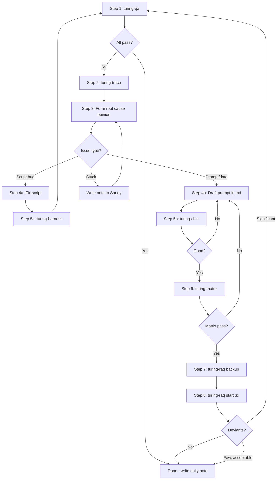

# Turing CLI Tools

All tools for the **Turing Loop** workflow. One folder, unified naming, consistent `--help`.

## The Turing Loop



## Tools Quick Reference

| Step | Tool | Purpose | Example |
|------|------|---------|---------|
| 1 | `turing-qa` | QA reports | `turing-qa lily_cps_extract` |
| 2 | `turing-trace` | Trace failures | `turing-trace --posting 10467` |
| 5a | `turing-harness` | Test actors directly | `turing-harness run lily_cps_extract` |
| 5b | `turing-chat` | Debug prompts | `turing-chat --actor lily` |
| 6 | `turing-matrix` | Multi-model testing | `turing-matrix` |
| 7-8 | `turing-raq` | RAQ testing | `turing-raq start lily_cps_extract` |

### Supporting Tools

| Tool | Purpose | Example |
|------|---------|---------|
| `turing-daemon` | Background execution | `turing-daemon start --task_type 9383` |
| `turing-status` | Progress overview | `turing-status requirements_extract` |
| `turing-errors` | Failure inspection | `turing-errors --limit 10` |
| `turing-dashboard` | Live TUI + watchdog | `turing-dashboard -W 30 -r -c 20` |
| `turing-costs` | LLM cost tracking | `turing-costs --week` |
| `turing-qa-gen` | Generate test fixtures | `turing-qa-gen 9384 --samples 5` |

### Watchdog Mode (turing-dashboard -W)

Monitor long-running jobs with automatic safety features:

```bash
# Basic watchdog - check every 30s
turing-dashboard -W 30

# Full safety mode for overnight runs
turing-dashboard -W 30 -r -c 20 -l logs/watchdog.log

# With Slack alerts
turing-dashboard -W 30 -r --webhook https://hooks.slack.com/...
```

| Flag | Purpose |
|------|---------|
| `-W N` / `--watchdog N` | Check every N seconds |
| `-r` / `--restart` | Auto-restart daemon if it dies |
| `-c N` / `--circuit-breaker N` | Kill daemon if failure rate > N% |
| `-l FILE` / `--log FILE` | Log events to file |
| `--webhook URL` | Send alerts to Slack/Discord |

Detects: daemon death, stalls, failure spikes, GPU idle, cascade trigger events

## Usage Examples

### Step 1: QA Check
```bash
turing-qa lily_cps_extract           # QA report for task type
turing-qa lily_cps_extract --stats   # Just stats
```

### Step 2: Trace Failures
```bash
turing-trace --posting 10467         # All logs for a posting
turing-trace --task-log 12345        # Specific task log
turing-trace --last lily_cps         # Last execution
```

### Step 5a: Test Actor Directly (script fixes)
```bash
turing-harness run lily_cps_extract --input '{"posting_id": 10467}'
turing-harness run lily_cps_extract --sample 5   # Random sample of 5
turing-harness branches skill_classifier --input '{"match": true}'
turing-harness chain skill_classifier --input '{"skill_name": "python"}'
```

### Step 5b: Debug Prompts (prompt fixes)
```bash
turing-chat                          # Interactive mode
turing-chat --actor lily             # Use specific actor config
turing-chat --model qwen2.5:7b       # Use specific model
```

### Step 6: Matrix Testing
```bash
turing-matrix                        # Run all cases × all models
turing-matrix --cases 5              # Quick test with 5 cases
turing-matrix --models qwen2.5:7b    # Single model
```

### Step 7-8: RAQ Testing
```bash
# ALWAYS backup first!
turing-raq backup lily_cps_extract

# Run 3x
turing-raq start lily_cps_extract --count 30 --runs 3

# Check progress
turing-raq status lily_cps_extract

# Compare runs
turing-raq compare lily_cps_extract

# If disaster, restore
turing-raq restore lily_cps_extract
```

### Full Production Run
```bash
# Start daemon in background
turing-daemon start --task_type 9383 --limit 2000

# Monitor
turing-daemon status    # Is it running?
turing-daemon log       # Live output
turing-errors           # Any failures?

# QA while running
turing-qa lily_cps_extract

# Stop when done (or if problems)
turing-daemon stop
```

## All Tools Support --help

Every tool supports `--help` for detailed usage:

```bash
turing-qa --help
turing-trace --help
turing-raq --help
# etc.
```

## Folder Structure

```
tools/turing/
├── README.md           # This file
├── turing-qa           # QA sampling reports (6-dimension strategy)
├── turing-qa-gen       # Generate test fixtures from task_logs
├── turing-trace        # Failure tracing
├── turing-chat         # Prompt debugging
├── turing-matrix       # Multi-model testing
├── turing-raq          # RAQ management (auto-backup on reset)
├── turing-harness      # Direct actor testing (--sample N)
├── turing-costs        # LLM cost dashboard
├── turing-daemon       # Background daemon
├── turing-status       # Progress overview
├── turing-errors       # Failure inspection
├── turing-dashboard    # Live TUI + watchdog mode
└── turing-q            # Quick SQL queries
```

## Related Documentation

| Document | Purpose |
|----------|---------|
| [Turing_project_directives.md](../../docs/Turing_project_directives.md) | Core principles, RAQ methodology |
| [DEVELOPMENT_CHEAT_SHEET.md](../../docs/DEVELOPMENT_CHEAT_SHEET.md) | Quick patterns and commands |
| [0000_talent_yoga_system_overview.md](../../docs/0000_talent_yoga_system_overview.md) | System architecture |

## Core Utilities (core/)

| Module | Purpose |
|--------|---------|
| `core/text_utils.py` | Shared text processing (normalize, detect_language, verify_quote) |
| `core/actor_schema.py` | Extract schema from actor docstrings |
| `core/database.py` | DB connection management |
| `core/constants.py` | Shared constants (Status, Fields, OwlTypes) |

### Actor Schema Extraction

Auto-extract schema from actor docstrings:

```bash
python3 core/actor_schema.py actors/postings__extracted_requirements_U.py
```

Output: Input/Output table columns, Output Fields with types, suggested RAQ config, JSON Schema.
